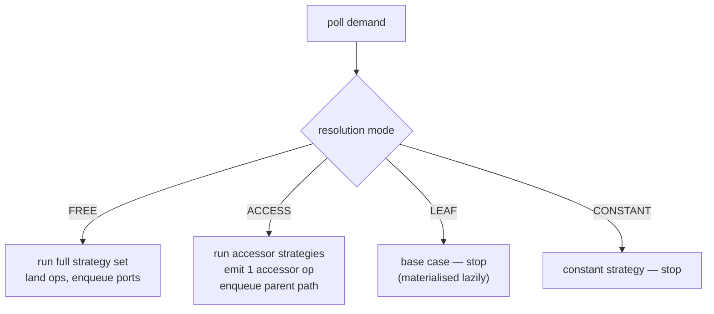
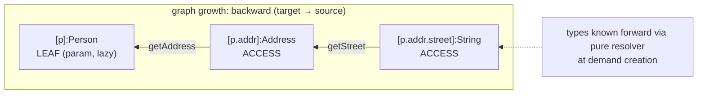
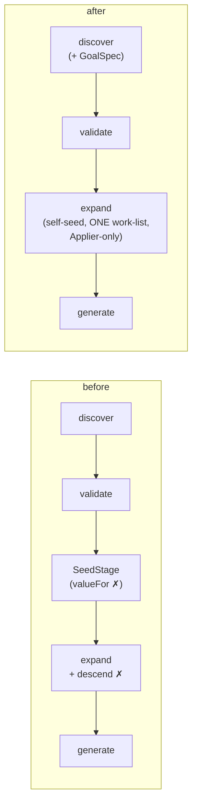

## Context

The expansion engine is documented (and largely built) as a single uniform demand work-list that
walks target→source. Two things break that uniformity today:

1. **Source-path descent is a second engine.** `ExpandStage.descend`/`resolveAccessor` is eager,
   walks *forward* (param→leaf), runs its **own** strategy dispatch (a restricted re-implementation of
   `run(demand)`), and keeps its **own** memo (`descended`). Its products are `SUPPLY` Values the main
   work-list never visits.
2. **`SeedStage` pre-populates the graph and bypasses the Applier.** It mints parameter/return roots
   with `graph.valueFor(...)` directly — the only mutation that does not go through the `Applier`,
   breaking the "single mutation site" invariant.

Both exist for one reason: the main loop only expands `DEMAND`-role (`TargetLocation`) Values
(`role() != DEMAND` → skip), so `SUPPLY` (source-path) Values must be produced some *other* way, and
the parameter `SUPPLY` leaves must exist *before* the loop runs so candidate-scanning strategies can
see them.

This change removes both by making source paths ordinary backward demands and letting the graph start
empty. It is a **consolidation of the existing architecture, not a new pattern**: the bipartite
Value/Operation graph, the myopic `Demand` SPI, append-only mutation, and cost-based plan extraction
are all unchanged. No architectural concept is broken or introduced — two carve-outs are folded into
the mechanism that already exists.

## Goals / Non-Goals

**Goals:**
- One work-list, one strategy-dispatch site, one visited-set. No eager/forward descent.
- The graph starts empty; every vertex (including root demands and parameter leaves) is born through
  the `Applier`.
- A demand's **resolution mode** is set at creation and is the sole dispatch key; the base-case rule
  tightens so a failed accessor chain is unreachable, not vacuously reachable.
- `SeedStage` deleted; goal-spec derivation moves to discovery.
- `ResolveCtx` loses `mapperType()`/`currentMethod()`; the `ThreadLocal` dies.

**Non-Goals:**
- Port-carries-intent / variable-vs-application unification (Seam B/E).
- Unifying method vs child-scope seeding (Seam C); nested `@Map` into container elements.
- Byte-identical generated code (the Spock/jqwik suite is the behavioural oracle).
- A wholesale "sync drifted specs to VOG reality" pass.

## Decisions

### D1 — Resolution mode is the work-list dispatch key

`Location.role()` (`SUPPLY`/`DEMAND`/`ELEMENT`/`CONSTANT`) becomes a **resolution mode** the single
loop dispatches on, derivable from the `Location` kind + access-path length:

| Mode | Location | Strategy set | Re-demands |
|------|----------|--------------|------------|
| `FREE` | `TargetLocation`, conversion intermediate | full set (assemble / convert / container / identity) | each port |
| `ACCESS` | multi-segment `SourceLocation` | accessor strategies only (assembly MUST NOT fire) | the parent path |
| `LEAF` | single-segment `SourceLocation` (parameter), `ElementLocation` | none — base case | — |
| `CONSTANT` | `ConstantLocation` | constant only | — |

*Alternatives considered.* (a) Keep the binary `DEMAND`-only skip and a separate descent — the status
quo, rejected (the two-engine smell is the whole point). (b) A free-standing `Mode` enum decoupled
from `Location` — rejected as redundant: `Location` already encodes the distinction; `role()` just
needs the `ACCESS`/`LEAF` split by segment count.

### D2 — Source paths are backward demands; types resolve via a pure helper

A source path `a.b.c` is the demand chain `SourceLocation[a,b,c] ←accessor← [a,b] ←accessor← [a]`.
The accessor **Operations** are emitted by the existing `Getter`/`Method`/`Field` path-resolver
strategies through the normal `run(demand)` — `resolveAccessor` and `descend` are deleted.

The one genuine subtlety: a source value's **type flows forward** (from the parameter), but demands
flow **backward**. An accessor's output type is **strategy-determined** (`getStreet()`→`String` is
decided by the getter/method/field accessor strategies, not by a direct type query), so a graph-free
"pure `ResolveCtx`" resolver cannot type a source path without re-implementing accessor matching
(which would duplicate strategy logic and break user accessor strategies). The resolution (decision A):
keep **one accessor-resolution helper** — `(parentType, segment) → OperationSpec`, via the accessor
strategies (today's `resolveAccessor`, **repurposed, not deleted**) — and use it two ways:

1. a **memoized, non-mutating forward type-walk** `typing(scope, segments)` that types a source-path
   demand at creation (base case: the parameter's declared `(type, nullness)` read from the method
   signature; step: `resolveAccessor(parentType, segment).output{Type,Nullness}`). It performs **no
   graph mutation** — pure type resolution, not expansion.
2. the **work-list `ACCESS` handler**, which on a demand `SourceLocation[a..k]` resolves the last
   segment's accessor on `parentType = typing(scope,[a..k-1]).type`, lands the accessor `Operation`
   through the `Applier`, and enqueues the parent `SourceLocation[a..k-1]` demand.

Values stay typed-at-creation (the VOG dedup key `(scope, location, type, nullness)` is preserved; no
untyped-Value resurrection), and the graph still grows strictly target→source — only the (pure,
memoized) type-walk reads forward.

*Alternatives considered (and rejected, decision A confirmed during apply).* (a) **A graph-free pure
`ResolveCtx` type resolver** — infeasible: accessor output types are strategy-determined; a pure
resolver would duplicate accessor matching and break user accessor strategies. (b) **Untyped source
demands** dedup'd by `(scope, location)` only, typed lazily via `setTyping` — rejected: it
special-cases `SourceLocation` dedup (target/conversion Values still need type in the key for overload
splitting) and revives the untyped-Value lifecycle VOG removed. (c) **Slim descent pre-pass** (don't
fold into the work-list) — rejected: leaves two mechanisms, only partially closing Seam A. The chosen
helper is shared by the type-walk and the `ACCESS` emission; the type-walk is memoized so each segment
type is computed once.

### D3 — The directive contributes a preferred source demand (collapses `pinnedSource`)

When a `FREE` target demand carries a directive with source path `P`, expansion creates the typed
`SourceLocation[P]` value (per D2), enqueues it, and the target's ordinary producer (`DirectAssign`
identity, or a conversion) binds to it — preferred over a same-typed sibling, preserving the existing
directive-pinned-source precedence. The eager `pinnedSource` threading through `sourceForPort`
disappears; "pinned source" is now "the one source demand the directive injects."

### D4 — Expansion self-seeds; `SeedStage` is deleted; goal-spec moves to discovery

At entry, `ExpandStage` enqueues one return-type demand per abstract method (created as a bare
`AddValue` through the `Applier`). Parameter `LEAF`s materialise lazily on first reference (when an
accessor chain bottoms out, or a candidate is bound). The per-level declared-bindings `GoalSpec` is a
pure reshaping of discovered `@Map` directives and is produced in the **discovery** phase, consumed by
expansion via the context.

*Alternative considered.* Compute `GoalSpec` at expansion entry instead of discovery — workable, but
discovery is the natural owner of "the goal" (it already owns the directives); expansion stays a pure
consumer.

*Seed dump (decided during apply).* With no separate seed stage, `ExpandStage` creates the empty
`MapperGraph` and self-seeds the return-root demands at entry, so there is no pre-expansion snapshot:
the `DumpGraphStage` `seed` view is **dropped** (it ran before expansion). The `full`/`transforms`/
`plan` dumps remain, all after expansion. This adds a `graph-debug-output` delta to the change.
(Alternative — keep a minimal init+return-root stage so the seed dump survives — rejected to honor
"no separate seed stage; graph starts empty.")

### D5 — Tighten the cost base case to `LEAF`

Plan extraction's base case becomes: a producerless `LEAF` (parameter / element root) is `Cost.ZERO`;
**every other** producerless Value — including a multi-segment `ACCESS` demand whose accessor never
matched — is `Cost.INFINITE`. Today's "any `SUPPLY` value is a base case" would mark a failed source
chain as reachable; it is masked only because eager descent always produced the chain. With descent in
the work-list, the tightened rule is required for correctness.

### D6 — Per-mapper `ResolveCtx`; drop `mapperType()`/`currentMethod()`; kill the `ThreadLocal`

`ResolveCtx` shrinks to `types()`, `elements()`, `callableMethods()`. `callableMethods` is bound when
the `ResolveCtx` is constructed per mapper at `Pipeline.process` time, so the
`ThreadLocal<MapperContext>` in `ProcessorModule` is removed entirely. `MethodCallBridge` (the only
production reader) is unaffected beyond the constructor wiring.

## Risks / Trade-offs

- **[Forward type-flow re-creeps in]** → confine it to one pure, non-mutating helper with no strategy
  dispatch; assert in review that the graph-mutating path is backward-only (the `descend` deletion is
  the structural check).
- **[A failed/typo'd source path now surfaces differently]** (no eager descent to fail fast) → the
  tightened `LEAF` base case (D5) makes the chain `INFINITE`, so existing realisation diagnostics
  report it unreachable; covered by the no-silent-sourcing specs.
- **[Lazy parameter leaves change candidate enumeration]** — candidate snapshots now come from the
  method signature + discovered Values rather than pre-seeded vertices → behaviour is identical
  (same `(type, nullness)` set); guarded by the existing strategy/harness suites.
- **[Spec drift]** the touched specs neighbour pre-VOG language (`Frontier`/`ExpansionStep`) → scope
  deltas to changed requirements only; leave the broader sync as separate debt.

## Migration Plan

Single-PR refactor, no runtime/data migration (compile-time processor). Order: (1) D6 (isolated SPI
cleanup, keeps suite green); (2) introduce resolution-mode dispatch (D1) alongside descent; (3) move
accessor emission to the work-list and delete `descend`/`resolveAccessor`/`descended` (D2/D3);
(4) tighten the base case (D5); (5) delete `SeedStage`, self-seed at entry, move `GoalSpec` to
discovery (D4). The Spock/jqwik suite gates each step. Rollback = revert the PR.

## Open Questions

- Exact carrier for `ACCESS` context: does the `Demand` gain a small "remaining source path + parent
  type" field, or is it derived from the `SourceLocation` + the pure helper? (Leaning: derive; add a
  field only if the resolvers need it.)
- Home of the pure source-path type resolver: a driver helper vs a shared utility the path-resolver
  strategies also call. (Leaning: driver helper used to type demands; strategies stay myopic.)
- Whether `Location.Role` is renamed to `Mode` or kept as `Role` with the `ACCESS`/`LEAF` values
  (naming only; settle during apply).
