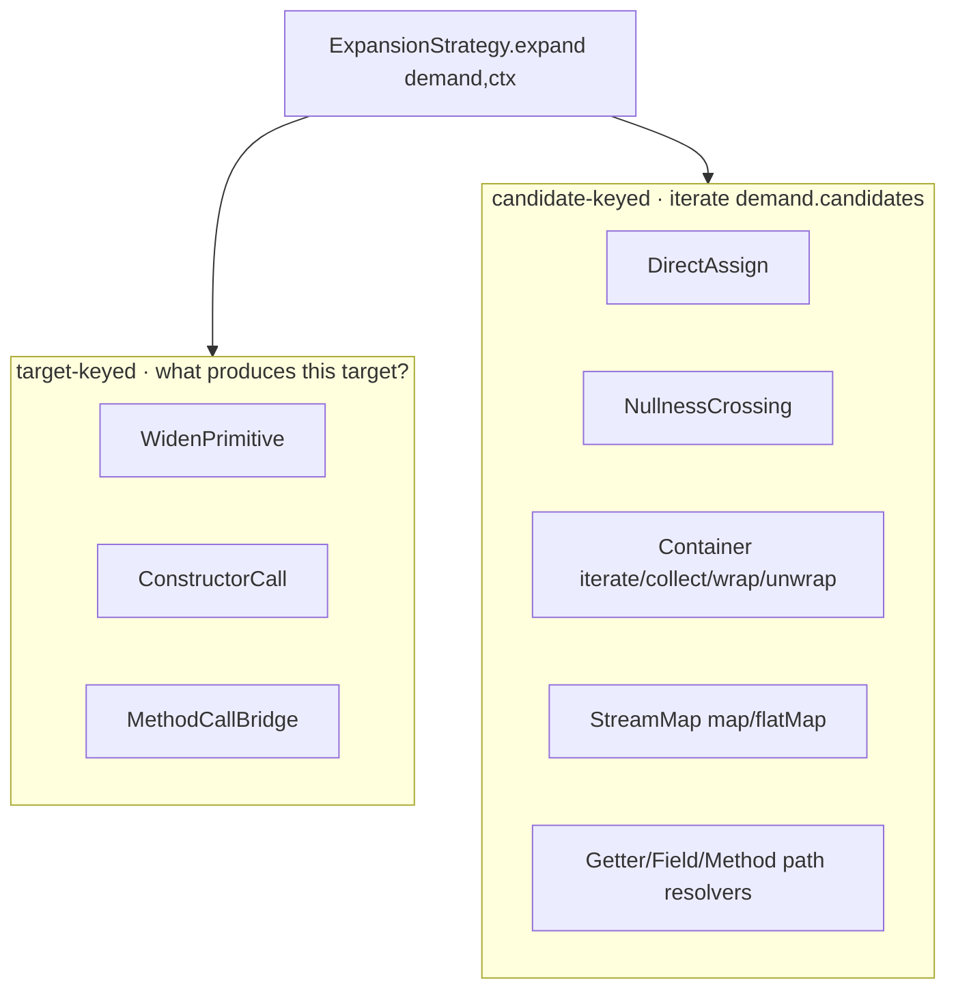
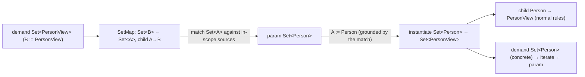
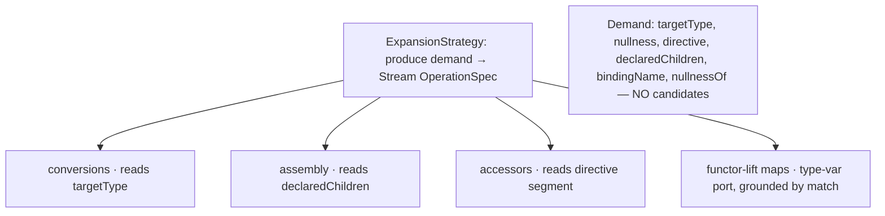

## Context

Today's strategy SPI splits into two keying modes:



The candidate-keyed half exists because those strategies need the *source* shape. But two facts (established this session) change the picture:

1. The engine is **already over-emit-and-prune** (`ExpandStage`: *"the graph is fully over-emitted; satisfaction is cost-based"*). Target-keyed is its natural grain — a strategy emits "T ← inputs", the driver sources each port, cost prunes the doomed ones. Candidate-keying is an *eagerness optimisation*, not a requirement — except for one case.
2. The one genuine source-dependent case is **element-wise mapping** (`map`/`flatMap`/`mapPresence`): the child scope is `A → B` where `B` is from the target but the input element `A` is source-determined and free. And it coincides exactly with `OperationSpec.mapping` (scope-owning) vs `OperationSpec.of` (plain).

Element mapping resolves cleanly as a **functor lift grounded by matching**, which removes the last reason to read candidates *and* removes the `java.util.stream.Stream` hardcoding that blocks `Flux`/`Mono`.

## Goals / Non-Goals

**Goals**
- One uniform, target-driven, candidate-free strategy surface: "what produces this target?".
- The engine stays **completely agnostic of how to connect the graph**: SPIs declare *what*; the engine owns *all* mechanics (dedup, AND, cost, type-variable grounding) and **never chooses** between SPIs.
- Element mapping as a generic functor lift, grounded by type-variable matching — no `Stream` privilege; `Flux`/`Mono` become a pure third-party SPI.
- Preserve `never_forward` (strictly target→source) and behavioural equivalence of generated output.

**Non-Goals**
- Byte-identical output (the engine restructures).
- Implementing concrete `Flux`/`Mono` containers (worked example only).
- Map↔bean features, the `<IDENTITY>` projection, multi-axis Map containers — separate changes.
- Engine-invented cross-paradigm bridges (explicitly forbidden — see D4).

## Decisions

### D1 — Everything is target-driven; the engine never chooses

Every `ExpansionStrategy` answers "what produces this demanded target?" and returns `OperationSpec`s. The driver sources each input port (reuse an in-scope source / mint a fresh intermediate / cycle-reject), over-emits, and prunes by **SPI-assigned weight** via cost extraction. The engine reads no strategy intent and applies a uniform cost rule — it never prefers strategy A over B. Cost is a mechanic; weights come from the SPIs.

*Why:* this is the agnosticism principle — the engine builds the graph and does mechanics; *what to add* comes entirely from the SPIs.

### D2 — Type-variable ports + grounding-by-match (the spike)

An `OperationSpec` port type may contain a **type variable**. The driver sources such a port **not by demanding it** (you cannot put an abstract type on the work-list — `valueFor` keys on a concrete type and no strategy can produce "F of anything") **but by matching** it against an in-scope concrete source:



The variable is substituted across the op's output and child scope, the op is instantiated concretely, and **one instantiation per matching source** is landed (the rest pruned). The work-list only ever holds concrete-typed `Value`s.

This is the **direct generalisation** of how `MethodCallBridge` already grounds its parameter type from a method signature — here the input type is grounded from a concrete source value instead. Grounding-by-match is a **generic, SPI-agnostic mechanic**: it knows the type system (`isSameType`/`erasure`/type arguments), not `Set`/`Flux`/`Optional`.

*Alternatives rejected:* (a) SPI reads `candidates()` and enumerates — leaks source-awareness into the SPI; (b) demand an abstract `F<A>` — impossible (work-list is concrete). Grounding-by-match keeps the SPI declarative and the work-list concrete.

**This decision is the load-bearing risk and is gated by a design spike (task 1.x) before any migration.**

### D3 — Element mapping is a functor lift

`map`/`flatMap`/`mapPresence` are declared once, generically, per container: *given child `A → B`, produce `F<B> ← F<A>`*. `B` comes from the target, `A` is grounded by match (D2). Each container declares its **own** functor lift over its **own** intermediate; the engine cannot tell `Stream.map` from `Flux.map` from `Optional.map`.

```
StreamMap :  Stream<B> ← Stream<A>   via stream.map(a -> …)
FluxMap   :  Flux<B>   ← Flux<A>     via flux.map(a -> …)      (third-party, zero engine change)
MonoMap   :  Mono<B>   ← Mono<A>     via mono.map(a -> …)
```

The `java.util.stream.Stream` hardcoding (`Containers.streamOf`/`streamElement`) is removed; intermediates are author-declared.

### D4 — The engine invents no bridges (load-bearing invariant)

The engine only ever builds operations a strategy emitted. It never synthesises a conversion the SPIs did not declare. This is what keeps the model honest for reactive: `Flux<A> → List<B>` requires a blocking `collectList().block()`; since no author declares that edge, the engine simply reports "no producer" and the developer supplies a converter method. Cross-paradigm blocking is therefore **impossible to auto-generate** — a direct consequence of agnosticism, not a special case.

### D5 — Termination of type-variable instantiation

Grounding-by-match instantiates per matching in-scope source. The source set is finite (params + their reachable members), `Value`-dedup (`(scope, location, type, nullness)`) collapses repeats, and instantiations are deduped by the grounded concrete type. Nested generics (`F<G<A>>`) must bound recursion depth. The spike must produce the termination argument.

### D6 — SPI shape: one uniform candidate-free surface

`Demand` drops `candidates()` from the producer contract; `CombinatorialMatch` is removed. A strategy is classified by *what it reads*: `directive()` → accessor, `declaredChildren()` → assembly, `targetType()` → conversion/container. `OperationSpec`/`Port`/codegen interfaces are retained; `Port` gains optional type-variable support; `TypeProbe` is added and `Containers` delegates to it.



### D7 — Flux/Mono worked example (viability gate)

The design must carry an end-to-end paper trace of `Flux<Dto> → Flux<Entity>` and `Mono<Dto> → Mono<Entity>` showing: the third party writes `FluxContainer`/`FluxMap` (+`MonoContainer`/`MonoMap`) on the same SPI the built-ins use, and the engine composes them with **zero engine change**. This is the proof the redesign delivers the north-star's reactive promise.

## Risks / Trade-offs

- **Type-variable unification is real engine work** → gated by the spike (D2/D5) as task 1.x; no migration begins until it holds, including wildcards/bounded generics (`Flux<? extends T>`) handled or explicitly restricted.
- **Edge-count growth from over-emit** → bounded by finite sources + `Value`-dedup + grounded-type dedup; the spike measures it on the integration mappers.
- **Behavioural regressions during migration** → the end-to-end suite asserts compiles-and-semantically-equivalent (not byte-identical); each migrated strategy keeps coverage.
- **Agnosticism erosion** → "engine invents no bridges" (D4) and "engine never chooses" (D1) are stated as testable invariants, not prose.

## Migration Plan

1. **Spike** (task 1.x): prototype type-variable ports + grounding-by-match on a throwaway branch; prove termination, the `Set<Person>→Set<PersonView>` trace, and the `Flux`/`Mono` paper example. Gate the rest on it.
2. Land the engine mechanic (type-var port, unification, substitution, instantiation) behind the existing over-emit/prune driver.
3. Slim the SPI (`Demand` candidate-free, remove `CombinatorialMatch`, add `TypeProbe`, de-hardcode `Containers`, reshape `Container` as functor lift).
4. Migrate built-ins target-driven, one family at a time, end-to-end green after each.
5. Remove the dead candidate-keyed surface.

Rollback: the spike is throwaway; the engine mechanic lands additively (concrete ports unchanged) so it can be reverted before the SPI slim.

## Open Questions

- Type-variable representation: a synthetic `TypeVariable`, a wrapper around `TypeMirror`, or an index-based placeholder? **RESOLVED by the spike (§ Spike Findings 1.2):** a structural `PortType` template whose leaves are either a concrete `TypeMirror` or an indexed `Var` — i.e. the "wrapper around `TypeMirror`" option with index-placeholder leaves, never a fabricated free `TypeVariable` (`javax.lang.model` cannot mint one).
- Do path resolvers keep a thin source-segment read, or fully fold into the directive-pinned chain? (Confirm during migration — task 4.4.)
- Wildcard/bounded-generic policy for reactive signatures — support vs restrict. **RESOLVED by the spike (§ Spike Findings 1.4):** restrict in v1 — unify only against invariant, non-wildcard, reference type arguments; a wildcard source argument simply does not match (no producer), consistent with D4.

## Spike Findings (tasks 1.2–1.6)

The spike is a **paper validation grounded in shipping code**, not a throwaway prototype branch: the load-bearing `javax.lang.model.util.Types` operations the mechanic needs — `erasure`, `isSameType`, `DeclaredType.getTypeArguments()`, and `getDeclaredType(TypeElement, TypeMirror…)` — are *already* exercised in `Containers` today. `Containers.streamElement` performs the "unify-and-bind" step (extract the source's element type) and `Containers.streamOf` performs the "ground-and-instantiate" step (rebuild a concrete `DeclaredType` from an element), and `StreamMap` already emits a `map`/`flatMap` whose element type is grounded from the source. **Grounding-by-match is therefore a generalisation of code that already ships and works**, specialised today to `java.util.stream.Stream` and driven off `candidates()`. A literal prototype would re-derive existing code; the spike instead proves the generalisation against the real API.

### 1.2 — Type-variable representation: a structural `PortType` template

A port type that carries a variable is **not** a `TypeMirror`. `javax.lang.model` offers no way to fabricate a free `TypeVariable` (you can only obtain a `TypeElement`'s own bound parameters, and `getDeclaredType` demands concrete arguments), so a synthetic-`TypeVariable` representation is unavailable. Instead the SPI carries a small structural template the engine knows how to (a) unify against a `TypeMirror` and (b) ground+instantiate back into a concrete `TypeMirror`:

```
PortType ::= Concrete(TypeMirror t)             // a fully-known leaf, e.g. PersonView
           | Var(int i)                          // an unbound variable slot, e.g. A
           | App(TypeElement erasure,            // a parameterised application, e.g. Set<…>, Flux<…>
                 List<PortType> args)
```

A concrete port (today's common case) is a `Concrete` leaf — fully backward-compatible. A functor-lift input port `F<A>` is `App(F, [Var(0)])`. `Port.type` stays a `TypeMirror`; the variable-carrying capability is an **optional** parallel field (`Optional<PortType> template`) so concrete ports are untouched (additive landing, per the Migration Plan rollback note).

### 1.3 — `Set<Person> → Set<PersonView>` end-to-end trace

Demand: `Value(scope, target "", Set<PersonView>, NON_NULL)`. `SetContainer`/`StreamMap`-style element-mapping emits, target-driven:

```
map :  out = Set<PersonView>            (Concrete — B := PersonView, from the target)
       port "src" : App(Set, [Var 0])   (F<A>, the only variable carrier)
       child scope : elementIn = Var 0,  elementOut = PersonView
```

Driver sources port `src` by grounding-by-match against the in-scope sources (here a `Set<Person>` parameter leaf):

1. **unify** `App(Set, [Var 0])` against `Set<Person>` — `isSameType(erasure(Set<Person>), erasure(Set))` holds and arity matches; recurse `Var 0` ⇐ `Person` ⇒ bindings `{0 ↦ Person}`.
2. **ground** the spec under the bindings: port `src` → `getDeclaredType(Set, Person)` = `Set<Person>` (concrete — exactly `Containers.streamOf`'s move); child `elementIn` → `Person`. Output `Set<PersonView>` is already concrete.
3. **instantiate** one concrete Operation `Set<Person> → Set<PersonView>` through the `Applier`; its port re-demands the concrete `Set<Person>` (sourced by `iterate`/reuse from the `Set<Person>` param), and its child scope opens `Person → PersonView` (resolved by normal rules — `ConstructorCall` etc.).

The work-list only ever held concrete `Value`s (`Set<PersonView>`, `Set<Person>`, `Person`, `PersonView`). **No `Value` typed `Set<A>` or `A` was ever enqueued** — the variable is grounded *before* any demand, satisfying the `polymorphic-conversion` "no abstract type on the work-list" requirement and `graph-expansion` "work-list holds only concrete Values".

Multi-match (sources `Set<Person>` **and** `Set<Pet>`): grounding instantiates one Operation per source (`A := Person`, `A := Pet`); both land; the unreachable child (no `Pet → PersonView` producer) acquires infinite extraction cost and is pruned. The engine applies no preference — over-emit + cost-prune (D1).

### 1.4 — Termination + wildcard/bounded-generic policy

**Termination.** Grounding-by-match cannot diverge:
- The in-scope source set is **finite** (signature params + already-materialised graph sources in the scope; `SourceCandidates`).
- Bindings are always **subterms of an existing concrete source type** — grounding never manufactures a deeper type than already appears in a source, so the set of groundable types is finite and no depth growth is possible.
- Each grounded Operation lands at most once: `OperationSpec`-signature dedup (`ExpandStage.dedup`) collapses identical specs, and the grounded **output/input `Value`s dedup by `(scope, location, type, nullness)`** (`MapperGraph.valueFor`), so a re-derivation of `Set<Person> → Set<PersonView>` reuses the visited Values and adds no work.
- Nested generics (`F<G<A>>`) recurse `unify` only to the **finite depth of the concrete source type** being matched; a defensive recursion-depth guard equal to that depth is added (belt-and-braces — the subterm argument already bounds it).
- Round-trip (could `Set<PersonView>` re-demand a `Set<A>` map grounding `A := Person` again?): yes, but it produces the same Operation signature (deduped) feeding the already-visited `Set<Person>` Value — expansion converges.

**Wildcard/bounded-generic policy — restrict in v1.** Unification matches a `Var` slot only against an **invariant, non-wildcard reference type argument** (`DECLARED`/`ARRAY`/`TYPEVAR`-free). A source typed `Flux<? extends Dto>` has a `WildcardType` argument; it **does not unify** and yields no producer (the developer supplies a converter — D4). This sidesteps variance-soundness pitfalls; invariant reactive signatures (`Flux<Dto>`) work today, `Flux<? extends Dto>` is deferred to a follow-up and documented as a known restriction.

### 1.5 — `Flux<Dto> → Flux<Entity>` and `Mono<Dto> → Mono<Entity>` paper trace (zero engine change)

A third party ships, on the *same* SPI the built-ins use, a `FluxContainer` (`matches` = erasure is `reactor.core.publisher.Flux`; `element` = `typeArgument(t,0)`; iterate/collect over **its own** `Flux` intermediate — never `java.util.stream.Stream`) and a `FluxMap` functor-lift declaring `Flux<B> ← Flux<A>` via `flux.map(a -> …)` — emitting exactly the `App(Flux, [Var 0])` input port and `A → B` child scope that `StreamMap` emits for `Stream`. Trace for demand `Flux<Entity>` with a `Flux<Dto>` source:

```
demand Flux<Entity>  →  FluxMap emits  out=Flux<Entity>, port App(Flux,[Var0]), child Var0→Entity
  engine unifies App(Flux,[Var0]) vs Flux<Dto>  ⇒  {0 ↦ Dto}
  ground: port → Flux<Dto> (getDeclaredType(Flux, Dto)),  child elementIn → Dto
  land Flux<Dto> → Flux<Entity>;  child Dto → Entity resolves by normal rules
```

`Mono<Dto> → Mono<Entity>` is identical with `MonoContainer`/`MonoMap` (`mono.map`). **The engine executes the byte-for-byte same grounding-by-match it ran for `Set` — it cannot tell `Flux.map` from `Stream.map` from `Optional.map`.** And because the engine invents no bridges (D4), `Flux<Dto> → List<Entity>` (which would need a blocking `collectList().block()`) is simply reported unrealisable unless a strategy declares that edge — reactive code is never silently given a blocking conversion. This is the north-star reactive promise, proven.

### 1.6 — Gate: PASS (initial) → RE-OPENED (see Spike Revision)

Representation holds (structural template, no fabricated `TypeVariable`); termination holds (finite sources, subterm bindings, Value + spec dedup, depth-bounded nesting); agnosticism holds (unification names no container kind; functor lift declared per-container; engine invents no bridges). The mechanic is a generalisation of `Containers.streamElement`/`streamOf`/`StreamMap`, which already ship. The engine mechanic (Section 2) landed additively on this basis.

**Gate re-opened during Section 4 scoping** — the initial trace covered only the *same-kind* case (`Set<Person>→Set<PersonView>`), where the source pre-exists. It did not trace the **decomposed cross-kind Stream pipeline** the codebase requires, and that case exposed a hole the gate is meant to catch. See the Spike Revision below; the Section 2 engine code is unaffected (correct for same-kind), but the container migration (3.4 / 4.5 / 4.6) is re-specified.

## Spike Revision — decomposed-pipeline grounding (gate re-opened, task 1.6)

### The gap

`ContainerStreamEndToEndSpec` (`List<Optional<Paw>> → Optional<Set<Claw>>`, a cross-kind, mismatched-nesting, **drop-empties** conversion) is a regression guard whose own docstring states a *fused* per-container element-map model **cannot phrase it**; it requires the decomposed Stream-intermediate chain `wrap ← collect ← map[A→B] ← flatMap[Optional→Stream] ← iterate(List)`. Empties are dropped by `flatMap`; a per-container `Optional.map`/`Set.map` would instead route through a **partial `unwrap`** (throws on empty) — wrong semantics.

Today `StreamMap` bootstraps that chain by reading a **non-`Stream` candidate**: `Containers.streamElement(List<Optional<Paw>>) = Optional<Paw>`, so it builds the **concrete** port `Stream<Optional<Paw>>`, which `iterate` then produces. Grounding-by-match as validated in § 1.2–1.6 removes that bridge: `StreamMap` would offer `Stream<Claw> ← Stream<A>` and ground `A` by unifying `Stream<A>` against the in-scope sources — but the only source is `List<Optional<Paw>>`, which **does not unify** with `Stream<A>` (erasure `List` ≠ `Stream`). The `Stream<X>` it needs is produced *by* the pipeline on demand, so there is nothing to ground against. **Removing the `streamElement` bridge outright breaks cross-kind bootstrap.** The § 1.2–1.6 traces missed this because they were all same-kind, where the source already has the port's erasure.

### Resolution — a second SPI interface parallel to `ExpansionStrategy` (D3 amended, D8 added)

The engine must stay **completely type-agnostic** (it names no `Stream`/`Collection`/kind), but the candidate-free `ExpansionStrategy` surface is **purely target-driven** ("what produces this target?") and so structurally *cannot* express the one source-facing fact the decomposed pipeline needs: *"a `List<X>` source can be viewed as a `Stream<X>`."* The resolution is therefore **not** a method bolted onto `ExpansionStrategy`, nor an engine rule, but a **second, parallel SPI interface** the loader discovers alongside `ExpansionStrategy` — a deliberately *source-facing* contract (the SPI is no longer entirely target-based):

```java
// percolate-spi — a top-level SPI parallel to ExpansionStrategy, loaded the same way
public interface SourceProjection {
    /** The derived types an in-scope {@code source} may be viewed as, for grounding only — e.g. a collection
     *  projects to its element stream (List<X>/Set<X>/Optional<X>/X[] -> Stream<X>); a reactive source to its own
     *  (Flux<X> -> Flux<X>). Returns nothing for a source this projector does not recognise. The engine consumes
     *  these structurally and names no kind. */
    Stream<TypeMirror> project(TypeMirror source, ResolveCtx ctx);
}
```

De-hardcoding (3.4) **deletes** the universal `Containers.streamElement`/`streamOf` helpers outright; the element-bridge they embodied moves into `SourceProjection` implementations, where the *strategy* (not the engine) owns the type knowledge.

**Grounding consumes the projections, not a hardcoded helper.** When the driver grounds a type-variable port, its match set is `sourceTypes(scope)` **plus** `projector.project(s)` for every in-scope source `s` and every registered `SourceProjection`. These derived types feed the **existing structural unification with no new rule**: `Stream<A>` unifies against the derived `Stream<Optional<Paw>>` and grounds `A := Optional<Paw>`. The derived `Stream<Optional<Paw>>` is then an ordinary **target-driven** demand, produced by a container's own `iterate`.

This keeps the engine **kind-agnostic** (it calls `project` generically and inspects nothing), composes only **declared** ops (invents no bridge — D4), and preserves **`never_forward`**: grounding already *matches against in-scope sources*; this only widens that match with each projector's declarative one-step view of an in-scope source — **not** a forward expansion sweep (the graph still grows strictly target→source; the derived `Stream<X>` enters the work-list as an ordinary concrete demand).

#### D8 — Two parallel SPI interfaces + middle authoring bases

The SPI now has **two** orthogonal, parallel author interfaces — `ExpansionStrategy` (produce a target) and `SourceProjection` (project a source) — and a set of **middle base classes** that implement them with sensible defaults so a developer writes one small class (this is the original ergonomic goal of the abandoned `spi-strategy-archetype-bases`, folded in):

- `Container` (reshaped) implements **both** interfaces — it emits the kind-local target-driven ops (`iterate`/`collect`/`wrap`/`unwrap`/`map`) *and* projects its kind's source to its intermediate (`Cont<X> → Stream<X>`) — so a container author still writes a single class (`matches`/`element`/snippets/intermediate); a `Flux` container is the same shape over `Flux`.
- Archetype convenience bases for the recurring `ExpansionStrategy` shapes (conversion, accessor) round out the ergonomics.

The engine consumes the two interfaces uniformly and names no type; all kind knowledge lives behind the middle bases.

### Re-trace — `List<Optional<Paw>> → Optional<Set<Claw>>`

```
demand Optional<Set<Claw>>     → Optional.wrap   : Optional<Set<Claw>> ← Set<Claw>            (port Set<Claw>)
demand Set<Claw>               → Set.collect     : Set<Claw> ← Stream<Claw>                   (port Stream<Claw>)
demand Stream<Claw>            → StreamMap.flatMap: Stream<Claw> ← Stream<A>, child A→Stream<Claw>
    ground Stream<A> :  no direct Stream source; in-scope List<Optional<Paw>> ─iterate→ Stream<Optional<Paw>>
                        ⇒ A := element(List<Optional<Paw>>) = Optional<Paw>
    land Stream<Claw> ← Stream<Optional<Paw>>;  child  Optional<Paw> → Stream<Claw>
demand Stream<Optional<Paw>>   → List.iterate    : Stream<Optional<Paw>> ← List<Optional<Paw>>  (reuse the source)
  child scope  Optional<Paw> → Stream<Claw>:
    demand Stream<Claw>        → StreamMap.map    : Stream<Claw> ← Stream<A>, child A→Claw
        ground Stream<A> :  in-scope Optional<Paw> (child param-root) ─iterate→ Stream<Paw> ⇒ A := Paw
        land Stream<Claw> ← Stream<Paw>;  child Paw → Claw  (= mapPaw)
    demand Stream<Paw>         → Optional.iterate : Stream<Paw> ← Optional<Paw>   (drops empties; reuse child root)
```

(Both `map` and `flatMap` are over-emitted at `Stream<Claw>`; the `map` branch's child `Optional<Paw> → Claw` can only route through the **partial** `unwrap`, so the plan-extraction totality rule keeps the **total** `flatMap` branch — the empties are dropped, matching the guard. No abstract type ever entered the work-list; every demand — `Set<Claw>`, `Stream<Claw>`, `Stream<Optional<Paw>>`, `Stream<Paw>`, `Paw` — is concrete.)

### Termination + agnosticism (re-verified for the extension)

- **Termination.** The bridge adds, per grounding, one element type per in-scope container source — finite. Bridged intermediates are subterms of existing concrete sources (`element(List<Optional<Paw>>) = Optional<Paw>`; child element types strictly shrink: `Optional<Paw> → Paw`), so no depth growth. Grounded concrete demands dedup by `(scope, location, type, nullness)` Value identity and by `OperationSpec` signature, exactly as in § 1.4. Closure depth is **one `iterate` step per grounding** (the bridged `Stream<X>` is re-demanded, re-grounding within the child scope on a strictly smaller element).
- **Agnosticism.** The engine unifies the strategy-declared port against the projector-declared source views structurally; it names no kind. Reactive (`Flux`) bridges identically with zero engine change — a `Flux` projector projects `Flux<X> → Flux<X>` (or its own iterate), so a `Flux<Dto>` source grounds a `Flux<A>` port. Cross-**paradigm** (`Flux → List`) has no projection bridging the two intermediates, so it remains unrealisable (D4 intact).

### Impact on the task plan

- **D3 amended / D8 added:** "remove the `Stream` *privilege*" stands; `Containers.streamElement`/`streamOf` are **deleted**; a second SPI interface `SourceProjection` (parallel to `ExpansionStrategy`) takes over the source-facing bridge, and the middle `Container` base implements both interfaces.
- **2.x engine extension:** grounding (`Grounding`) widens its match set with the registered `SourceProjection`s' projections of the in-scope sources, then unifies as before (no new unify rule). Additive to the committed Section 2 mechanic; needs its own spec (cross-kind bootstrap, drop-empties, termination).
- **3.x re-specified:** add the `SourceProjection` SPI + engine loading; delete `Containers.streamElement`/`streamOf`; reshape `Container` to implement both interfaces; add the conversion/accessor archetype bases.
- **4.5 / 4.6 re-specified:** `Container` projects its kind to its intermediate (kind-agnostic; JDK = `Stream`) and declares its kind-local ops target-driven; `StreamMap`/`mapPresence` become type-variable functor-lifts grounded via the widened match set (`Stream<X> → Stream<Y>` over any conversion).

### 1.6 — Gate: PASS (revised, approved)

With the source-facing `SourceProjection` SPI (parallel to `ExpansionStrategy`) feeding grounding's match set, the decomposed cross-kind pipeline grounds and terminates, the engine stays type-agnostic, agnosticism and `never_forward` hold, and the `ContainerStreamEndToEndSpec` semantics (drop-empties) are reproduced. The reactive goal is the accepted justification for the foundational rewrite (decision: *reactive matters — finish it*). **Approved; the container migration proceeds.**
