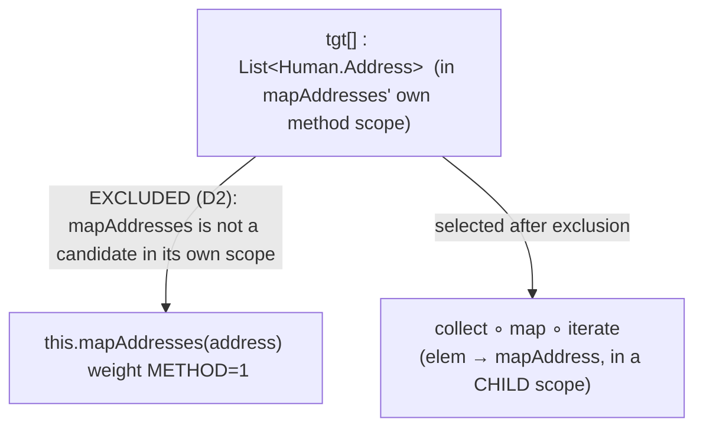
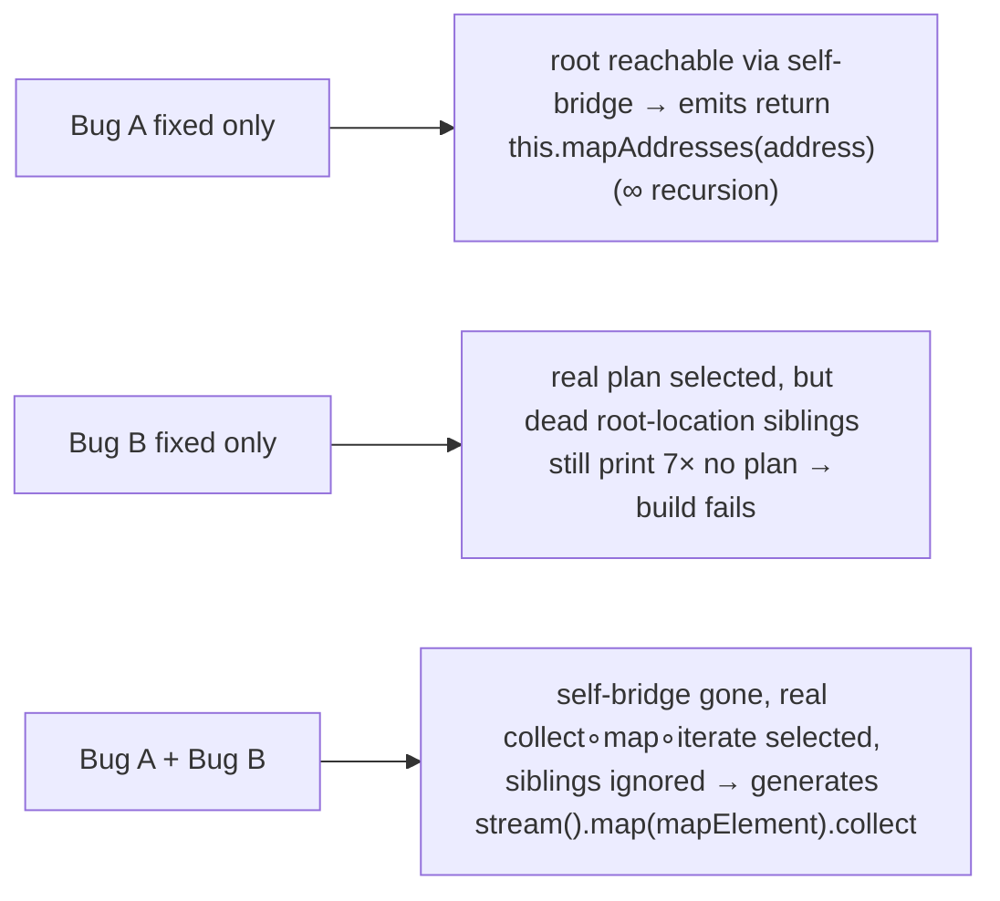
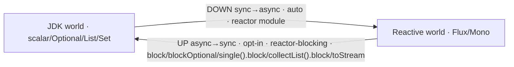

## Context

Root-causing why `List<Human.Address> mapAddresses(Set<Person.Address>)` (with a sibling `Human.Address mapAddress(Person.Address)`) fails to generate — from the integration project's `.dot` dumps — surfaced two independent engine bugs. Both are pre-existing and paradigm-agnostic (the JDK `List`/`Set` case and the reactive `Flux`/`Mono` case fail identically); the first is the exact quirk `add-reactor-modules` cited (D9) when deferring `reactor-blocking`.

The seeded root demand and its over-emitted conversion way-points share one graph location. `ExpandStage` mints a fresh intermediate at `output.getLoc()` (`ExpandStage.java:282`), so producing the root `tgt[]::List<Human.Address>` via `collect` mints `Stream<Human.Address>` **at the same root location** `tgt[]` (path `""`), only a different type. Every such typed Value then answers `isReturnRoot()` (`TargetLocation.java:25` = `path.getSegments().isEmpty()`).

This change is **not an architecture shift.** It preserves over-emit-then-prune, target-driven expansion, myopic strategies, the graph-agnostic engine, and the candidate-free SPI. Bug B is a *candidate-visibility* correction; Bug A is a *root-identity* correction. Neither alters the engine's planning model.

## Goals / Non-Goals

**Goals:**
- A direct container-return mapper generates the real `src.stream().map(this::mapElement).collect(...)` plan, delegating element mapping to the sibling method.
- No spurious `no plan for tgt[]` from over-emitted typed siblings at the return location.
- Ship the deferred opt-in `reactor-blocking` module (the upward async→sync crossings), unblocked by the self-bridge fix.
- Fold in the tests `add-reactor-modules` postponed.

**Non-Goals:**
- Making the over-emitted candidate graph acyclic. Box/unbox cycles (`byte↔Byte`, `long↔Long`, …) are intentional; only the *extracted plan* must be a DAG and finite-cost pruning already guarantees that.
- Any `spi` surface change (`CallableMethods.producing(TypeMirror)`, `ResolveCtx` stay as-is).
- Auto-inventing upward (blocking) crossings — they remain opt-in by packaging.
- Breaking legitimate self-recursion (a tree mapper calling itself on a *child* of its input).

## Decisions

### D1 — The return root is the seeded Value, recorded in the graph

The over-emitted intermediates that sit at the root location are conversion way-points, not return roots. The seeded root is the single Value created per abstract method by `seedReturnRoot` (location = root path, type = the method's declared return type). Record it explicitly: `seedReturnRoot` marks its Value on the graph (a `returnRoots()` set), and the three consumers read that set instead of the location-only `isReturnRoot()` predicate:

- `ExtractedPlan` — root set for reachability/extraction.
- `RealisationDiagnosticsStage` — the only Values checked for "no plan".
- `BuildMethodBodies` — the Value whose plan becomes the method's `return` expression.

*Alternatives considered:* (b) re-derive identity by matching a root-location Value's type against its `MethodScope` return type — correct (exactly one Value per `(scope, location, type)`), but forces a `Types` dependency into the graph-only `ExtractedPlan.extract(graph)`. (c) leave `isReturnRoot()` location-only and instead mint root-location intermediates at a distinct *intermediate* location — narrower, but the explicit seeded-root mark is more direct and future-proofs codegen's return-expression selection. Chosen: (a) record the seed — no `Types` plumbing, no `Location` redesign.

### D2 — A method may not satisfy demands in its **own method scope** (self-bridge exclusion)

The self-bridge fires because the callable index (`getAllMembers`, `DiscoverCallableMethodsStage.java:42`) includes the method under generation, and `this.mapAddresses(param)` (weight `METHOD`) out-prices the real chain. **A method `M` consuming its own parameter to produce its own output is always a degenerate self-call (infinite recursion).** It surfaces in several forms, all of which live in `M`'s own method scope: at the return root (`return this.m(param)`), behind an `iterate`/`collect` round-trip at a same-location sibling, and wrapped at a field (`List.of(this.m(param))`). The fix excludes `M` from its own candidate set **throughout `M`'s `MethodScope`** (every location, not only the root).

Why scope-wide is still narrow enough: a container's per-element transform is a **separate child scope** (the `map`/`flatMap` lambda), *not* `M`'s method scope, so legitimate self-recursion through a container element — `children.stream().map(e -> mapCat(e))` — is preserved (`mapCat` is excluded in `mapCat`'s method scope but available in the element child scope). Excluding only at the return root is **insufficient**: the degenerate `List.of(this.mapCat(src))` appears at a *field* slot and out-prices the real element-map path.

Implementation locus (no SPI change): the driver builds a **per-`MethodScope`** `ResolveCtx` that wraps `CallableMethods` with a view excluding that scope's `ExecutableElement`; it is applied to every demand whose scope is that `MethodScope`, and never to a child (element) scope. Strategies stay myopic (they still just call `producing(type)`); candidate visibility is a driver concern. Method identity is by signature (name + parameter types), robust across `Element` instances.

*Alternatives considered:* exclude only at the return root (insufficient — see above); add an exclusion parameter to `CallableMethods.producing` (SPI change — rejected); have the driver post-filter self-referential `MethodCall` specs by introspecting the spec's target element (the driver must not read into opaque codegen specs — rejected).

*Known limitation (not a regression):* a **scalar** self-referential field — `Node next` mapped via `this.mapNode(src.getNext())` *in the method scope* — is also excluded, so such a mapper reports a clean "no plan" rather than generating. This never worked before (it self-bridged to `return this.mapNode(src)`), so the change trades silent infinite recursion for an honest diagnostic. Making scalar self-reference *work* needs an argument-aware rule (allow `M(sub-part)`, forbid `M(whole-param)`) and is a separate follow-up.

### D3 — Both fixes are required; neither alone suffices

### D4 — `reactor-blocking` ships by packaging, weighting, and reuse-only ports

Mirrors `add-reactor-modules` D3/D6/D7. A new pure-SPI module registers the upward crossings; the boundary-direction rule is enforced by *which strategies are on the classpath*, not by engine logic.

Each upward edge is weighted above any non-blocking alternative (a correctness property for lazy-vs-eager `Mono`, per D6 of the parent change) and uses reuse-only ports (the `unwrap` pattern) so it never mints an ever-deeper source. With D2 in place the high-weight blocking path is no longer masked by the self-bridge and becomes demonstrable.

The lossy/assuming crossings (`block` = assume present, `single().block` = assume exactly one) are marked **partial**; the safe ones (`blockOptional`, `collectList().block`, `toStream`) are **total**. Totality dominates weight, so when a JDK container is demanded the element-preserving total bridge is chosen over a degenerate "take-one-and-wrap" (`List.of(flux.single().block())`) — a multi-element source is never silently reduced to one, and an empty `Mono` is surfaced as `Optional` rather than NPE'd through `block()`.

*Consequence of reuse-only (a known limitation):* a blocking bridge consumes only an **in-scope reactive source** (a parameter/field), never a *minted* reactive intermediate, so the composition is **block-then-map** (block the source, then transform in the JDK world) — never map-in-reactive-then-block. For a JDK-container target that *also* needs an element transform (`Flux<DTO> → List<DAO>`), the JDK-world element map after `collectList().block()` is available; the engine may still prefer the cheaper-but-partial scalar shortcut, so the canonical per-family bridges are asserted on the identity-element (`Flux<T> → List<T>`) and scalar shapes. Preferring the total container bridge in the element-transform case is a cost-tuning follow-up.

### D5 — Cycles are a graph property, not the bug

The over-emitted graph is intentionally cyclic (symmetric box/unbox conversions). The self-bridge is *not* a graph cycle — it reads the parameter and writes the root (acyclic in-graph) and is a semantic self-reference the cost model cannot see. That is precisely why it needs candidate exclusion (D2), not a cycle detector. `ExtractedPlan`'s finite-cost reachability already keeps pure cycles out of the plan; this change does not touch that.

## Risks / Trade-offs

- **[Over-broad self-bridge exclusion breaks legitimate recursion]** → D2 scopes the exclusion to a method's own `MethodScope`; container-element recursion lives in a separate child scope and is untouched (a `CatMapper` test asserts it still generates). Scalar self-reference at a method-scope field becomes an honest "no plan" (a strict improvement over the prior silent infinite recursion).
- **[Three consumers drift on root identity]** → centralise the seeded-root set in the graph (D1) so `ExtractedPlan`, diagnostics, and codegen read one source of truth; no per-stage re-derivation.
- **[Per-scope ResolveCtx churn]** → memoize the scoped view per `Scope`; the wrapper only filters one element.
- **[`reactor-blocking` weight inversion]** → keep upward weights strictly above every non-blocking alternative; the "no eager block" guard test pins this.
- **[Hidden coupling: did the parent change leave a `no plan` for an unsatisfiable bean root masked by the self-bridge?]** → after D2, re-confirm the `reactor`-only upward negatives still report a clean "no producer".

## Migration Plan

Additive and isolated. Engine fixes are internal (no SPI/codegen-output contract change for existing passing mappers — covered by the full existing suite). `reactor-blocking` is a new module added to `settings.gradle`; removing it from the build reverts the upward crossings with no engine impact. Rollback = revert the commit; the two engine fixes and the module are in one change but independently revertible at the file level.

## Open Questions

- Should `TargetLocation.isReturnRoot()` be removed once all consumers move to the graph's seeded-root set, or retained as a cheap pre-filter? (Lean: retain as a pre-filter, authority is the seeded set.)
- Does `reactor-blocking` need `toStream` given `collectList().block` + `iterate`, or is it redundant like `fromIterable`/`fromCallable` were in the parent change? (Resolve during specs.)
