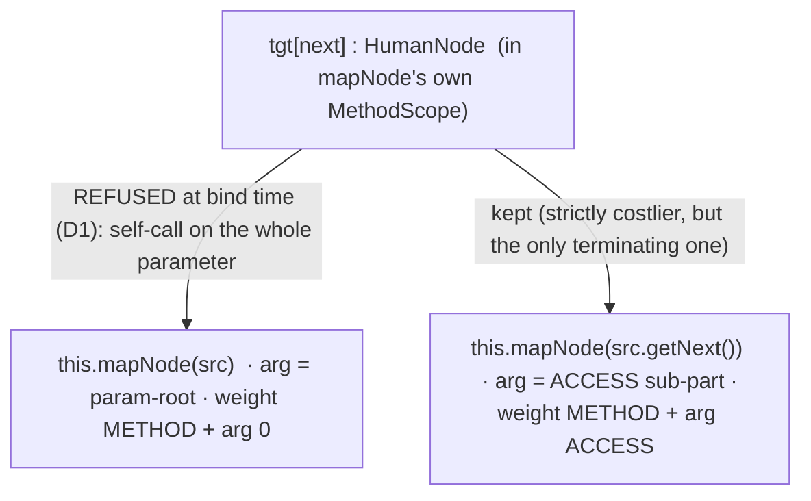
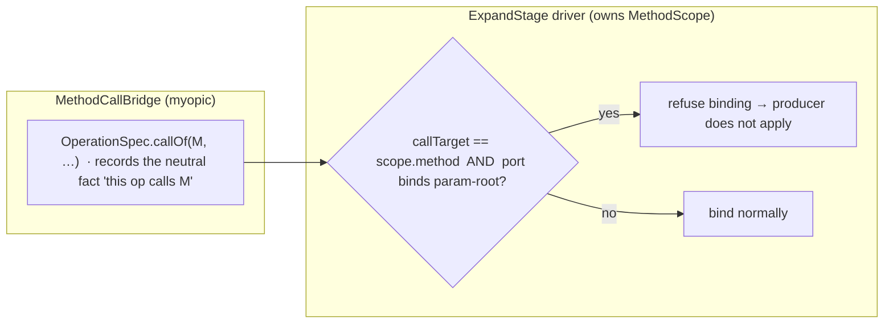
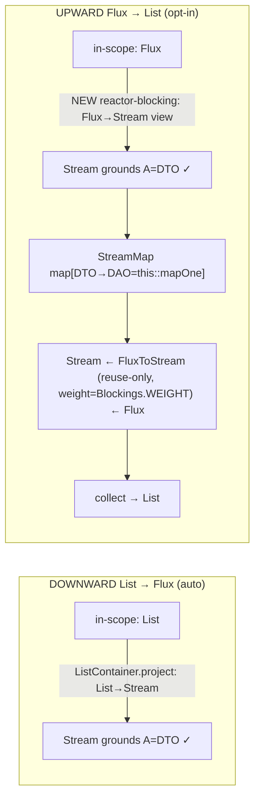

## Context

Two shipped capabilities have a `no plan` gap that root-causing (from the `percolate-integration` `.dot` dumps) traced to single, independent causes. Neither is an architecture shift: FU1 *refines* the self-bridge rule introduced by `fix-container-return-mappers`; FU2 *completes* the `reactor-blocking` module by adding the grounding-view half of a bridge whose producer half already ships. Both preserve over-emit-then-prune, target-driven expansion, myopic strategies, the graph-agnostic engine, and grounding-by-match.

**FU1 — the self-call exclusion is too coarse.** `SelfCallGuard` hands the driver a `ResolveCtx` whose `CallableMethods` hides the method-under-generation `M` throughout `M`'s `MethodScope`. That is a *visibility* filter applied *before* an argument is bound, so it cannot distinguish the degenerate `this.m(src)` from the legitimate `this.m(src.getNext())` — both live in `M`'s own scope.

**FU2 — the reactive source has no JDK grounding view.** `StreamMap` (the JDK element transform) carries a type-variable port `Stream<A>`; the engine grounds `A` only by unifying that port against in-scope source types widened by `SourceProjection`s (`Grounding` ← `SourceCandidates.sourceTypes`), never against minted intermediates. JDK containers project their kind to `Stream`; `FluxContainer` omits `iterate` so `Container.project()` returns empty; and `reactor-blocking` registers no `SourceProjection` at all.

## Goals / Non-Goals

**Goals:**
- A scalar self-referential mapper generates the structural recursion `this.m(src.getNext())`, delegating the element/child to a sibling or to itself on a *sub-part* of its input.
- A reactive element transform `Flux<DTO> → List<DAO>` (delegating elements to `this::mapOne`) generates `src.people.toStream().map(this::mapOne).collect(...)` when `reactor-blocking` is on the classpath.
- The whole-parameter self-call (`this.m(src)`) and the no-opt-in upward crossing remain an honest `no plan`.

**Non-Goals:**
- Making the over-emit candidate graph acyclic (box/unbox cycles are intentional).
- Auto-inventing upward (blocking) crossings — they stay opt-in by packaging.
- Letting grounding draw from minted intermediates (would risk invented bridges / non-termination the spike bounded).
- Any non-additive SPI change; any forward source→target expansion.

## Decisions

### D1 — The self-call rule is per-binding: forbid the whole parameter, allow a sub-part

The degeneracy is `M` called on its **own whole, unchanged parameter** — a runtime infinite loop. `M` called on a *strict sub-structure* (an accessor result, an element) terminates because the structure shrinks. The two are over-emitted at the **same** target site and the degenerate one is **strictly cheaper**, so cost cannot choose correctly — the engine must *refuse the specific binding*.

The rule fires when **all** hold: the operation's call target is `M` (the current `MethodScope`'s method) **and** the port being bound resolves to `M`'s own parameter-root `Value` (a `LEAF` at the parameter's source location). `Value` identity gives "is the whole parameter" directly; the missing fact is "is a call to `M`" (see D2).

*Alternatives considered:* (b) keep the scope-wide visibility filter — rejected, kills `next`. (c) site-based exclusion (only at the return root) — rejected, the degenerate binding reappears at child/field sites and still out-prices. (d) a cycle detector — rejected, the self-call is acyclic in-graph (reads param, writes output); it is a *semantic* self-reference the cost model cannot see.

### D2 — Carry a neutral call-target on `OperationSpec`; the driver decides self-vs-delegate

To apply D1 the driver must recognise "this op calls `M`". `OperationSpec` is opaque, and re-deriving identity from the `label` is forbidden (no label inference). The fix is an **additive, optional** field on `OperationSpec` carrying the **call target** as the `ExecutableElement` (the same identity `MethodCandidate.getMethod()` already exposes on the SPI input side).

Crucially this is a **neutral fact, not a behavioural marker**. A "self-call" boolean would require the *strategy* to know the method-under-generation — but `ResolveCtx` deliberately dropped `currentMethod`, so a myopic strategy cannot know it. `MethodCallBridge` instead records *which method it calls* (a fact it already holds), and the **driver** — which owns the `MethodScope` — compares and decides. Strategies stay myopic; the self-vs-delegate judgment lives where the scope lives.

This makes the SPI symmetric (`ExecutableElement` identity now on both the input `MethodCandidate` and the output `OperationSpec`) and is additive: existing `of`/`ofPartial`/`mapping` callers are untouched; only `MethodCallBridge` populates the new field. The coarse `SelfCallGuard` is removed; `MethodCallBridge:38-42`'s assembly-case half-guard folds into the one bind-time check.

*Alternatives considered:* (b) keep `SelfCallGuard` and add the argument awareness inside it — rejected, the guard runs at candidate-visibility time, before any argument exists. (c) have the driver re-run `CallableMethods` itself and land self-calls specially — rejected, re-introduces a driver-side per-supply-mode branch the engine deleted. (d) label/string matching — rejected, label inference.

### D3 — `reactor-blocking` ships the missing grounding view as an opt-in `SourceProjection`

The producer half (`Flux<T> → Stream<T>` / `Flux<T> → List<T>`) ships; the **grounding view** half does not. Add `Flux<X> → Stream<X>` so the JDK `Stream<A>` port unifies against a reactive source. Cleanest: `FluxToStream` *also* implements `SourceProjection` — one class is the view **and** the producer, mirroring how `Container` bundles `project()` + `expand()`. Add `Mono<X> → Optional<X>` projected from the **total** `MonoBlockOptional`.

The view only enables the *type-binding*. The concrete `Stream<DTO>` is still produced by the existing high-weight reuse-only bridge, so: no eager block is invented, any lazy alternative still out-prices, and the boundary-direction rule stays enforced by **packaging** — the view cannot live in non-blocking `reactor` (would make upward crossings auto-discoverable) nor in the JDK container (which does not know `Flux`).

### D4 — The old "cost-tuning follow-up" framing was wrong

`add-reactor-modules`/`fix-container-return-mappers` D4 assumed a wrong-but-compiling `List.of(flux.single().block())` shortcut the engine would over-prefer. That shortcut does not exist (no singleton-List-wrap producer). Re-probing reports `no plan`; the true cause is the missing grounding view (D3), not a weight. This change corrects the record.

### D5 — Totality and weight discipline carry over unchanged

Project the view only from **total** bridges (`FluxToStream`, `FluxCollectListBlock`, `MonoBlockOptional`), never the partial `MonoBlock`/`FluxSingleBlock`, so an element-preserving total bridge is never undercut by a degenerate take-one. Blocking weight (`Blockings.WEIGHT`) stays strictly above any non-blocking alternative; the "no eager block" guard pins it.

### D6 — Delivering the scalar self-reference also required relaxing `AccessorResolver`'s same-type filter (scope extended)

Root-causing the scalar self-reference (FU1) surfaced a **second, independent** engine constraint: `AccessorResolver.resolveAccessor` filtered accessor candidates with `output != parentType`, which rejects a recursive same-type accessor (`NodeDto getNext()` returning `NodeDto`). So even once the per-binding self-call rule (D1) lands `this.mapNode(src.getNext())`, the `src.getNext()` sub-part could not be resolved and the mapper still reported `no plan`. The decision (was: relax-now vs. document-as-follow-up) is to **relax now**, delivering the scalar goal end-to-end.

The fix is not the narrow "also admit same-type accessors" tweak the follow-up first proposed, but a re-derivation of the predicate: `output != parentType` was only ever a **proxy** for "exclude the reuse-only identity / nullness specs (`DirectAssign`, `requireNonNull`/`coalesce`) that consume `parentType` through a **reuse-only** port and would otherwise shadow the accessor". Replacing it with `!port.isReuseOnly()` expresses that intent directly — it excludes exactly those specs while correctly admitting a recursive same-type accessor. The change is purely additive to accessor resolution (it only widens what counts as an accessor, by the precise margin of the recursive case), the Javadoc is rewritten to document the real intent, and the full suite stays green. Behavioural outcome: the `graph-expansion` scenario *"A scalar self-referential field generates structural recursion"*.

## Risks / Trade-offs

- **[FU2 bean-field grounding fails on materialisation order]** → In `Flux<DTO> → List<DAO>` where the source is `src.people`, the `Flux<DTO>` ACCESS `Value` must be materialised in scope before the element-map grounding runs, or its type is absent from `sourceTypes`. *Mitigation:* land the **param-direct** repro (`List<DAO> map(Flux<DTO> src)`) first to isolate the projection fix; diagnose the bean-field case via the integration `.dot`; apply a minimal materialisation-order tweak in `graph-expansion` only if the dump confirms it. Param-direct success is the acceptance bar; bean-field is a stretch goal gated on the dump.
- **[Over-broad self-call refusal]** → D1 refuses *only* the param-root binding; container-element recursion (child scope) and different-method delegation are structurally untouched (`CatMapper` + a delegation test stay green).
- **[SPI field misused by third parties]** → the call-target is optional and engine-internal in meaning; document it as "the method this op calls, for the driver's self-call rule", not a general hook.
- **[Diagnosis needs `.dot` on a failing compile]** → compile-testing cannot dump dots when generation fails; route diagnosis through the `percolate-integration` Gradle build, which dumps `.dot` regardless.

## Migration Plan

Additive and isolated. The `OperationSpec` field is optional (existing factories keep compiling). `SelfCallGuard` removal is internal; the full existing suite covers no-regression for passing mappers. The `reactor-blocking` `SourceProjection` is purely additive to that opt-in module; removing the module reverts both halves. Rollback = revert the commit; FU1 (engine+SPI) and FU2 (module) are independently revertible at the file level.

## Open Questions

- Does the bean-field case need a materialisation-order change, or does the existing pinned-source path already materialise `src.people` before the element-map expands? (Resolve with the integration `.dot`.)
- Should the call-target field be `ExecutableElement` directly, or a lighter signature token compared the way `SelfCallGuard` compares today (name + erased params)? (Lean: reuse the existing signature comparison to stay robust across `Element` instances.)
- Is a `Mono → Optional` grounding view actually exercised by any element-transform demand, or is `Flux → Stream` the only load-bearing one? (Resolve during specs/tests; ship `Mono → Optional` only if a test demands it.)
