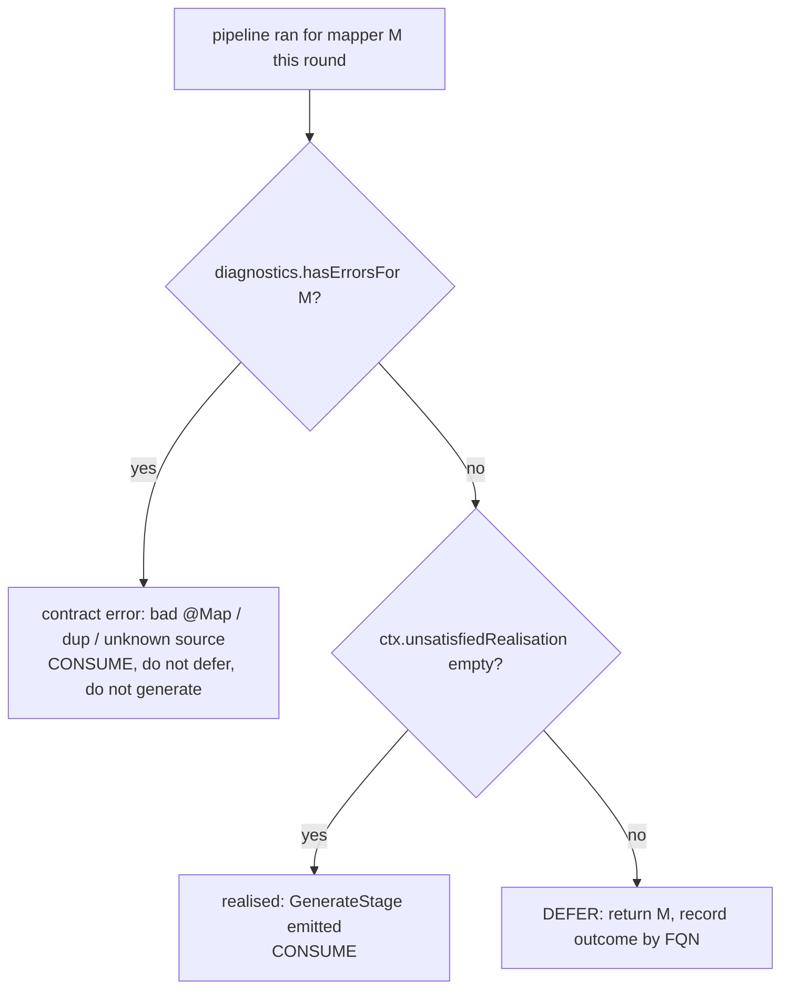
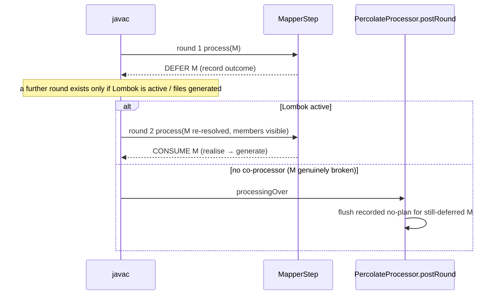

## Context

`PercolateProcessor extends BasicAnnotationProcessor`; its single `MapperStep` runs the whole
per-mapper `Pipeline` (discover → validate → expand → realisation-diagnostics → generate) and
returns `ImmutableSet.of()` — i.e. it **never defers**. When a `@Mapper` and the Lombok-annotated
DTOs it maps live in one compilation unit, the realisation stages (`ConstructorCall`,
`AccessorResolver`) read those DTOs in the **first** round, before Lombok has injected the
constructors/accessors. `RealisationDiagnosticsStage` then emits `no plan for tgt[]…` and javac
aborts.

A spike (standalone real `BasicAnnotationProcessor` + real Lombok 1.18.46, one compilation unit)
established the mechanics this design is built on:

- Round 1 sees only the `[0]`-arg default constructor on the `@Value` type. **Deferring** the mapper
  causes `BasicAnnotationProcessor` to re-resolve it **by name** in round 2, where the
  Lombok-injected all-args constructor is present. → deferral is sufficient; **no binding artifact**.
- **Deferral alone does not create another round** — javac runs a further round only when files are
  generated or another processor (e.g. Lombok) is active. So a co-processor's forced round is what
  lets a deferred mapper realise; a genuinely-broken mapper with no co-processor gets only round 1.
- The Step is **never** invoked at `processingOver`, so the recorded `no plan` for a still-deferred
  mapper must be emitted from `PercolateProcessor.postRound`. `BasicAnnotationProcessor`'s generic
  `MiscError` for the leftover deferral cannot be suppressed (its `process` is `final`), so it
  co-occurs with our message for the no-co-processor broken case — a documented trade-off (Risks).

This is **not** an architecture shift. The processor already concentrates round concerns in
`MapperStep` (it calls `Diagnostics.reset()` at round start) while stages stay myopic. This change
*strengthens* that boundary — it does not move round logic into stages.

## Goals / Non-Goals

**Goals:**
- A `@Mapper` co-compiled with its Lombok (or any AST-modifying-processor) domain types generates
  correctly, with no binding artifact and no Lombok-specific knowledge in the engine.
- A *genuinely* unrealisable mapper still produces percolate's own `no plan` diagnostic, correctly
  anchored on the mapper type (emitted at `processingOver` for a still-deferred mapper).
- Pipeline stages remain round-agnostic and idempotent.

**Non-Goals:**
- No MapStruct-style `AstModifyingAnnotationProcessor` SPI / `lombok-percolate-binding` artifact.
- No change to the SPI, the expansion engine, codegen, or generated output for realisable mappers.
- No attempt to make stages individually round-aware or to persist partial pipeline state.

## Decisions

### D1 — Stages stay round-agnostic; `MapperStep` owns the round decision

The whole `Pipeline` re-runs, idempotently, each round against a **freshly re-resolved**
`TypeElement` (BAP re-feeds deferred elements by name). No stage learns about rounds. This mirrors
the engine's existing law *strategies stay myopic; the driver owns orchestration* — here *stages
stay round-agnostic; the Step owns rounds*.

### D2 — Realisation outcome becomes **data on `MapperContext`**, not an in-stage diagnostic

`RealisationDiagnosticsStage` stops calling `diagnostics.error(...)`. It keeps its existing guard
(skip if `diagnostics.hasErrorsFor(mapperType)` — a contract error already explains the failure) and
otherwise **records** the unreached return-roots' formatted `no plan` messages into a new
`MapperContext` field (e.g. `unsatisfiedRealisation : List<String>`, empty when fully realised). The
stage's closest-miss walk is unchanged; only the sink changes (emit → record). `MapperStep` reads
this field to decide.

### D3 — Defer while unsatisfied; emit at `processingOver` via `postRound`

After the pipeline, `MapperStep` classifies the mapper using the recorded outcome plus the existing
`Diagnostics` API:

The emit does **not** happen in a normal round. A spike established the load-bearing fact:
**deferral alone does not create another round** — javac runs a further round only when files are
generated *or* another processor (e.g. Lombok) is active. So:

- **Co-module Lombok** — Lombok forces the extra round; BAP re-resolves the deferred mapper by name,
  the injected members are now visible, the mapper realises and is **consumed** (no leftover). Clean.
- **Genuinely un-realisable, no co-processor** — there is no further round, and BAP does **not** invoke
  a `Step` at `processingOver`. So `PercolateProcessor.postRound`, on the final round, **flushes** the
  recorded `no plan` for every still-deferred mapper (re-resolving the location by name). `MapperStep`
  holds the only cross-round state, `Map<fqn, List<String>>`, strings only — never `Element` (D5).

### D4 — No fixpoint, no global-progress gate (both disproven by the spike)

An earlier design emitted on a monotone *fixpoint* gated by a global "no-progress" round, observed via
`postRound`/`getRootElements`. The spike disproved its premise: **without a co-processor, deferral
yields no second round at all**, so any rule that waits for "one more round" never fires — javac goes
straight from round 1 to `processingOver` and BAP reports its generic `MiscError` instead of our
message. The guaranteed `processingOver` round (D3) is therefore the only robust emit point, and the
per-mapper outcome is simply flushed there (latest = most complete). No cross-round comparison and no
progress flag are needed; the `RoundProgress` collaborator was removed.

### D7 — Filer-writing stages run once, on the realised round

The pipeline re-runs on every deferral round, but `GenerateStage` and the three `Dump*Stage`s write
through the `Filer`, which forbids reopening a path — a deferred-then-realised mapper would otherwise
write each artifact twice. Both are gated on `ctx.getUnsatisfiedRealisation().isEmpty()`, so they run
only on the round the mapper realises. For that flag to be set at dump time,
`RealisationDiagnosticsStage` (with its `ValidateConstantDefaultLegalityStage` predecessor) is
reordered **before** the dump stages (`Expand → validate-constants → realisation → dumps → generate`).
Consequence: a genuinely un-realisable mapper emits no `.dot` under the multi-round model (it never
reaches a realised round) — see Risks; restoring failing-mapper dumps is a follow-up.

### D5 — Never carry `Element`s across rounds; re-resolve by name

`MapperContext` is rebuilt per round by `Pipeline` (`new MapperContext(element)`); javac `Element`s
from a prior round are stale. The cross-round outcome map keys on the mapper's **fully-qualified
name** and stores **formatted message strings**. The spike confirmed by-name re-resolution sees the
upstream-injected members.

### D6 — Alternatives considered

- **MapStruct `AstModifyingAnnotationProcessor` SPI + `lombok-percolate-binding`.** Not adopted:
  MapStruct-coupled and bakes Lombok-awareness into percolate. Deferral is oracle-free and works for
  *any* AST-modifying processor with no new dependency. *But* such a **completeness oracle is the only
  way to get a clean single error** for a genuinely-broken mapper (defer only types it says are still
  incomplete; emit immediately for complete-but-broken ones) — see Risks/Open Questions, it is the
  natural follow-up to remove the `MiscError`.
- **Split the pipeline across rounds (contract in round 1, realisation later).** Rejected: it
  requires persisting an `Element`-laden `MapperContext` across rounds — exactly what BAP forbids.
  Re-running the idempotent pipeline is cheaper and safe (D1/D5).

## Risks / Trade-offs

- **[`MiscError` co-occurs for a genuinely-broken mapper with no co-processor]** → BAP deferral is
  required to get re-invoked in Lombok's forced round, and BAP reports `MiscError` for any element
  still deferred at the end (its `process` is `final`; the deferred set is private — not suppressible
  without reflection). So a genuinely un-realisable mapper compiled *without* an AST-modifying
  co-processor shows **both** our `no plan` (the useful message) **and** BAP's generic error. The
  mapper fails the build either way; our message names the cause. *Mitigation/future:* a completeness
  oracle (D6) lets such a mapper emit cleanly in round 1 without deferral. The co-module Lombok case —
  the actual goal — is unaffected (consumed in Lombok's round, no leftover, no `MiscError`).
- **[Failing-mapper `.dot` dumps lost under multi-round]** → dumps now run only on a realised round
  (D7), so a never-realising mapper produces no debug graph. *Mitigation/future:* render each round's
  `.dot` text into round-spanning state and write once at `processingOver`; for now the integration
  build still dumps for *realisable* mappers (which is green).
- **[A contract error gets deferred]** → `RealisationDiagnosticsStage` records nothing once the mapper
  is scarred, and `MapperStep` checks `hasErrorsFor` first and consumes — contract errors are never
  deferred.
- **[Re-running the pipeline each round costs]** → negligible (compile-time, handful of mappers,
  idempotent); correctness dominates.
- **[Diagnostic surfaces at `processingOver` rather than round 1]** → acceptable; compile-testing and
  the build assert the message text, not the round. Realisable mappers consume on their realising
  round.

## Migration Plan

Additive and revertible. `MapperContext` gains one empty-list field; `RealisationDiagnosticsStage`
swaps its sink from `diagnostics.error` to `ctx` recording; `MapperStep` (now `@Singleton`) gains the
classify/defer logic, the per-FQN deferred map, and a `flushDeferredDiagnostics()` called from the new
`PercolateProcessor.postRound`; the pipeline reorders realisation ahead of the Filer-writing stages
(D7). Generated output is identical for realisable mappers, so the existing green suite is the
no-regression guard. Rollback = revert the commit.

## Open Questions

- **Completeness oracle** to remove the `MiscError` and restore failing-mapper dumps: detect that a
  referenced type is still incomplete (an AST-modifier will touch it) so percolate defers *only* those
  and emits cleanly in round 1 for complete-but-broken mappers. The natural follow-up.
- Whether to record **formatted messages** (simplest) or the unreached **root identities**
  (re-format at emit) on `MapperContext`. Lean: formatted messages — the fixpoint round re-ran the
  pipeline, so they are fresh and the message logic stays solely in `RealisationDiagnosticsStage`.
