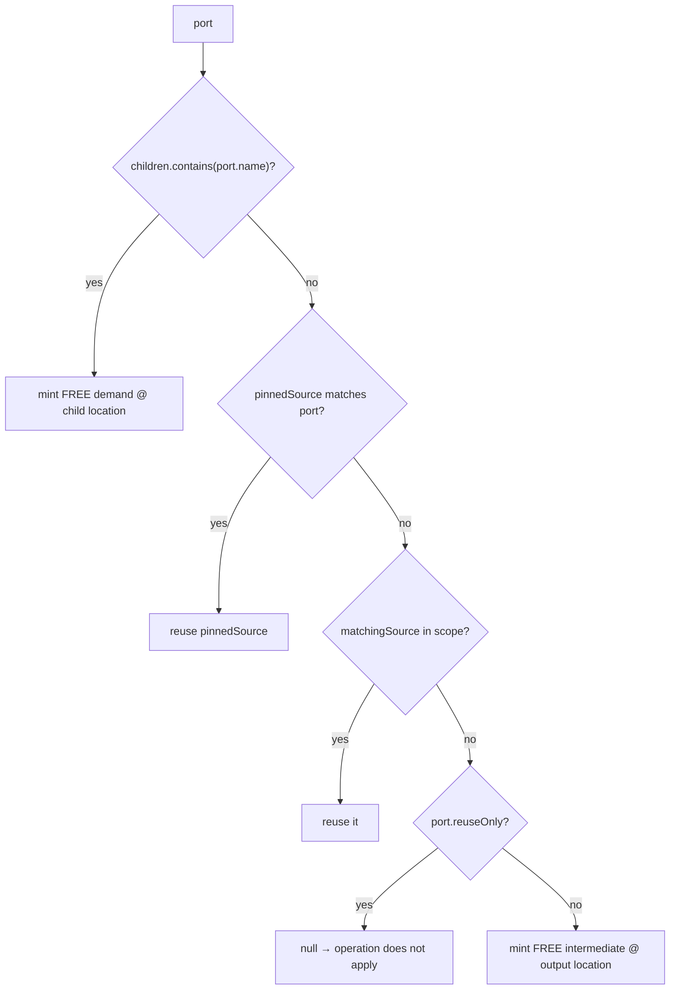
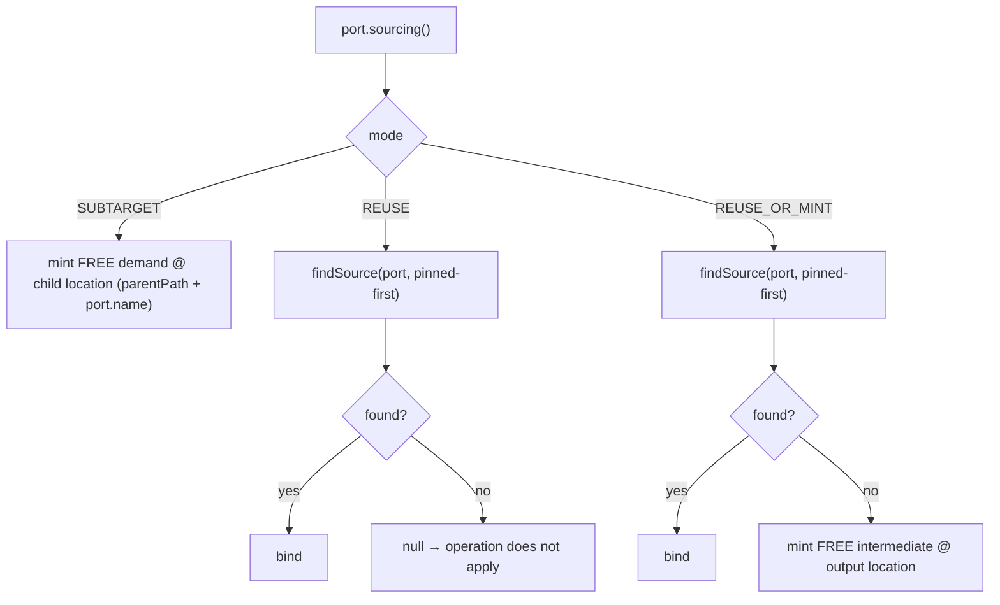
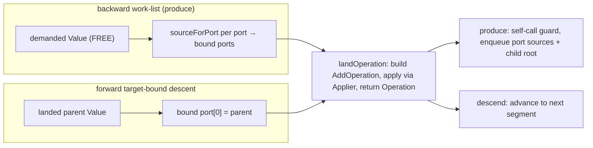

## Context

The expansion driver is otherwise mechanical — it over-emits every strategy match and prunes by cost — but one cluster of *implicit* decisions remains in `ExpandStage.sourceForPort`. For each port of a landing operation it reconstructs the port's sourcing intent from two heuristics and a threaded parameter:

The strategy already *knows* each port's intent when it emits it: `ConstructorCall` fires only when its parameter names equal `declaredChildren`, so every port it emits is a sub-target; `DirectAssign` / `NullnessCrossing` / `Container.unwrap` emit `Port.reuse(...)`. The engine throws that intent away and re-derives it by name-matching the goal spec and reading a boolean. A second, parallel landing path (`descendSegment`) hand-rolls its own `AddOperation` construction for accessor descent. This is the surface the next strategies (builders → `SUBTARGET`; sub-class dispatch; `@Context` captures → a future by-name bind) will push on, so it is worth making explicit and uniform before they arrive.

Constraints: Java 11 (no `sealed`, no pattern-`instanceof`); the change is an annotation-processor refactor (no runtime artifact, no data migration); the bar is **semantic equivalence** — every existing integration graph and extracted plan stays byte-identical.

## Goals / Non-Goals

**Goals:**

- Make a port's sourcing intent an explicit, strategy-declared attribute; have the engine **dispatch** on it, never reconstruct it.
- Collapse `sourceForPort` from five heuristic branches to a three-way dispatch on the declared mode.
- Remove `declaredChildren` from the engine binding path; remove the threaded `pinnedSource` parameter; write `AddOperation` construction once.
- Keep every architectural invariant: over-emit + cost-prune-to-one, myopic candidate-free strategies, one cost fold = SAT, the engine never chooses.
- Leave a clean seam for a future by-name `CAPTURE` binding mode.

**Non-Goals:**

- Implementing captures / `@Context`, builders, or sub-class dispatch (this is foundation only).
- Changing the cost fold, grounding-by-match, the scope model, or codegen.
- Merging the two control flows (backward produce work-list vs forward target-bound descent) — only their landing primitive is shared.
- Byte-level output changes of any kind.

## Decisions

> Architecture note: this change does **not** shift the architecture. It makes an *implicit* engine decision *explicit* on the SPI, which **strengthens** the existing "engine owns mechanics, SPI declares intent, strategies stay myopic" line rather than bending it. The only externally visible shift is a source-incompatible `Port` construction API (flagged BREAKING in the proposal).

### D1 — `Port` carries a closed sourcing mode

`Port` gains `Sourcing sourcing` with three values:

| mode | meaning | replaces |
|------|---------|----------|
| `SUBTARGET` | a structural sub-target — the engine mints a FREE demand at the child location | the `children.contains(port.name)` name-match |
| `REUSE` | must bind an in-scope source, else the operation does not apply | the `reuseOnly` boolean / `Port.reuse(...)` |
| `REUSE_OR_MINT` | bind an in-scope source, else mint a FREE intermediate at the output location | the default branch |

`sourceForPort` becomes:

*Alternatives considered.* (a) Keep the name-match and add only a boolean `subTarget` flag — rejected: still two mechanisms reconstructing one decision. (b) A polymorphic `PortSourcing` strategy object the engine calls back — rejected: over-engineering a small closed set, and it would hand the strategy a sourcing hook (a step toward graph access). A plain enum the engine switches on keeps mechanics in the engine.

*Myopia preserved.* The strategy declares the **mode** (a purely local fact it already holds); the engine still owns the child **location** (`parentPath + port.name`) and every graph mutation. No strategy gains graph or candidate access.

### D2 — `declaredChildren` leaves the binding path

`declaredChildren` stays only in `ProduceDemand.declaredChildren()`, where assembly strategies gate on it. The engine's `land` / `sourceForPort` no longer receive the children set: a `SUBTARGET` port already carries the name needed to form the child location.

*Semantic-equivalence argument (the nuance to pin).* Today an assembly port whose name is **not** a declared child silently falls through to reuse/mint; under explicit `SUBTARGET` it is always a child demand. These coincide because `ConstructorCall` only emits ports when `parameterNames(ctor).equals(declaredChildren)` — so every `SUBTARGET` port name **is** a declared child, and the child-location computation (`parentPath + name`) is identical to today's. A guard test pins that `ConstructorCall` fires only on set-equality.

### D3 — Directive-pinned source becomes a ranking input (Thread B)

`SourceCandidates.matchingSource(scope, port, pinned?)` ranks an in-scope source list **pinned-first, then by `Value::id`** (today's deterministic order). The `@Nullable Value pinnedSource` threaded through `expandFree → land → sourceForPort` disappears; one reuse lookup serves both "prefer the directive-pinned source" and "any in-scope source of the port's type." The pinned source is still materialised by forward descent in `expandFree`; only its *use* moves into ranking.

### D4 — One `landOperation` primitive (Thread C)

Both walks land through a single primitive — conceptually `landOperation(spec-fields, boundPorts, outputAddValue, childScope?) → Operation` — so `AddOperation` construction is written once.

The control flows stay **distinct**: the self-call guard and the work-list enqueue remain on the produce path (descent has no call target and enqueues nothing — `ACCESS`/`LEAF` are base cases); the forward root→leaf loop remains on the descend path. Target-bound descent is unchanged: `src.a.b.c` resolves root→leaf only because each segment's type is a data-dependency of the next, while the demand still flows from the target that asked for the leaf.

### D5 — Keep `ACCESS`, fix its documentation (Thread D)

The investigation confirms: under forward target-bound descent every `ACCESS` `Value` is an accessor `Operation`'s output by construction (`descendSegment` lands the producing op), so a **producerless `ACCESS` cannot arise**. We therefore *keep* the `ACCESS` role and *correct its prose*:

- `Location` enum doc: drop "only accessor strategies may, re-demanding the parent path"; state that `ACCESS` values are produced **forward** by target-bound descent and are base cases for `expand`.
- `graph-model` spec: align the `ACCESS` description to the above.

*Alternative considered.* Collapse `ACCESS` into `LEAF`. Rejected: a (hypothetical) producerless multi-segment source would then become a `Cost.ZERO` base case — silently wrong, since only a true supply root is free. The `ACCESS` ≠ `LEAF` distinction is a cheap correctness guard in `plan-extraction`'s base-case rule, which stays **unchanged** (so `plan-extraction` is not a modified capability).

### D6 — Reserve the by-name `CAPTURE` seam (forward-looking)

The mode is an enum the engine switches on, and `SourceCandidates` matching stays an **engine** concern. We deliberately do not encode "type is the only match key" into the mode contract: a future `CAPTURE` mode (`@Context`-like, bound by name to an ambient source) must slot in beside the three modes and extend matching with a name key without reopening the closure. Built now: three modes only.

## Risks / Trade-offs

- **SPI source break for third-party `Port` construction** → built-in and reactor strategies update in lockstep; the `Port.reuse(...)` factory survives as the `REUSE` constructor and the primary constructor defaults `REUSE_OR_MINT`, so most call sites are untouched. Flagged BREAKING in the proposal.
- **A strategy stamps the wrong mode → silent plan drift** → the three built-in assignments are mechanical; the byte-identical integration-graph bar catches any drift, and focused Spock tests assert each built-in's emitted port modes.
- **`SUBTARGET` vs former name-match divergence** → covered by D2's set-equality argument plus a guard test on `ConstructorCall`.
- **Pinned-source ranking re-orders selection** → a test pins that a directive-pinned source still wins over a same-typed sibling and that, absent a pin, ordering is `min` by `Value::id` (unchanged).

## Migration Plan

In-tree refactor, no deploy/rollback machinery. Order: (1) `Port` gains `Sourcing` + factories; (2) built-ins stamp modes; (3) engine — `sourceForPort` dispatches on mode, extract `landOperation`, `SourceCandidates` pinned-first ranking; (4) `Location.Role` docs + `graph-model` prose; (5) verify every integration graph/plan byte-identical. Rollback = revert the commit.

## Open Questions

- Should `REUSE_OR_MINT` be the default of the primary `Port` constructor (keeping concrete-port construction ergonomically unchanged), or always explicit? Leaning **default**.
- The reactor `Container.unwrap` reuse port flows through the `Container` base — confirm the single base update covers it with no reactor-module-specific change (expected: yes).
