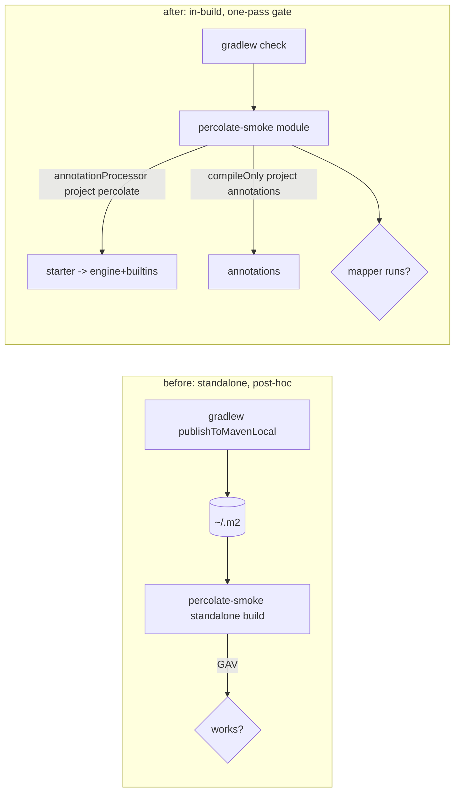

## Context

Two warts from the archived `introduce-consumer-packaging` change.

**POM leak.** Every percolate module uses `platform(project(':dependencies'))` on `api`/`implementation` for third-party version management. Those are published variants (`apiElements`/`runtimeElements`), so each published POM gains a `<dependencyManagement>` import of the internal platform. That both (a) exposes consumers to internal build/test version constraints and (b) forced us to publish the internal platform as `percolate-dependencies` so the import resolves at all.

**Smoke is post-hoc.** `percolate-smoke` is a standalone build that runs *after* `publishToMavenLocal`, resolving the published coordinates. It can only fail once the artifact already exists, pollutes `~/.m2`, is a manual two-pass, and is not a `check` gate. A `project()` dependency resolves against the **exact build outputs**, so a normal in-build module tests starter aggregation + generation + behaviour + zero-footprint as a real one-pass gate. The only thing publish-then-consume uniquely checked — POM closure and HTTP-downloadability — is Central's concern (immutable, content-identical) or a POM-generation bug fixed structurally by the de-leak.

## Goals / Non-Goals

**Goals:**
- Published percolate POMs are self-contained: concrete dependency versions, no import of the internal platform.
- The internal `:dependencies` platform is no longer published.
- The consumer smoke becomes an in-build module wired into `./gradlew check`, using `project()` deps.
- `TypeUniverse` sheds its dead jqwik-era members and gains `of(Class<?>)`; fixture specs reference fixtures by Class literal.

**Non-Goals:**
- Maven Central publishing, signing, or a release-time staging gate (deferred).
- Any new validation of published coordinates / downloadability (a committed POM-inspection test is explicitly out — manual inspection only).
- Changing what the starter/BOM/annotations are or how a consumer wires them.
- Reworking the World-1 harness beyond the fossil removal + `of(Class)` (no second JavacTask, no behavioural change to the shared substrate).

## Decisions

### Decision 1: Self-contained POMs via versionMapping + platform off published variants

Pin concrete versions in every publication with `versionMapping { usage('java-api') { fromResolutionResult() }; usage('java-runtime') { fromResolutionResult() } }`, and keep `platform(project(':dependencies'))` off the **published** configurations (`api`/`implementation`). The platform stays available for *resolution* (so unversioned deps like `'org.jgrapht:jgrapht-core'` still resolve) by attaching it to the resolvable classpaths that do not feed published variants — e.g. a convention that adds it to `compileClasspath`/`runtimeClasspath`/`annotationProcessor`/test classpaths rather than to `api`/`implementation`. Result: the POM lists concrete versions and no platform import.

**Alternative — `pom.withXml` strips the `<dependencyManagement>`:** surgical and small, but edits raw XML and leaves the platform on the published variant's Gradle Module Metadata. Kept as a fallback if the configuration reshape proves noisy.

**Alternative — keep publishing `percolate-dependencies` (status quo):** rejected; it leaks internal constraints to consumers, which is the wart being removed.

### Decision 2: `:dependencies` stops publishing

Once nothing imports it, drop `maven-publish` from the `:dependencies` module. It returns to being a purely internal version platform.

### Decision 3: `percolate-smoke` becomes an in-build module

Convert it from a standalone build to a subproject in `settings.gradle`:

It declares `annotationProcessor project(':percolate')` (so the starter puts engine+builtins on the AP classpath, exercising aggregation) and `compileOnly project(':annotations')`. It compiles one fixed mapper, runs it (a `JavaExec` `smokeRun` on the main runtime classpath, which carries no percolate — proving zero footprint), and `check.dependsOn smokeRun`. It does **not** apply `maven-publish`. Its standalone `settings.gradle` is removed.

### Decision 4: The smoke module is subject to the repo quality gates

As a subproject applying `java`, it inherits the root `java-base` conventions (errorprone, NullAway, PMD, CodeNarc, spotless). Rather than special-casing the root build to exclude it, keep it subject to the gates and add the minimal null-marking (`@NullMarked package-info`) so its handful of trivial classes pass. Generated code is already excluded from these checks (`disableWarningsInGeneratedCode`, `treatGeneratedAsUnannotated`). If it proves noisy, fall back to excluding the module in the root convention.

### Decision 5: TypeUniverse fossil removal + `of(Class<?>)`

Delete the members kept alive only by the removed jqwik property layer — `pool()`, `TYPE_POOL`, `anyConstruct()`, and the `INSTANT`/`LOCAL_DATE_TIME` constants that fed only the pool — and drop the `TypeUniverseSpec` assertion on `pool().size()`. Add `static TypeElement of(Class<?> type)` that resolves through the **same** `Elements` substrate (`lookup(type.getCanonicalName())`), so the single-substrate invariant is preserved — `of(X.class)` is just a rename-safe, IDE-tracked spelling of `element("…X")`. Migrate the **fixture** references (`io.github.joke.percolate.spi.builtins.fixtures.*`) across the strategy specs to `of(<Fixture>.class).asType()`; leave `element(String)` in place for JDK types and any genuinely dynamic name. This is the direct fix for the "fixtures look unused / rename silently breaks them" problem, and it removes the self-justifying test that made a fossil look load-bearing.

**Alternative — keep `element(String)` everywhere:** rejected; it is the root cause of the IDE-invisibility and rename-fragility this change exists to fix.

## Risks / Trade-offs

- **versionMapping/config reshape touches every module's build** → Mitigation: implement as a root-convention change keyed on plugin application, not per-module edits; verify by diffing a generated POM before/after (concrete versions, no import).
- **Removing the platform from `api`/`implementation` could break version resolution** for unversioned third-party deps → Mitigation: ensure the platform is attached to the resolvable classpaths; a failed `compileJava` surfaces any miss immediately.
- **Losing the published-coordinate check** that caught the original leak → Accepted: the de-leak removes that bug class structurally; real coordinate validation belongs in the deferred staging gate.
- **Smoke module quality-gate friction** → Mitigation: minimal `@NullMarked`; fall back to excluding it from the strict conventions if needed.

## Migration Plan

1. Add `versionMapping` to the publication convention; move `platform(project(':dependencies'))` off published configurations onto resolvable classpaths.
2. Drop `maven-publish` from `:dependencies`.
3. Regenerate a POM (`generatePomFileForMavenPublication`) and confirm concrete versions + no `percolate-dependencies` import.
4. Convert `percolate-smoke` to a subproject: add to `settings.gradle`, remove its `settings.gradle`, switch deps to `project(':...')`, wire `smokeRun` into `check`, add `@NullMarked`.
5. `./gradlew check` green (now including the smoke), and `publishToMavenLocal` still succeeds with one fewer artifact.

Rollback: restore the platform on published configs, re-add `maven-publish` to `:dependencies`, and revert `percolate-smoke` to a standalone build.

## Open Questions

- Whether to run the smoke as a `JavaExec` (current shape) or a JUnit/Spock test class. Leaning `JavaExec` — dependency-light and consumer-like.
- Whether `versionMapping` alone suffices to drop the import or whether the platform must also be removed from published configs (verify empirically in step 3; fall back to `pom.withXml`).
