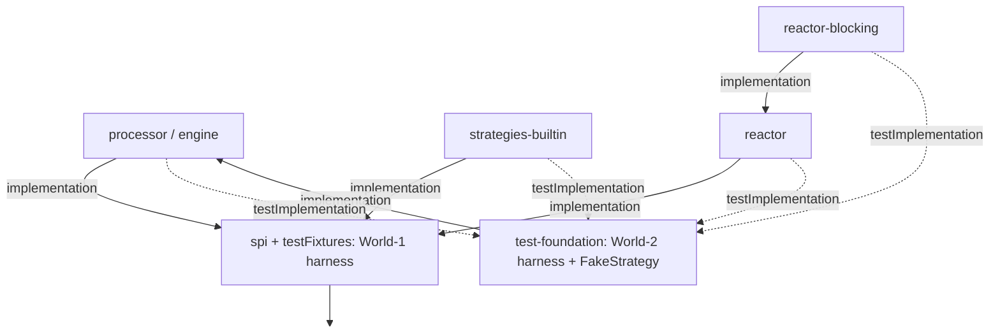
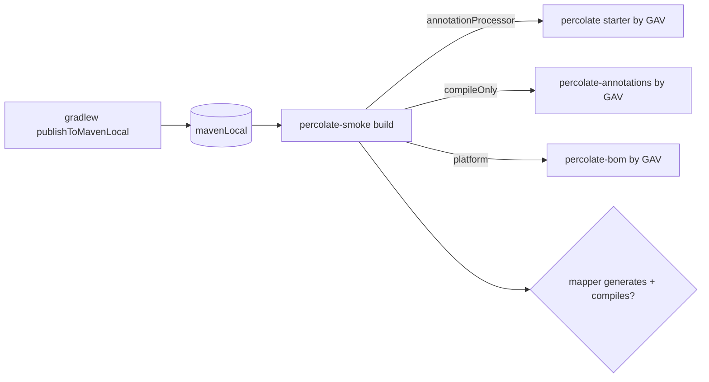

## Context

Percolate is a compile-time annotation processor with two coupled problems. (1) No consumer packaging: no version platform for its own artifacts, no single coordinate, and the engine only ships usable strategies via `processor`'s `runtimeOnly project(':strategies-builtin')`. (2) That same edge leaks the builtins onto `processor`'s test classpath, so the engine's end-to-end specs run the real `PercolateProcessor`, pick up builtins via ServiceLoader, and assert builtin-specific output. The module graph claims `processor` and `strategies-builtin` are independent SPI peers; the test classpath silently couples them. Because the engine never compile-tests strategies in *their own* module, refactors regress in ways caught only downstream.

Generated code references only the consumer's types and `javax.annotation.processing.Generated` (a `java.base` type); `@Mapper`/`@Map` are `CLASS`-retention. Percolate therefore has zero runtime footprint — packaging is entirely about the `annotationProcessor` classpath. The internal `:dependencies` `java-platform` pins third-party versions for our builds and is **not** a consumer BOM.

This change does packaging, publishing, the shared test harness, and the e2e re-slice together, because cutting the `runtimeOnly` edge breaks the engine's e2e specs and the harness + relocation is what repairs them — they are one indivisible move.

## Goals / Non-Goals

**Goals:**
- A single convenience coordinate (`percolate`) that supplies engine + builtins, versions via a BOM.
- Maven publication for every publishable module, validated through `publishToMavenLocal`.
- The processor↔builtins separation enforced by the dependency graph: `processor` has no edge (compile/runtime/test) to any strategy module.
- A shared `test-foundation` compile harness consumed by every e2e suite.
- Builtin e2e tests relocated into `strategies-builtin`; engine e2e tests rewritten against a `FakeStrategy`.
- A black-box `percolate-smoke` build resolving artifacts by GAV from `mavenLocal()`.

**Non-Goals:**
- Maven Central publication (signing, metadata, release automation) — `publishToMavenLocal` is the validation boundary here.
- Splitting the engine out of `processor`.
- Adding new conversion strategies or changing generated-mapper runtime behaviour.
- Publishing `test-foundation` as a public testing artifact (it stays internal for now; the module boundary makes that a later one-line decision).

## Decisions

### Decision 1: Starter as aggregator, not fat jar

`io.github.joke.percolate:percolate` is an aggregator whose POM has `api` dependencies on `processor` and `strategies-builtin`. Consumers add it to `annotationProcessor`; transitive resolution lands engine + builtins on the processor classpath. Baking builtins into the processor jar (immutables-style) is rejected — it would destroy the SPI separation that is load-bearing for extensibility. This is the Spring-Boot-starter shape.

### Decision 2: Consumer BOM distinct from the internal platform

`io.github.joke.percolate:percolate-bom` (`java-platform`) manages versions of percolate's own artifacts only. The internal `:dependencies` platform stays internal. Because percolate is compile-time-only on an isolated classpath, the consumer BOM need not pin third-party versions.

### Decision 3: Cut `processor`'s builtins edge; the starter owns bundling

Remove `runtimeOnly project(':strategies-builtin')` from `processor`. This makes the separation structural and removes builtins from `processor`'s test classpath. This is not an architecture break — it tightens an already-declared boundary.

### Decision 4: `test-foundation` houses the World-2 harness and `FakeStrategy`

A new module `test-foundation` depends on `processor` + compile-testing and exposes:
- `compileMapper(source, target, directives) -> Compilation` (and helpers) — strategy-agnostic compilation of a `@Mapper` over supplied sources.
- `FakeStrategy` — a synthetic SPI implementation emitting a sentinel, for engine-isolation tests.

It sits **above** `processor` and references **no** strategy module, so it stays strategy-agnostic. The World-1 harness (`TypeUniverse`, `HarnessResolveCtx`) stays in `spi` testFixtures — it needs only javac + spi and must not be pulled above `processor`.

### Decision 5: Re-slice e2e by who owns the asserted behaviour

Classify each `processor` e2e spec by the litmus test "does the assertion mention a string only a strategy knows?":
- **Builtin output** (`Integer.valueOf`, container expressions, `new Foo(...)`) → move to `strategies-builtin/src/test`, rewritten on the shared harness. `strategies-builtin` gains `testImplementation project(':processor')` + `project(':test-foundation')` + compile-testing.
- **Engine behaviour** (cost selection, descent, diagnostics, weaving) → stay in `processor`, rewritten to drive generation with `FakeStrategy` (registered via a test-local `META-INF/services` entry) and assert on the sentinel + structure.
- **Pure stage/discovery/validation** specs that never run the full pipeline are unaffected.

`reactor`/`reactor-blocking` migrate their compile boilerplate onto the harness (they already test-depend on `processor` + `strategies-builtin`).

### Decision 6: Smoke as a standalone build consuming `mavenLocal()`

`percolate-smoke` is a self-contained Gradle build (its own `settings.gradle` + `build.gradle`, `repositories { mavenLocal() }`), **not** a subproject and **not** an `includeBuild` (which would substitute project deps and bypass `mavenLocal`). Validation is two-pass: `./gradlew publishToMavenLocal` then build the smoke project. Its inability to reference `project(':...')` is what guarantees the black-box property.

## Risks / Trade-offs

- **Large, indivisible change** → Mitigation: sequence the work internally — packaging+publish, then `test-foundation`, then re-slice, then smoke — running `./gradlew check` between phases so breakage is localised.
- **Cutting `runtimeOnly` red-lines the build until the re-slice lands** → Accept within this change; the harness + relocation in the same change restore green before completion (no excluded specs, per the chosen approach).
- **Engine tests via `FakeStrategy` could under-constrain** → the fake asserts weaving/structure with a sentinel; real conversion correctness is owned by `strategies-builtin` e2e. Composition seams stay covered by the existing World-1 expansion/grounding specs plus targeted strategy e2e.
- **Two-pass smoke validation is not a single `./gradlew check`** → document the two commands; optionally add a root helper task (`GradleBuild`/`Exec`) that runs them in order. Smoke validates packaging, not behaviour, so it need not gate the main `check`.
- **`@MapList` is `RUNTIME`-retention while `@Map`/`@Mapper` are `CLASS`** → generated impls don't reflect, so `compileOnly` annotations suffice; documented, retention unchanged.

## Migration Plan

1. **Packaging + publish:** realise `bom`, add `percolate` starter, apply `maven-publish` to publishable modules, cut `processor`'s `runtimeOnly` edge. Build is now red on `processor` e2e.
2. **Harness:** add `test-foundation` (harness + `FakeStrategy`); wire `strategies-builtin` (and `processor`) test classpaths to it.
3. **Re-slice:** move builtin-output specs to `strategies-builtin`; rewrite engine specs against `FakeStrategy`; migrate reactor specs onto the harness. Build green again.
4. **Smoke:** standalone `percolate-smoke` build; validate via `publishToMavenLocal` + smoke build.
5. `./gradlew check` green, then commit.

Rollback: re-add the `runtimeOnly` edge, drop the new modules, restore specs from VCS. No external artifact has shipped, so there is no compatibility surface.

## Open Questions

- Resolved: scope is one big change (packaging + publish + harness + re-slice + smoke); full `maven-publish`/`publishToMavenLocal`; no excluded specs (relocation happens in-change).
- Starter artifact id: `percolate` (chosen, mirroring `org.immutables:value`).
- Whether the smoke build gates `check` or runs as a separate verification task (leaning separate, since it needs `publishToMavenLocal` first).
