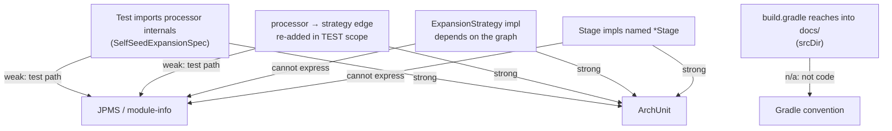
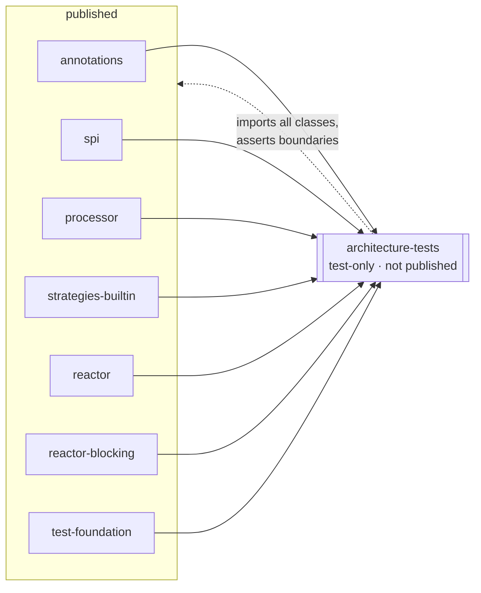
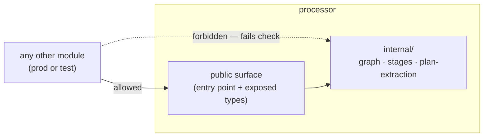

## Context

Percolate's module graph already encodes the intended architecture, but three recent changes proved the boundaries are not *enforced* — they re-erode each time:

- `consumer-packaging` removed `processor`'s `runtimeOnly strategies-builtin` edge to make engine⟂builtins graph-true; the manual change then had `strategies-builtin` reach into the root `docs/` tree.
- `e2e-test-architecture` declared "the engine is tested via `FakeStrategy`; `processor` has no edge to any strategy," yet `SelfSeedExpansionSpec` — a pure engine-expansion test — sits in `strategies-builtin` and imports `processor.graph.*` and `processor.stages.*` internals.

The boundaries live only in discipline and memory files. There is no build artifact that fails when a boundary is crossed, so drift is invisible until a human notices. This change makes the boundaries **declared in code and checked by `./gradlew check`**, before a documentation overhaul is layered on top.

Constraints that shape the solution:

- The product is an **annotation processor**: at processing time it loads on a *flat* `annotationProcessor` classpath, not a module path, and discovers strategies by `ServiceLoader`.
- Tests are **Groovy/Spock** plus **Google compile-testing**, which runs `javac` in-process.
- **Solo maintainer**; the goal is catching one's own drift fast, not policing many contributors.
- The project already has a rich, written architectural vocabulary ("strategies stay myopic," "`*Stage` naming," "`spi` is the bridge," "engine ⟂ strategy") — boundaries that are *member-of-type* and *test-scope* shaped, not merely module-level.

## Goals / Non-Goals

**Goals:**

- Make "reaching into engine internals" a definable, build-checkable fact via an explicit `processor` api/internal package split.
- Enforce the inter-module layering, the engine↔strategy `spi`-only crossing, and the strategy-myopia / `*Stage` / no-cycle conventions as failing tests.
- Relocate exactly the tests the new rules force out (starting with `SelfSeedExpansionSpec`) into `processor` against `FakeStrategy`.

**Non-Goals:**

- The full contract-audit and re-sort of all `strategies-builtin/e2e` specs — a later change. This change moves *only* what the encapsulation rule makes illegal.
- Healing the `docs/` `srcDir` reach — the later documentation-overhaul change removes it via antora-collector. This change must **not** add a rule that fails on the existing `srcDir`.
- Adopting JPMS now (see Decision D1; kept as a future option).
- Any change to runtime behaviour, generated output, or the consumer-facing processing surface.

## Decisions

### D1 — ArchUnit over Jigsaw (JPMS)

The enforcement mechanism is **ArchUnit**, running in a dedicated test module, not JPMS `module-info.java`.

The leaks this project actually produces, mapped against what each tool governs:

The two leaks we have are **test-scope** and **build-config** — JPMS's weakest areas — and the highest-value rules are **member-of-type conventions** JPMS cannot express. JPMS's compile-time guarantee is also partly moot here: the engine processes on a flat AP classpath, so a consumer build never reads our `module-info` during processing. Against that, JPMS would tax every build (Groovy/Spock + in-process compile-testing + ServiceLoader under the module system require `--add-opens`/`--add-reads`/`org.javamodularity` ceremony). For a solo maintainer the un-bypassable property buys little over a fast failing test.

ArchUnit, conversely, expresses the project's real vocabulary (test-scope rules, internal-package rules, "implementors of X must not depend on Y," naming, cycles) and runs in the harness that already exists.

*Architecture note (per the "never break the architecture" rule):* this is **not** an architectural shift — it declares and guards the architecture that already exists. JPMS remains a clean future hardening; adopting it later is additive, whereas unwinding a JPMS test setup later is not. Its only edge — a single self-documenting `module-info` per module — is matched by one readable `layeredArchitecture()` / `onionArchitecture()` declaration.

*Alternatives considered:* JPMS `module-info` (rejected now: cost/stack mismatch above); per-module Gradle dependency restrictions only (rejected: cannot see *into* code for internal-package or strategy-myopia rules); status quo of discipline + memory files (rejected: that is precisely what eroded three times).

### D2 — A dedicated `architecture-tests` module is the single vantage point

ArchUnit must import the compiled classes of every module it reasons about, including cross-module rules ("no module other than `processor` touches `processor.internal`"). A single test-only, **unpublished** module that takes every publishable module on its `testImplementation` classpath is the one place that can see the whole graph.

The module applies no `maven-publish`, imports classes via `ClassFileImporter` over the other modules' build outputs (their `jar`/`classes` reachable through the `testImplementation project(...)` edges), and is wired into `check`. Putting the rules here keeps each functional module free of architecture-test plumbing.

*Alternative considered:* scatter ArchUnit rules into each module's own `src/test` (rejected: no module except a dedicated aggregator can express cross-module rules without itself depending on the modules it polices, which would *create* the very edges we forbid).

### D3 — The api/internal split is "internal by package segment, public by exception"

`processor`'s graph, stages, and plan-extraction implementation types move under a package segment containing `internal`; only the entry point and the types other modules genuinely consume stay outside it. ArchUnit's rule is then the single line "no class outside `processor` depends on `..processor..internal..`." The encapsulation rule and the relocation of `SelfSeedExpansionSpec` are two faces of one fact: once `processor.graph` becomes `processor.internal.graph`, the spec's imports are illegal from `strategies-builtin`, which *forces* the move rather than relying on a reviewer to notice.

*Alternative considered:* mark internals with a `@Internal` annotation and write an ArchUnit rule against it (rejected: a package segment is self-evident in every import line and needs no annotation upkeep; the annotation approach hides the boundary from the reader of an import statement).

### D4 — Move only what the rules force; drive engine tests with FakeStrategy

`SelfSeedExpansionSpec` currently stands up a throwaway `ExpandingProcessor` that `ServiceLoader`s real strategies merely to make expansion produce operations, then asserts on graph internals. Relocated to `processor`, it drives expansion with the existing `FakeStrategy` (the engine suite's established vehicle), so it asserts the engine contract without any strategy module on the classpath. Any sibling spec the encapsulation rule also makes illegal moves the same way. Specs that genuinely assert a builtin's own atom/output/targeted-diagnostic stay in `strategies-builtin` — their triage is the *later* change, not this one.

## Risks / Trade-offs

- **Package move ripples across the engine** → Mitigation: it is a mechanical move + import rewrite with no behavioural edit; the unchanged engine suites are the safety net (a green run proves placement-only). Stage the move as its own commit so a regression bisects cleanly.
- **ArchUnit importing build outputs can be flaky if class locations shift** → Mitigation: import via the `testImplementation project(...)` edges (compiled `classes` dirs / jars Gradle already resolves), not hard-coded paths; let `check` order guarantee the modules are built first.
- **A rule could accidentally fire on the not-yet-removed `docs/` `srcDir`** → Mitigation: this change adds no build-config rule; the `srcDir` is code-invisible to ArchUnit anyway, and its removal belongs to the later docs change.
- **`FakeStrategy` may not reproduce the exact expansion shape `SelfSeedExpansionSpec` asserts** → Mitigation: the spec asserts engine structure (self-seeded return root, demand-driven leaf, goal-spec ownership), which is strategy-agnostic; if a particular assertion needs a producing operation, the fake emits a sentinel producer, as the engine weaving spec already does.
- **ArchUnit rules are deletable (not compiler-enforced)** → Accepted: for a solo maintainer the value is fast drift detection; a deleted rule is itself a visible diff, and JPMS remains the escalation if that ever stops being enough.

## Migration Plan

1. Add the `architecture-tests` module (no publication), wire it into `settings.gradle` and `check`; land the layering + cycle + naming + myopia rules that already pass, proving the harness.
2. Introduce the `processor` `internal` package segment; move graph/stages/plan-extraction internals; rewrite imports. Run the engine suites — they must pass unchanged.
3. Add the "no external dependence on `processor.internal`" rule. It now goes red on `strategies-builtin`.
4. Relocate `SelfSeedExpansionSpec` (and any sibling the rule reddened) into `processor`, rewired onto `FakeStrategy`. The rule goes green.
5. `./gradlew check` is the gate; every boundary is now a failing-test away from violation.

*Rollback:* the change is additive (new test module + rules) plus a mechanical package move and a test relocation. Reverting the merge restores the prior package names and test locations with no behavioural impact.

## Open Questions

- Exact public surface of `processor`: which currently-public types other modules truly consume (and so stay outside `internal`) is settled by compiling step 2 — anything no external module imports moves inward.
- Whether `reactor` / `reactor-blocking` need any rule beyond the shared layering, or are fully covered by the generic strategy-module rules (resolve when their classes are imported in step 1).
- ArchUnit version pin against the Java 11 / Gradle 9.3 toolchain (resolve at implementation).
