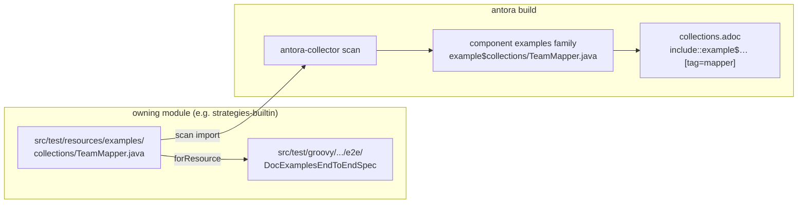
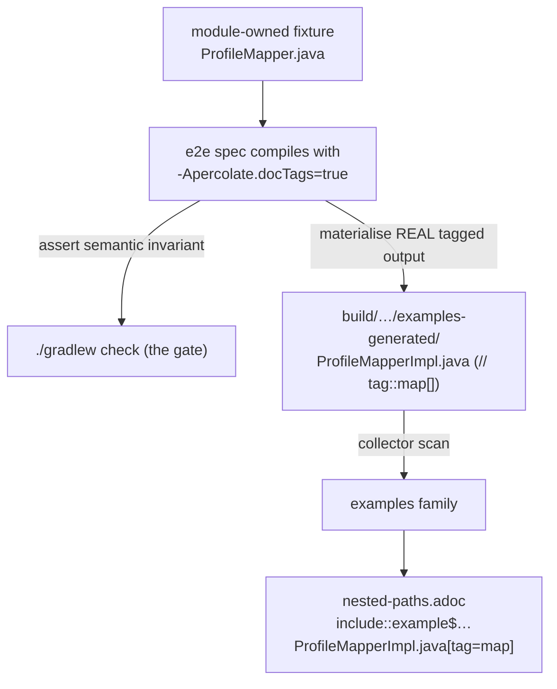
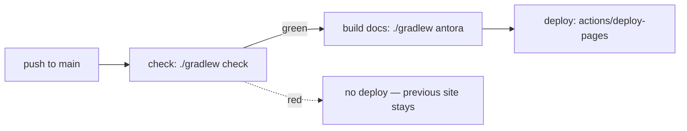

## Context

The `add-antora-user-manual` change (its design D2, the "include-bridge") made a deliberate interim trade: example mappers live under `docs/modules/ROOT/examples/` and `strategies-builtin` reaches into that tree as a test resource `srcDir`, because Antora's `include::example$…` resolves only inside a component's `examples` family and cannot reach a module's source tree. That trade left three open seams, all flagged in the original design's own risks and open questions:

- the example source sits far from the spec that compiles it, and a leaf module reaches up into the root `docs/` tree (the wrong dependency direction);
- generated *output* shown in the manual is hand-typed (`nested-paths.adoc`), so it can drift even though the input cannot;
- the deploy is ungated, and the promised reactive examples have no module in which they can compile.

This change closes all three. It lands after `enforce-module-separation`, so the modules the fixtures move into already have crisp, enforced boundaries.

Hard constraints (unchanged since D2):

- Antora `include::example$<path>` resolves only within an `examples` family; the included file must physically sit in the catalog. The only choice is whether that file is the source of truth or a projection of it.
- Generated mappers are produced by our processor; we own the emitter, so output can carry whatever markers we choose to emit.
- `./gradlew check` is the compile gate; Antora renders, it does not compile.

## Goals / Non-Goals

**Goals:**

- Make the owning module the single source of truth for each example fixture; delete the cross-tree `srcDir`.
- Single-source documented generated output from real generation, sliced by tags like inputs already are.
- Publish only on a green build.
- Give the reactive examples a real home.

**Non-Goals:**

- Re-sorting or deduplicating the broader e2e test suite (that is `audit-e2e-test-placement`, change 3).
- Committed golden files (conceded: the test is the correctness oracle whether or not output is displayed; real-compile-with-tags is correct by construction).
- A custom Antora UI, multi-component split of the manual, or release-tag deploy automation.

## Decisions

### D1 — antora-collector `scan` imports module-owned fixtures; the module owns the source

Fixtures move into the owning module's `src/test/resources/examples/…` (a real resource, so the e2e spec keeps loading it via `JavaFileObjects.forResource(...)` unchanged — `forResource` reads the *classpath resource*, which a `src/test/resources` file is and a `src/test/java` file is not). Antora's collector `scan` reconstitutes them into the component's `examples` family at site-build time; `scan` imports files as-is and compiles nothing, so the compile gate stays in Gradle.

If `into:` reconstructs the same subpath, the existing page `include::`s are unchanged — only the file location and `strategies-builtin/build.gradle` change (the `rootProject.file('docs/...')` `srcDir` is deleted).

*Spike-first task:* the collector resolves `scan.dir` relative to either the content-source worktree root or the `antora.yml` start_path (`docs/`). This determines whether `dir` names modules directly or needs `../` / a relocated content-source root. A 30-minute experiment (extension in, one `scan` at one module, run `antora`) settles it before any file moves.

*Alternatives considered:* keep `docs/` ownership + the `srcDir` reach (rejected: the wrong-direction coupling this change exists to remove); a Gradle `Sync` that copies module fixtures into `docs/` (rejected: a committed/gitignored projection and build-ordering, where the collector is purpose-built for exactly this import).

### D2 — Output is single-sourced via an opt-in doc-tag emission mode

The slicing mechanism for inputs is already tags (`include::…[tag=mapper]`). Outputs need only the same tags, and we own the generator. A processor option `-Apercolate.docTags` (**default off**) makes the generator wrap each generated method in `// tag::<methodName>[]` / `// end::<methodName>[]`. Off by default keeps real consumer output pristine (the `@Generated`-only contract holds); the docs path turns it on. Antora strips the tag-directive lines on include, so published snippets are clean code.

Because the displayed body is the actual generated body, even unasserted lines are truthful — there is no second copy to diverge. The hand-typed block in `nested-paths.adoc` is replaced by an `include::`. (The tags bracket the method *body*, not the whole method: JavaPoet can't emit comments between type members, and the body is `CodeBlock`-wrapped cleanly in `BuildMethodBodies`. A page shows the generated logic; the signature, derivable from the input, is prose context.)

*Materialisation — by the e2e spec, not a separate module.* The spec already runs the real processor through Google compile-testing (its generated text is identical to a real `javac` compile), so it is the single owner of input → assert → output: it writes the tagged generated source to a build directory the collector scans, and the Antora task depends on that test task. Reach for an annotation only if a page needs a *sub-method* region the per-method auto-tags do not carve (`@Tag("id")`); reject a generic `@SourceMarker(before,after)` as premature generality that leaks AsciiDoc into Java.

*Alternatives considered:* a dedicated real-compile `docs-examples` module that emits to `build/generated` and doubles as smoke (rejected as primary: it reintroduces a resource-vs-source duplication of each fixture and more build wiring, while `percolate-smoke` already covers real-compile smoke and compile-testing already runs real `javac`); committed golden snippets (rejected per Non-Goals); line-range includes or generator-always-emits-tags (rejected: brittle / pollutes every consumer's output).

### D3 — The deploy is gated on a green build

Today `build.yml` runs `./gradlew check` and `docs.yml` builds+deploys Antora, both on push to `main`, **independently**. The deploy must be downstream of the check.

Reconcile the two workflows so the Pages deploy `needs:` the check job. Preferred: fold the docs build+deploy jobs into the pipeline that already runs check on `main`, so check runs **once** and the docs jobs depend on it (also removing the confusing `build` job-name collision between the two files). The full-history checkout (`fetch-depth: 0`) and `pages: write` / `id-token: write` permissions move with the docs jobs.

*Alternative considered:* keep `docs.yml` separate and trigger it via `workflow_run` on `build` completing successfully (rejected as default: it avoids a second check run but adds conclusion-gating and cross-workflow artifact handling; revisit only if the single-pipeline run time becomes a problem).

### D4 — Reactive examples live in `reactor`

`Flux`/`Mono` example mappers, their e2e spec, and the materialised tagged output live in `reactor` (the only module where they compile), with a manual page and a second collector `scan` entry. This is the concrete payoff of inverting ownership: an example compiles where its atoms live, which the old single-`srcDir` wiring could not express.

### D5 — Provision Antora via the `org.antora` Gradle plugin, not mise

The manual's interim toolchain (`add-antora-user-manual` D4) pinned `npm:antora` in `.mise.toml` and ran `antora` off `PATH`. This change adopts the **`org.antora` Gradle plugin** instead: a `docs` Gradle module (or the root build) applies `id 'org.antora'`, configured with the Antora `version`, the `playbook`, `options = [fetch: true]`, and a `packages` map that installs `@antora/collector-extension`. The plugin manages its own Node runtime (no system Node), so `.mise.toml` drops the `npm:antora` entry (mise keeps Java + openspec). It registers a Gradle task named `antora` (`./gradlew antora`).

Why this supersedes mise here:

- **It resolves the spike's extension-isolation finding.** The plugin installs the `packages` entries into the *same* managed Node context as Antora, so `require('@antora/collector-extension')` resolves with no `NODE_PATH` hack and no per-tool prefix isolation (the very isolation the manual's D4 hit for the CLI/generator).
- **The site build becomes a first-class Gradle task.** That turns the two cross-cutting orderings this change needs into ordinary task edges: the materialisation step (D2) is `antora.dependsOn(<the doc-example test task>)`, and the deploy gate (D3) is `./gradlew check` then `./gradlew antora` in one pipeline.
- It folds documentation into the build the rest of the project already uses (the plugin needs Java 17+/Gradle 7.3+; the project is on Java 25 / Gradle 9.3).

*Alternatives considered:* keep mise `npm:antora` and register the collector as a second `npm:` tool (rejected: prefix isolation — the spike's finding — and the docs build stays outside Gradle, so check-gating and materialisation ordering need CI glue instead of task edges); the `antora` umbrella with the collector vendored in (rejected: more bespoke than a plugin built for exactly this).

## Risks / Trade-offs

- **Collector `dir` base path** → **RESOLVED by the spike (2026-06-27)**: antora-collector resolves a *plain* `scan.dir` against the content-source worktree root (the repo root, since `url: .`); only a dot-prefixed path resolves against the `docs/` start_path. So module dirs are named directly — `dir: strategies-builtin/src/test/resources/examples`, `dir: reactor/...` — with no `../` and no relocating the content root. The collector reads the repo worktree (origin `worktree` = repo root) and imports tracked content into the catalog.
- **Wiring the collector extension under mise** → The spike found the extension **cannot** be a separate `mise npm:` tool: mise installs each `npm:` entry in an isolated prefix, so the `antora` install cannot `require('@antora/collector-extension')` from a sibling prefix (the same isolation D4 calls out for the CLI/generator). Task 2 must make it resolvable from antora's require context — install it into the antora toolchain's `node_modules` (e.g. a project `package.json` consumed by the docs build, or extending the mise `antora` umbrella), not as a standalone `npm:@antora/collector-extension` line. The spike confirmed loading via `NODE_PATH` as a stopgap only.
- **Doc-tag emission touches the locked codegen** → Mitigation: it is printer-level only (wrap a method's text in two comment lines under the option); it does not touch the recursive `ExtractedPlan` walk or `isStream` weaving, and is inert when the option is off. Covered by a generation test asserting tags appear only under the option.
- **A test that writes files is a mild smell** → Mitigation: scope materialisation to the doc-example specs (snapshot-style), keep pure-assertion specs side-effect-free, and let the Antora task depend on the producing task so ordering is explicit, not incidental.
- **antora-collector is a community extension** → Accepted: it is the purpose-built tool for importing build/external content; declare it in the `org.antora` plugin's `packages` map (installed in Antora's own Node context) and register it in the playbook's `antora.extensions`.
- **`scan` does not compile, so the site build never catches a broken example** → This is correct, not a cost: the compile gate is `./gradlew check` and the deploy is gated on it (D3); Antora keeps catching broken `include::`/`xref:` wiring via `--log-failure-level=warn`.

## Migration Plan

1. Spike the collector `dir` resolution (D1); record the base-path outcome.
2. Add the doc-tag processor option + printer emission (default off); add a generation test that tags appear only under the option (D2).
3. Move the six fixtures into their owning modules' `src/test/resources`; delete the `rootProject.file('docs/...')` `srcDir`; keep the e2e specs' `forResource` calls working.
4. Register antora-collector (playbook + `.mise.toml`); add `scan` entries; confirm input `include::`s render unchanged.
5. Materialise tagged generated output from the doc-example specs; replace the hand-typed `nested-paths.adoc` block (and any like it) with `include::` by tag.
6. Add the reactive fixture, spec, page, and `scan` entry (D4).
7. Reconcile `build.yml` / `docs.yml` so deploy `needs:` check (D3).
8. `./gradlew check` green locally; a local `antora` build renders inputs and outputs from real fixtures.

*Rollback:* the change is file moves + an opt-in printer flag + CI wiring + a docs extension; reverting restores the `docs/`-owned fixtures and the ungated deploy with no engine behavioural impact.

## Open Questions

- The collector `scan.dir` base (D1 spike) — the one structural unknown.
- The pinned `@antora/collector-extension` version against the existing Antora 3.1.x pin.
- Whether every documented page *should* show output, or only some — a per-page authoring call bounded by "single-source it or don't show it; never hand-type it."
