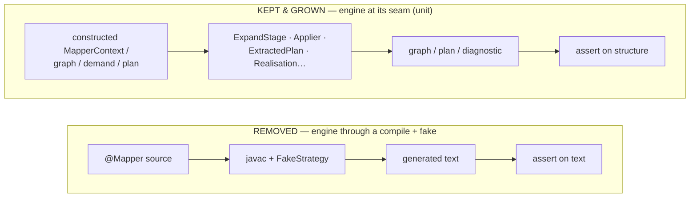
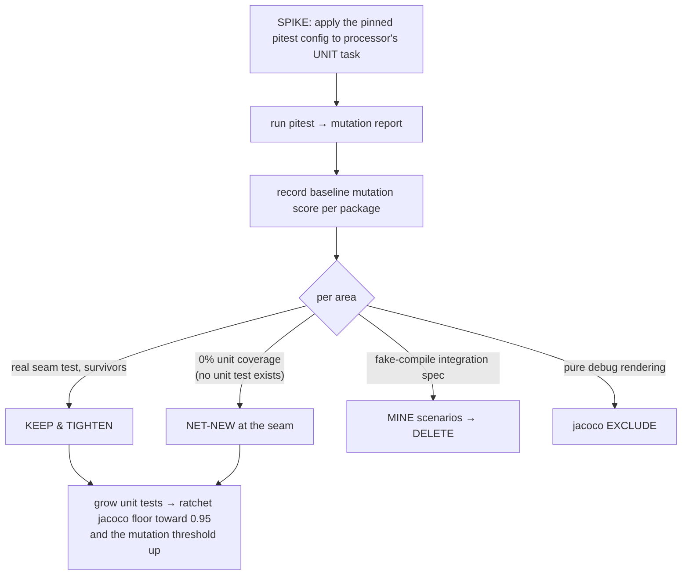

## Context

The `processor` engine currently earns most of its coverage from **fake-driven compile-testing**: specs
that stand up a `FakeStrategy`, run `javac` over a synthetic `@Mapper`, and assert on generated text. That
makes engine coverage slow, compile-coupled, and shallow — a mutated cost comparison or a broken hoist
often still produces *some* compiling output, so the test passes. The three-layer plan (`openspec/notes.md`)
makes the engine a **library**: tested at its own seams by unit tests, mutation-verified, with no strategy
and no fake. The integration confidence those compile-tests gave moves to the **feature-e2e layer** in the
very next change, so the gap this opens is closed immediately.

The build already separates the suites: `test` runs `@Tag('unit')`, `integrationTest` runs
`@Tag('integration')`. **The jacoco *report* merges `test.exec` + `integrationTest.exec`; the jacoco
*verification gate* (`jacocoTestCoverageVerification`) measures only `test.exec` — the unit suite.** (The
spike corrected an earlier belief that the gate merged both: only `JacocoReport` is wired with the merging
`executionData`; the verification task keeps the jacoco-plugin default of the `test` task's exec.) This is
*fortunate* — the gate already measures exactly the unit figure this change wants to drive to 95%, with no
rewiring needed once the integration suite is emptied.

## Goals / Non-Goals

**Goals:**

- Test the engine **at its seams** — construct a stage/component's input (a `MapperContext`, graph, demand,
  or extracted plan) and assert its output, with no compilation — to a **95% branch gate** on the unit
  suite.
- Integrate **pitest on the unit suite only**, spike-validated, with a ratcheting mutation-score threshold.
- Remove the engine integration tests and the now-orphaned `FakeStrategy`.

**Non-Goals:**

- Feature or real-strategy integration coverage — owned by `features-as-documentation`, which closes the
  gap right after.
- pitest on the integration suite (it is slow precisely there; explicitly out of scope).
- Any production or behavioural change beyond a **test-only visibility relaxation** of the expand `Driver`
  (D5); re-adding an engine integration test (only on a later demonstrated need).

## Decisions

### D1 — Test the engine at its seam, not through a compile

The unit tests drive the engine's own structures directly and assert on structure, not generated text:



This is the style the existing engine unit specs (`BipartiteGraphSpec`, `CostSpec`, `ExtractedPlanSpec`,
`GroundingSpec`, `GoalSpecSpec`, …) already use; the change *extends* it to the stages and behaviours that
were only reachable through a compile before (self-seeding/descent, assembly hoisting, realisation
closest-miss, nullness crossing). The seam substrate is already proven: `GroundingSpec` builds
`OperationSpec`/`Port`/`ChildScopeSpec` on `HarnessResolveCtx` + `TypeUniverse` (a real javac
`Types`/`Elements` with **no `@Mapper` compile**), and is precisely why `Grounding` is the single
best-covered load-bearing class. Every net-new seam test is `GroundingSpec`-shaped.

*Architecture note (per the "warn on shifts" rule):* this **removes the engine's compile-level test surface
inside `processor`** — a deliberate shift. It is safe only because the feature layer re-establishes
real-compile coverage immediately; this change must not ship as the final state of the test suite, and the
proposal/commit say so.

### D2 — pitest, unit-suite-only, spike-first

The pitest configuration is **fixed** (below), so the spike's job is to *validate it runs fast and useful
on the Spock unit suite*, *measure the baseline mutation score of the current engine tests*, and — the
deciding output — **decide per area whether the existing tests are fixed, grown, or written net-new at the
seam** based on what the mutation report exposes (D-decision routed in "Spike results" below).



Fixed configuration (the spike validates, does not choose) — the **shipped** values:

- Gradle plugin `id("info.solidsoft.pitest") version "1.19.0"`, applied to `processor`; pitest runs against
  the unit `test` task via `includedGroups = ['unit']`, which **excludes** `integrationTest` (pitest is slow
  only there).
- Core `pitestVersion = '1.25.1'` (user-updated from the spike's 1.22.1) and `junit5PluginVersion = '1.2.3'`
  for Spock-on-JUnit-Platform support.
- `mutators = ['ALL']` — maximal strictness, fitting "library-grade" engine tests.
- **Incremental analysis** via `enableDefaultIncrementalAnalysis = true` **plus** the
  `org.pitest:pitest-history-plugin:0.0.1` dependency. From pitest **1.23+** incremental analysis was
  extracted into a separate plugin; with the flag set but the dependency absent, pitest **errors**. The dep
  is required, not redundant.
- `threads = availableProcessors`, `timestampedReports = false`, `jvmArgs = ['-XX:+EnableDynamicAgentLoading']`.
- **Runtime:** with threading the unit-suite mutation run is **~50s** on `processor` (down from ~2m22s
  single-threaded); incremental analysis makes repeat runs faster still — comfortably acceptable.

Coverage (95% branch) and mutation score (kills) are tracked as two complementary gates; the mutation
threshold starts at the spike baseline and ratchets up as unit tests land.

*Alternatives considered:* pitest across both suites (rejected: the integration suite is where pitest is
slow, and it is being removed anyway); coverage-only, no pitest (rejected: 95% line coverage without
mutation verification still passes weak assertions — pitest is what makes the unit suite *trustworthy*,
which is the whole point of "engine as a library").

### D3 — A per-module branch floor that ratchets, measured on the unit suite

The root convention applies a branch gate to every jacoco module. Because
`jacocoTestCoverageVerification` measures only `test.exec` (Context), the figure it gates *is* the unit
figure — no rewiring is needed when `integrationTest` is emptied.

The gate is a **per-module knob, not a global constant**: the root convention reads
`ext.branchCoverageMinimum` (defaulting to `0.6`); a module sets its own. `processor` sets its honest
current unit-suite floor and **ratchets it up** as seam tests land:

```groovy
// root build.gradle (convention)
minimum = project.findProperty('branchCoverageMinimum') ?: 0.6
// processor/build.gradle
ext.branchCoverageMinimum = 0.30   // honest current floor; → 0.95 in task 4.3
```

The floor is **never set below the then-current measurement**, so the gate is always green and `main` is
never red — the ratchet only ever climbs. This replaces the original "flip `0.6` → `0.95` directly" framing,
which would have been red from day one (the honest unit-suite branch is `0.30`). Task 4.3 lands the final
`0.95`. The override stays scoped to `processor` — the strategy modules are covered by the feature layer,
not by this gate. (A prior session had *disabled* `processor`'s gate entirely (`enabled = false`); that was
a mistake and is reverted — the gate must always be on.)

### D4 — Remove `FakeStrategy` and the engine integration specs together

`FakeStrategy` exists in `test-foundation` solely to drive these engine compile-tests; once they are gone it
is unused and is deleted along with its engine-side `META-INF/services` registration. `PercolateCompiler`
stays — the feature-e2e layer uses it with *real* strategies. The specs removed are exactly those that
compile a mapper with a fake to assert engine behaviour (`EngineWeavingFakeStrategySpec`,
`SelfSeedExpansionSpec`, `GenerateStageFailureModesSpec`, `DocTagsEmissionSpec`, and any sibling); their
asserted behaviours are re-expressed as seam-level unit tests where they are engine contracts (most are).

**`docTags` is relocated to `spi` and unit-tested there.** The tag-wrapping is a pure codegen transform
(wrap a `CodeBlock`/region in `// tag::<name>[]` / `// end::<name>[]`), so it belongs with the other codegen
helpers in `spi`, not buried in `BuildMethodBodies`. Extract it into an `spi` helper, have the engine call
it, and **unit-test it in `spi`** — no processor, no compile. That replaces the removed processor
`DocTagsEmissionSpec` with a fast, isolated test at the right layer.

### D5 — Seam-test `ExpandStage` through a package-visible `Driver`

`ExpandStage.run(MapperContext)` is thin; all the load-bearing logic (seed return root, expand-free, land,
`sourceForPort`, forward `pinnedSource` descent, `descendSegment`) lives in the **private inner `Driver`** —
the 321-mutation blob at 0% coverage. To exercise those paths at the seam, `Driver` is **relaxed to
package-visible** so the unit suite constructs a `MapperContext` (shape + goalSpecs + callable methods,
sourced off compiled fixture classes via `TypeUniverse` — no `@Mapper` compile) plus stub
`ExpansionStrategy`/`SourceProjection` lists, runs the driver, and asserts on the resulting `MapperGraph`.

*Architecture note (warn on shifts):* this is a **test-only visibility relaxation**, not an architectural
shift — `Driver` stays inside `internal.stages.expand`, behind the ArchUnit module boundary; nothing outside
the engine can reach it, and the public `Stage.run` contract is unchanged. *Alternative considered:* drive
only the public `run(MapperContext)` and never relax visibility (rejected by the user: it forces every
expand assertion through one coarse door and obscures which Driver path a surviving mutant lives on).

## Risks / Trade-offs

- **95% branch on the engine is a tall bar** → some packages are legitimately hard/low-value to unit-cover
  (debug `dump`/`DotRenderer` output). Mitigation: cover them where feasible; use narrow, justified jacoco
  exclusions for pure-debug rendering rather than weakening the global bar — each exclusion noted.
- **The load-bearing core is at 0% unit coverage** → this is **net-new** seam authoring, not a rewrite (there
  is no unit test there to fix or replace). Mitigation: the `GroundingSpec` template + the `TypeUniverse`
  harness make each net-new spec cheap; the proof is that the one class done this way (`Grounding`) is the
  best-covered.
- **Generated Dagger classes pollute the mutable set** → 2 classes (`DaggerProcessorComponent*`, 84
  mutations) are counted today. Mitigation: task 4.3 adds an `excludedClasses` filter so the gate measures
  engine logic, not Dagger wiring.
- **Deleting tests reduces coverage before unit tests replace it** → sequence within the change so the unit
  tests land *before* the gate is ratcheted and the integration specs removed; the floor only ever climbs,
  so `main` is never red.
- **A removed integration spec covered something no unit test can reach** → if a behaviour genuinely needs a
  compile to assert, record it for the feature layer rather than keeping a lone fake-driven spec.

## Migration Plan

1. **Spike** pitest on `processor`'s unit task; record plugin, wiring, baseline mutation score, threshold.
   *(done — see Spike results)*
2. Grow the engine unit tests at the seams toward 95% branch (stages, graph, plan, cost, hoist, realisation,
   nullness), ratcheting the jacoco floor and the pitest threshold as kills rise.
3. Ratchet `processor`'s jacoco floor to `0.95`; add the Dagger `excludedClasses` filter; wire the pitest
   threshold into `check`.
4. Remove the engine integration specs and `FakeStrategy`; empty `processor`'s `integrationTest`.
5. `./gradlew check` green (unit 95% + pitest threshold); the ArchUnit boundary stays green.

*Rollback:* the change is tests + build config + one test-only visibility relaxation; reverting restores the
prior specs and the `0.6` gate with no production impact.

## Spike results (resolves the open questions)

The pitest spike (tasks 1.1–1.2) ran the pinned config against `processor`'s `@Tag('unit')` suite, re-run on
the shipped `pitestVersion 1.25.1` with threading.

- **Wiring confirmed:** `info.solidsoft.pitest 1.19.0` + core `1.25.1` + `pitest-junit5-plugin 1.2.3` +
  `pitest-history-plugin 0.0.1` resolve cleanly; incremental analysis writes history; `includedGroups =
  ['unit']` excludes the compile-driven integration specs. Runtime **~50s** threaded.
- **Baseline (whole module, 1.25.1 run):** **3449 mutations, 583 killed = 17% mutation score**; test strength
  **54%** (kills among *covered* mutations); **2372 mutations have no coverage** — dominated by the
  load-bearing stages reachable today only through the deleted integration/fake specs, plus 2 generated
  Dagger classes in the mutable set.

| package | mutation cov | test strength | bucket / decision |
| --- | --- | --- | --- |
| `internal.graph` | 49% | 66% | **KEEP & TIGHTEN** — strongest seam tests; kill the 190 survivors |
| `model` | 37% | 37% | **KEEP & TIGHTEN** — light touch |
| `nullability` | 23% | 24% | **KEEP & TIGHTEN asserts** — line-rich, assertion-poor (strengthen, don't rewrite) |
| `internal.stages.expand` | 13% | 46% | **MIXED** — `Grounding`/`GroundingSpec` keep & grow; `ExpandStage$Driver`, `SourceCandidates`, `SelfCallGuard`, `BindingDirective` are **NET-NEW** (0% — driver via D5) |
| `internal.stages.generate` | 3% | 41% | **NET-NEW** — `BuildMethodBodies`/`$Walk`, `HoistPlan`, `AssembleMapperType` at 0%; `IncomingValuesImplSpec` keep & grow |
| `internal.stages.validate` | 6% | 53% | **NET-NEW** — real classes (`ValidateConstantDefaultLegalityStage`, …) at 0% |
| `internal.stages.discover` | 0% | — | **NET-NEW** — only spec is `@Tag('integration')` (excluded) |
| `internal.stages.dump` | 0% | — | **jacoco EXCLUDE (3.2)** or thin seam tests — pure debug rendering |
| `processor` (root) | 4% | 30% | **NET-NEW / GROW** — driver/pipeline barely covered in the unit suite |

**Framing correction (vs. an earlier "REWRITE at the seam" label):** the load-bearing core
(`ExpandStage$Driver`, the `generate` stages, `discover`, `validate`) sits at **literal 0% unit coverage** —
there is no unit test to rewrite *or* fix. Whatever brushed it was the fake-compile integration specs, which
are excluded from the unit run, are deleted by this change, and never reached the `Driver` internals anyway
(`SelfSeedExpansionSpec` documents the deep-descent coverage as *deferred*). So those areas are **NET-NEW**,
not "rewrite". Only the three real-seam areas (`graph`, `Grounding`, `IncomingValuesImpl`) are *kept and
tightened*; deleting them would discard both the template and the only real coverage in the module.

**Mutation threshold (for task 4.3):** ratchet from the spike baseline — start `mutationThreshold` no higher
than the 17% module score (or set it on test strength) and raise it as phase-3 seam tests land, so `main` is
never red. The 95% figure is the jacoco *branch* floor (D3), a separate, complementary bar.

**`dump`/`DotRenderer` exclusion (D-risk):** `internal.stages.dump` has 0% coverage and is pure debug
rendering — a confirmed candidate for the narrow jacoco exclusion in task 3.2. `DotRenderer` (in
`internal.graph`) is already partially covered by `DotRendererSpec`; decide its exclusion in 3.2 against the
then-current report rather than pre-emptively.
</content>
</invoke>
