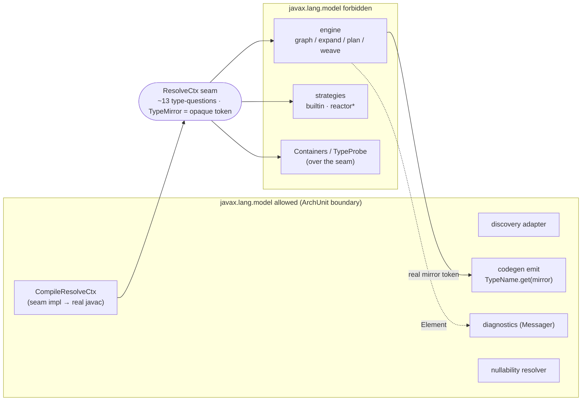
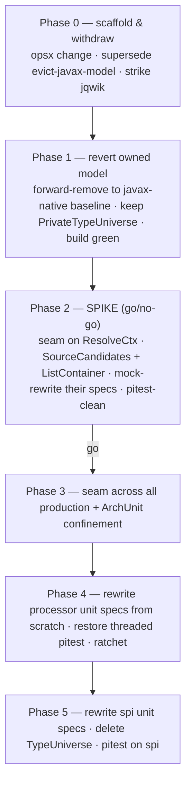

## Context

The engine and strategies read Java types by calling `javax.lang.model` (`Types`/`Elements`/`TypeMirror`)
**directly** — `ctx.types().isSameType(...)`, `((DeclaredType) m).getTypeArguments()`, `m.getKind()` — at
~127 sites (~47 in `strategies-builtin`, ~80 in `spi`, plus engine). Because those calls must be answered
consistently, ~48 of ~74 `@Tag('unit')` specs stand up a real javac substrate (`TypeUniverse`, a shared
static `JavacTask`). javac is thread-hostile, so the shared substrate races under threaded pitest, which
forced `@Isolated`, `threads = 1`, and `spock-pitest.groovy`. Only ~11 specs actually mock.

The distinct type-questions the whole codebase asks number only **~10–13**. This is the disease: not
`TypeMirror`, but the *direct wide coupling* to it. `ValidateNoDuplicateTargetsStageSpec` already proves the
cure — it mocks `Messager` and treats `ExecutableElement`/`AnnotationMirror` as never-stubbed opaque tokens,
because the stage never interrogates them.

This change supersedes `evict-javax-model`. That change tried to replace the *currency* (`TypeMirror` →
owned `TypeRef` value model); it proved unreachable because codegen needs genuinely compiler-backed mirrors
(three permanent exemptions → dual currency forever), and its real win — a per-spec javac
(`PrivateTypeUniverse`) — only relabelled the substrate rather than removing javac from the unit path.

## Goals / Non-Goals

**Goals:**

- One narrow, mockable **type-query seam** on `ResolveCtx` (the ~10–13 measured questions), with `TypeMirror`
  kept as an **opaque pass-through token** the engine/strategies never interrogate.
- Unit tests mock `ResolveCtx` and stub the 1–2 questions their subject asks — **no javac in the unit path**,
  parallel-safe by construction, so `@Isolated`/`threads = 1`/`spock-pitest.groovy` are deleted, not bridged.
- `javax.lang.model` confined by ArchUnit to the seam impl + discovery adapter + codegen emit + diagnostics +
  nullability resolver.
- `processor` and `spi` unit specs **rewritten from scratch** against mocks, with **pitest as the acceptance
  oracle** (threaded, deterministic, extended to `spi`).

**Non-Goals:**

- Rewriting the 20 `strategies-builtin` unit specs, shrinking the 16 e2e specs to doc examples, and the pitest
  rollout to `strategies-builtin`/`reactor` — all deferred to `features-as-documentation` (#3).
- Any owned type-value model. The seam abstracts *questions*, not *values*; `TypeMirror` remains the currency.
- Changing any engine algorithm (expansion, cost, weaving, port sourcing) — coupling shape only.

## Decisions

### D1 — A behavioural seam over `TypeMirror`, not an owned value model

| Option | Verdict |
|---|---|
| Owned `TypeRef`/`TypeSpace` sole currency (`evict-javax-model`) | Rejected — unreachable (codegen needs real mirrors → dual currency); huge; the tests don't even use it |
| Per-spec real javac (`PrivateTypeUniverse`) | Rejected as the *goal* — relabels the substrate; javac stays in the unit path; needs `SynchronizedElements` |
| Keep `@Isolated` + `threads = 1` | Rejected — the recurring bridge; blocks the pitest rollout |
| **Narrow mockable seam; `TypeMirror` an opaque token** | **Chosen** — removes javac from unit tests; the three exemptions evaporate; smallest completable surface |

Because we abstract the *questions* and keep the *values*, the codegen/discovery sites that genuinely need a
real mirror (`AssembleMapperType`, `BuildMethodBodies`, `CallableMethods.producing`) keep receiving one and
call `TypeName.get(...)`/`Types.isAssignable(...)` at the boundary — there is no exemption wall.

### D2 — `ResolveCtx` **is** the seam

`ResolveCtx` is already the SPI context handed to strategies, and the engine holds one too. Making it the seam
means **one abstraction serves both** and preserves the engine/strategy separation (neither gains graph
access; the seam is read-only type Q&A). `ResolveCtx.types()`/`elements()` are removed; the ~13 questions land
directly on `ResolveCtx`:

### D3 — The measured surface (~13 questions)

`isSameType(a,b)` · `isAssignable(a,b)` · `erasure(t)` · `isPrimitive(t)`/`isArray(t)`/`isDeclared(t)` ·
`typeArgument(t,i)` / `typeArgumentCount(t)` · `arrayComponent(t)` · `declaredType(elem,args…)` ·
`arrayType(t)` · `boxed(t)`/`unboxed(t)` · `simpleName(t)`/`qualifiedName(t)`. Methods that *return* a type
return another opaque token. `Containers`/`TypeProbe`'s higher-level predicates (`isList`, `isOptional`,
`streamElement`, …) become **mockable over the seam** — either instances the mock returns, or seam methods —
carved so each unit test stubs 1–2 questions. The exact carving is validated by the spike (D7).

### D4 — Rewrite from scratch, pitest as oracle

The misaligned specs are not migrated (that preserves coverage we know is suspect — pitest has never run on
`spi`). Each is re-derived from "what branches must this unit guarantee?", asserting behaviour on a mocked
`ResolveCtx`, with **pitest ratcheting** the acceptance floor. Example-based Spock only — **no jqwik**.

### D5 — `javax.lang.model` confinement (ArchUnit)

One rule: `javax.lang.model` imports are allowed only in the seam impl, the discovery adapter, codegen
emission, diagnostics emission, and the nullability resolver. Everywhere else (engine graph/stages,
strategies, `Containers`/`TypeProbe`) is `javax.lang.model`-free. This is the same rule `evict-javax-model`
wanted, but now it *holds* — there are no engine-side exemptions to carve.

### D6 — Revert the owned model without git-revert conflicts

The owned-model commits interleave with the `PrivateTypeUniverse` test scaffold across 20 branch commits plus
the Phase-1 `spi …/types` package already on `main`. Rather than `git revert` the range (which conflicts), the
owned model is **forward-removed as ordinary edits** on this branch (which already carries the scaffold to
keep): delete `spi …/types` + `TestTypes` + the discovery adapter, un-dual-type `Port`/`OperationSpec`/
`Demand`, restore `PortType`/`PortTypes` and pre-fold `Grounding`, restore `TypeMirror`-keyed `Value.id()`/
`MapperGraph.valueKey`/`MethodScope`/`SelfCallGuard`. `PrivateTypeUniverse` is kept transitionally for the
specs deferred to #3; the shared static `TypeUniverse` is deleted once `processor`+`spi` specs are mock-only.

## Risks / Trade-offs

- **[Seam surface misses a question]** → the spike ports a real stage + strategy first; the e2e/doc compiles +
  `percolate-smoke` gate every commit; a missing question fails the real-compile path loudly.
- **[Higher-level predicate carving too coarse — a test still needs many stubs]** → the spike *measures* 1–2
  stubs per rewritten test as an explicit go/no-go criterion; adjust the carving before rollout.
- **[Forward-removing the owned model breaks a green build mid-way]** → done as its own phase gated by a full
  build on the restored baseline before any seam work begins.
- **[Rewritten specs under-assert (green but weak)]** → pitest ratchet is the gate; a weak spec fails to kill
  mutants and blocks `check`.
- **[Removing `types()`/`elements()` breaks a caller assumed to be on the boundary]** → ArchUnit surfaces every
  straggler; each is either routed through the seam or confirmed to be a boundary package.

## Migration Plan

Gates: e2e/doc compiles + `percolate-smoke` green after Phases 1–5; pitest deterministic and ratcheting in
`processor` (Phase 4) and `spi` (Phase 5). Rollback at any phase = `git revert` (no persisted state).

## Open Questions

- ~~Whether `Containers`/`TypeProbe` fold *onto* `ResolveCtx` or stay as separate injectable instances the mock
  returns~~ — **resolved in Phase 3**: every predicate folds onto `ResolveCtx` as a mockable default method;
  `Containers`/`TypeProbe` survive only as thin, source-compatible static forwarders (`Containers.isList(t, ctx)`
  → `ctx.isList(t)`) for existing callers, with two exceptions kept ctx-free because they never needed compiler
  backing: `Containers.isArray(t)`/`isReferenceType(t)`/`typeArgument(t,i)`/`arrayComponentType(t)` keep their
  original no-`ResolveCtx` signature and body (pure `TypeMirror` token navigation, not seam questions).
- Whether the `spi` pitest ratchet floor and thresholds live in `spi/build.gradle` or the shared root block —
  decided at Phase 5 with real scores in hand.

### Phase 3 addendum — the realised seam surface and confinement scope

The audited surface came out larger than the D3 sketch (~13 questions) once two things were counted precisely:

- **Element/member reflection** (`Elements.getAllMembers`, `ElementKind`/`Modifier` checks, `getEnclosedElements`,
  a hand-rolled supertype-BFS in `MethodCallBridge`) showed up throughout the Accessor-family strategies and
  `ConstructorCall`/`MethodCallBridge` — structurally the same disease as the Types/TypeMirror algebra, just over
  `Element`/`TypeElement` instead of `TypeMirror`. Decision: **fold it into the seam** (not a second boundary
  exemption), landing `membersOf`, `isField`/`isMethod`/`isConstructor`, `isPrivate`/`isStatic`, and `superclassOf`
  alongside the type-algebra methods. `Element`/`TypeElement`/`ExecutableElement`/`VariableElement` remain opaque
  pass-through tokens exactly like `TypeMirror` — held and passed as parameters, never cast or `.getKind()`-probed
  outside the seam.
- **`ResolveCtx`'s realised method count is ~35**, not ~13: the 13 type-algebra questions, plus `kind(t)` (a raw
  `TypeKind` escape hatch for lattice/table-keyed code — `WidenPrimitive`'s widening lattice, `PrimitiveWrapperConversion`'s
  unbox-accessor map), plus the higher-level predicates (`isList`/`isSet`/`isOptional`/`isStream`/`isCollection`/
  `isIterable`/`isEnum`/`isReferenceType`/`isType`, `typeElementNamed`), plus the member-reflection set above.
  `isCollection`/`isIterable` resolve their named supertype (`java.util.Collection`/`java.lang.Iterable`) via
  `typeElementNamed` + `isAssignable` rather than needing a dedicated "assignable-to-name" method — no seam
  addition beyond `typeElementNamed`, which the exact-erasure predicates (`isList`/`isSet`/`isOptional`/`isStream`)
  already needed.
- **What stayed out of the seam, deliberately**: three pure single-hop `TypeMirror`/`Element` token-navigation call
  sites — `LiteralCoercion` (a static utility with no `ResolveCtx` in reach, called from a `Stage` that has none
  either), `Labels`/`DotRenderer` (debug-graph/label formatting, cosmetic only, "never the basis of a behavioural
  decision" per their own javadoc) — plus two engine `Stage`s that structurally cannot reach a `ResolveCtx`
  (`ValidateSourceParametersStage`, `ValidateConstantDefaultLegalityStage` — `ResolveCtx` is constructed per-mapper
  inside `ExpandStage.run`, not available to arbitrary stages). These call `.getKind()`/cast/`.asElement()` directly
  on an already-opaque token with zero `Types`/`Elements` involvement — the same shape `ValidateNoDuplicateTargetsStageSpec`
  already mocks without javac, so they carry no real-compiler burden today and needed no seam routing.
- **ArchUnit confinement, realised**: rather than a blanket "no `javax.lang.model` outside boundary" ban (which
  would also outlaw holding `TypeMirror`/`TypeElement` tokens everywhere, breaking the opaque-token design), the
  rule bans `javax.lang.model.util.Types`/`Elements` — the two compiler-service classes — everywhere except: the
  bare `io.github.joke.percolate.processor` package (the Dagger wiring — `ProcessorModule`/`MapperStep` and their
  generated `*_Factory`/`DaggerProcessorComponent` siblings, which mention `Types`/`Elements` in constructor/field
  types purely as DI plumbing), `internal.stages.expand` (seam impl), `internal.stages.discover` (discovery
  adapter), `internal.stages.generate` (codegen emission), `nullability` (the nullability resolver), and the
  `ResolveCtx` interface itself (declares `types()`/`elements()`, kept as a transitional bridge until Phases 4–5
  remove them). See `ModuleBoundariesSpec.groovy`'s confinement rule.
