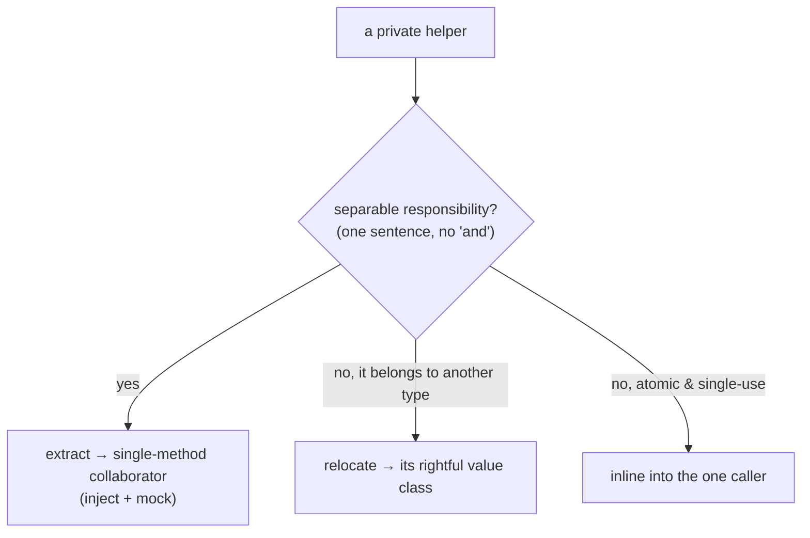
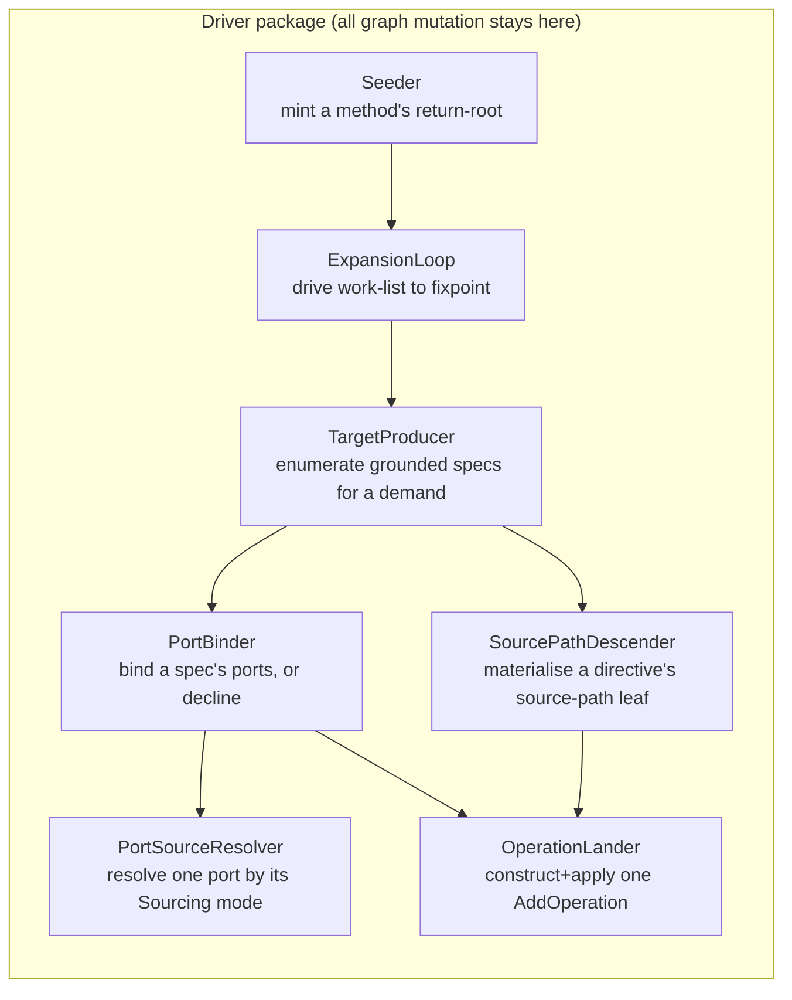
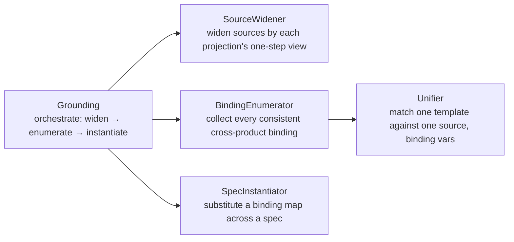

## Context

The `processor` engine is declared "tested as an isolated library" (`engine-test-quality`), and it hits the numbers: 95% branch, 86% mutation. But a census of `internal/stages` shows the algorithm-bearing classes are monoliths behind a single door:

| Class | lines | entry methods | private methods |
|---|---|---|---|
| `ExpandStage.Driver` | 392 | 1 | 21 |
| `BuildMethodBodies` | 250 | 1 | 17 |
| `Grounding` | 232 | 1 | 11 |
| `ValidateConstantDefaultLegalityStage` | 195 | 1 | 11 |
| `RealisationDiagnosticsStage` | 91 | 1 | 5 |
| `AssembleMapperType` | 82 | 1 | 4 |

The value/view classes (`DemandView`, `DescendView`, `Applier`, `MapperGraph`, the `Dump*Stage` trio) are already small — the disease is confined to the logic stages.

A private method is not independently testable: a test double cannot intercept `private` (it is `invokespecial`, statically bound — even `mockito-inline` cannot stub it). So the only test surface is the entry point, every test drives the whole pipeline, and that is exactly what forces `FakeResolveCtx`/`FakeType` and the `PrivateTypeUniverse` javac substrate. **The fake is the tax the test pays for the code having no seams.** The metrics were satisfied by a black box; the property they proxy — individually addressable units — was not.

**Architecture note (not a shift):** this change alters no engine *behavior* and no north-star. The target-driven over-emit + cost-prune design, "the driver + `Applier` own all graph mutation," and "strategies stay myopic" are all preserved — mutation stays inside the driver package. What changes is an engine-internal **coding convention** (single-responsibility units, no `private`), introduced deliberately and machine-enforced. That convention shift is the only thing to flag; it is guarded, not incidental.

## Goals / Non-Goals

**Goals:**
- Every method in the engine `internal` packages is describable in one sentence without "and," and is individually isolable by a same-package spec.
- `ExpandStage.Driver` and `Grounding` fully decomposed into single-method collaborators + relocations; `BuildMethodBodies` decomposed as the codegen exemplar.
- Two co-enforced ArchUnit guards prevent regression: no-`private` in engine internals, and a class-size/method-count cap.
- `FakeResolveCtx`/`FakeType` deleted from `processor`; `PrivateTypeUniverse` shrunk to (at most) the compile-tested codegen `TypeName.get(mirror)` leaf.
- Unit-only threaded pitest and the 95% branch gate preserved; ratchet floors maintained.

**Non-Goals:**
- No change to engine behavior, the target-driven design, or any user/SPI-facing contract.
- Not a repo-wide no-`private` ban — engine `internal` packages first; widen later once proven.
- Not the `strategies-builtin` unit-spec migration and not `features-as-documentation` — both are downstream and unblocked by this change, not part of it.
- Not a mass-split of every flagged stage — the remaining stages are an audit backlog, each gated by the litmus.

## Decisions

### D1 — Decompose the monolith; do not "expose and spy" it

The blob is untestable because its steps are private. Two ways out: flip every `private` to package-private and spy the exposed guts, or **extract the steps into collaborators**. We extract.

- **Rejected — expose + spy the god-class:** satisfies "isolable" cheaply but leaves a 392-line class intact, and every spec then couples to its internal call graph via self-call stubs. That entrenches the structure it was meant to cure and is strictly worse than today.
- **Chosen — extract to collaborators:** each separable step becomes its own single-method unit with an injected, mockable seam. Isolation *and* structural improvement, with tests coupled to real contracts (A↔B), not to internals.

### D2 — Three fates for every private helper

A god-class's private wall is not all "hidden collaborators." Each helper is triaged:

This is why the outcome is a handful of classes, not a swarm: much of a blob's wall is *misplaced* methods (`type`/`nullness`→`Value`, `childLocation`→`Location`, `splitPath`→the path type) that simply go home.

### D3 — `ExpandStage.Driver` seam map

`land` becomes an orchestrator returning `Optional<Operation>` — "turn a spec into an operation, or nothing if a port can't be sourced or the guard refuses" — tested by mocking `PortBinder`, `SelfCallGuard`, `OperationLander`. The work-list `enqueue` of follow-ups moves to `ExpansionLoop` (the caller), so `land` is a pure function of its inputs. `SelfCallGuard` and `SourceCandidates` are already extracted; the latter already mock-tests with one stub — the pattern is in-repo, just unapplied to `Driver`.

### D4 — `Grounding` seam map

Correction banked from exploration: the unifier does **not** need a fake. Decomposed, each method asks a bounded set of questions about bounded tokens — `isGroundable` (1 stub), `unifyApp` arity-mismatch (3 stubs, recursion never reached), `BindingEnumerator` (mock the `Unifier`, zero `ctx`). The fake was only ever demanded by the cross-product driven through `ground()`. The sole residual is genuine self-recursion (`unify→unifyApp→unify`, `SpecInstantiator.ground` over `App` args), handled by D5.

### D5 — Spies only for irreducible self-recursion

Extraction handles delegation; it cannot handle a function calling *itself*. `Grounding`'s unification and substitution recurse into their own type structure. There, and only there, the spec `Spy()`s the subject and stubs the recursive call — the one case where removing `private` is precisely what *enables* the isolation. A spec that finds itself spying a *non-recursive* sibling is a signal the helper should have been a collaborator (D1).

### D6 — Two CO-ENFORCED ArchUnit guards, in `architecture-tests`

- **Rule A — no `private` methods** in `..processor.internal..`. Excludes synthetic/lambda members (`lambda$…`, `access$…`); private constructors are auto-safe (`methods()` does not match constructors); `@Generated`/Lombok excluded by annotation.
- **Rule B — class-size / method-count / God-Class-WMC cap** over the same packages, tuned tighter than today (the memory notes `Driver` already skirts the PMD threshold).

`A ∧ B` is load-bearing: **A alone is satisfied by exposing a blob's guts** (D1's rejected path); B alone lets logic hide as `private` in a smallish class. Together, separable logic has nowhere to live but a new small class.

- **Rejected — CodeNarc:** lints Groovy only; it never sees the Java engine. It would lint the Spock specs — the wrong side.
- **Rejected — PMD-only:** a PMD XPath rule could express Rule A, but ArchUnit is already wired in `architecture-tests` and is more expressive for package-scoped structural rules.

### D7 — Remove the fakes; shrink the substrate

Once `Driver`/`Grounding` decompose, their specs mock the seam and `FakeResolveCtx`/`FakeType` lose all consumers in `processor` → deleted. `BuildMethodBodies`/`AssembleMapperType` split into pure assembly logic (mock-tested) and the irreducible `TypeName.get(mirror)` leaf, which JavaPoet can only render from a real mirror — that leaf is **compile-tested** (feature-e2e layer), never fake-fed. `PrivateTypeUniverse` shrinks to that leaf or disappears.

## Risks / Trade-offs

- **Over-atomization → a dust-cloud of micro-classes.** → The floor is "isolable + one sentence," not "one line per class"; D2's relocate/inline fates and the cohesion rule (a data/query class keeps several single-sentence methods over shared state) hold the line. Rule B is a ceiling, not a target.
- **Complexity relocates into under-tested wiring.** → The orchestrator (`ExpansionLoop`, `Driver.land`, `Grounding.ground`) is a first-class unit, tested by mocking its collaborators — the composition is not "just glue."
- **A large core-engine refactor risks behavioral regression.** → Behavior is pinned by the untouched feature-e2e layer during the refactor (its whole purpose), and by unit-only pitest holding the ratchet. Spike-gated: land `Grounding` (the smaller, self-contained one) first as the reference before touching `Driver`.
- **Rule A fires on synthetic lambda methods.** → Exclude synthetic members explicitly; verify the rule is green on an untouched module before trusting it.
- **The "no-private" convention diverges from the rest of the repo.** → Intentional and scoped to engine `internal`; the guard makes it explicit rather than a silent local dialect. Widening is a later decision.

## Migration Plan

1. **Spike / reference — `Grounding`.** Decompose into `SourceWidener` / `BindingEnumerator` / `Unifier` / `SpecInstantiator`; re-spec each with mocks (+ spy for recursion). Prove no fake survives for it. Go/no-go gate.
2. **`ExpandStage.Driver`.** Apply D3: extract collaborators, relocate misplaced methods, inline atomics; `land`→`Optional<Operation>` orchestrator. Delete `FakeResolveCtx`/`FakeType` once the last consumer is gone.
3. **Codegen exemplar — `BuildMethodBodies`.** Apply D7: split pure logic from the `TypeName.get` leaf; shrink `PrivateTypeUniverse`.
4. **Guards.** Add Rules A + B over the decomposed packages; confirm green.
5. **Audit backlog.** File the remaining stages (`ValidateConstantDefaultLegalityStage`, `RealisationDiagnosticsStage`, the validate stages, `GraphDumpWriter`, `AssembleMapperType`) as follow-up, each gated by the litmus; widen the guard's package scope only as they land.

Rollback: each phase is an independent structural refactor behind a green feature-e2e + pitest gate; revert a phase without touching the others.

## Open Questions

- **Rule B's exact metric** — class length, method count, or WMC — and its threshold. Settle empirically against the decomposed `Grounding`/`Driver` so the cap bites the next offender without flapping on legitimate cohesive classes.
- **Does `AssembleMapperType`/`BuildMethodBodies` leave a genuinely irreducible `PrivateTypeUniverse` leaf, or does the feature-e2e layer already cover it** — i.e. can the substrate be deleted outright rather than shrunk? Resolved in Phase 3.
- **How wide does Rule A's package scope go at the end of this change** vs. deferred to the audit backlog — decided per stage as each is decomposed.
