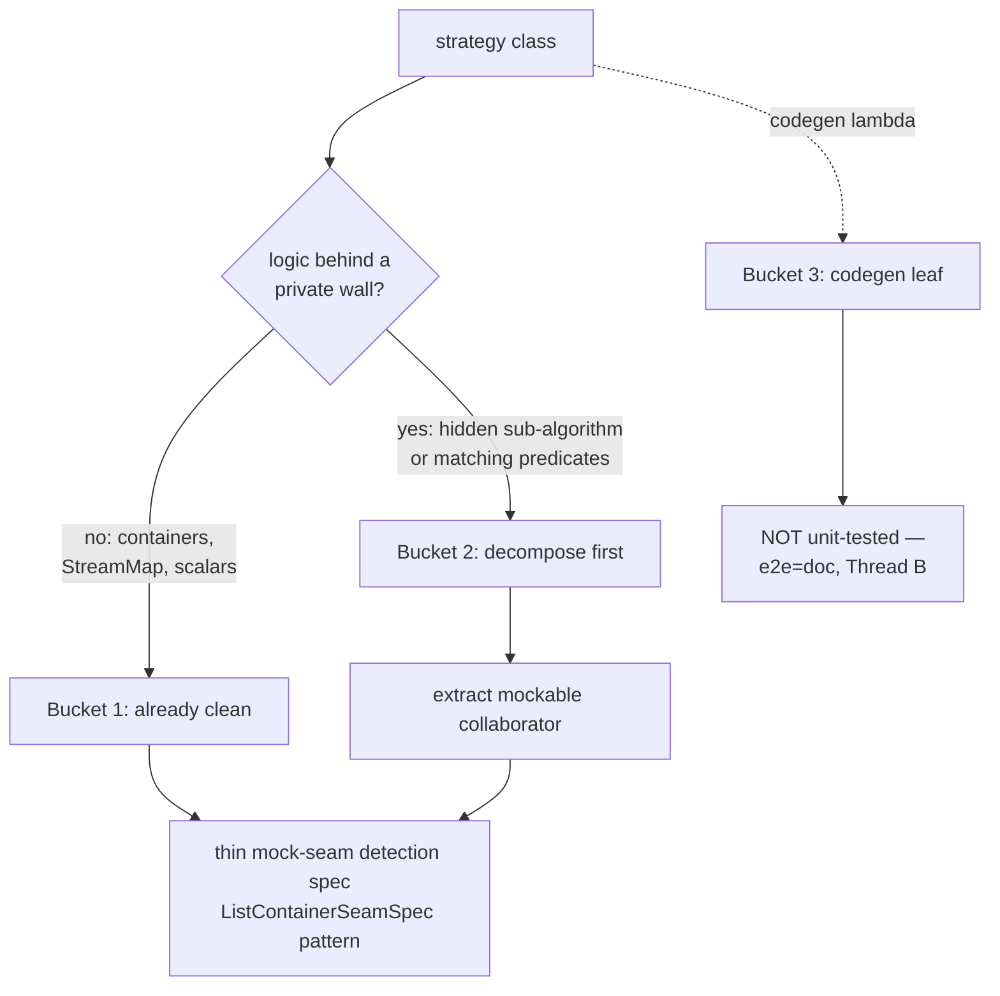
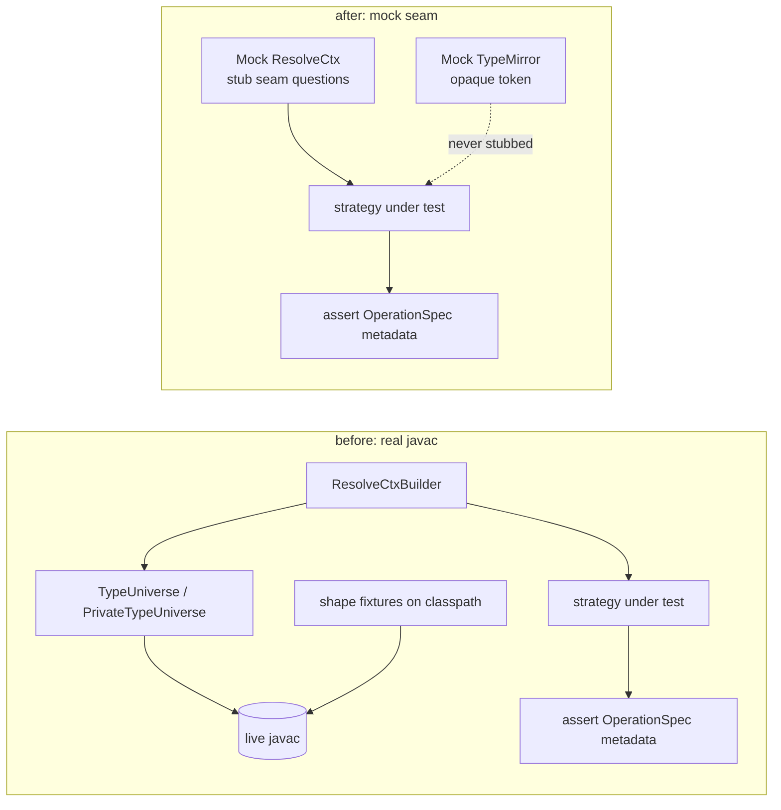
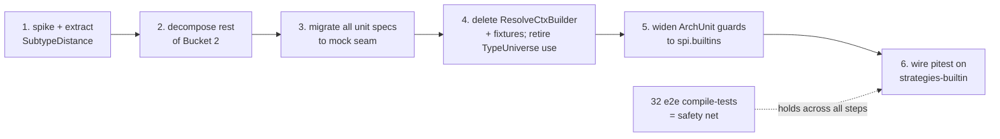

## Context

`type-query-seam` (archived 2026-07-05) made `ResolveCtx` a narrow, mockable type-query seam and rewrote the `processor` + `spi` unit specs to mock it. It deliberately stopped at the strategy boundary, leaving the old real-javac test scaffolding alive in `strategies-builtin`:

- `ResolveCtxBuilder` hands out a `ResolveCtx` whose `types()`/`elements()` are a **live javac session** (`TypeUniverse` static, or `PrivateTypeUniverse` per-spec), backed by real fixture classes on the test classpath.
- ~15 unit specs (`MethodCallBridgeSpec`, `OptionalContainerSpec`, `ConstructorCallSpec`, `GetterPathResolverSpec`, …) drive their strategy through that real type world.
- `strategies-builtin` has **no** mutation testing.

A census of the module's production source (below) shows it is **not** god-class-shaped — the SPI's "one class per type" discipline kept containers clean — but a small set of strategies fuse a real sub-algorithm behind `private`, which is exactly why their specs need a real compiler. `harden-engine-as-library` already taught the lesson: raising pitest on a coarse, un-isolable seam measures the wrong property. So the source must be made isolable *before* pitest is wired.

This is **Thread A**, upstream of `features-as-documentation` (Thread B). The 32 existing `strategies-builtin` e2e compile-tests are the safety net for the whole cutover and are untouched here.

## Goals / Non-Goals

**Goals:**
- Every `strategies-builtin` unit spec is **mock-based** over the `ResolveCtx` seam — no javac, `TypeMirror` an opaque never-stubbed token.
- The strategies whose logic is trapped behind `private` are decomposed into **individually-mockable collaborators** first, so mutation testing lands on isolable units.
- `ResolveCtxBuilder` and the shape fixtures are deleted; strategy-side `TypeUniverse` usage is retired.
- The two co-enforced ArchUnit guards (no-private + size ceiling) cover `spi.builtins`, locking in cleanliness.
- pitest runs on the `strategies-builtin` unit suite (threaded, history-plugin, floor-gated).

**Non-Goals:**
- **No** new integration tests and **no** fat unit suites. Codegen-output correctness is Thread B's e2e=doc job.
- **No** removal of `types()`/`elements()` from `ResolveCtx` (the production impl still delegates through them; removal is a later phase).
- **No** touching the containers / `StreamMap` / scalar strategies' production source (already clean).
- **No** touching the 32 e2e compile-tests, nor the `processor` `discover`/`AssembleMapperType` boundary specs (they legitimately keep `TypeUniverse`).

## Decisions

### D1 — Three-bucket model drives the whole change

Each strategy is classified by *what its unit spec must do*, and the bucket dictates the work:

Census (loc / public / private):

| Bucket | Classes | Work |
|---|---|---|
| **1 — clean** | Array/Collection/List/Set/Stream/Optional​Container, `StreamMap` (70/1/0), `DirectAssign`, `ConstantValue`, `PrimitiveWrapperConversion` (data tables + leaf), `Widen`/`Field`/`MethodPathResolver` | mock-seam detection spec only; no source change |
| **2 — decompose** | `MethodCallBridge` (135/1/5), `GetterPathResolver` (83/1/5), `ConstructorCall` (110/1/5, light), `NullnessCrossing` (125/2/4, light) | extract collaborators → then mock-seam spec |
| **3 — codegen leaf** | every `buildCodegen`/`renderCodegen`/`step`/`box`/`unbox`/`requireNonNull`/`coalesce` `CodeBlock` lambda | never unit-tested; e2e=doc |

### D2 — `MethodCallBridge` → `SubtypeDistance`, spiked first

`MethodCallBridge` hides a hand-rolled BFS subtype-distance walk (`subtypeDistance`/`bfsDistance`/`Pair`, `MethodCallBridge:86-134`) behind `private`. It is a cost tie-breaker whose only test surface today is a real type hierarchy — the cause of that spec's 16 real-javac references. Extract it to a package-private `SubtypeDistance` collaborator whose surface is the `ResolveCtx` seam (`isSameType`/`isAssignable`/`superclassOf`/`isDeclared`), mockable in isolation.

This is the **spike (task 1)** and the go/no-go reference for the whole change, because it also forces a real decision:

- **Alternative A — replace with a library primitive** (`[[feedback_library_primitives]]`: JGraphT is already a dependency). A `Graph` of supertype edges + a shortest-path — but the graph is *derived on demand* from `ctx.superclassOf`, so building a JGraphT graph just to walk one chain may be more scaffolding than the walk it replaces.
- **Alternative B — keep the BFS, extracted and isolated.** Chosen default: the win here is *isolability*, not the walk's internals; a mocked seam makes the BFS directly unit-testable, and isolating it is what makes its latent smell (returns `0` for both "same type" and "not assignable" — a distance and a "no path" collapsed) reviewable rather than buried.

Spike outcome recorded in Open Questions; if the spike shows the extraction is awkward or the collaborator wants graph access (a `[[feedback_strategies_stay_myopic]]` red flag), stop and reassess before touching the other classes.

### D3 — Mock-seam spec pattern: assert `OperationSpec` metadata, mirror stays opaque

The migrated specs follow `ListContainerSeamSpec`: a `ResolveCtx ctx = Mock()`, a `TypeMirror type = Mock()` passed as an opaque token that is **never stubbed** (it is a pass-through identity per the seam doctrine), seam questions stubbed (`ctx.isList(type) >> true`), and assertions over `OperationSpec` **metadata only** — ports, weights, nullness, declared child-scopes — never the rendered `CodeBlock`. This preserves the existing `builtin-strategy-unit-tests` "assertion scope is OperationSpec metadata only" invariant; the migration changes *how the type answers are supplied* (mock, not javac), not *what is asserted*.

### D4 — Shared-static `TypeUniverse` dies; `PrivateTypeUniverse` retreats to the compiler boundary

There are two javac fixtures in `spi/src/testFixtures`, and they have different fates once strategies-builtin migrates:

- The shared-static **`TypeUniverse`** (one JVM-lifetime `JavacTask`) is consumed *only* by five strategies-builtin specs (`MethodCallBridge`, `OptionalContainer`, `StreamMap`, `ResolveCtxBuilder`+its spec) and its own `TypeUniverseSpec`. Migrating those to the mock seam removes every code consumer, so **`TypeUniverse` and `TypeUniverseSpec` are deleted**. `PrivateTypeUniverse` references it only in `{@link}` javadoc; those (and two `processor`-spec doc mentions) are re-worded.
- The per-spec **`PrivateTypeUniverse`** is consumed by the four `processor` `discover`/`AssembleMapperType` boundary specs — genuine compiler-boundary adapters that translate javac ⇄ engine and need real mirrors (the same reason `decompose-engine-stages` kept `TypeNameRenderer`'s `TypeName.get(mirror)` leaf compile-tested). It **survives**, scoped to those specs.

This finally lands notes.md #2's "delete `TypeUniverse`" goal — `type-query-seam` deferred it because strategies-builtin still consumed it. Removal of `types()`/`elements()` from the `ResolveCtx` interface is a *separate* concern and stays out of scope (the production impl still delegates through them; a later phase).

### D5 — Widen the ArchUnit guards to `spi.builtins`

`decompose-engine-stages` added Rule A (no `private` in the decomposed packages) + Rule B (≤15 methods per class), scoped by `DECOMPOSED_ENGINE_PACKAGES` in `ModuleBoundariesSpec`. This change **adds `spi.builtins`** to that list. Rule B is comfortably satisfied — the largest surface is `OptionalContainer` at 7 public methods. Rule A is what forces every leftover `private` factory (`buildCodegen`, `box`/`unbox`, `resolveTypeElement`, …) to be resolved by the three fates from `decompose-engine-stages`: (a) separable step → collaborator, (b) misplaced → relocate, (c) atomic single-use → inline. Codegen lambdas are `OperationCodegen` values, not `private` methods, so they don't trip Rule A. Both rules are re-verified to actually fire before trusting them green.

### D6 — pitest last, on clean code

Only after D1–D5 land does `strategies-builtin/build.gradle` gain the pitest block, mirroring the spi rollout: `pitest-history-plugin` dependency, `threads = availableProcessors()`, a mutation floor that tolerates measured run-to-run variance, unit-suite-only (`@Tag('unit')`), never gating the slow e2e suite. Running pitest before decomposition is explicitly forbidden — it would re-measure the wrong property.

### D7 — Ordering

## Risks / Trade-offs

- **Mock fidelity — stubbing an answer real javac would never give ⇒ a false-green unit** → the 32 e2e compile-tests hold across the whole change and prove the real type-query→metadata derivation; `TypeMirror` stays an opaque never-stubbed token so specs cannot smuggle type internals past the seam.
- **`SubtypeDistance` extraction reveals a latent behaviour bug** (the same-type / not-assignable both-return-`0` collapse) → in scope only to *isolate and pin current behaviour*, not to fix; any behaviour change is a separate `FOLLOW-UP`-marked finding, guarded by the e2e net.
- **Over-atomization while satisfying Rule A** (turning cohesive spec-assembly into a swarm of one-line classes) → apply the `decompose-engine-stages` litmus ("describable in one sentence without *and*") and the three fates; `ConstructorCall`/`NullnessCrossing` are explicitly *light* touches, mostly widen-and-inline, not forced extractions.
- **Guard widening flags a container's multi-public-method surface on Rule B** → verified ≤7 public methods today, well under the 15 ceiling; if a future container approaches it, that is the signal to split, which is the rule working.
- **Scope creep into `types()`/`elements()` removal** → explicitly deferred; this change keeps the SPI surface intact and only removes the *test* bridge.

## Open Questions

- **`SubtypeDistance`: library-primitive vs keep-BFS?** — **Resolved (task-1 spike): keep-BFS-extracted.** The
  extraction to a package-private `SubtypeDistance` collaborator was mechanical — the BFS reads only through the
  `ResolveCtx` seam (`isSameType`/`isAssignable`/`superclassOf`/`isDeclared`) and required no graph access, so the
  go/no-go checkpoint (task 1.4) is a clear go. A JGraphT `Graph` was not adopted: the supertype chain is derived
  on-demand one hop at a time from `ctx.superclassOf`, so building a graph structure first would be more scaffolding
  than the ~15-line walk it replaces — Alternative A does not pay for itself here.
- **Does any migrated spec genuinely need a real mirror for metadata it asserts** (beyond the codegen leaf)? — if one surfaces, it belongs to the e2e=doc layer, not a reintroduced javac fake; flag it rather than resurrect `ResolveCtxBuilder`.
