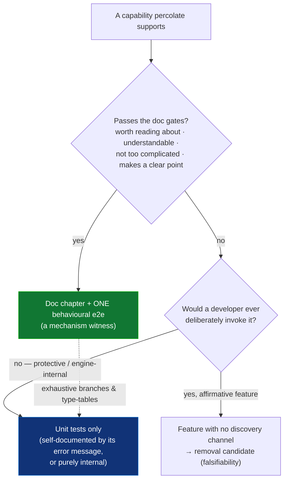
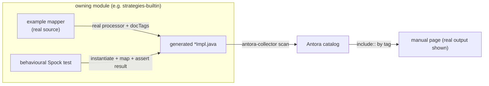
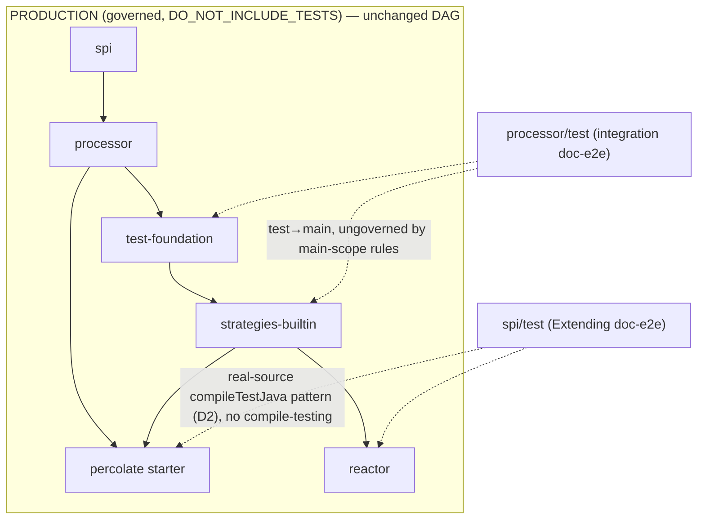

## Context

This is step 4 (final) of the testing/documentation plan of record (`openspec/notes.md`). Steps 1–3 (`harden-engine-as-library`, `type-query-seam`, `decompose-engine-stages`, `cutover-strategies-to-mock-seam`) made the engine unit-testable at a mockable `ResolveCtx` seam and moved builtin strategy tests onto it. The consequence this change acts on: the engine correctness that once *had* to be proven through a full compile (because the logic sat behind private walls needing a real `javac`) can now be proven by unit tests — so the compile-test layer no longer needs to carry it.

Current state, verified in-tree:

- `docs/modules/ROOT/pages/` holds all 10 pages; only **1 of ~13** shown generated-output blocks is single-sourced (`nested-paths`); the rest are hand-typed and can silently drift.
- `collections.adoc` asserts container support in a *prose table* and shows only the hardest case (element conversion); there is no worked `List<X>→List<Y>` example.
- `strategies-builtin/.../e2e/` has 16 specs; only 2 (`ConversionMethod`, `DefaultMethodConversion`) self-describe as backing a page. The rest are engine-correctness/regression specs using ad-hoc `forSourceLines` fixtures and asserting on generated *source text*.
- `e2e-test-architecture` currently forbids *any* processor→strategy edge ("compile, runtime, **or test**"); `module-boundaries` ArchUnit guards import main classes only (`DO_NOT_INCLUDE_TESTS`).

## Goals / Non-Goals

**Goals:**
- Invert the dependency: the manual's feature sections define the e2e set; every e2e is a documented feature's example.
- Make the e2e layer minimal, positive-only, and behavioural — and trustworthy (single-sourced generated output on every page).
- Close the fundamental example gaps (list mapping, optionals, defaults/nullness, compile-time switches, path access over fields/records).
- Co-locate each feature's prose with the module that owns it; keep `docs/` as the spine.
- Repatriate engine-correctness compile-tests to `processor` unit tests without silently dropping protection.

**Non-Goals:**
- **No new library features.** Nested containers (`List<Set>→Set<List>`), builders, maps, filtering are out — where the manual reaches an unsupported cell it documents the limitation and the escape hatch (a conversion method), it does not build the feature.
- Not exhaustive e2e coverage — exhaustiveness is the unit + pitest layer's job by design.
- Not modifying the main-scope `module-boundaries` ArchUnit rules (verified compatible, not changed).
- Not re-architecting the docTags/collector single-sourcing pipeline — it is reused; only its *coverage* and the *page locations it scans* grow.

## Decisions

### D1 — Documentation drives a non-exhaustive e2e layer (parametricity)

An e2e exists only as a documented feature's example, and only one **witness per user-facing mechanism** is written — not one per type combination. This is sound, not a coverage compromise, for the same reason Spring's `@ControllerAdvice` is trusted without a test per exception type: the mechanism is *parametric over its type arguments*. `List<X>→List<Y>` runs the same iterate→map→collect pipeline for all `X,Y`; the element type is data, not a code path. Enumerating element types would test Java generics, not percolate.

The unit + pitest layer carries exhaustiveness. Where percolate is genuinely *not* parametric (e.g. the primitive-widening table's 6 entries are 6 paths), those paths get exhaustive **unit** coverage and the manual shows one representative.

*Alternative rejected:* exhaustive compile-test coverage — the current state, which produced brittle, high-maintenance specs that duplicated unit concerns and still missed regressions.

### D2 — e2e assert behaviour over real generation; not generated source text

The old specs asserted `content.contains('<generated string>')`, which is simultaneously brittle (a rename reddens them) and blind (un-asserted lines regress silently) — the root cause of the "dead weight" grievance. A doc-e2e SHALL instead **instantiate the generated mapper and assert what it does**; the generated source is materialised only for *display* in the manual.

Recommended mechanism (reusing the `percolate-smoke` shape already blessed for normal-module validation): doc examples are **real source** in the owning module, compiled by the real processor with `-Apercolate.docTags` on, run by a plain Spock test, and their real generated `*Impl.java` collected for the manual. This fits the positive-only rule perfectly — valid source can only express positive examples, and negatives were already destined for unit tests.

*Alternative considered:* keep compile-testing but load+run the in-memory classes. Workable but fiddlier, and it keeps the string-match harness around. A short spike SHALL confirm the normal-module round-trip (source → generate → run → collect → include) on one example before converting the rest; the collector contract stays stable either way.

### D3 — Co-location: feature prose moves to its module; `docs/` keeps the spine

Feature pages move to `<module>/src/docs/*.adoc` and reach the single Antora `percolate` component via a collector `scan` entry (the mechanism already used for fixtures) — a flat folder, **no** per-module Antora scaffolding. `docs/` keeps index, getting-started, mapper-structure, and `nav.adoc`. This is invisible to the reader (Antora aggregates one component) and is justified purely by maintainer locality: a feature's source, test, and prose sit together. Ownership rule: **a page lives with its compile-test; the compile-test lives with the strategy.** The central `nav.adoc` is the one irreducible coupling (adding a page is a one-line xref) — accepted, not fought.

### D4 — `processor`/`spi` host their own doc-e2e; narrow the strategy-free rule to the unit suite

> ⚠️ **Architecture-sensitive refinement — flagged per design rules.** Layer 1 established "the engine is tested without real strategies." This change narrows that invariant from *all* processor test scope to the **unit** suite only.

Rationale it does **not** break the architecture: the load-bearing property is *engine correctness is proven in isolation from strategies* — and that property lives entirely in the unit suite (the one pitest and the coverage gate measure). A `@Tag('integration')` doc-e2e that pulls `strategies-builtin` + `test-foundation` to demonstrate a **processor-owned** feature (the compile-time switches) does not touch that property. The build permits it (test→main edge; the main graph stays a DAG), and the `module-boundaries` guards are main-scope (`DO_NOT_INCLUDE_TESTS`), so production separation is untouched. The same reasoning lets `spi` host the Extending doc-e2e, with `reactor` as the real custom-strategy example — as implemented, `spi`'s doc-e2e uses the real-source `compileTestJava` pattern (D2) rather than compile-testing, so it depends on `percolate` (the starter, bundling `processor` + `strategies-builtin`) and `reactor` directly; it needs no `test-foundation` edge at all, since that harness exists specifically for the compile-testing pattern `processor`'s switches reference uses instead.

Guardrails that keep it honest: (1) doc-e2e stay `@Tag('integration')`, out of the unit/pitest/coverage gate; (2) public API only — never `processor.internal..`; (3) `test-foundation` stays strategy-agnostic (each module brings its own strategies).

*Alternative rejected:* host the switches example in `strategies-builtin`. Pragmatic, but it separates a processor-owned feature from the module that owns it — the exact locality this change exists to remove.

### D5 — Sort the 16 e2e specs two ways, repatriate before deleting

Each existing spec is either a doc example (keep, rework to behavioural + single-sourced) or engine correctness (repatriate to a `processor` unit test at the seam). Because **pitest runs on the unit suite only**, an integration-tagged correctness e2e contributes zero to the mutation score today — so deleting one that is the *sole* protector of a path silently drops protection with a green score. The discipline is sequenced per spec:

1. write the unit test for the invariant (drive the decomposed collaborator via the mock seam);
2. confirm it kills the mutant the e2e implied (mutate the fix, watch the unit test fail);
3. then delete the e2e.

Specs already covered by existing unit tests are dropped directly. The naming seam: **a doc chapter is named for the user's mental model ("return a container directly"); a unit test for the engine's mechanism ("a method must not satisfy its own return root").**

### D6 — Chapters = the orthogonal codegen axes; composition = cross-references

The manual's structure mirrors the codegen north star (nullability ⟂ presence ⟂ sequence, composition ⟂ snippets): one chapter per axis, and each composition edge that is *claimed* in prose ("optionals work inside containers — see §Collections") is backed by exactly one small behavioural example. The e2e count is therefore bounded by the prose, never by the combinatorial product — minimal by construction.

### D7 — A feature→example census is a first-class deliverable

The change produces and maintains a **feature → {chapter, example, e2e}** matrix. It is both the coverage map for the doc work and the falsifiability audit: a supported capability with no row is either a doc to write or a feature to defend. Scope of the falsifiability principle: it governs **affirmative features** (documented in the manual). **Protective behaviours** (diagnostics) are self-documented by their error message at failure time and are unit-tested; **engine internals** need no discovery and are unit-tested. Different discovery channels, one rule: everything a user can deliberately invoke must be discoverable.

## Risks / Trade-offs

- **Silent coverage drop on repatriation** → Mitigation: D5's repatriate-then-delete sequence; never bulk-delete trusting a unit-only pitest score.
- **Behavioural-mechanism churn (normal-module round-trip)** → Mitigation: D2's one-example spike before mass conversion; the collector `include::`-by-tag contract stays fixed regardless of harness.
- **Scope sprawl (breadth + resort + co-location in one change)** → Mitigation: sequence — spine/mechanism spike first, then per-chapter; the D7 census tracks completeness and prevents half-done pages.
- **Nav remains a central touch-point** → Accepted: the irreducible spine coupling is one xref line per page; everything else is local to the module.
- **`processor`/`spi` integration tests now build against the downstream stack** → Mitigation: integration-tagged and out of the unit gate, so engine unit isolation and pitest scope are unchanged (D4).

## Open Questions

- Does the collector cleanly import `.adoc` **pages** (not just example fixtures) from module dirs, or does page co-location need a second content source? (Resolve in the D2/D3 spike.)
- `List<Set<X>>→Set<List<X>>` and similar nested-container cells: confirm empirically by writing the example whether they compile — each resolves to *document as supported* or *document the limitation*. (This is the census doing its job, not a blocker.)
