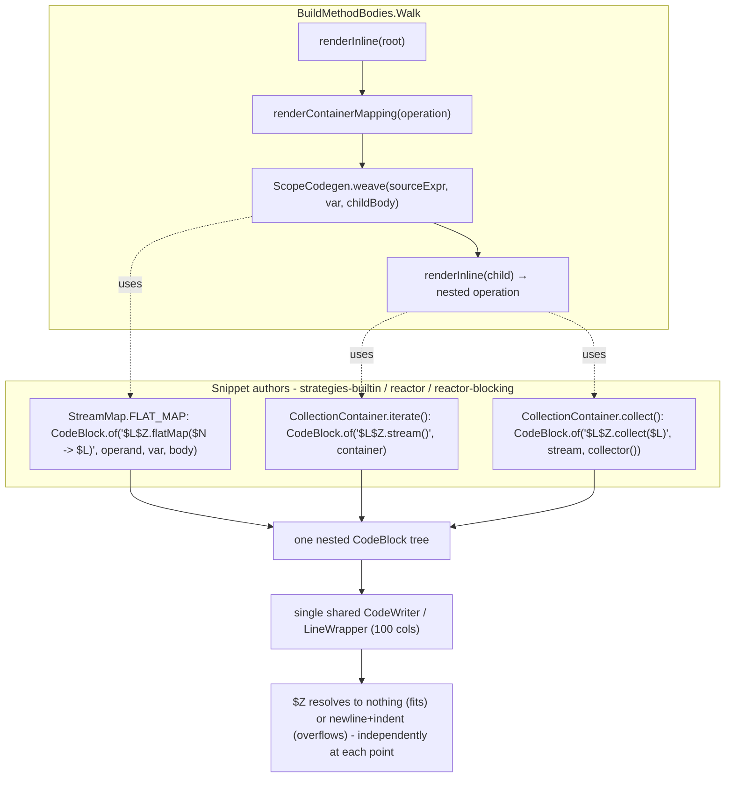

## Context

`GenerateStage` (`code-generation` capability) renders each mapper method body by recursively walking the extracted plan in `BuildMethodBodies.Walk` (`processor/src/main/java/io/github/joke/percolate/processor/internal/stages/generate/BuildMethodBodies.java`). Each `Operation`'s codegen handle (`OperationCodegen.render` / `ScopeCodegen.weave`, `container-codegen-spi`) returns a small `CodeBlock`, e.g. `CodeBlock.of("$L.map($N -> $L)", operand, var, body)`, and the walk splices these together via `$L` substitution as it recurses — one big nested `CodeBlock`, never a single monolithic builder.

The project depends on `com.palantir.javapoet` (a drop-in fork of Square's JavaPoet), whose `CodeWriter`/`LineWrapper` already implements column-aware soft wrapping at 100 columns (`CodeWriter.java`: `new LineWrapper(out, indent, 100)`), triggered only by an explicit `$W` (wrapping space) or `$Z` (zero-width space) token in a format string. None of the existing snippets use either token, so a fluent pipeline like `person.getAddresses().stream().flatMap(...).collect(...)` renders as one unbroken line regardless of length.

Confirmed by reading `com.palantir.javapoet:javapoet:0.16.0` sources directly (`CodeWriter.emit`, `LineWrapper`): `$W` emits a literal space when the line does not need to wrap (a poor fit here, since the existing style has no space before a chained `.`), while `$Z` emits nothing when unwrapped and a newline + fixed continuation indent (`indentLevel + 2`) when the line would overflow. `$Z` is therefore the correct primitive for a chain-continuation dot.

Because `$L` recursively emits a nested `CodeBlock` through the *same* `CodeWriter`/`LineWrapper` instance, a `$Z` placed inside an inner snippet's format string composes automatically with `$Z`s placed inside outer snippets — no coordination between snippets or the composer is required, and `BuildMethodBodies` needs no changes.

## Goals / Non-Goals

**Goals:**
- Long generated fluent pipelines wrap at call boundaries (the `.` before a chained method) once they exceed JavaPoet's 100-column limit, instead of rendering as one line.
- Apply the fix uniformly across every first-party snippet shaped like `CodeBlock.of("$L.method(...)", operand, ...)` in `strategies-builtin`, `reactor`, and `reactor-blocking`.
- Document the `$Z`-before-the-dot convention on the SPI contract (`ScopeCodegen`, `OperationCodegen`, `Container.UnarySnippet`/`UnwrapSnippet`) so third-party strategy/container authors follow it too.

**Non-Goals:**
- No change to the *semantics* of any generated code — this is whitespace/line-break only.
- No general-purpose Java source reformatting (e.g. running generated output through `palantir-java-format`). That was considered and explicitly rejected for this change — see Decisions.
- No engine, graph, plan-extraction, or `BuildMethodBodies` composer changes.
- No change to JavaPoet's column limit (100, hardcoded in the library, not exposed as configurable).
- Not fixing every conceivable long line in generated code (e.g. long constructor argument lists) — only chain-continuation snippets. A future change can extend the same convention to other snippet shapes if needed.

## Decisions

### Decision: `$Z` (zero-width space) over `$W` (wrapping space)

JavaPoet offers two wrap primitives. `$W` always consumes a character (a space when not wrapped); `$Z` consumes nothing when not wrapped. Since every existing chain snippet already omits a space before the dot (`"$L.stream()"`), `$W` would visibly regress the unwrapped case by inserting a stray space (`x .stream()`). `$Z` preserves today's unwrapped rendering exactly and only changes anything once a line actually overflows.

**Alternative considered:** always hard-break with `"\n"` at every chain link, regardless of length. Rejected — it would make today's already-short, perfectly readable one-liners (e.g. `address.stream().map(...).collect(Collectors.toList())`) needlessly multi-line, which is a regression for the common case.

### Decision: per-snippet `$Z` markers, not a post-processing formatter

Two shapes of fix were explored (see the proposal's "Why"): (a) each snippet marks its own wrap points via `$Z`, or (b) run all generated source text through `palantir-java-format` (already used for hand-written code) before writing it via the `Filer`.

(a) was chosen because:
- It fits the codebase's existing SPI philosophy that each container/strategy snippet is a small, self-contained, "myopic" unit that owns its own rendering — see `container-codegen-spi`'s "one class per container" principle. Wrap-point placement is one more thing a snippet already decides about its own text.
- It requires no new dependency on the processor's runtime classpath (formatter libraries are non-trivial in size and would ship to every consumer's `annotationProcessor` path).
- It requires no change to `AssembleMapperType`'s `JavaFile.builder(...).build().writeTo(filer)` — the `Filer`-based incremental-compilation path is untouched.
- Blast radius is naturally bounded to lines that are already too long; JavaPoet's own 100-column limit already governs `CodeBlock.toString()` in unit tests today, so short existing assertions are unaffected by adding `$Z` (it renders as nothing).

(b) remains a reasonable *future* option if long lines are found elsewhere (e.g. constructor calls with many fields) that aren't chain-shaped and thus can't be fixed by a `$Z` convention — but it's a materially bigger change (new dependency, `AssembleMapperType` restructuring, uniform reformatting of *all* generated output including deliberately-placed doc-tag comments) and is out of scope here.

### Decision: fix all first-party modules together, not just the reported example

The reported readability problem only came from `strategies-builtin` (`CollectionContainer`, `OptionalContainer`, `StreamMap`). But grepping `reactor` and `reactor-blocking` turns up the identical `CodeBlock.of("$L.method(...)", ...)` shape in `FluxMap`, `MonoContainer`, `FluxSingleBlock`, `FluxCollectListBlock`, `FluxToStream`, `MonoBlock`, `MonoBlockOptional`. Fixing only the reported set would leave an inconsistency where some first-party containers wrap gracefully and others (particularly `reactor-blocking`'s two-call chains like `"$L.single().block()"`) do not. Since this is purely mechanical (add `$Z` before each `.`), doing all of them together costs little extra and avoids a known follow-up.

### Decision: document the convention as Javadoc, not as an enforced check

There is no mechanical way (ArchUnit or otherwise) to verify that a `CodeBlock` format-string literal contains `$Z` in the right place — it's a string, not a structural property the compiler or a static-analysis rule can see. The convention is therefore recorded as Javadoc on the three SPI touchpoints a container/strategy author actually implements (`ScopeCodegen.weave`, `OperationCodegen.render`, `Container.UnarySnippet`/`UnwrapSnippet`), consistent with how other unenforceable conventions in this codebase (e.g. "strategies stay myopic") are communicated — through the contract's own documentation rather than a runtime guard.

## Flow (how `$Z` composes across the recursive walk)

Each snippet only ever knows about its own `$Z`; the shared `LineWrapper` in the JavaPoet fork is what makes the wrap decision globally consistent once all the nested `CodeBlock`s are flattened into one text stream at emit time.

## Risks / Trade-offs

- **[Risk] Flat continuation indent, not staircase per nesting depth.** JavaPoet's `LineWrapper` always continues at `indentLevel + 2` regardless of how deep in the recursive chain the `$Z` sits — a wrapped outer chain and a wrapped inner (lambda-body) chain land at the same indent, which can read as "flatter" than a hand-formatter's per-depth staircase. → **Mitigation**: accept it; this is a JavaPoet library constraint with no public override, and the flat style is still far more readable than one 190-character line. Verify visually against the actual `PersonMapperImpl` example before closing out the change.
- **[Risk] Existing spec/e2e fixtures with long expected-text assertions may need updating.** Any unit spec that asserts exact generated text for a chain long enough to cross ~100 columns will see its expectation change (new wrap). → **Mitigation**: run the full `strategies-builtin`, `reactor`, `reactor-blocking`, and doc-e2e test suites after the change; update any fixture whose expected text changes shape. Expected to be a small set given most unit fixtures use short type names.
- **[Risk, discovered during implementation] `CodeBlock.toString()` never flushes a trailing buffered chunk after `$Z`/`$W`.** JavaPoet's `LineWrapper` defers text following a wrap marker into an internal buffer and only flushes it when something *containing a newline* is appended afterward, or `close()` is called — neither of which `CodeBlock.toString()` ever does. Every real generated file is unaffected (a class/method/statement always emits a literal `}\n`/`;\n` downstream of any `$Z`, which forces the flush — verified by inspecting the regenerated `PersonMapperImpl.java`), but a **unit spec calling `.render(...).toString()` directly on an isolated snippet whose format string ends right after the `$Z`-marked call has its entire trailing text silently dropped** (not merely re-wrapped — gone). This surfaced as 9 failing assertions across `ArrayContainerSpec`, `SetContainerSpec`, `ListContainerSpec`, `OptionalContainerSpec`, and `StreamMapSpec`. → **Mitigation**: wrap the rendered `CodeBlock` in `CodeBlock.of("$L\n", <expr>)` before calling `.toString()` in any such assertion — the appended literal `\n` forces the flush, and the trailing newline is harmless to substring assertions. Applied to all 9 affected assertions.
- **[Risk] Convention drift for third-party SPI authors.** Since the `$Z` convention is Javadoc-only (not enforced), a new external container/strategy could still emit unwrapped chains. → **Mitigation**: accepted as unavoidable given format strings are opaque to static analysis; documented at the exact three touchpoints an author implements, which is the best available leverage point.
- **[Trade-off] Narrower fix than a general formatter.** This does not address long lines outside chain-shaped snippets (e.g., a constructor call with many arguments). → Accepted per Non-Goals; a formatter-based approach remains available as a future, larger change if that need materializes.

## Migration Plan

No migration — this is a source-generation formatting change with no data, API, or runtime behavior impact. Rollout is a normal code change:
1. Add `$Z` to the identified snippets (mechanical, one file at a time).
2. Add Javadoc to the three SPI touchpoints.
3. Regenerate/inspect the `percolate-integration` sample mappers (e.g. `PersonMapperImpl`) to visually confirm the wrapped output reads well.
4. Run the full test suite (`./gradlew check`) across `strategies-builtin`, `reactor`, `reactor-blocking`, `processor`, `spi`; update any fixture whose expected generated text shape changed.
5. No rollback complexity — reverting the snippet edits reverts to today's unwrapped rendering with no other side effects.

## Open Questions

- None outstanding. The approach, scope (all first-party modules), and documentation approach were confirmed with the user before drafting this design.
