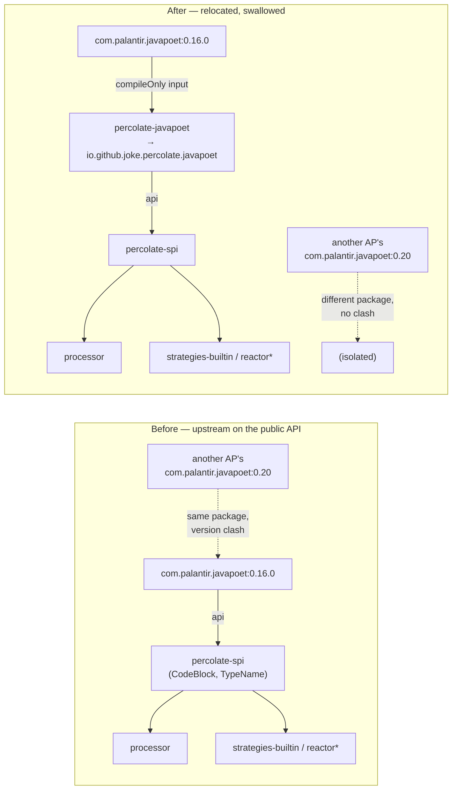

## Context

The processor renders generated code with JavaPoet (`com.palantir.javapoet:javapoet:0.16.0`). `CodeBlock` and `TypeName` are on the **public SPI `api` surface** (`spi/build.gradle` declares `api 'com.palantir.javapoet:javapoet'`), so every strategy author — the built-ins, `reactor`, `reactor-blocking`, and future third parties — compiles against them.

Annotation processors share one classloader on a consumer's processorpath. If another processor contributes a *different* `com.palantir.javapoet` version, Gradle resolves a single version onto that path and percolate may run against one it was not compiled against → `LinkageError`/`NoSuchMethodError` at annotation-processing time, surfacing as a baffling failure in the *consumer's* build. Square archived JavaPoet; Palantir's fork is the successor, so the set of processors on this exact package grows. ~20 more strategies are imminent, each a new consumer of the SPI's JavaPoet types — so the cutover is cheapest now.

## Goals / Non-Goals

**Goals:**
- Make percolate immune to a foreign `com.palantir.javapoet` version on a shared processorpath.
- Relocate JavaPoet into `io.github.joke.percolate.javapoet` and make the relocated `CodeBlock`/`TypeName` the SPI's public codegen types.
- Atomic, behavior-preserving cutover of all five JavaPoet-using modules before the strategy build-out.

**Non-Goals:**
- Shading the Dagger runtime and jgrapht-core/jheaps into the processor jar — internal-only deps, a separate follow-up change.
- Introducing a percolate-owned `Code` wrapper type (de-leaking the SPI from JavaPoet's *shape*) — explicitly deferred and left reversible.
- Any change to generated code, engine behavior, or the doc-tag feature.

## Decisions

**D1 — A dedicated `percolate-javapoet` relocation module, not per-module shading.** Both `spi` and `processor` need the *same* relocated `CodeBlock` (a `CodeBlock` crosses the spi↔processor boundary). A single relocation module gives one canonical relocated type. *Alternatives:* shading into `spi` only (processor would need its own copy or an awkward dependency on spi's shaded jar); shading per-module (produces multiple "identical" copies → the very duplication we are eliminating). Rejected.

**D2 — Expose the relocated `CodeBlock` as the SPI api; do not introduce a `Code` wrapper now.** Zero wrapper cost, strategy authors keep JavaPoet's mature builder API, and it is **reversible** — a `Code` de-leak can wrap the relocated type later without re-relocating. *Alternative:* own a `Code` type now (JavaPoet-independent SPI). Deferred: larger surface, and relocation does not foreclose it.

**D3 — Fully swallow upstream (the load-bearing invariant).** The upstream dependency is `compileOnly`/shadow-scoped in the relocation module, and the published POM/metadata declares **zero** `com.palantir.javapoet` dependency. If upstream leaked transitively, consumers would carry both packages and the immunity would be lost. This is asserted by a classpath test.

**D4 — Relocate `com.palantir.javapoet` only.** `javax.lang.model.*` (the `Modifier`/`TypeMirror` that `TypeName`/`MethodSpec` reference) stays intact so the codegen API still interoperates with the compiler's mirror types.

**D5 — Atomic cutover.** The relocated `CodeBlock` is a distinct class from upstream's; a value crossing spi↔processor↔strategies must be one type, so a partial cutover cannot type-check. All five modules flip in one change — mechanical (IDE move-package + Spotless), behavior-preserving.

**D6 — Rejected: injecting behavior into JavaPoet's emit via a build trick.** Both a merge-replaced `MethodSpec` and a shadow-`strip-final` + subclass fail *structurally*: shadow runs **post-compile**, but any modified API must exist at **compile** time; `MethodSpec` has a `private` constructor and a hardcoded `new MethodSpec` inside a `final Builder` (construction is sealed); and its `emit` seam couples to package-private `CodeWriter` (zero stability contract). Any injection into JavaPoet's emit therefore requires owning the package — a real fork — which this change does not do. (Recorded so it is not re-proposed.)

## Risks / Trade-offs

- **Shaded jar not consumable as a compile `api` artifact** → configure GradleUp/shadow so the relocated jar *is* the module's published api artifact; a smoke compile against `io.github.joke.percolate.javapoet.CodeBlock` verifies it.
- **Upstream leaks transitively** (immunity silently lost) → the swallow invariant (D3) plus an explicit test asserting no `com.palantir.javapoet` on any downstream compile/runtime classpath.
- **Partial cutover** (relocated vs upstream `CodeBlock` mixed) → forbidden by D5; one change, `./gradlew check` gate, and an ArchUnit guard that no production source imports `com.palantir.javapoet`.
- **`percolate-javapoet` omitted from BOM/POM management** → add it to the BOM and to the published-artifact checks.
- **Breaking change for external strategy authors** → documented BREAKING; there are no external strategy authors yet, and it is reversible behind a future `Code` type.

## Migration Plan

1. Add `percolate-javapoet` (shadow relocation of upstream 0.16.0 → `io.github.joke.percolate.javapoet`); verify the swallow invariant.
2. Point `percolate-spi` at `api project(':percolate-javapoet')`; flip its imports.
3. Flip imports + dependencies in processor, strategies-builtin, reactor, reactor-blocking in the same change; remove every direct `com.palantir.javapoet:javapoet` dependency.
4. Add the ArchUnit no-`com.palantir.javapoet`-import guard and the classpath-swallow test; add `percolate-javapoet` to the BOM.
5. Green `./gradlew check` (incl. `percolate-smoke`). Rollback = revert the change (no data/runtime migration; generated output is unchanged).

## Open Questions

- None blocking. `percolate-javapoet` is published as a normal BOM-managed coordinate (required because it carries the SPI's public `CodeBlock`). Whether to *additionally* fat-jar it into the processor is out of scope here and belongs with the Dagger/JGraphT follow-up.
