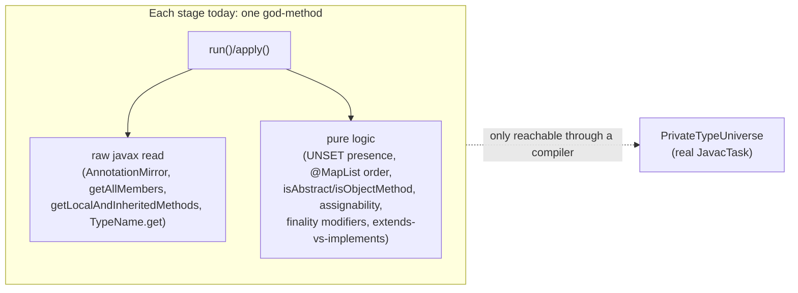
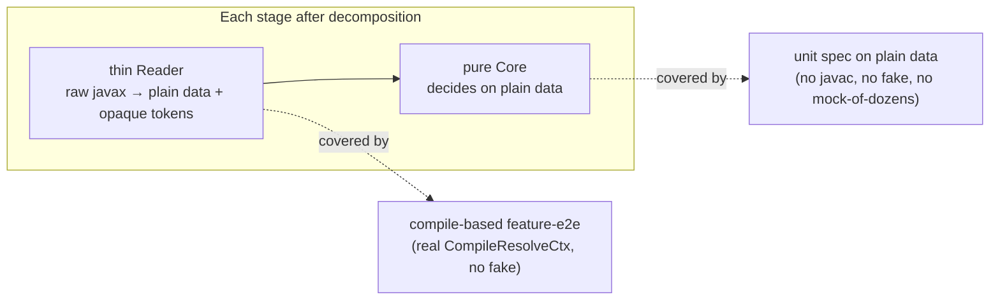

## Context

`PrivateTypeUniverse` (a per-spec `JavacTask` in `spi/src/testFixtures`) is the last real-javac substrate on the unit path. Four `processor` boundary specs still construct it: `DiscoverAbstractMethodsStageSpec`, `DiscoverMappingsStageSpec`, `DiscoverCallableMethodsStageSpec`, `AssembleMapperTypeSpec`. They were kept on javac as a deliberate "boundary exemption" — but the exemption is a symptom, not a law. Each of the four stages fuses a **raw-javax read** with **pure decision logic** in one method, so the only reach to the logic is through a compiler.

This is the exact shape `decompose-engine-stages` already resolved for the engine ("the fake was the tax for zero seams"). The engine stages were decomposed into single-method collaborators; these four discovery/codegen stages never were. The `expansion-test-harness` spec already states the target for the codegen side ("pure assembly logic → mocked seams; the `TypeName.get(mirror)` residue → compile-based feature-e2e"); this change generalizes it to the discovery side and finishes the job.

Current per-stage fusion:

## Goals / Non-Goals

**Goals:**
- Decompose the four boundary stages into a thin javax **reader** + a **pure core**, so pure logic unit-tests on plain data with no javac.
- Delete `PrivateTypeUniverse` and its `DirectiveFixtures` coupling; make the whole `processor` unit path javac-free and parallel-safe by construction.
- Cover the thin readers through the **existing** compile-based feature-e2e layer (real `CompileResolveCtx`).
- Hold the `processor` pitest mutation/line/test-strength floors — never lower the ratchet.
- Remove stale `TypeUniverse` text (four `build.gradle` files, `spi/README.md`).

**Non-Goals:**
- Growing the `ResolveCtx` seam to swallow annotation-mirror reading or member enumeration (rejected below).
- Introducing any `FakeType`/`FakeResolveCtx` — fakes are a unit crutch this change removes, not adds.
- Changing any consumer-facing API, generated-code output, or diagnostics behaviour (the `AnnotationValue`-carried error positions per design D6 are preserved).
- Touching the other three docs/version threads (separate changes).

## Decisions

### D1 — Decompose, do not relocate, grow the seam, or mock raw javax

Four ways to dissolve the fixture were weighed:

| Option | Verdict |
|---|---|
| **Decompose** (chosen): thin reader + pure core; pure core → unit on plain data, reader → compile e2e | Keeps focused unit coverage, adds no fake, matches the `decompose-engine-stages` precedent and the existing codegen spec rule |
| Relocate: delete the unit specs, cover everything via compile e2e | Trades fast, focused unit coverage of `UNSET`/filter/assignability logic for slow e2e; risks the pitest floor |
| Grow the `ResolveCtx` seam to cover annotation reading + member enumeration | Large production/architecture change; still can't seam `TypeName.get(mirror)`; over-broadens a read-only type-query seam into a discovery API |
| Mock raw javax (`AnnotationMirror`/`Elements`/`Types`) in the specs | The brittle-stub anti-pattern the project already rejected when it chose `FakeType`; and `TypeName.get(mirror)` cannot be mocked at all |

**Not an architecture shift.** This applies an *already-established* pattern (single-method collaborators, decomposed stages) to stages that were skipped. It does not introduce a new pattern or move a module boundary.

### D2 — Thin reader / pure core split, with opaque javax tokens

Every `javax.lang.model` value the pure core receives is a **never-stubbed opaque token** — the exact discipline the `ResolveCtx` seam already uses for `TypeMirror`. The reader projects each raw read into plain data (`String`, `Set<Modifier>`, plain method/candidate descriptors) and carries any token (an `AnnotationValue` for D6 error positioning, an `ExecutableElement` for later codegen) through untouched.

Per-stage split:

| Stage | Thin reader (→ compile e2e) | Pure core (→ unit on plain data) |
|---|---|---|
| `DiscoverMappingsStage` | `AnnotationMirror` member reads → `(rawString, AnnotationValue token)`; `@Map`/`@MapList` FQN classify; `@MapList` unwrap to ordered raw directives | `Map.UNSET`-sentinel presence per member; assemble `MappingDirective` carrying the opaque tokens |
| `DiscoverAbstractMethodsStage` | `getLocalAndInheritedMethods` + `Object` element → method descriptors (`Set<Modifier>`, enclosing-is-object flag, opaque `ExecutableElement`) | `isAbstract` / `isObjectMethod` filter over descriptors |
| `DiscoverCallableMethodsStage` | `getAllMembers` → candidate descriptors (kind, param count, return-type token) | single-param / `METHOD` / non-`Object` filter; return-type `isAssignable` (the seam already answers `isAssignable`) |
| `AssembleMapperType` | `TypeName.get(mirror)` rendering + `Filer` write (un-seamable leaf) | finality-modifier selection; `extends`-vs-`implements` decision |

### D3 — `AssembleMapperType`'s render leaf goes to compile e2e; its finality switches are already covered

`TypeName.get(mirror)` reads deep into a real mirror and cannot be meaningfully mocked. The pure decisions (`classes.final`/`methods.final`/`parameters.final` modifier selection, interface-vs-class → `implements`/`extends`) are extracted and unit-tested on plain inputs; the render+write leaf is asserted by compiling real `@Mapper`s. The three finality switches are **already** exercised end-to-end by the `compile-time-switches` doc-e2e (`classes-final-on`, `methods-final-off`, `parameters-final-on`, …), so most of `AssembleMapperTypeSpec`'s behaviour already has an e2e home; only branches a real compile does not exercise (void return, `extends` vs `implements`, field emission, `@Generated`) need a targeted fixture added.

### D4 — No fake, ever; e2e uses real compilation

The compile-based feature-e2e layer compiles real sources through the real `CompileResolveCtx`. It needs **no** `FakeType`/`FakeResolveCtx`. This change introduces none and imports none in any rewritten spec.

### D5 — Coverage discipline: hold the pitest floor

Because pure cores unit-test on plain data, mutations in the decision logic are killed by fast units; mutations in the thin readers are killed by compile e2e. Before deleting the fixture, the `processor` pitest run must show floors **held**. Any reader branch a real compile does not already cover gets a targeted `@Mapper` fixture — coverage is preserved by construction, never by lowering the ratchet ([[feedback_pitest_history_plugin]]: keep the history plugin; never disable `jacocoTestCoverageVerification`).

### D6 — Naming, ArchUnit, and the spy self-call trap

- Collaborators are **not** `Stage` implementors, so they take no `*Stage` suffix (only `Stage` implementors do — [[feedback_stage_naming_convention]]).
- Respect the ArchUnit no-private-method + size-cap guard co-enforced since `decompose-engine-stages`: collaborator methods are package-visible, each class stays small.
- If a pure core recurses into itself and its spec spies the subject, an *instance-method* self-call extraction is recorded as an untracked interaction under `0 * _`; extract such helpers as `static` (parameterising the field), still non-private per ArchUnit ([[feedback_spy_self_call_extraction]]). Most cores here are non-recursive (mock collaborators, no spy needed).
- Specs are example-based Spock (`where:` tables); **no jqwik** ([[feedback_no_jqwik]]); Spock house style — strict mocking ended by `0 * _`, no `given:`/`setup:` label, validate every mocked argument, spy the subject only for genuine self-calls.

## Risks / Trade-offs

- **[Reader branch escapes e2e coverage → pitest floor drops]** → Run `:processor:pitest` after each stage's decomposition; add a targeted `@Mapper` fixture for any surviving mutant before proceeding. The floor gate is the acceptance oracle.
- **[Decomposition churns production code near a boundary]** → Keep the reader a pure projection and the core a pure function; no behaviour change to generated code or diagnostics. Verify `percolate-smoke:smokeRun` and the doc-e2e outputs are byte-identical.
- **[`MappingDirective` token threading loses an error position]** → The reader carries every `AnnotationValue`/`AnnotationMirror` token the current `toDirective` carries; the pure core never inspects them, only forwards. Assert the D6 positioning fixtures still resolve.
- **[Spotless/Guava worker flake masks a real failure]** → Known pre-existing environment flake; confirm via `git stash` on `main` before attributing to this change ([[project_type_query_seam]]).

## Migration Plan

1. **DiscoverMappingsStage** — extract the annotation reader + pure `MappingDirective` builder; rewrite `DiscoverMappingsStageSpec` on plain `(rawString, opaque token)` data; add compile-e2e `@Map`/`@MapList` fixtures for any uncovered directive-shape branch.
2. **DiscoverAbstractMethodsStage** + **DiscoverCallableMethodsStage** — extract member readers + pure filter/assignability cores; rewrite both specs on plain descriptors.
3. **AssembleMapperType** — extract the pure finality/`extends`-vs-`implements` decisions; move render-leaf assertions to compile e2e (reuse the switches doc-e2e; add fixtures for void-return / extends / field-emission / `@Generated`); rewrite `AssembleMapperTypeSpec`.
4. **Delete** `PrivateTypeUniverse` + the `DirectiveFixtures` coupling; confirm `spi/testFixtures` export no javac-backed type; confirm zero `PrivateTypeUniverse` imports remain.
5. **Stale text** — remove `TypeUniverse` references from `build.gradle`, `processor/build.gradle`, `spi/build.gradle`, `strategies-builtin/build.gradle`, and `spi/README.md`.
6. **Gate + sync** — `./gradlew check` green, `processor` pitest floors held, `percolate-smoke:smokeRun` green; sync deltas to main specs; archive.

Rollback: the decomposition is behaviour-preserving and staged per stage; a stage can be reverted independently before step 4, since `PrivateTypeUniverse` is only deleted once all four specs are javac-free.

## Open Questions

- Exact collaborator granularity per stage (one reader + one core each, or finer) is settled at apply time against the ArchUnit size-cap; the spec constrains only that pure logic be javac-free and the reader be e2e-covered.
- Whether `DiscoverCallableMethodsStage`'s assignability core routes `producing` through the existing `ResolveCtx.isAssignable` seam method or keeps a locally-injected `Types` behind the reader — decided at apply time by whichever keeps the core mockable with a single stub.
