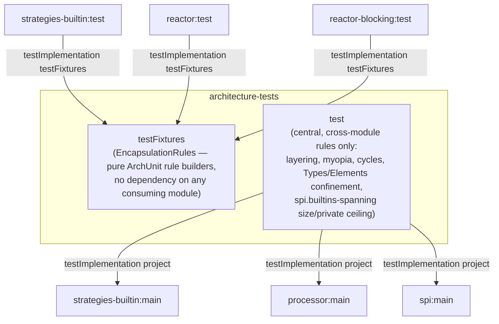

## Context

`architecture-tests` is a dedicated, unpublished module hosting ArchUnit rules over every other percolate
module. Its `build.gradle` (82 lines) currently does three unrelated things: ordinary dependency wiring,
a hand-rolled cross-project "boundary probe" (globbed build-output directories threaded through a system
property, feeding exactly one ArchUnit rule), and a JavaPoet "swallow-check" (eager dependency-graph
resolution + a hand-registered task, feeding no ArchUnit rule at all — it's a completely different
mechanism, resolving classpaths rather than importing bytecode).

Both blocks were investigated in detail before this change:

- **The swallow-check** protects the `javapoet-relocation` capability's "upstream JavaPoet is fully
  swallowed" invariant against a regression (some module transitively or accidentally reintroducing
  `com.palantir.javapoet` onto its own classpath) that has **never occurred** — the check has always passed.
  An `exclude`-based preventive alternative was considered and rejected too: the decision, made explicitly,
  is to accept the residual risk rather than guard it at all, given how narrow and hypothetical the failure
  mode is (a single stray/transitive dependency, in a repo with no history of it).
- **The boundary probe** hand-globs each probed module's build-output directories as 12 literal path
  strings (3 modules × 4 layout guesses). Checked against the actual build output: **5 of the 12 never
  exist** (no module here has Groovy main sources; `reactor`/`reactor-blocking` have no plain-Java test
  sources). The mechanism also fails **silently**: if the whole probe pipeline ever went empty, the ArchUnit
  rule it feeds (`noClasses()...check(candidates)`) would be vacuously true — a guard rail that can rot into
  a no-op with zero signal.

The reason the probe exists at all is legitimate: ordinary Gradle project dependencies
(`testImplementation project(':strategies-builtin')`) only expose a module's **main** output, never its
**test** output, and the rule being checked ("no class outside the engine reaches `processor.internal`")
must cover test code too — a strategy-module spec reaching into engine internals for testing convenience is
exactly the kind of violation that's easy to write and easy to miss. The fix is not to build a better probe;
it's to notice that `strategies-builtin`, `reactor`, and `reactor-blocking` **already** have
`testImplementation project(':processor')` (verified — all three), which means each of them already has,
on its own ordinary test classpath, everything the rule needs: its own main+test classes, and `processor`'s.
No cross-project reaching is required if each module checks itself.

## Goals / Non-Goals

**Goals:**
- Delete the swallow-check with no replacement (decided; residual risk accepted).
- Eliminate the boundary-probe mechanism entirely by moving the one rule it serves into the three modules
  that already have everything the rule needs.
- Share the rule-building logic once (as `architecture-tests` `testFixtures`, reusing the exact pattern
  `spi` already has applied — currently empty — for `strategies-builtin` to consume), not copy-pasted three
  times.
- Leave every other ArchUnit rule untouched, in place, unmoved.

**Non-Goals:**
- Not moving the "strategy implementation may not touch the engine graph" rule. Investigated during
  exploration and initially misclassified as probe-dependent — it is not. It already runs against `imported`
  (architecture-tests' ordinary main-classpath scan), not `candidates` (the probe-derived set), so it needs
  no cross-project reaching today and moving it would not reduce any complexity. Left exactly where it is.
- Not moving the `javax.lang.model.util` confinement rule. It checks that classes **outside** an enumerated
  processor-internal boundary — which explicitly includes every strategy module and the
  `Containers`/`TypeProbe` helpers — never depend on `Types`/`Elements`. That's a genuinely cross-module
  property (it must see every module together to confirm none of them violate it), not a repeated per-module
  check, so it stays central.
- Not moving `JavaPoetRelocationSpec` ("no production class imports unrelocated upstream JavaPoet"). It's
  the same *shape* of rule (identical check, repeatable per module) and could migrate later using the same
  testFixtures mechanism this change introduces, but it doesn't use the probe or the swallow-check and
  wasn't part of what this change investigated in depth. Deliberately left out to keep this change's blast
  radius matched to what was actually validated.
- Not expanding the boundary-probe rule's scope to `test-foundation` (which also depends on `processor` and
  theoretically could violate it, but was never in `boundaryProbeModules` either). This is a structural
  refactor, not a coverage expansion.

## Decisions

### D1 — Delete the swallow-check outright, no exclude

Considered and rejected: a preventive `configurations.all { exclude group: 'com.palantir.javapoet' }` on the
five downstream modules. It's genuinely simpler and stronger than the current detect-and-fail approach (it
makes the leak structurally impossible rather than resolving-then-checking), but the explicit decision here
is that even that small addition isn't warranted for a regression that has never happened and would, if it
ever did, most likely surface as an immediate compile failure anyway (a direct stray dependency) rather than
a subtle one. Simplicity wins over defense-in-depth for this specific, narrow, historically-unviolated
invariant.

### D2 — Shared rule logic lives in `architecture-tests`' own `testFixtures`, not a new module or a Gradle plugin

A tiny shared Gradle convention plugin was considered (each module applies it, gets the rule wired
automatically). Rejected: the Gradle wiring each consuming module needs is nothing — no new task, no new
dependency beyond one `testImplementation`, the classpath is already there. A plugin would solve a wiring
problem that doesn't exist here; what's actually needed is shared **rule-construction code**, which
`java-test-fixtures` already provides as a first-class Gradle mechanism, with a working precedent already in
this repo (`spi`'s `testFixtures`, consumed by `strategies-builtin` today — currently empty, but the wiring
is proven).

No cycle: `testFixtures` depends only on ArchUnit (+Spock/Groovy), never on any consuming module, so the new
edges (each strategy module's `test` → `architecture-tests`' `testFixtures`) never loop back through
`architecture-tests`' own `test` → strategy-module `main` edges, which are a disjoint configuration.

### D3 — Move exactly one rule: "no class outside the engine reaches `processor.internal`"

This is the only rule the probe served. It moves into a new small spec in each of `strategies-builtin`,
`reactor`, and `reactor-blocking`, each importing its own module's classpath (`ClassFileImporter()
.importPackages('io.github.joke.percolate')`, which — unlike `architecture-tests`' own scan — naturally
includes that module's own test classes, since they're genuinely on that module's own test runtime
classpath) and calling into the shared `testFixtures` rule with `processor.internal` as the forbidden
package. The central `ModuleBoundariesSpec` test method for this rule is deleted, not just deprecated.

This also structurally closes the silent-pass gap the probe had: a module's own `sourceSets.test.output` is
never "accidentally empty" the way a hand-globbed external path list could be — Gradle guarantees it exists
and is populated whenever `test`/`testClasses` runs. No non-empty assertion is needed; the failure mode the
old mechanism was vulnerable to doesn't exist in the new shape.

## Risks / Trade-offs

- [Risk] Deleting the swallow-check removes CI's only signal if `com.palantir.javapoet` is ever
  reintroduced onto a downstream classpath; the failure would then surface however that library's absence
  or presence manifests downstream (most likely a normal compile error from a direct stray dependency,
  possibly a runtime `LinkageError` from a transitive one) rather than a named, upfront diagnostic. →
  Mitigation: none added, by explicit decision (D1) — this is an accepted trade, not an oversight.
- [Risk] The boundary-check rule's scope (exactly `strategies-builtin`, `reactor`, `reactor-blocking`) is a
  straight carry-over from today's `boundaryProbeModules` list; it does not gain `test-foundation` even
  though `test-foundation` also depends on `processor`. → Mitigation: this mirrors today's actual coverage
  exactly (not a regression), and expanding coverage is explicitly out of scope for this change.
- [Risk] Four modules (`architecture-tests`, `strategies-builtin`, `reactor`, `reactor-blocking`) now
  declare `com.tngtech.archunit:archunit` instead of one; a future ArchUnit version bump touches four
  `build.gradle` files instead of one. → Mitigation: the version is already centrally managed by the
  `dependencies` platform project (`api 'com.tngtech.archunit:archunit:1.4.1'`), so a bump is still a
  one-line change there; each module only adds the unversioned `testImplementation 'com.tngtech.archunit:archunit'`
  coordinate.

## Migration Plan

Build/test-tooling-only change; no production code, no generated-mapper behavior, no consumer-facing surface
is touched. Land directly on `main` behind the normal `./gradlew check` gate. No feature flag; rollback is a
normal revert if the redistributed rule turns out to miss something the central version caught (it
shouldn't — same rule body, same effective classpath content, just assembled from a different, already-
present source).

## Open Questions

None outstanding — scope (which rules move, which stay, and why) was deliberately narrowed during
exploration to exactly what was investigated and validated.
