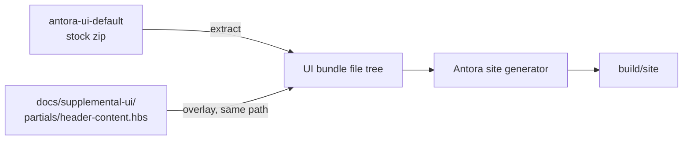
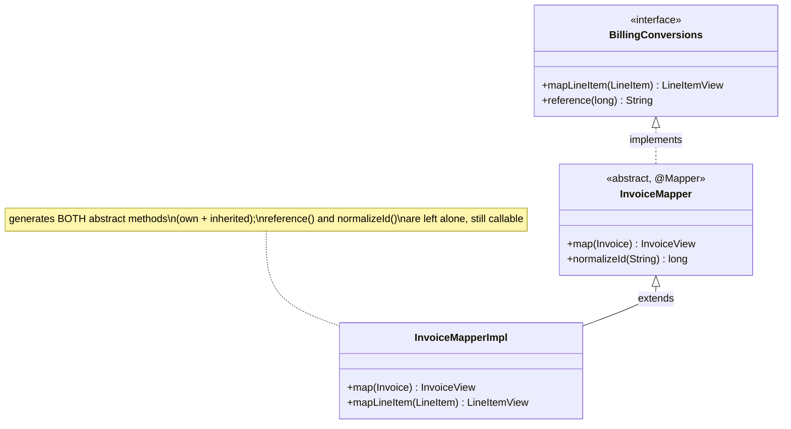

## Context

Two independent, previously-verified findings drive this change:

1. `antora-playbook.yml` pulls `antora-ui-default` unmodified (`ui.bundle.url`, the stock GitLab-hosted
   zip). Its `src/partials/header-content.hbs` hardcodes a demo navbar — `Home`, a `Products` dropdown
   (Product A/B/C), a `Services` dropdown (Service A/B/C), and a `Download` button — all `href="#"`. None
   of it is derived from project data; it is sample content the bundle expects consumers to replace. The
   file's *only* other content is the real brand link (`site.title`), the conditional search box, and the
   mobile burger button — all of which must survive.
2. `mapper-structure.adoc` states abstract-class mappers and inherited discovery are supported but shows
   neither. Both are real:
   - `AssembleMapperTypeFeatureSpec` (processor, internal) already proves an abstract-class `@Mapper`
     compiles to `ClassMapperImpl extends ClassMapper` via a real `PercolateCompiler.compile(...)` run —
     but it's a processor-internal fixture, not the manual's real-source `docs/<topic>/` pattern.
   - `AbstractMethodReader.readMethods` (`processor/.../discover/AbstractMethodReader.java:30`) discovers
     methods via Guava's `MoreElements.getLocalAndInheritedMethods`, which walks the full interface/class
     inheritance graph. `MapperStep.process` (`processor/.../MapperStep.java:62`) only treats the
     `@Mapper`-annotated type itself as a processing root — ancestors need no annotation. No manual example
     or e2e fixture currently exercises this cross-supertype path.

## Goals / Non-Goals

**Goals:**
- Remove 100% of the stock UI bundle's placeholder navbar content without forking or rebuilding the UI
  bundle.
- Add two new `mapper-structure.adoc` sections, each backed by a real, compiled, behaviourally-asserted
  fixture per the `user-manual` capability's single-sourcing requirement — no hand-typed "generated output".
- Prove (not just assert in prose) that cross-supertype discovery and abstract-class generation work, via a
  compiling e2e.

**Non-Goals:**
- No release/tag UI work. Antora's git-tag version dropdown (`content.sources[0].tags: [v*.*.*]`) is
  already wired and self-populates on the first `v*.*.*` tag; this change adds no code for it.
- No replacement nav item for the removed navbar (confirmed with the user: minimal navbar, nothing added).
- No processor/codegen change. The "complete generated mapper" ask is satisfiable with the existing
  `docTags` mechanism (method-level tags) plus an **untagged** `include::`, since Asciidoctor unconditionally
  strips `// tag::`/`// end::` marker-comment lines from included content whether or not a `tag=` filter is
  applied. No new "whole-class tag" is needed.
- No fork of `antora-ui-default`; only a single-file overlay.

## Decisions

### D1 — Overlay one partial via `ui.supplemental_files`, not a UI bundle fork

Antora supports `ui.supplemental_files` in the playbook: a local directory whose files are layered onto the
extracted UI bundle's file tree at the same relative path before the site is generated. Pointing this at
`docs/supplemental-ui/` with a single replacement `partials/header-content.hbs` overrides exactly the
hardcoded block, leaving every other bundle file (styles, scripts, the version-dropdown partials `nav.hbs` /
`nav-menu.hbs` / `page-versions.hbs` / `toolbar.hbs`, etc.) on the stock, upstream-maintained path.

Alternative considered — fork `antora-ui-default` and point `ui.bundle.url` at a custom-built zip: rejected.
It trades a one-file overlay for owning an entire UI bundle's build pipeline (its own Gulp/webpack toolchain)
indefinitely, for a one-block edit. Disproportionate for a solo-maintained project.

The replacement `header-content.hbs` keeps the `navbar-brand` (site title/link) and the conditional search
box. It drops the `topbar-nav` / `navbar-end` block entirely rather than leaving an empty shell — and it
drops the burger button **with** it, not just the block it toggled. `src/js/05-mobile-navbar.js` (the
bundle's own script, verified from the bundle source rather than assumed) does
`document.getElementById(this.getAttribute('aria-controls')).classList.toggle(...)` unconditionally on
click; keeping the burger while removing `#topbar-nav` would throw a `TypeError` the first time a mobile
visitor taps it. There is nothing left for a burger to open, so it is removed along with its target.

### D2 — New doc-example packages follow the existing real-source pattern, not a new mechanism

Every other manual section (`gettingstarted`, `defaultmethod`, `nested`, `collections`, …) is a real
`@Mapper` under `strategies-builtin/src/test/java/io/github/joke/percolate/docs/<topic>/`, compiled by the
ordinary `compileTestJava` task, paired with a `@Tag('integration')` Spock spec under
`strategies-builtin/src/test/groovy/.../docs/<topic>/` that instantiates the generated `*Impl` and asserts
behavior. The two new sections reuse this unchanged:

- `docs/abstractclass/` — one abstract-class `@Mapper` (mirrors the shape `AssembleMapperTypeFeatureSpec`
  already proved at the processor level, restated as a manual-owned fixture).
- `docs/hierarchy/` — one plain interface (`@Map`-annotated abstract method + a `default` method) and one
  `@Mapper abstract class` implementing it (its own abstract method + its own concrete method).

No new collector `scan` entry is needed — both packages fall under the existing `strategies-builtin` scans
already declared in `docs/antora.yml`.

### D3 — Show the complete generated impl via `include::…[tags=**]`

`AssembleMapperType` (with `-Apercolate.docTags`) brackets each generated method individually, tagged by
method simple name (`AssembleMapperType.java:76`). An initial assumption that Asciidoctor unconditionally
strips tag-directive comment lines even on an **untagged** include (no `tag=`/`tags=` attribute at all) was
checked against a real `./gradlew antora` build and was **wrong** — an untagged include of a docTags-on file
renders literal `// tag::map[]` / `// end::map[]` comments in the output. The correct, already-established
mechanism (`temporal-mapping.adoc`, per the `doc-tag-whole-methods` change and the `user-manual` spec's own
"whole-class listing carries no tag-marker noise" scenario, which names `tags=**` as the example) is
`include::example$hierarchy/InvoiceMapperImpl.java[tags=**]` — `tags=**` matches every tag in the file and
*does* explicitly elide the marker comments. No processor change is needed either way; this was a doc-syntax
correction only, made during implementation and verified by inspecting the rendered HTML.

### D4 — Hierarchy example proves cross-supertype discovery in the assertion, not just in prose

The `hierarchy` e2e spec SHALL assert that the generated impl's inherited method (declared on the
unannotated interface) and its own abstract method both produce correct output, and that invoking the
`default` method and the concrete class method directly still returns their hand-written behavior (proving
percolate left them alone). This makes the doc example double as the first e2e proof of cross-supertype
discovery outside the processor-internal `AbstractMethodReader`.

## Risks / Trade-offs

- [Risk] `ui.supplemental_files` silently no-ops if the path is misconfigured, leaving the stock navbar in
  place with no build error. → Mitigation: verify with a local `./gradlew antora` build and inspect
  `build/site/index.html` for the absence of "Products"/"Services"/"Download" before considering the task
  done.
- [Risk] A future `antora-ui-default` upstream update changes `header-content.hbs`'s surrounding structure
  (e.g. adds new required markup around `navbar-brand`), and the overlay silently diverges from what a
  fresh bundle pull expects. → Mitigation: `ui.bundle.snapshot: true` is already set, so this was already a
  latent risk of tracking `HEAD` of the bundle; the overlay does not materially increase it. No action
  needed beyond noting it.
- [Risk] The `hierarchy` fixture's package-info / naming could collide with the existing `docs/collections`
  or similar topic packages. → Mitigation: new topic names (`abstractclass`, `hierarchy`) checked against
  the existing `docs/*` package list during implementation; none currently exist.

## Migration Plan

Docs-only, no runtime/consumer impact. Land directly on `main` behind the normal `./gradlew check` +
`./gradlew antora` gate; no feature flag, no rollback beyond a normal revert.

## Open Questions

None outstanding — scope, page placement, and example shape were confirmed with the user during
exploration.
