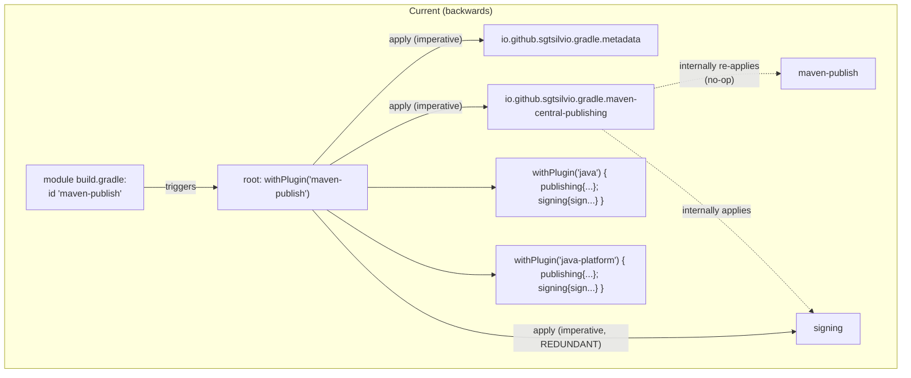
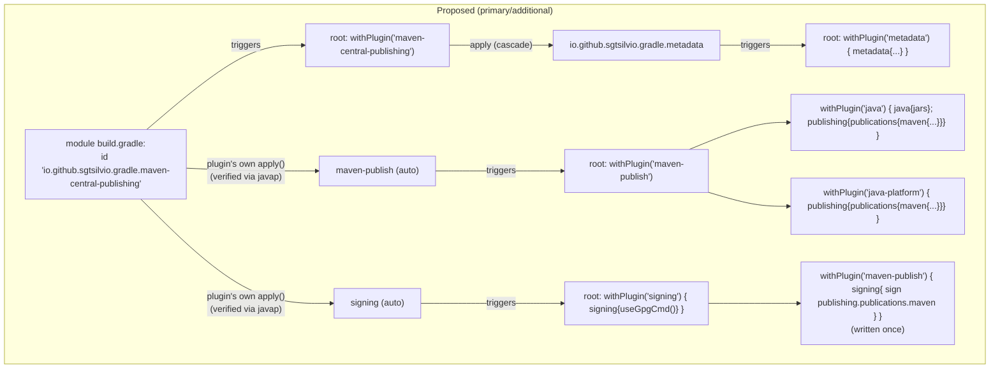

## Context

Root `build.gradle` configures every subproject through a `subprojects { ... }` block that reacts to plugins via `pluginManager.withPlugin(id) { ... }`. The established convention (already used for `net.ltgt.errorprone` → `net.ltgt.nullaway`, and `java-base` → `com.diffplug.spotless`/baseline plugins/`jacoco`/`pmd`) is: a module declares one **primary** plugin in its own `plugins{}` block; root cascades any **additional** plugin that always travels with it via `pluginManager.apply` from inside the primary's `withPlugin` block, then configures the additional plugin in its own separate `withPlugin` block.

Publishing does not follow this shape today. Every publishable module declares `id 'maven-publish'` directly, and root's `withPlugin('maven-publish')` block imperatively force-applies `io.github.sgtsilvio.gradle.metadata`, `io.github.sgtsilvio.gradle.maven-central-publishing`, and `signing`. Decompiling the installed `io.github.sgtsilvio.gradle.maven-central-publishing` 0.5.0 jar (`javap -p -c` on `MavenCentralPublishingPlugin.class`) shows its `apply(Project)` calls `project.getPluginManager().apply(MavenPublishPlugin::class)` and `.apply(SigningPlugin::class)` as its first two actions — it already brings in `maven-publish` and `signing` itself. Its own README claims otherwise; the bytecode is authoritative for what's actually installed. `io.github.sgtsilvio.gradle.metadata`'s `apply()` applies nothing else — it's a standalone extension plugin.

Separately, `.github/workflows/release.yml` has an in-flight uncommitted change: it added a `crazy-max/ghaction-import-gpg@v7` step (imports a real private key into a GPG keyring / starts `gpg-agent`) and removed the `ORG_GRADLE_PROJECT_signingKey` / `ORG_GRADLE_PROJECT_signingPassword` env vars. The current `signing { useInMemoryPgpKeys(findProperty('signingKey'), findProperty('signingPassword')) }` in `build.gradle` now reads properties CI never sets — a real `publishToMavenCentral` run would fail signing as the tree stands.

## Goals / Non-Goals

**Goals:**
- Make the publishing plugin declared per module (`io.github.sgtsilvio.gradle.maven-central-publishing`) match what the module actually opts into, following the same primary/additional convention as the rest of the file.
- Eliminate the redundant `signing` re-application and the duplicated `publishing`/`signing.sign` blocks.
- Bring `build.gradle`'s signing config back in sync with the already-uncommitted `release.yml` gpg-agent change.

**Non-Goals:**
- No change to which modules are published, their coordinates, or POM content.
- No change to the Central Portal upload mechanism (`publishToMavenCentral`, staging directory, credentials properties).
- No change to `release-versioning` or `release-please` gating — this only touches the plugin wiring and signing mechanism inside the `publish` job's `./gradlew publishToMavenCentral` step.
- No fallback in-memory-key signing path is added for local development (confirmed with the change requester). Unlike the old `useInMemoryPgpKeys` config, `required { }` does **not** gate whether `useGpgCmd()` attempts a real signature on `publishToMavenLocal` — see the corrected note under D5 and the Risks section, confirmed by hands-on testing during task 4.1.

## Decisions

**D1 — Primary plugin per module: `io.github.sgtsilvio.gradle.maven-central-publishing`, not `maven-publish`.**
Every publishable module's `plugins{}` block declares only `io.github.sgtsilvio.gradle.maven-central-publishing`. `maven-publish` and `signing` are never declared by a module — they arrive as a side effect of the primary plugin's own `apply()` (bytecode-verified). This is the direct fix for the proposal's core complaint: the plugin a module opts into should be the one that actually drives everything else, not an incidental side plugin (`maven-publish`) that happens to also be present.
*Alternative considered*: keep `id 'maven-publish'` on modules and also add `id 'io.github.sgtsilvio.gradle.maven-central-publishing'`. Rejected — redundant, and still requires root to know which plugin is "the real trigger," which is the exact confusion this change removes.

**D2 — `io.github.sgtsilvio.gradle.metadata` cascades from `maven-central-publishing`, never module-declared.**
Root's `pluginManager.withPlugin('io.github.sgtsilvio.gradle.maven-central-publishing') { pluginManager.apply 'io.github.sgtsilvio.gradle.metadata' }` mirrors the existing `net.ltgt.errorprone` → `net.ltgt.nullaway` cascade exactly. A second, separate `pluginManager.withPlugin('io.github.sgtsilvio.gradle.metadata') { ... }` block holds the `metadata { }` configuration (readable name, license, developers, GitHub coordinates) — unchanged content, new location.
*Alternative considered*: declare `id 'io.github.sgtsilvio.gradle.metadata'` on every module directly (this was the first draft during exploration). Rejected per explicit correction from the change requester — it breaks the "primary declares, root cascades additionals" convention used everywhere else in the file, since metadata always and only travels with central publishing here; there is no case where a module wants one without the other.

**D3 — `maven-publish` and `signing` get reactive-only `withPlugin` blocks in root, no `pluginManager.apply`.**
Since the primary plugin's own `apply()` already applies both, root never calls `pluginManager.apply 'maven-publish'` or `pluginManager.apply 'signing'`. Root only supplies the *configuration* half: `withPlugin('maven-publish') { withPlugin('java') {...}; withPlugin('java-platform') {...} }` and `withPlugin('signing') { signing { useGpgCmd(); required {...} }; withPlugin('maven-publish') { signing { sign publishing.publications.maven } } }`.
This is safe under Gradle's evaluation order: a module's own `plugins{}` block (which triggers `maven-central-publishing.apply()`, which in turn applies `maven-publish` and `signing`) is fully evaluated before the root `subprojects { }` closure body runs against that project. `pluginManager.withPlugin(id) { action }` invokes `action` immediately if `id` is already applied at registration time — which it is, for all three plugins, by the time `subprojects { }` registers its callbacks. Ordering between the root's own `withPlugin` blocks is therefore just textual (top-to-bottom) script order, not apply-time order.

**D4 — Collapse the duplicated `signing { sign publishing.publications.maven } }` into one call.**
Both the `java` and `java-platform` branches create a publication literally named `maven` (`publishing.publications.maven(MavenPublication) { from components.X }` — only the `from` differs). The `sign` call doesn't care which component backs the publication, so it moves out of both branches into one place inside `withPlugin('signing') { withPlugin('maven-publish') { signing { sign publishing.publications.maven } } } }`, which fires once either way, after whichever branch (`java` or `java-platform`) has already registered the `maven` publication (both branches are declared earlier, textually, in the same reactive cascade — see D3's ordering argument).

**D5 — Signing mechanism: `useGpgCmd()` instead of `useInMemoryPgpKeys(...)`.**
Matches the already-uncommitted `release.yml` change, which imports a real private key into a GPG keyring via `crazy-max/ghaction-import-gpg@v7` rather than passing raw key material through `ORG_GRADLE_PROJECT_signingKey`/`signingPassword`. `useGpgCmd()` delegates every signing operation to the local `gpg` binary / `gpg-agent`, which is exactly the surface that action sets up. `required { gradle.taskGraph.allTasks.any { it.name.contains('MavenCentral') } }` is unchanged in source, but its *effect* is narrower than under the old config: Gradle's signing plugin treats a `useGpgCmd()` signatory as "configured" the moment the method is called, independent of whether a usable key actually exists in the agent — `required { }` only controls whether a build fails when no signatory is configured at all, not whether an already-configured one is invoked. Confirmed by hands-on testing (task 4.1): on a machine with a real personal GPG key already in its keyring, plain `./gradlew :annotations:publishToMavenLocal` — a task whose name does not contain `MavenCentral` — still ran `signMavenPublication` and invoked real `gpg` against that key.
*Alternative considered*: keep `useInMemoryPgpKeys` as a local-dev fallback behind an `if (findProperty('signingKey'))` branch. Rejected per explicit confirmation from the change requester — no fallback path wanted, simpler is preferred.
*Alternative considered (raised after the task 4.1 finding)*: add `tasks.withType(Sign).configureEach { onlyIf { gradle.taskGraph.allTasks.any { it.name.contains('MavenCentral') } } }` to force-skip signing outside a Central publish, restoring the old scoping exactly. Rejected per explicit confirmation from the change requester — unconditional real signing on any task that touches the `maven` publication (including `publishToMavenLocal`) is accepted as intended, not worked around.

## Risks / Trade-offs

- **[Risk]** Any developer machine with a usable GPG key in its agent now performs a real (potentially interactive, pinentry-prompting) signature on `publishToMavenLocal`, not just on a Central publish — a behavior change from the old `useInMemoryPgpKeys`-based setup, where a missing `signingKey` property cleanly skipped signing for any task outside the `required { }` gate. → **Mitigation**: accepted as intended (see D5); not worked around with an `onlyIf` guard. A developer who wants a signature-free local publish can temporarily disable their `gpg-agent` or use `-x signMavenPublication -x signJavaPlatformPublication`.
- **[Risk]** Collapsing the two `signing { sign ... }` calls into one relies on the `maven` publication already existing by the time the shared block runs — a subtle ordering assumption. → **Mitigation**: covered by D3's ordering argument (plugins are already applied before `subprojects{}` runs, callbacks fire in textual script order); partially verified in practice (task 4.1) — `generatePomFileForMavenPublication`/`generateMetadataFileForMavenPublication` succeeded before `signMavenPublication` ran, confirming the publication and its sign task are wired correctly; the sign step itself could not be driven to a successful completion in this non-interactive environment (pinentry has no TTY to prompt against), which is an environment limitation, not a wiring defect.
- **[Risk]** Relying on decompiled bytecode behavior (`maven-central-publishing` auto-applying `maven-publish`+`signing`) rather than documented behavior means a future plugin version bump could silently stop auto-applying them, breaking every module at once. → **Mitigation**: `./gradlew check` across all 9 modules (task 4.3 in tasks.md) will fail loudly (missing `signing`/`publishing` extensions) if this ever changes; low risk within this change's scope since the version is pinned.

## Migration Plan

1. Update root `build.gradle` first (new reactive structure), keeping it tolerant of modules still on `id 'maven-publish'` mid-migration (the `withPlugin('maven-publish')`/`withPlugin('signing')` blocks work regardless of which plugin triggered the underlying `maven-publish`/`signing` application).
2. Switch each of the 9 publishable modules' `plugins{}` block from `id 'maven-publish'` to `id 'io.github.sgtsilvio.gradle.maven-central-publishing'`, one module at a time or all at once (no inter-module ordering dependency).
3. Reconcile `.github/workflows/release.yml`'s uncommitted diff with the new `useGpgCmd()` config; grep the repo for any other lingering `signingKey`/`signingPassword` references (docs, other workflow files).
4. Validate with `./gradlew check --no-configuration-cache` (per existing project convention) and a local `publishToMavenLocal` dry run on one `java` module and the one `java-platform` module (`bom`).
5. No rollback complexity beyond a normal revert — this is build-config-only, no data migration, no runtime behavior change for consumers of the published artifacts.

## Open Questions

None outstanding. Module scope (all 9 publishable modules — `strategies-builtin` was missing from the original 8-module list drafted during exploration and added during task 2 of implementation), signing fallback (none), and the primary/additional plugin shape were confirmed with the change requester during exploration. One additional question surfaced during implementation (task 4.1): whether `useGpgCmd()` should be scoped with an explicit `onlyIf` to skip signing outside a Central publish, given it silently drops the old required{}-based scoping. Resolved: no scoping added, unconditional real signing accepted as intended (see D5 and Risks).
