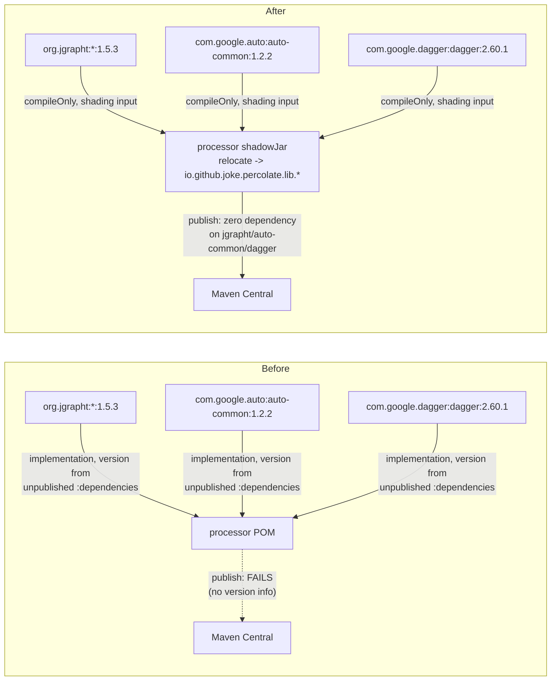

## Context

`processor` declares `implementation` dependencies on four internal-only libraries whose versions are managed only through the unpublished `:dependencies` platform: `org.jgrapht:jgrapht-core`, `org.jgrapht:jgrapht-io`, `com.google.auto:auto-common`, `com.google.dagger:dagger`. Because `:dependencies` must never be published (it also carries test/tooling-only constraints — Spock, Mockito, ArchUnit, CodeNarc — that have no place in a runtime POM), Gradle cannot emit an `import`-scope `dependencyManagement` entry for it, so these four dependencies publish with **no version**, and Maven Central's Central Portal validator rejects the POM.

The project already solved an adjacent problem — a third-party library baked into percolate's own artifact without leaking as an external dependency — for JavaPoet (`relocate-javapoet-as-spi-api`, archived 2026-07-12): `percolate-javapoet` shades and relocates `com.palantir.javapoet` to `io.github.joke.percolate.javapoet`, fully swallowing the upstream dependency. That design doc explicitly deferred "Dagger runtime and jgrapht-core/jheaps" as a follow-up, noting they're internal-only. This change is that follow-up, extended to `auto-common` (found during implementation to have the same shape — `PercolateProcessor extends com.google.auto.common.BasicAnnotationProcessor`, an internal-only public-superclass dependency) — and additionally normalizes the relocation package convention across both.

## Goals / Non-Goals

**Goals:**
- `processor`'s published POM/Gradle metadata declares zero dependency on `org.jgrapht:jgrapht-core`, `org.jgrapht:jgrapht-io`, `com.google.auto:auto-common`, or `com.google.dagger:dagger`.
- One project-wide relocation convention, `io.github.joke.percolate.lib.<lib>`, applies to every shaded third-party dependency — including retroactively aligning `percolate-javapoet`'s existing `io.github.joke.percolate.javapoet` to `io.github.joke.percolate.lib.javapoet`.
- One project-wide directory convention: every relocation module lives under `lib/`, matching the package convention. `percolate-javapoet` moves from the repo root to `lib/javapoet`.
- Same immunity benefit as the JavaPoet relocation: no foreign version of jgrapht/auto-common/dagger on a consumer's shared annotationProcessor classpath can collide with percolate's.
- `./gradlew check` (incl. `percolate-smoke`, ArchUnit guards, pitest) stays green through the change.

**Non-Goals:**
- Introducing a shared relocation module for jgrapht/auto-common/dagger the way `percolate-javapoet` is shared. These three libraries are consumed exclusively inside `:processor` (verified: no other module declares or imports them, and the types never cross the spi↔processor boundary), so a dedicated module would be pure overhead. Shading happens directly in `processor/build.gradle`.
- Relocating `dagger-compiler` or `com.google.auto.service` (`AutoService`/`AutoService.Processor`) — both are build-time-only annotation processors (`annotationProcessor` scope), excluded from the published POM entirely regardless of version, and not part of this problem.
- Any change to `PercolateProcessor`'s observable behavior, the generated code it emits, or the Dagger dependency graph it wires (`ProcessorModule`/`ProcessorComponent`) — this is a packaging-only change.

## Decisions

**D1 — Shade directly in `processor`, not a shared module.** `percolate-javapoet` exists as a separate module because a `CodeBlock`/`TypeName` value crosses the spi↔processor boundary and every strategy author compiles against it — one canonical relocated type is required. jgrapht/auto-common/dagger have no such cross-module surface: `MapperGraph`/`DotRenderer` (jgrapht), `PercolateProcessor` (auto-common), `ProcessorComponent`/`ProcessorModule` (dagger, package-private) are all `processor`-internal. *Alternative:* a shared `percolate-processor-internal-deps` module mirroring `percolate-javapoet`. Rejected — adds a module, a publish, and a project-dependency hop for zero cross-module benefit.

**D2 — One relocation convention: `io.github.joke.percolate.lib.<lib>`.** Establishing the convention now (rather than letting `percolate-javapoet` keep its own one-off `io.github.joke.percolate.javapoet`) means every shaded dependency is discoverable under one predictable prefix. *Alternative:* leave `percolate-javapoet` alone and only apply the convention to the new libraries. Rejected per explicit instruction — inconsistency between "the one existing shaded dep" and "everything shaded from now on" is worse than a one-time mechanical rename while the precedent is still fresh (no external strategy authors yet, per the original design doc's risk note). The relocation set, finalized during implementation, is **larger than originally scoped** — see D3:
  - `org.jgrapht` → `io.github.joke.percolate.lib.jgrapht`
  - `org.jheaps` → `io.github.joke.percolate.lib.jheaps` (jgrapht-core's own algorithm dependency — not optional, its matching/shortest-path code calls into it directly)
  - `org.apfloat` → `io.github.joke.percolate.lib.apfloat` (jgrapht-core's own dependency for some scoring/centrality algorithms)
  - `com.google.auto.common` → `io.github.joke.percolate.lib.autocommon` (kept distinct from `com.google.auto.service`, a different, unrelocated, build-time-only dependency — the prefix match is exact-package)
  - `com.google.common` → `io.github.joke.percolate.lib.guava` (Guava — `BasicAnnotationProcessor`, which `PercolateProcessor` extends, embeds Guava types directly in its own fields/methods, confirmed via `javap`; not optional)
  - `dagger` → `io.github.joke.percolate.lib.dagger` (the library's actual top-level Java package — **not** `com.google.dagger`, which is only its Maven groupId; relocating the wrong string was a real bug caught during implementation, see Risks)
  - `com.palantir.javapoet` → `io.github.joke.percolate.lib.javapoet` (renamed from `io.github.joke.percolate.javapoet`)
  - **Not relocated, dropped entirely:** `org.jgrapht:jgrapht-io` (see D3a) and small compile-time-only annotation jars pulled in by Guava/auto-common (`jsr305`, `checker-qual`, `error_prone_annotations`, `j2objc-annotations`, the empty `listenablefuture` placeholder) — excluded from the `shaded` configuration's resolution entirely; none are resolved at ordinary runtime classloading, and `jsr305`'s package is `javax.annotation`, which must **never** be relocated (it would also rewrite `javax.annotation.processing.*` from the JDK).
  - **Not relocated, kept as ordinary dependencies:** `jakarta.inject:jakarta.inject-api`, `javax.inject:javax.inject` — `dagger.internal.Provider` directly `implements` both JSR-330 `Provider` interfaces (confirmed via `javap`), so they're needed, unrelocated, at runtime; but as a tiny, effectively-frozen spec API there's no meaningful version-collision risk to shade against. Declared with explicit literal versions (not sourced from `:dependencies`) so they publish correctly versioned.

**D3 — Scope grew beyond the four original direct dependencies to their own internal-only runtime dependencies.** Naively shading only `org.jgrapht`/`com.google.auto.common`/`dagger` (leaving their transitive runtime dependencies — jheaps, apfloat, Guava — unrelocated) would bundle those transitives into the jar *unrelocated and undeclared*: present (bloating the jar), not immune to a foreign version on the classpath, and invisible in the POM. `org.jgrapht:jgrapht-io` was handled differently: its only use, `DotRenderer`'s debug-only DOT export (gated behind `-Apercolate.debugGraphs`, confirmed via `GraphDumpWriter.skipDump`), was replaced with a small hand-written DOT serializer (`DotRenderer` already built its own attribute maps and vertex-ID quoting; jgrapht-io's `DOTExporter` only assembled the final text), eliminating jgrapht-io and its own `antlr4-runtime`/`commons-text`/`commons-lang3` dependencies entirely rather than shading them.

**D3a — Dagger's generated sources relocate along with everything else; no special-casing needed.** `dagger-compiler` (annotationProcessor-scope, build-time-only) generates `DaggerProcessorComponent` etc. as **source** during `processor`'s own `compileJava`, importing unrelocated `dagger.*` by source text. Those generated sources compile into ordinary `.class` files that become part of `processor`'s `main` sourceSet output — indistinguishable, at the `shadowJar` merge step, from any other class in `processor`. Shadow's relocator rewrites bytecode constant-pool references (not source), uniformly, across every class file it merges. Since `DaggerProcessorComponent`/`ProcessorComponent`/`ProcessorModule` are all `processor`-internal, the entire generated-code ↔ runtime-support reference graph is self-contained inside the shaded jar and comes out consistently renamed. *This is not the D6 rejected trick from `relocate-javapoet-as-spi-api`* — that one tried to inject new *behavior* into JavaPoet's emit via package tricks post-compile; this is ordinary whole-jar shading of an unmodified dependency, Shadow's primary use case. **A source-level "no production import of the unrelocated package" ArchUnit rule (as used for JavaPoet) does not apply here** — unlike JavaPoet (where downstream consumers only ever see the already-relocated type), `processor`'s own source is the shading *input* and necessarily imports the raw upstream types directly; relocation is a post-compile bytecode rewrite, not a source-level restriction. Verified empirically instead: after shading, `processor`'s jar shows zero classes under `org/jgrapht/`, `org/jheaps/`, `org/apfloat/`, `com/google/auto/common/`, `com/google/common/`, or `dagger/`, and `DaggerProcessorComponent.class` resolves its field types to the relocated `io.github.joke.percolate.lib.dagger.*` packages.

**D4 — A dedicated `shaded` configuration, not `compileOnly`/`compileClasspath`, for the shadowJar merge set.** Unlike `percolate-javapoet` (a leaf module whose entire `compileClasspath` is exactly its one shading input), `processor`'s `compileClasspath` also carries `spi`/`annotations` (and, transitively, `lib:javapoet`) plus unrelated `compileOnly` deps (lombok, jspecify, auto-service-annotations) — none of which may be bundled into the shaded jar. `jgrapht-core`/`auto-common`/`dagger` are declared **twice**: once via plain `compileOnly` (so `processor`'s own compilation, including Dagger-generated sources, sees them — versions resolved from `compileOnly platform(project(':dependencies'))`), and once via the standalone `shaded` configuration (`shaded platform(project(':dependencies')); shaded 'org.jgrapht:jgrapht-core'; ...`), which `shadowJar`'s `configurations.set([project.configurations.shaded])` merges — exactly this set (plus each library's own transitive runtime deps) and nothing else from `processor`'s wider dependency graph. The `shaded` configuration also excludes `jakarta.inject`/`javax.inject` and the small compile-time-only annotation jars (D2) from its own resolution, so shadowJar's merge set is precise.

**D5 — Publish the shaded jar via the same `apiElements`/`runtimeElements` override as `percolate-javapoet`, plus disabling Shadow's own `shadowRuntimeElements`/`shadowApiElements` variants.** `processor`'s existing `withJavadocJar()`/`withSourcesJar()`/`from components.java` publication stays; only `apiElements`/`runtimeElements`'s outgoing artifacts are swapped to `shadowJar`'s output. **Critical, non-obvious finding from implementation:** merely applying `com.gradleup.shadow` — regardless of `addShadowVariantIntoJavaComponent`'s value, and even with zero other Shadow configuration — makes Gradle's variant matching prefer Shadow's own `shadowRuntimeElements`/`shadowApiElements` configurations (attribute `org.gradle.dependency.bundling = shadowed`) over the real, correctly-wired `runtimeElements`/`apiElements` (`= external`) for **ordinary in-build project-to-project dependencies** (e.g. `reactor`'s `testImplementation project(':processor')`). Since Shadow's own shadow variants declare **zero** dependencies (everything is assumed bundled), every in-build consumer of `project(':processor')` silently lost `jakarta.inject`/`javax.inject`/`annotations`/`spi` transitively — surfacing as `NoClassDefFoundError: dagger/internal/Preconditions` deep in `reactor`'s/`reactor-blocking`'s integration tests, since these run `PercolateProcessor` **in-process** (`com.google.testing.compile.Compiler.javac().withProcessors(new PercolateProcessor())`), so whatever's missing from the consuming module's own classpath breaks immediately. Fixed by explicitly setting `configurations.shadowRuntimeElements.canBeConsumed = false` and `shadowApiElements.canBeConsumed = false`, removing the ambiguous candidate entirely so Gradle's variant matching has only the one, correctly-wired pair left. (`addShadowVariantIntoJavaComponent = false` alone, which only controls what's exported in *published* Gradle Module Metadata for external consumers, did not fix this — the two settings govern different consumers.)

**D6 — Move `percolate-javapoet` to `lib/javapoet`; let the artifactId follow the new project name, not be pinned.** `settings.gradle` changes `include 'percolate-javapoet'` to `include 'lib:javapoet'`, so the Gradle project path becomes `:lib:javapoet` and its (default) project name becomes `javapoet` — the directory structure now mirrors the `io.github.joke.percolate.lib.*` package convention exactly, and `lib/` is the designated home for any future relocation module. The published artifactId, which defaults to the project name, therefore changes from `percolate-javapoet` to `javapoet` (coordinate `io.github.joke.percolate:javapoet`). *Alternative considered:* override the artifactId (`base.archivesName` + `publishing.publications.maven.artifactId`) to keep publishing as `percolate-javapoet` despite the move, avoiding orphaning the old Central coordinate. Explicitly rejected — the artifact name SHALL match the directory/module structure; consistency between what's on disk and what's published outweighs preserving the old coordinate, and no external consumers exist yet to be broken by it.

**D7 — No jar-inspection "swallow" test added, matching established precedent.** `decentralize-architecture-boundary-checks` (archived 2026-07-15) deleted the equivalent JavaPoet jar-inspection swallow-check outright, accepting the risk rather than maintaining an extra guard for a narrow-blast-radius invariant. The same call is made here: the swallow/relocation invariant is verified manually during implementation (jar contents, generated POM) and via `percolate-smoke`'s real annotation-processing run, but no permanent automated jar-inspection test is added.

## Risks / Trade-offs

- **[Risk] Relocating the wrong string for Dagger** (`com.google.dagger`, its Maven groupId, instead of `dagger`, its actual top-level Java package) **silently leaves the entire dependency unrelocated** → Happened during implementation: the relocate rule matched zero classes, so `dagger`'s classes sat in the shaded jar completely unrelocated, and an earlier "unrelocated leftovers" check (which grepped for the wrong prefix too) falsely reported success. Caught only by explicitly listing the jar's top-level packages. Mitigation going forward: verify a relocation's *target* Java package (not the Maven groupId) directly from the dependency's own jar contents before writing the `relocate` rule, for any future shaded library.
- **[Risk] Partial relocation leaves a mixed `io.github.joke.percolate.javapoet` / `io.github.joke.percolate.lib.javapoet` codebase mid-cutover** (50+ production files, 99+ incl. tests, import the old package) → Mitigation: atomic cutover in one commit, mechanical rewrite + Spotless, same precedent as D5 in `relocate-javapoet-as-spi-api`; `./gradlew check` gate; updated `JavaPoetRelocationSpec`'s and `ModuleBoundariesSpec`'s expected package alongside the rename.
- **[Risk] Naive transitive-dependency handling either bundles-but-doesn't-relocate (worst case) or breaks in-build consumers (Shadow's own shadow variants)** → Both occurred during implementation and are now fixed: see D2/D3 (full relocation of jheaps/apfloat/Guava) and D5 (`canBeConsumed = false` on Shadow's own variants).
- **[Risk] PMD flagged the hand-written `DotRenderer` DOT serializer** (`ConsecutiveLiteralAppends` and `InefficientStringBuffering` on `StringBuilder.append(...)` calls mixing literals and computed values) → Fixed by building each full line as a plain `String` via `+` concatenation in a local variable first, then a single `.append(variable)` call — PMD's rule inspects the syntax of the `append(...)` argument itself, not the value's provenance.
- **[Risk] `auto-common`/Guava relocation breaks `PercolateProcessor extends BasicAnnotationProcessor`'s `ServiceLoader` discovery** (a `META-INF/services/javax.annotation.processing.Processor` entry naming `PercolateProcessor` must still load correctly with a relocated superclass hierarchy) → Mitigation: this is exactly the self-contained-hierarchy case from D3a — the superclass class file is relocated together with the subclass in the same jar; `percolate-smoke`'s `smokeRun` exercises this concretely (a real `javac -processorpath` run) and passed.
- **[Risk] ArchUnit's `ModuleBoundariesSpec` (a pre-existing, cross-module rule confining `javax.lang.model.util` usage) started flagging the newly-relocated `io.github.joke.percolate.lib.autocommon.*` visitor classes** (which legitimately extend `javax.lang.model.util.SimpleAnnotationValueVisitor8` etc.) → Fixed by broadening its existing JavaPoet-only exclusion filter (`/io/github/joke/percolate/lib/javapoet/`) to the whole `/io/github/joke/percolate/lib/` prefix, covering every shaded library uniformly.
- **[Trade-off] Renaming an already-shipped, archived capability's public package (`javapoet-relocation`) is unusual for OpenSpec (deltas normally apply to unreleased behavior)** → Accepted per explicit direction; no external strategy authors exist yet, so there is no real consumer migration cost, only an in-repo mechanical one.
- **[Trade-off] `io.github.joke.percolate:percolate-javapoet` (published from the earlier `relocate-javapoet-as-spi-api` release) is orphaned on Maven Central** — future releases publish `io.github.joke.percolate:javapoet` instead → Accepted per D6; no functional risk (old versions remain resolvable, just unmaintained).

## Migration Plan

1. Move `percolate-javapoet` to `lib/javapoet` (`settings.gradle`: `include 'lib:javapoet'`; update `project(':percolate-javapoet')` references in `spi/build.gradle` and `bom/build.gradle` to `project(':lib:javapoet')`); rename its relocation target to `io.github.joke.percolate.lib.javapoet`; mechanical import rewrite across `spi`, `processor`, `strategies-builtin`, `reactor`, `reactor-blocking` (production and test sources); update `JavaPoetRelocationSpec`'s and `ModuleBoundariesSpec`'s exclusion paths.
2. In `processor/build.gradle`: add `com.gradleup.shadow`; add the standalone `shaded` configuration (D4); move `jgrapht-core`/`auto-common`/`dagger` to `compileOnly` + `shaded`; drop `jgrapht-io` entirely, replacing `DotRenderer`'s `DOTExporter` usage with a hand-written serializer; add explicit-versioned `jakarta.inject-api`/`javax.inject` dependencies; add the `shadowJar` task with the full relocation set (D2); override `apiElements`/`runtimeElements` outgoing artifacts and set `shadowRuntimeElements`/`shadowApiElements` non-consumable (D5); move the `:dependencies` platform import off `implementation` onto `compileOnly` so it no longer leaks into the published POM at all.
3. Add `testImplementation` entries wherever real (unrelocated) jgrapht/auto-common/dagger behavior is exercised at test runtime (`processor`'s own tests that build a real Dagger component; `jgrapht-core` for `BipartiteGraphSpec`).
4. Verify: `./gradlew check` green (including `reactor`/`reactor-blocking` integration tests, which run `PercolateProcessor` in-process and were the ones that caught D5's variant-selection bug); inspect `processor`'s generated POM shows zero shaded-coordinate dependencies and every remaining dependency versioned; `percolate-smoke`'s `smokeRun` passes.
5. Rollback: revert the change. No data/runtime migration — generated mapper output is unchanged, this is packaging-only.

## Open Questions

None blocking.
