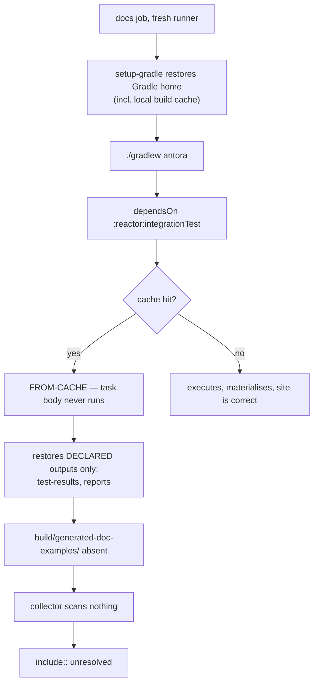

## Context

The `docs` job deploys a broken site without failing. Investigation found two independent defects that
compound, plus an unworkable feature introduced hours earlier.

**Defect 1 — undeclared task outputs.** Three doc-e2e specs write generated sources into
`build/generated-doc-examples/` from inside a `then:` block:

```groovy
private static void materialise(final String relativePath, final String content) {
    def file = new File("build/generated-doc-examples/${relativePath}")
    file.parentFile.mkdirs()
    file.text = content
}
```

Gradle has no knowledge of this directory. `Test` is `@CacheableTask` and `org.gradle.caching=true`, so on a
fresh runner the task is satisfied from cache and never executes:



The `dependsOn` edges in the root `build.gradle` are correct. A satisfied dependency simply does not imply
an executed task — and the contract that would have made it imply that (declared outputs) was never stated.

**Defect 2 — Antora's failure tolerance.** `@antora/playbook-builder` schema:

```js
failure_level: { format: ['warn','error','fatal','none'], default: 'fatal', arg: 'log-failure-level' }
```

The default is `fatal`, so ERROR-level asciidoctor messages are logged and the process still exits `0`.
`user-manual` already requires the opposite ("SHALL fail rather than emit a silently incomplete site"), so
this is an unimplemented requirement, not new scope. It is also why defect 1 reached production.

**Withdrawn feature.** Commit `0e0079c7` added tag-sourced versions. `@antora/collector-extension`
(`lib/index.js:37-58,130-134`) creates a fresh worktree per non-`HEAD` ref and scans *that*, so a tag
origin sees no `build/` directories; with only `scan:` entries and no `run:` commands, every tagged version
would silently lose all generated `include::`s. Notably `lib/index.js:38` skips any origin whose descriptor
carries no `ext.collector` — the hook that a source-preserving design would have used, considered and
rejected below.

## Goals / Non-Goals

**Goals:**

- A clean-runner docs build either produces a complete site or fails loudly.
- Generated example output survives a build-cache hit.
- Install snippets advertise the latest released version without a manual bump step.
- Reduce the documentation build to one honest version.

**Non-Goals:**

- Multi-version documentation, in any form (tag-sourced, docs-branch, or committed HTML). Withdrawn.
- Committing generated sources to git. Explicitly rejected by the maintainer.
- Replacing `@antora/collector-extension` with a staged `Sync` task. Attractive (it would make the
  materialisation a first-class, cache-correct Gradle artifact and retire a second mechanism), but a larger
  restructuring than this fix warrants. Recorded here as a possible successor.
- Changing how the doc-e2e specs compile or assert. Only their outputs become visible to Gradle.
- Anything touching `project.version` or `release-versioning`.

> **Architecture note — explicit warning.** Withdrawing versioning contradicts the current
> `user-manual` spec, whose Purpose describes a "hosted, **versioned** Antora user manual" that "derives
> its versions natively from this repository's git refs". This change removes that requirement rather than
> working around it. The narrowing is deliberate and the spec delta states it directly.

## Decisions

### D1 — Declare `generated-doc-examples` as an `integrationTest` output, per owning module

```groovy
tasks.named('integrationTest') {
    outputs.dir(layout.buildDirectory.dir('generated-doc-examples'))
}
```

in `reactor`, `processor` and `reactor-blocking` only.

*Why:* it states the contract that was missing. A cache hit now restores the files; a cache miss re-runs
the specs. It also lets Gradle clean stale entries — the `features-as-documentation` change previously hit
a real "stale `generated-doc-examples` collision" bug that this closes as a side effect.

*Why per-module, not in the convention plugin:* only 3 of the modules materialise doc examples. Declaring a
never-written output on every module's `integrationTest` would be noise, and the declaration belongs next
to the spec that owns it — consistent with the co-location design (D3/D4 of `features-as-documentation`).

*Alternatives considered:* `outputs.upToDateWhen { false }` (correct but discards caching for the whole
test task, and hides rather than states the contract); parameterising the output directory via a system
property instead of the relative `new File("build/…")` (more robust against a changed working directory,
but the working directory is Gradle's default project dir and is not in question here — deferred).

### D2 — Fail the build via the playbook, at `warn`

```yaml
runtime:
  log:
    failure_level: warn
```

*Why the playbook rather than the Gradle plugin's `options`:* the playbook describes the site, so the
guarantee holds for any invocation rather than only the Gradle-mediated one. The plugin route
(`'log-failure-level': 'warn'` in the `options` map) would work identically but scopes the guarantee to one
caller.

*Why `warn` and not `error`:* the existing requirement covers unresolved `include::` (logged at ERROR),
broken `xref:` and missing nav targets (logged at WARN). Only `warn` satisfies all three. The manual
currently builds with zero warnings, so the stricter level is achievable today.

### D3 — Derive `percolate-version`, single-sourced in Gradle

```groovy
def latestRelease = providers.exec {
    workingDir = rootDir
    commandLine 'git', 'describe', '--tags', '--abbrev=0'
    ignoreExitValue = true
}.standardOutput.asText.map { it.trim().replaceFirst(/^v/, '') }.getOrElse('0.0.0-SNAPSHOT')

antora {
    options = [clean: true, fetch: true, attributes: ['percolate-version': latestRelease]]
}
```

`AntoraExtension.setOptions(Map)` converts a map under the `attributes` key into `--attribute name=value`
pairs. The `providers.exec` shape mirrors the configuration-cache-safe derivation already proven in
`percolate.conventions.gradle:7-19`.

`--abbrev=0` yields the *latest reachable tag*, which is the latest **released** version — the right value
for an install snippet. This deliberately differs from `project.version`, which on `main` is a
`-SNAPSHOT` past that tag and must never appear in a "add this dependency" block.

**The hardcoded attribute is removed from `docs/antora.yml` rather than left as a fallback.** That makes
Gradle the single source and dissolves the attribute-precedence question entirely — no need to rely on
playbook attributes hard-beating component-descriptor attributes. It is consistent with the existing
requirement that the toolchain *is* a Gradle-provisioned Antora build; a bare `npx antora` is not a
supported path.

*Note:* `setOptions(Map)` converts eagerly, so the value is resolved at configuration time — the same
timing the conventions plugin already uses, and safe because `providers.exec` is `ValueSource`-backed.

### D4 — Remove versioning rather than fix it

`tags:` and the `!v1.0.0` / `!v1.0.1` exclusions leave `antora-playbook.yml`; `docs/antora.yml` returns to
an unversioned component.

*Alternatives considered and rejected:*

| Option | Cost per docs build | Rejected because |
|---|---|---|
| `run:` build per tag origin | O(tags) full Gradle builds | ~470 tags over 3 years; unbounded growth |
| Commit generated examples to git | O(1) | maintainer rejected committing generated sources |
| Bake Antora-ready source onto `docs/vX.Y` branches | O(1) | same objection: generated content in git |
| Preserve built HTML per version | O(1) build, O(N) stitching | version picker is aggregate-built, so old sites list only themselves; frozen UI drifts; `deploy-pages` replaces the whole artifact |

Withdrawal is free: zero tags are aggregated today, and the live site is already unversioned, so no URL
moves. Keeping versioning is what would have relocated every page to `/percolate/main/`.

### D5 — Align `setup-gradle` to `v6`

Version alignment across all three usages. This changes the docs job's cache key, so the next run is a
genuine cache miss — which will transiently *hide* defect 1. Verification must therefore not rely on
observing CI green once.

## Risks / Trade-offs

- **`failure_level: warn` turns an unrelated upstream warning into a red build** (e.g. from a refreshed UI
  bundle, since the playbook uses `snapshot: true`) → the manual builds warning-free today, and a warning
  that would break the site is exactly what we want surfaced; downgrade to `error` if upstream noise proves
  unmanageable.
- **A tagless or shallow clone renders `0.0.0-SNAPSHOT` into install snippets** → the deploying workflow
  pins `fetch-depth: 0`, so CI always resolves a real tag; the fallback is deliberately shaped to be
  visibly not a release rather than plausibly wrong.
- **Declared outputs change `integrationTest` cache keys**, so the first build after this lands re-runs
  those tasks → one-time cost, no correctness impact.
- **Losing versioned docs means a user on an older release reads current docs** → accepted trade-off;
  mitigated by install snippets naming the latest release and by documenting behaviour changes in the
  changelog.
- **Verification is easy to fake.** A cache miss makes the bug invisible → the plan below reproduces the
  failure deliberately before fixing it.

## Migration Plan

1. Land D2 (`failure_level: warn`) **first**, with no other change, and confirm `./gradlew antora`
   reproduces the failure on a cache hit. This converts a silent bug into a red build and proves the
   reproducer works.
2. Land D1, then confirm the same sequence passes:
   ```
   ./gradlew integrationTest --build-cache
   rm -rf reactor/build processor/build reactor-blocking/build
   ./gradlew antora --build-cache          # tasks FROM-CACHE, site must still be complete
   ```
3. Land D4, then D3, rebuilding the site after each.
4. Confirm configuration cache stays clean (`--configuration-cache`) after D3 adds a `providers.exec`.

Rollback: every item is independently revertable; D4 is itself a revert of `0e0079c7`.

## Open Questions

- ~~Does a playbook/CLI attribute hard-beat a component-descriptor value?~~ Dissolved by D3 — the
  descriptor value is removed, so no precedence conflict exists.
- Is `warn` sustainable given `ui.bundle.snapshot: true` pulls a moving UI bundle? To be observed over the
  first few builds; `error` is the fallback position.
