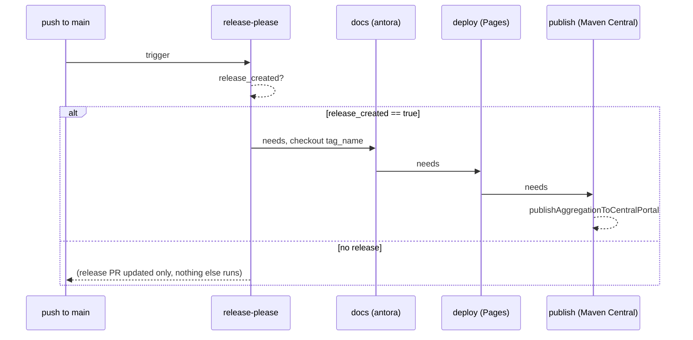

## Context

`build.yml` runs `check` on every PR and push to `main`, then unconditionally chains `docs` (Antora
build) → `deploy` (GitHub Pages) on any non-PR event. `release.yml` runs `release-please` on every
push to `main` and only runs `publish` (Maven Central) when `release-please` reports
`release_created`, checking out the exact release tag (`needs.release-please.outputs.tag_name`)
rather than trusting `main` at pipeline time.

The docs site is single-version and unversioned (see `user-manual` spec, "The site is single-version
and unversioned") and its install snippets already derive the "latest release tag" from full git
history at build time — so the docs build itself is release-tag-aware even though its *trigger*
today is "every push to main," not "a release happened."

## Goals / Non-Goals

**Goals:**
- Docs deploy only fires when `release-please` actually cuts a release, checked out at that release
  tag — never on an ordinary merge to `main`.
- Docs deploy runs and succeeds before the Maven Central publish attempts, within the same release
  workflow run, so the reversible step gates the irreversible one.
- `build.yml` no longer builds or deploys docs at all (confirmed: no docs-smoke-test-only job wanted).

**Non-Goals:**
- No change to how "latest release tag" is derived inside the Antora build/install snippets — that
  logic (and the existing tag-exclusion behavior for v1.0.0/v1.0.1) is untouched.
- No change to `check`'s scope or the PR pipeline.
- No versioned/multi-version docs site — still single-version, unversioned, per existing spec.

## Decisions

### Move `docs`+`deploy` into `release.yml`, not a new workflow

Considered: keeping `docs`/`deploy` in `build.yml` but adding a tag-ref condition. Rejected —
`build.yml` only triggers on `push: branches: [main]` and `pull_request`, never on tag pushes, so a
tag-based condition would simply never be true; the jobs would go dead. `release.yml` already has
the exact signal needed (`release-please`'s `release_created` + `tag_name` outputs) computed from the
same `push: branches: [main]` trigger, so moving the jobs there reuses an existing, correct gate
rather than inventing a second trigger path.

### Order `publish` after `deploy`, not just after `release-please`

Both `docs`/`deploy` and `publish` are gated on `release_created`, but a shared `if` condition alone
does not impose ordering — GitHub Actions runs jobs with satisfied `needs` as soon as those needs
succeed, in parallel where possible. Making `publish` depend on `deploy` (`needs: [release-please,
deploy]`) forces sequential execution: if the docs build or Pages deploy fails, `publish` never runs.
This directly encodes the proposal's reversibility argument — docs is revertible (redeploy the old
site or just fix and re-tag), Maven Central publish is not (no delete/republish of a coordinate).

### Both new jobs checkout the release tag, not `main`

`publish` already does this (`ref: ${{ needs.release-please.outputs.tag_name }}`) specifically so
that what's published matches the tagged commit even if `main` has moved on by the time the job runs.
`docs`/`deploy` need the identical guarantee — the published manual's install snippets must reflect
the released version, and the antora build's own tag-history requirement (`fetch-depth: 0`) still
applies unchanged.

## Risks / Trade-offs

- **Docs freshness lag** → Between releases, the live docs site reflects the last release, not `main`
  HEAD. This is the intended behavior change (the whole point of the proposal), not an accident, but
  worth being explicit: doc fixes on `main` no longer appear live until the next release cuts.
- **Slightly longer release pipeline** → `publish` now waits on a full Antora build + Pages deploy
  before running, adding wall-clock time to the release critical path. Accepted: correctness/safety
  ordering outweighs a few extra minutes on an infrequent (release-triggered) pipeline.
- **Permissions duplication** → `pages: write` / `id-token: write` need to be added at the `deploy`
  job level in `release.yml` (job-level permissions override the workflow-level `contents: write,
  pull-requests: write` block already there). Mitigation: this is the same job-level-permissions
  pattern `build.yml`'s `deploy` job already used; only the file it lives in changes.

## Migration Plan

1. Add `docs` and `deploy` jobs to `release.yml`, gated on `release_created`, checking out `tag_name`,
   carrying over the `environment: github-pages` / `concurrency: group: pages` config verbatim from
   `build.yml`.
2. Update `publish`'s `needs` to `[release-please, deploy]`.
3. Remove `docs` and `deploy` jobs from `build.yml`.
4. Update the `user-manual` spec's deploy-trigger requirement and the `maven-central-publishing`
   spec's publish-gating requirement to reflect the new trigger/ordering.

No rollback complexity beyond a standard revert: the previous `build.yml`/`release.yml` split is a
plain file diff, not a data migration.

## Open Questions

None — decisions above resolve the ordering, trigger, and scope questions raised during exploration.
