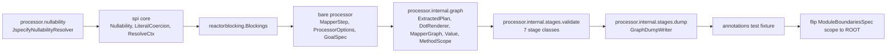

## Context

`architecture-tests/.../ModuleBoundariesSpec.groovy` already enforces "no `private` methods" (design D6 of `decompose-engine-stages`), but only against `DECOMPOSED_ENGINE_PACKAGES` (`processor.internal.stages.expand..`, `processor.internal.stages.generate..`, `spi.builtins..`). That scope grew once per prior change as each package was decomposed clean. A repo scan for this change found `private` methods still declared outside that scope in `processor.internal.graph`, `processor.internal.stages.validate.*` (7 classes), `processor.internal.stages.dump.GraphDumpWriter`, bare `processor` (`MapperStep`, `ProcessorOptions`, `model.GoalSpec`), `processor.nullability.JspecifyNullabilityResolver`, `spi` (`Nullability`, `LiteralCoercion`, `ResolveCtx`), `reactorblocking.Blockings`, and an `annotations` test fixture — all untestable via `invokespecial` dispatch for the same reason the covered packages were decomposed.

Separately, `@VisibleForTesting` (`org.jetbrains.annotations`) is already the repo's convention for marking a method whose visibility was widened only so a test can reach it (see `Container`, `Accessor`, `DotRenderer` — today applied to package-private statics). `protected` has no equivalent marker: a `protected` method could be a genuine inheritance extension point (e.g. `Container`'s template methods, overridden by `ArrayContainer`/`CollectionContainer`/`SetContainer`/etc.) or it could be `protected` purely so a test subclass can reach it, with no real subclass ever calling or overriding it. Nothing today distinguishes the two.

## Goals / Non-Goals

**Goals:**
- Widen the existing no-`private`-methods ArchUnit rule to every Java package in the repo (still excluding the shaded `lib.*` third-party sources and the synthetic/bridge/private-constructor exemptions already in place).
- Decompose the ~20 currently-flagged classes so the widened rule passes with zero exceptions.
- Add a new ArchUnit rule: a `protected` method with no subclass override and no subclass-originated call must carry `@VisibleForTesting`, so "real extension point" vs. "protected only to dodge the private ban" is a build-checked distinction, not tribal knowledge.
- Audit and annotate the existing `protected` methods this new rule flags.

**Non-Goals:**
- Widening `MAX_METHODS_PER_CLASS` (the co-enforced size ceiling from `decompose-engine-stages`) beyond its current scope (`processor.internal.stages.expand..`, `processor.internal.stages.generate..`, `spi.builtins..`). Without a size ceiling, a class can satisfy the no-`private` rule by exposing everything as package-private rather than decomposing — that loophole is accepted as a known follow-up, not solved here (see Risks below).
- Changing any generated-mapper behavior, runtime semantics, or public API. This is a visibility/testability refactor only.
- Retroactively re-litigating whether existing `protected` extension points (e.g. `Container`'s template methods) should exist — only their *marking* is in scope.

## Decisions

### D1 — Widen scope via the existing constant, not a parallel rule

`ModuleBoundariesSpec`'s no-`private` rule currently filters on `DECOMPOSED_ENGINE_PACKAGES`. Rather than adding a second "everywhere else" rule, the array is replaced with the repo `ROOT` package (`io.github.joke.percolate`), keeping the single rule definition and its existing `notSyntheticOrBridge` exemption. The `lib.*` shaded-dependency exclusion already applied at import time (`notShadedLib` in `setupSpec()`) continues to apply, so third-party javapoet/jgrapht/etc. sources under `lib.*` are never in scope.

**Alternative considered**: keep the package-list pattern and enumerate every remaining package explicitly. Rejected — the whole point of this change is "everywhere," and an enumerated list would need editing again the next time a package is added, silently under-enforcing until someone remembers.

### D2 — Decompose before flipping the scope, one bucket at a time

The rule is only flipped to repo-wide once every currently-flagged class has been decomposed; tasks.md orders the buckets from most isolated to most collaborator-heavy:



Each bucket keeps `./gradlew check` green before the next starts — matching the incremental style of `decompose-engine-stages`/`cutover-strategies-to-mock-seam`. `private` methods become package-private (the same "testable seam" pattern used throughout the decomposed engine), not `public`, unless a class already needs a wider surface.

### D3 — Detecting "protected, unused by any subclass"

The new rule needs, per `protected` method `M` declared on class `C`:

```mermaid
flowchart TD
    M["protected method M on class C"] --> Q1{Any subclass of C<br/>declares an override of M?}
    Q1 -- yes --> OK[Genuine extension point<br/>rule passes]
    Q1 -- no --> Q2{Any subclass of C<br/>contains a call<br/>targeting M?}
    Q2 -- yes --> OK
    Q2 -- no --> Q3{M is abstract?}
    Q3 -- yes --> EXEMPT[Exempt — abstract methods<br/>have no body to test directly]
    Q3 -- no --> Q4{Annotated<br/>@VisibleForTesting?}
    Q4 -- yes --> OK
    Q4 -- no --> FAIL[Rule violated]
```

Both "override" and "subclass calls it" count as real usage — a subclass invoking an inherited protected helper without overriding it is still exercising it as an extension seam, not just a test artifact. Both checks run against `JavaClass.getAllSubclasses()` (ArchUnit's transitive subclass set) intersected with each subclass's own declared methods (`JavaClass.getMethods()` only returns members declared directly on that class, so a match there is a real override, not an inherited-and-ignored member) and `JavaMethod.getCallsOfSelf()` filtered by the caller's owner being a subclass.

**Test-only subclassing does not count as usage.** The import that backs this rule uses `ImportOption.Predefined.DO_NOT_INCLUDE_TESTS` (already the pattern in `ModuleBoundariesSpec.setupSpec()`), so a Spock spec that subclasses a production class purely to reach a `protected` seam is invisible to this check — exactly the case the rule exists to catch, since that method needs `@VisibleForTesting`, not a pass by accident of test-side inheritance.

**Alternative considered**: treat "has at least one subclass at all" as sufficient, without checking whether that subclass touches `M` specifically. Rejected — a subclass overriding *other* methods but not `M` would falsely exempt `M`.

### D4 — Abstract methods are exempt

An abstract `protected` method has no body — there's nothing to unit-test directly, and by construction every concrete subclass must override it, so it can never fail the "no subclass overrides it" check for classes with any concrete descendant. It's excluded up front rather than relying on that being always true (a `protected abstract` method on a class with zero concrete subclasses yet, mid-refactor, would otherwise be a false positive).

### D5 — Both rules live in `ModuleBoundariesSpec`

Same rationale as the existing co-location note in that file: this suite is the one place that already imports every module's classes together, and the new protected-method rule needs cross-module subclass visibility (a `spi` base class's subclasses live in `strategies-builtin`/`reactor`), same as the no-`private` rule needing repo-wide reach.

## Risks / Trade-offs

- **[Risk] Widening no-`private` without widening the size ceiling reopens the "expose everything as package-private" loophole outside the already-decomposed packages** → Accepted as a Non-Goal for this change; flagged as a follow-up candidate once the newly-decomposed classes stabilize and a sensible per-package ceiling can be tuned (mirroring how `MAX_METHODS_PER_CLASS` was tuned against real decomposed classes, not guessed upfront).
- **[Risk] False positives on `protected` methods designed as forward-looking extension points with no subclass yet** → Mitigated by the rule's own escape hatch: annotate with `@VisibleForTesting` (documenting "not yet a real extension point") or reconsider whether `protected` is warranted before any subclass exists at all.
- **[Risk] ArchUnit's call-graph resolution can miss overrides through generic bridge methods** → The existing `notSyntheticOrBridge` exemption already strips compiler-generated bridges from the no-`private` rule; the same predicate is reused for the protected-method rule's override detection so bridge noise doesn't cause false negatives (silently treating a bridge as "not an override").
- **[Risk] Large one-shot blast radius (~20 classes + ~19 files of protected-method audit) increases the chance of an incomplete decomposition slipping through review** → Mitigated by D2's bucketed, greenat-each-step migration order in tasks.md, matching prior changes' incremental discipline.

## Migration Plan

1. Decompose each bucket in D2's order; keep `./gradlew check` green after each.
2. Flip `DECOMPOSED_ENGINE_PACKAGES` reference to `ROOT` in the no-`private` rule once all buckets are clean.
3. Add the protected-method rule (D3/D4) to `ModuleBoundariesSpec`, initially expected to fail against existing `protected` methods.
4. Audit each flagged `protected` method: annotate `@VisibleForTesting` where no real subclass usage exists, leave unannotated where a genuine override/call already exists.
5. No rollback complexity — this is test/architecture-suite-only; a revert is a plain `git revert` with no runtime migration to undo.

## Open Questions

- Should the size-ceiling co-enforcement widen in a dedicated follow-up change once this one ships, or is package-private exposure without a ceiling an acceptable steady state for the newly-decomposed packages? (Leaning: follow-up change, not blocking this one.)
