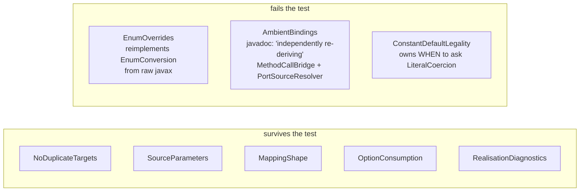
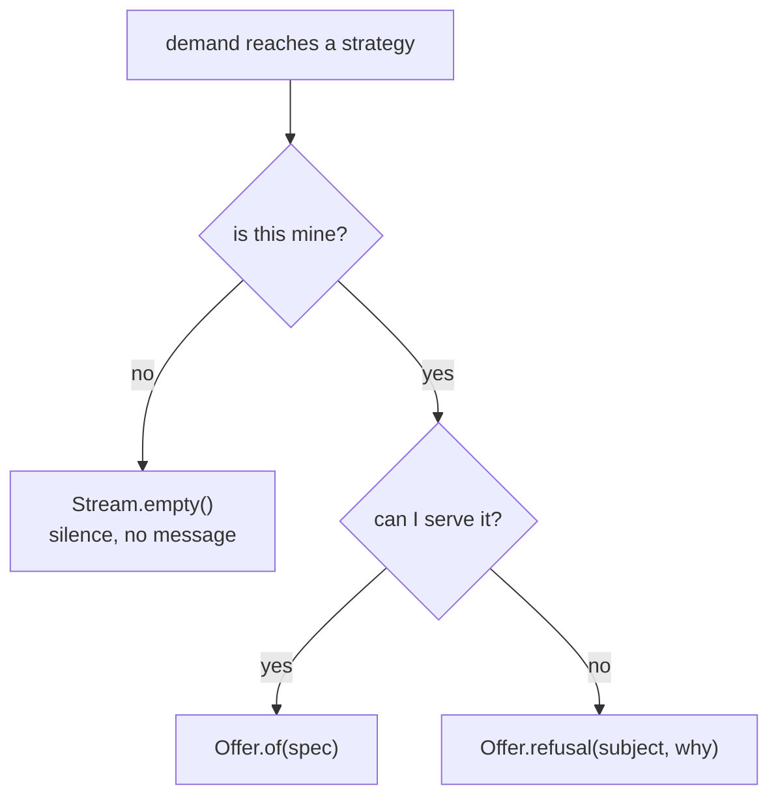
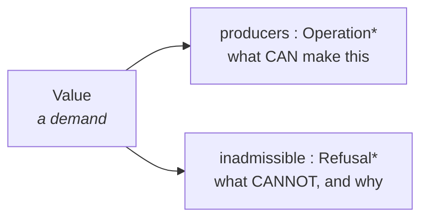
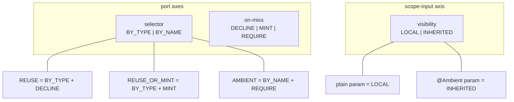
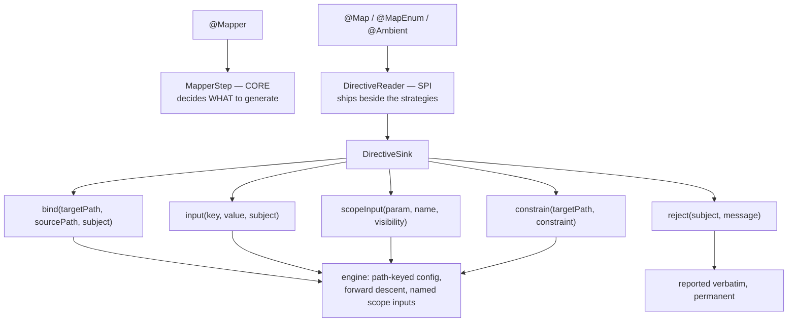
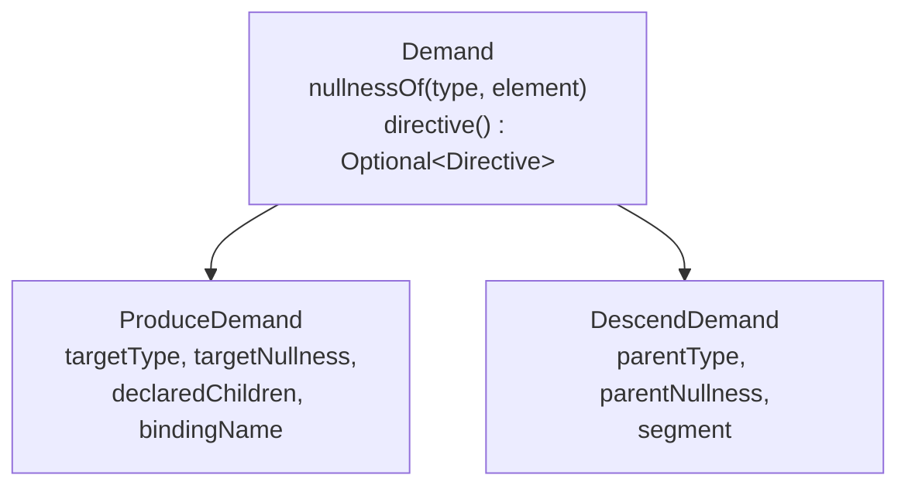
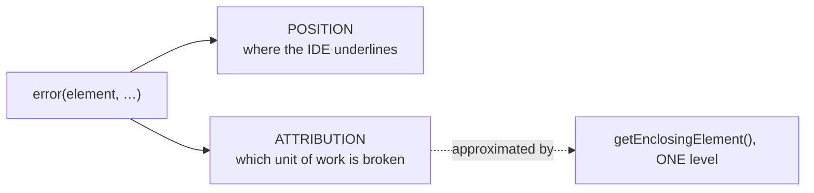

## Context

The processor's engine — `internal/graph` plus `internal/stages/expand` and `internal/stages/generate` —
already imports nothing from `spi.builtins`. The coupling this change removes lives entirely in
`internal/stages/validate`, in the discovery chain's hand-rolled `@Map` member vocabulary, and in one
annotation import inside the graph package.

Applying the test *"if there were no SPI strategies at all, would this stage still make sense?"* to the eight
stages that emit diagnostics today:



The generative cause is one sentence in the SPI: `expand` returns `Stream<OperationSpec>`, so `Stream.empty()`
conflates *"not applicable"* with *"applicable, and the author erred"*. A strategy's reason dies at the return
statement, so any targeted message must be re-manufactured outside the SPI. `EnumConversion` has no channel at
all and throws `IllegalStateException` from `render`.

Two constraints frame every decision below, both set by the project owner:

1. The graph engine must reference no SPI strategy — no type, method, parameter, or concept traceable to one.
   The graph *may* carry generalised state, provided a future strategy never needs a second mechanism.
2. Validation belongs near where the issue matters — with whoever owns the vocabulary being validated.

## Goals / Non-Goals

**Goals:**

- Make a strategy's "no" three-valued, so no core stage re-derives an SPI decision.
- Open the directive surface so adding a `@Map` member — or a third-party annotation — touches no core code.
- Remove every user-facing-annotation read from the engine, and the word "ambient" from its vocabulary.
- Relocate `@Map` / `@MapEnum` / `@Ambient` semantics to the SPI side, leaving `@Mapper` core.
- Separate a diagnostic's **position** from its **attribution**, so a message can point wherever the mistake
  is without breaking suppression or multi-round deferral.
- Land the whole SPI surface in one cutover, before any release pins it.
- Fix the three live defects this analysis surfaced.

**Non-Goals:**

- **Plan-scoped ("cross-path") constraints.** See D8; deferred with no customer.
- Runtime polymorphic dispatch, `uses = {…}` external conversion sources, or a `@Named` qualifier.
- Making `NullabilityResolver` an SPI extension point (D13).
- Resuming `add-explicit-conversion-method`. That branch stays parked; this change creates the primitives it
  needs but ships none of its user-facing behaviour.

## Decisions

### D1 — A strategy answers with `Stream<Offer>`, not `Stream<OperationSpec>`

`Offer` is a pseudo-sealed pair: a production, or a refusal carrying an opaque `Subject` and a message.
`Stream.empty()` keeps its meaning.



*Alternatives considered.* **A refusal-shaped `OperationSpec`** (`OperationSpec.refusal(...)`) needs no
signature change and breaks nobody — but it is a union hiding inside a product type, where `weight`, `ports`
and `codegen` are meaningless on a refusal. That is exactly the "impossible states are representable" defect
this change exists to remove; rejected on the owner's "clean beats minimal" rule. **A `default
Stream<Rejection> explain(demand, ctx)` hook** called only for unrealised demands costs nothing at the happy
path, but it asks the strategy to compute its decision twice and puts a non-myopic question on the myopic
interface. **Eager objection on every demand** is unusable: `reuseOrMint` mints intermediates at the *same*
`TargetLocation` carrying the *same* directive, so `ConstantValue` would object once per candidate
intermediate type. `ValidateConstantDefaultLegalityStage`'s careful assembly-port walk exists precisely to
dodge that multiplicity.

*Cost, counted.* 21 direct overriders change mechanically; the three SPI base classes (`Conversion`,
`Accessor`, `Container`) re-wrap in their `final` methods and insulate 13 leaf strategies, which do not change
at all.

### D2 — Refusals are anchored on the demanded `Value`

> **Architectural shift — flagged deliberately.** The graph absorbs state that exists only to serve
> diagnostics. This is new, and it is only admissible under constraint 1's second clause: the state must be
> generalised such that no future strategy needs a second mechanism.



Every refusal — from a strategy, from a port that could not be sourced, from a rejected grounding — is a fact
*about a demand*, so the demand is the anchor. Refused productions never become `Operation` vertices, so plan
extraction and code generation provably cannot reach them.

*Alternatives considered.* **On `Operation`** fails immediately: a strategy that declines produces no
operation. **A `MapperGraph`-level list** is what a previous session actually built —

```java
/** Specifications a `using` pin refused during landing … */
private final List<Rejection> rejections = new ArrayList<>();
```

— named after one feature in its own javadoc, and structurally inviting a second field per feature forever.
Rejected as the concrete failure this change corrects. **A side channel on `MapperContext`** keeps the graph
clean but has no anchor, so rendering has to reconstruct which demand a refusal belonged to; it also forfeits
DOT visibility for free.

*Rendering rule.* `RealisationDiagnosticsStage` already descends the deepest unsatisfied port chain from an
unreachable return root. At the miss, refusals on that `Value` replace its generic "no producer" line. One
stage, one rule, and the over-emission multiplicity of D1's rejected alternative resolves itself, because only
the chain to a genuinely unreachable root is ever rendered.

### D3 — `Directive` becomes an open bag with an opaque `Subject`

```
Directive        sourcePath()  : List<String>          structural — the engine walks it
                 inputs()      : List<DirectiveInput>  everything else, opaque

DirectiveInput   key()         : String                "constant" | "format" | "enum" | …
                 value()       : Optional<String>      scalar inputs
                 member(name)  : Optional<String>      structured inputs, e.g. @MapEnum
                 subject()     : Subject               OPAQUE positioning handle
```

> **Architectural shift.** The SPI trades a typed, compile-checked directive surface for an open keyed one.
> A strategy that misspells `"fromat"` gets silence instead of a compile error. Accepted: it is the price of
> the core never learning a member's name, and the consumption rail turns a misspelling into a *louder* error
> than today — "declared but had no effect", positioned at the token.

`Subject` is a marker interface. The core implements it over `(Element, AnnotationMirror, AnnotationValue)`;
strategies never unwrap it, only hand it back inside a `Refusal`.

*Alternatives considered.* **Keeping the enumerated accessors** means every new member touches the annotation,
`RawDirective`, `MappingDirectiveBuilder`, `MappingDirective` (two fields plus a predicate), `BindingDirective`,
`Directive`, and a hardcoded key registry inside a core stage — six places, and it forecloses third-party
annotations permanently. **A `Directive.Member` enum as the subject vocabulary** (one constant per `@Map`
member) was the earlier proposal; it re-acquires in the SPI exactly the closed core-owned vocabulary the bag
removes. Opacity is what makes the subject extensible.

*Consumption follows the same object.* `OperationSpec.withConsumed(Set<DirectiveInput>)` replaces
`withConsumedOptionKeys(Set<String>)`, which generalises the rail along both axes at once — every declared
input rather than two hardcoded keys, and per entry rather than per member. A `@MapEnum` entry naming a
nonexistent target constant is simply never stamped, so the generic rail underlines that entry.

### D4 — `Map.UNSET` is deleted; readers read only written members

`com.google.auto.common.AnnotationMirrors.getAnnotationValue` fills in defaults — provable from the current
code, which reads all six members unconditionally and only then tests the sentinel.
`AnnotationMirror.getElementValues()` returns **only explicitly written** members, which yields all three
semantics the sentinel was invented for:

| requirement | `getElementValues()` |
| --- | --- |
| written member is present | key present |
| `member = ""` is present, not absent | key present, value `""` |
| absent member carries no token to underline | no key, no `AnnotationValue` |

`RawDirective` and `MappingDirectiveBuilder` — whose entire job is undoing the defaults-filling — are deleted,
and the two structurally identical annotation readers merge into one helper parameterised by annotation class,
with repeatable-container unwrapping derived generically from `@Repeatable`.

*Trade-off.* `Map.UNSET` is `public`. Deleting it is source-breaking in principle and inconsequential in
practice, but it rewrites requirements across eight capability specs — the single largest edit in the change.

### D5 — "Ambient" dissolves into three orthogonal axes

`AmbientDecl` is `InputDecl` plus a name, built by `MethodScope` from the same parameters, at the same
`SourceLocation`, with the same type and nullness — its own javadoc says both paths "materialise the identical
graph `Value`". The only real differences are how a port selects and what a miss means:



Selection honours visibility asymmetrically, and this is the trap:

```
BY_TYPE  searches  the scope's OWN declarations                 (visibility ignored)
BY_NAME  searches  the scope's own declarations
                 + ancestors' INHERITED declarations
```

Naively merging `inputDecls()` and `ambientDecls()` into one stream would let a child scope type-match an
enclosing method's `@Ambient` parameter — a silent behaviour change. The asymmetry above reproduces today's
semantics exactly, including `ambient-parameters`' requirement that an `@Ambient` parameter *remains* an
ordinary `@Map` source, which becomes a tautology rather than an invariant to uphold.

Consequences: `Port.key` (dead in three of four modes) disappears into the selector; `internal/graph/AmbientKeys`
and its `io.github.joke.percolate.Ambient` import are deleted; `ResolveCtx.ambientKey` is removed because
`MethodCallBridge` reads the annotation directly, being SPI-side itself; and `ValidateAmbientBindingsStage` is
deleted, because an unsourceable *required* port is the engine failing its own port contract, reportable in
port vocabulary with no candidate re-walk and no `producing()` shadow.

### D6 — Grounding admissibility is a bound on the type variable, not a hook

`EnumConversion` declares `PortType.variable(0)`; `Unifier.bindVariable` binds any declared or array type;
`Grounding` instantiates one spec per match. So `Status map(String tag)` grounds `enum→Status` against
`String`, binds, lands, wins the fold, and **crashes** at `EnumConversion.render`. The missing primitive is not
a diagnostic channel — it is a *veto*: the engine over-emits a grounding the strategy would have rejected.

`PortType.variable(index, Bound)` where `Bound.check(TypeMirror, ResolveCtx)` returns an optional `Refusal`.
Because the bound closes over the target type and the override table, it expresses both "source must be an
enum" and "its constants must be covered", deleting both crash sites declaratively.

*Alternatives considered.* **A post-grounding `verify(GroundedOperation, ctx)` callback** works — the engine
knows the emitting strategy at that instant — but adds a second call-back moment for something the type system
should state. **A typed `MappingRejected` thrown from a codegen and caught by `GenerateStage`** is ~30 lines
and turns the crashes into positioned errors, but it fires after the plan is chosen, so a workable alternative
plan is never tried. A bound refuses the candidate *before* it competes, which is strictly better.

### D7 — `DirectiveReader` is a new SPI role; `@Mapper` stays core



> **`reject` vs. `constrain`, settled during apply.** The shape rules were first expressed as an always-refusing
> `constrain` at the malformed target path. That does not work: a constraint refuses *candidates*, so it is only
> ever heard when some strategy offers one — and a malformed declaration is precisely the case where nothing
> does. Compile-testing the three `@Map` rules showed the author getting an unrelated self-call refusal at the
> root instead of the rule they broke. A declaration's own well-formedness is unconditional, so it needs an
> unconditional channel; the core still learns no annotation vocabulary, because it reports the reader's own
> message verbatim.

> **Architectural shift.** Discovery stops interpreting annotations and becomes a loop that runs readers. The
> `processor` module will import no user-facing annotation except `@Mapper`.

Re-evaluated per the owner's challenge: are `@Map`'s `source` and `target` engine-essential? **As annotation
members, no** — the engine never branches on either; `TargetLocation` paths are built from SUBTARGET *port
names*, and `GoalSpec` is a path-keyed lookup passed straight through to strategies. **As mechanisms, yes.**
Dropping `declaredChildren` deletes `graph-expansion`'s "supply is directive-rooted only" requirement and lets
assembly explode combinatorially; collapsing a source path into one strategy-emitted spec
(`getStreet(getAddress(person))`) renders correctly but destroys the intermediate `Value`s that carry
per-segment nullness crossings and cross-binding sharing. So the sink supplies both as neutral data and the
engine never learns their origin.

*Alternatives considered.* **Core keeps reading `@Map`** violates constraint 1 once `@Map` is agreed to be SPI
vocabulary. **Every strategy reads its own annotation** forces third parties to know about `using` to honour a
pin, and duplicates path matching across strategies.

*Readers are per-annotation, not per-strategy* — three of them, not 26. One `@Map` reader copies every written
member into the bag generically, so `ConstantValue`, `NullnessCrossing`, `TemporalFormat`,
`LegacyTemporalFormat`, `InstantLocalDateTimeBridge` and any future member's consumer need no reader at all.

### D8 — Constraints are demand-scoped, and can never be cost weights

The requirement taxonomy, with current customers:

| | shape | customers | cost |
| --- | --- | --- | --- |
| ① | `Port` — a value requirement | everything | shipped |
| ② | candidate-local admissibility | `SelfCallGuard`, the pin guard, required-port miss, type bounds | zero: a landing filter |
| ③ | shared-resource agreement | `MemberRequest` dedup keys | low: a post-plan pass |
| ④ | cross-path side constraint | **none** | breaks cost-fold-only extraction |

`constrain()` is ② and is **not a new mechanism**: it generalises the engine's only existing enforcement
primitive. `graph-expansion` already records why preference cannot substitute for it — at one target site the
engine over-emits both self-call bindings and "the degenerate one is *strictly cheaper* … so over-emit +
cost-prune alone cannot choose correctly — the binding must be refused outright."

Constraints on a demand are AND-composed. "Opposing constraints" is an empty conjunction at one `Value`,
detected locally, with the refusals of every filtered candidate serving as the explanation. No solver.

**Why a pin cannot be modelled as a weight** — four independent failures, verified against `Cost`:

1. `FINITE_ORDER = comparingInt(Cost::getPartials).thenComparingDouble(Cost::getWeight)`. Totality is
   lexicographically prior, so a total alternative beats a partial pinned production **at any weight,
   including negative**. Fatal on its own.
2. `DirectAssign` is `Weights.NOOP = 0` and zero-port, i.e. exactly `Cost.ZERO`. A pin's single weight term
   must beat a sum over an arbitrarily deep subtree, so it must go negative.
3. `plus` adds componentwise, so a negative weight propagates upward without bound — a pinned operation at
   −1000 flips an unrelated selection three levels up. The discount is not local.
4. `min` chooses among *reachable* candidates; it cannot exclude one. An inapplicable pin would fall back
   **silently**, which is the exact diagnostic gap this change closes.

A fifth kills it even if the four were solved: whoever applies the discount must recognise "pinned", so
weight-tuning does not escape the coupling it exists to avoid. `Weights.SENTINEL_UNREALISED` is the dead
fossil of a previous attempt at exclusion-through-weight; it is deleted here.

> **Cost is the preference algebra. Admissibility is the enforcement algebra. They are not interchangeable.**

### D9 — `descend` is brought to parity with `expand`, and `directive()` pulls up to `Demand`

No accessor decline in the repo is anything but "not mine", so `descend` could keep its signature and halve the
base-class churn. Widening anyway, because the owner's rule is that the SPI is cleaned *during* this change
rather than re-broken by the next one, and widening later is a second cutover for every implementor.

The same reasoning closes the other asymmetry: `ProduceDemand` carries a `Directive` and `DescendDemand` does
not, so an accessor cannot see the configuration of the binding whose path it is walking. Rather than adding a
second accessor, `directive()` **moves up to `Demand`**, where it belongs — both shapes carry the configuration
in effect and differ only in what they are being asked:



**This is the binding's directive, not a per-segment one.** `SourcePathDescender.pinnedSource` is invoked from
`Driver.expandValue`, where the binding is already resolved, so the directive threads through as one extra
parameter on two methods and into `DescendView`. Requires **no `DirectiveSink` change**: the sink already binds
`(targetPath, sourcePath)` and configuration travels with the binding. Per-*segment* configuration would need a
sink keyed by `(targetPath, segmentIndex)` and stays out of scope — nothing asks for it, and inventing the key
shape without a customer is exactly the speculation D7 avoids elsewhere.

*Myopia note.* An accessor can now behave differently based on configuration declared at the target. That is
not a myopia violation — it is the same per-demand data `expand` already receives, not graph access — but it
does couple the source walk to the target binding, so an accessor reading configuration must still make a
purely local decision from its own `DescendDemand`.

### D10 — `declaredChildren` stays derived

Derived from the set of bound paths, as `GoalSpec` does today, rather than declared explicitly on the sink.
Smaller API, and it cannot disagree with the bindings.

### D11 — Shared-resource agreement is a post-plan pass over declared facts

`MemberPlan.forMapper` resolves duplicate dedup keys with `putIfAbsent`, so two operations requesting one class
member with different `fieldType` or `initializer` silently share the first — deterministically wrong generated
code, avoided today only by the convention of embedding discriminators in the key. Grouping the winning plan's
requests by key and erroring on disagreement needs **no SPI change, no graph change, and no strategy
knowledge**; it is the same shape as the consumption rail and confirms the taxonomy generalises.

### D12 — Diagnostics deliberately traded

| today | after | why acceptable |
| --- | --- | --- |
| `cannot coerce 'abc' to int` | same — `ConstantValue` refuses with this message | no loss |
| `@MapEnum names an unknown target constant 'X'` | `@MapEnum(target = "X") had no effect` | same token underlined; survives strategy removal, which today's message does not |
| `IllegalStateException` at render ×2 | positioned compile error | strict improvement |
| silent wrong member reuse | positioned error | strict improvement |
| unbound `@Ambient` key, at mapper type | same position, engine-worded | `hasErrorsFor` propagation still forces mapper-type positioning |

The one genuine loss: an error whose demand some *other* strategy satisfies now goes quiet where a
pre-expansion stage would have caught it. In practice every abstract method is seeded, so the exposure is a
malformed declaration on a path that also has a working producer — and the consumption rail catches exactly
that case on the success path.

### D13 — Nullability stays core and SPI-facing

`Demand.nullnessOf(TypeMirror, Element)` is called by `ConstructorCall`, `MethodCallBridge` and `Accessor` on
elements that are not scope inputs, so the resolver cannot be pre-computed away and is not a leak — annotation
reading is already confined to `JspecifyNullabilityResolver`, outside the engine. What *does* go is the
`BiFunction` threaded through `Scope.inputDecls`/`ambientDecls`: those declare a scope's own inputs, resolvable
once at declaration time. `Scope` becomes plain data, and `SourceCandidates`, `SourcePathDescender` and
`Seeder` lose the field entirely.

Separately, `DotRenderer.nullnessOf` matches any annotation whose **simple name** is `Nullable` — a second,
divergent nullness rule inside the engine that ignores `@NullMarked` scoping and bypasses the resolver. Debug
output only, corrected here. Making `NullabilityResolver` an SPI extension point is a legitimate future axis
with no current customer; explicitly out of scope.

### D14 — Diagnostics become values attributed to a unit of work

> **Architectural shift.** `Diagnostics` stops being an eager `@Singleton` emitter and becomes a per-mapper
> collection plus one flush point. This is forced scope, not opportunism: without it the refusal channel
> cannot position its own messages, and it breaks Lombok interop (below).

`Diagnostics.error(element, …)` uses its one `Element` argument for two unrelated purposes:



Attribution is *guessed* by containment even though the processor knows it exactly — every diagnostic raised
inside `Pipeline.process(mapperType)` belongs to that mapper. Because the two share a field, **position is
constrained by attribution**: an error positioned at an offending `@Ambient` parameter leaves
`hasErrorsFor(mapperType)` false (the parameter's enclosing element is its method, and for an inherited
candidate that method's enclosing element is a supertype in another compilation unit), so the generic "no plan"
still fires and `GenerateStage` still generates. That is the sole reason `ValidateAmbientBindingsStage`
positions everything at the mapper type.

**The forcing argument.** `MapperStep` classifies a mapper into exactly two buckets — *scarred* (consume, never
defer) or *recorded outcome* (defer, for Lombok interop). That works today only because errors and deferral are
mutually exclusive **by construction**: the only deferrable outcome is "nothing was scarred at all". Refusals
render at the deepest miss — precisely the deferred case — and they are not one kind:

```
"cannot coerce 'abc' to int"        wrong in every round     → must consume
"no producer for tgt[address]"      may realise next round   → must defer
```

One mapper can now carry both, and a mapper-level binary cannot express it. **Deferrability becomes a property
of the individual diagnostic.**

```java
Diagnostic {
    Severity severity;      // ERROR | WARNING
    Subject  position;      // opaque; resolves to Element + AnnotationMirror + AnnotationValue
    String   message;
    boolean  permanent;     // opt-out of deferral; default false (transient)
}

MapperContext.report(Diagnostic) / diagnostics() / hasErrors()
DiagnosticEmitter.flush(mapperType, List<Diagnostic>)      // the ONLY Messager writer
```

The deferral rule, which reproduces today's behaviour exactly while allowing the opt-out:

```
defer  ⟺  the mapper is unrealised  AND  every recorded diagnostic is transient
```

A realised mapper never defers, so a consumption-rail "declared but had no effect" on an otherwise-working
mapper is emitted immediately regardless of its flag. Transient-by-default is deliberate: a producer that
forgets to classify errs toward giving the mapper another round, which at worst delays a message to
`processingOver` — whereas a wrong `permanent` consumes a mapper Lombok would have fixed.

*Alternative considered.* **Per-producer classification** (each producer states transient or permanent) is
purer but ambiguous exactly where it matters: `UsingMethodCall` refusing "no method named `upper`" is permanent
unless `upper` is Lombok-generated, which the strategy cannot know. Opt-out keeps the safe answer as the
default.

Every consumer collapses into a query on the unit of work:

| today | after |
| --- | --- |
| `diagnostics.hasErrorsFor(ctx.getMapperType())` | `ctx.hasErrors()` |
| `scarredWithEnclosing` containment heuristic | deleted |
| `diagnostics.reset()` per round | deleted — the context is already per-mapper-per-round |
| `ctx.setUnsatisfiedRealisation(List<String>)` | `Diagnostic`s, transient |
| `Diagnostics` `@Singleton` holding a `HashSet` **and** a `ConcurrentHashMap` | deleted |

That last row also removes global mutable cross-mapper state — one collection thread-safe and the other not is
a standing hazard for this repo's threaded-pitest runs.

**`Subject` resolution.** The SPI provides the constructor; the core owns the representation:

```java
Subjects.of(Element element, AnnotationMirror mirror, AnnotationValue value)   // readers call this
Subjects.none()                                                                // → the mapper type
```

Strategies never *build* a `Subject`, only pass along one received from a `DirectiveInput`. So a strategy
cannot fabricate a position, a third-party reader gets exact positions with zero core knowledge of its
annotation, and the emitter never downcasts an unknown implementation.

**What this unlocks beyond this change**: a required-port miss positioned at an inherited candidate's parameter
in another compilation unit; `Diagnostics.warning`'s current silent failure to participate in suppression
becomes a `severity` field; and a list of diagnostic *values* makes per-key suppression, a `-Werror`-style
option, or an IDE-facing dump trivial where a Messager side effect makes them impossible.

## Risks / Trade-offs

- **[Size — the dominant risk.]** Larger than `add-ambient-parameters` (51 tasks); 21 spec files.
  → Task groups are ordered so ③ (D11) lands first and independently, then A, then B, then C, each leaving the
  build green. `./gradlew check --no-configuration-cache` gates every group, not just the end.
- **[The SPI cutover lands as one commit across five modules.]** A partial cutover does not compile.
  → Sequence within group A: add `Offer` and the bag alongside, migrate the three base classes, then the 21
  overriders, then delete the old surface. The 13 insulated leaves never move.
- **[Open `Directive` loses compile-time key checking.]** A misspelled key silently reads absent.
  → The generalised consumption rail reports the *declared* side as unconsumed, so a typo becomes a positioned
  error rather than silence. Built-in key constants stay `static final` in the owning strategy.
- **[Refusal noise.]** A strategy that refuses eagerly could bury the real message.
  → Refusals render only along the deepest-miss chain of an unreachable return root, so an over-emitted
  intermediate's refusal never surfaces unless it is the actual miss.
- **[`constrain()` could grow into ④ by accident.]** A contributor may reach for a plan-wide constraint.
  → The sink's signature is `constrain(targetPath, …)` — demand-scoped by type, not by convention. ④ would
  require a new signature and therefore a deliberate decision.
- **[Behavioural change hidden in D5's asymmetry.]** Merging the two declaration streams naively changes
  type-matching in child scopes.
  → An explicit regression scenario: a container element transform must **not** type-match an enclosing
  method's `@Ambient` parameter.
- **[`Map.UNSET` removal is public-API breaking.]**
  → No release with a stable SPI has shipped. Recorded in the proposal as intentional.
- **[Diagnostic emission order changes.]** Messages arrive grouped per mapper at its outcome fixpoint rather
  than interleaved with processing. Accepted by the owner; `javac` guarantees no ordering. Any e2e assertion
  on diagnostic order must be rewritten to assert on content and position.
- **[A crash mid-pipeline now loses collected diagnostics that would previously have been emitted eagerly.]**
  → Flush in a `finally` around `Pipeline.process`, so a partial run still reports what it found.
- **[A producer marking a diagnostic `permanent` incorrectly consumes a mapper Lombok would have fixed.]**
  → Transient is the default; `permanent` is an explicit opt-out, reviewed per call site. The e2e suite keeps
  a Lombok-interop scenario that must still realise on the second round.

## Migration Plan

1. **③ first, alone** (D11): no SPI change, no dependency on the rest, ships green.
2. **D** — diagnostics as values (D14): no SPI change either, and a strict improvement standing alone. Lands
   **before A**, because A's refusal rendering depends on attribution being decoupled from position and on
   per-diagnostic deferrability. De-risks A by separating "how a message travels" from "who produces it".
3. **A** — the SPI answer shape (D1, D3, D4, D6): `Offer`, the bag, written-member reading, bounds. Deletes
   `ValidateConstantDefaultLegalityStage`, `ValidateEnumOverridesStage`, `RawDirective`,
   `MappingDirectiveBuilder`, `Map.UNSET`, `Weights.SENTINEL_UNREALISED`, both crash sites.
4. **B** — port axes and scope-input visibility (D5, D13): deletes `ValidateAmbientBindingsStage`,
   `AmbientKeys`, `ResolveCtx.ambientKey`, `Port.key`, `AmbientDecl`; adds the two ArchUnit rules at engine
   scope. Independent of A; may run in parallel.
5. **C** — directive reading and constraints (D7, D8): re-homes discovery, moves
   `ValidateMappingShapeStage`'s rule into the built-in `@Map` reader, widens the ArchUnit rule to the whole
   `processor` module.
6. **E** — built-in feature packages (Q1, resolved): a pure move, last, so its import churn never collides
   with a semantic edit in the same file.
7. **Then** `add-explicit-conversion-method` resumes on top, with its bad graph-recording requirement and
   `UsingPinGuard` dropped and its pin re-expressed as a contributed constraint.

Rollback is per-group: each of ③/D/A/B/C/E is independently revertable, and only C is a prerequisite for the
parked branch.

## Open Questions

### Resolved during design

1. **Built-in feature packages ride along** (group E). `spi.builtins.enumconversion/`, `…temporal/`,
   `…methodcall/`, `…container/`, `…accessor/`, `…value/`, `…assembly/`, `…primitive/`, with shared `Labels`
   and `Members` staying at the root. This makes "delete the package, delete the feature" literally true —
   the owner's own strategy-removal test, made structural — and co-locates each reader with the strategies it
   serves. Sequenced last, as a pure move. (`enum` is a reserved word; the package is `enumconversion`. The
   existing ArchUnit `BUILTINS` pattern already uses `..`, so it needs no change.)
2. **Three readers, one per annotation** — `MapDirectiveReader`, `MapEnumDirectiveReader`,
   `AmbientDirectiveReader`. Ownership is legible, each models exactly what a third party would write, and a
   reader's tests exercise one annotation's vocabulary. The alternative (one built-in vocabulary reader) is
   fewer moving parts but makes the built-ins a special case rather than the first customer of the new role.
3. **Two refusals against one `Subject` render both**, deduplicated only on identical text. Suppressing the
   second would hide a genuine conflict — two strategies objecting to one declaration for different reasons is
   information, not noise. `Subject` therefore needs no identity contract beyond what the emitter uses to
   collapse exact duplicates.
4. **Required-port refusal positioning** — resolved by D14, not worked around. Once attribution moves to the
   unit of work, position is unconstrained: a required-port miss positions at the `callTarget`'s parameter even
   when that parameter belongs to an inherited method in another compilation unit. The mapper-type fallback
   (`Subjects.none()`) remains only for diagnostics with no owning token, such as member-agreement conflicts.

5. **`DescendDemand` carries a `Directive`** — and rather than a second accessor, `directive()` pulls up to
   `Demand` (D9). Costs one parameter through `SourcePathDescender` and no `DirectiveSink` change, because it
   is the *binding's* directive. Per-segment configuration remains out of scope.
6. **Refusals render in the `plan` dump as well as `full`.** Showing the negative space around a chosen plan
   is exactly what makes a cost surprise debuggable — "why did the cheaper-looking candidate not win?" is
   unanswerable from a dump that only draws survivors. `transforms` stays unchanged.

### Still open

None blocking. Two items resolve by discovery during implementation rather than by decision:

- **How many e2e assertions depend on diagnostic ordering** (D14 changes it). Counted in the tasks phase; the
  fix is mechanical either way.
- **Whether `Subjects.none()` positioning at the mapper type reads well for member-agreement conflicts**
  (D11), whose class-level resource genuinely has no owning token. Judged against the real message once the
  emitter exists.
