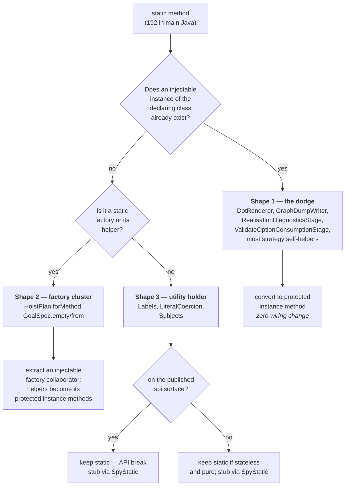
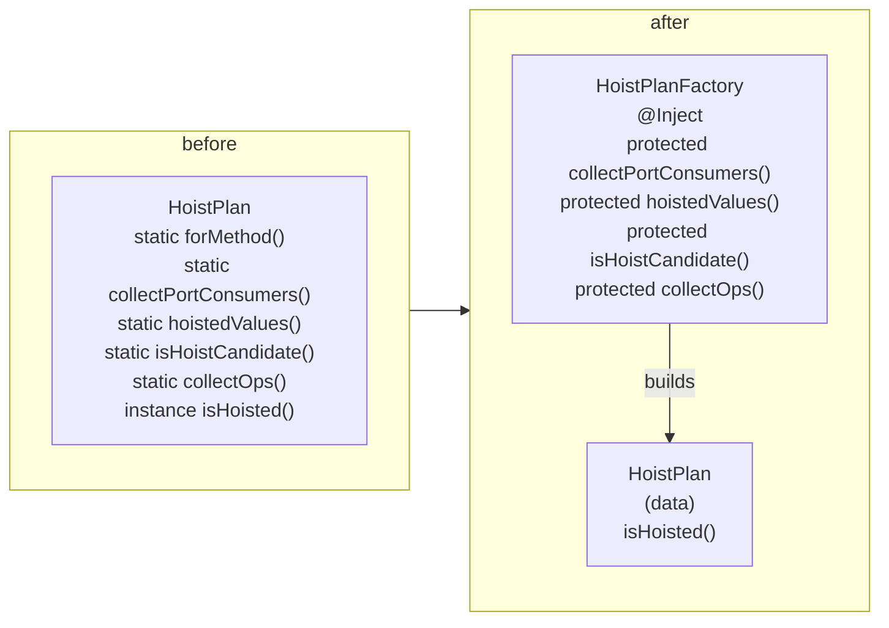
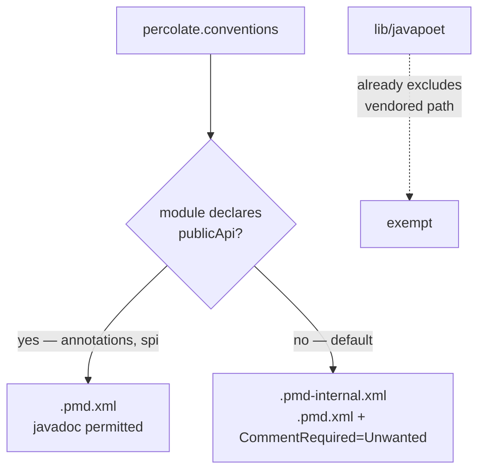

## Context

Two structural rules already hold repo-wide: no private methods (ArchUnit Rule A) and unused protected methods carry `@VisibleForTesting` (Rule C). Both exist to guarantee every authored method can be intercepted by a test double. `static` defeats both — `INVOKESTATIC` bypasses proxy interception entirely — and a previously recorded convention actively recommended it as the fix when extracting a helper on a `Spy`'d class tripped strict `0 * _`. That recommendation was wrong; the correct fix is to declare the self-interaction. In the meantime 192 static methods accumulated in main Java.

The statics are not homogeneous. Reading the hot spots shows three distinct shapes, and they need different treatments:



Shape 1 is the bulk and the actual regression: `DotRenderer` is already `@NoArgsConstructor(onConstructor_ = @Inject)` — a Dagger-managed singleton — carrying 12 static helpers it calls on itself. Nothing prevents those from being instance methods today.

Separately, the mock maker that makes final classes mockable, and `SpyStatic` usable, reached exactly one module of six because `SpockConfig.groovy` is copy-pasted per module.

## Goals / Non-Goals

**Goals:**

- Close the `static` testability hole with the same force the private-method ban already has.
- Make final-class mocking and `SpyStatic` available in every module, from one definition.
- Replace the "make it static" workaround with a recorded, order-correct self-call idiom.
- Confine javadoc to the two externally consumed modules without losing design rationale.

**Non-Goals:**

- Static analysis proving every protected method is spy-tested. Not derivable: the fact lives half in Java bytecode and half in Groovy, and Spock's AST transform reduces `1 * u.f(_)` to a `MockController` call carrying the method name as a string constant, so no call edge survives. pitest at 85/95/90 remains the oracle. Custom CodeNarc spec-shape rules were considered and explicitly dropped.
- Changing any published API. The `spi` static surface is preserved deliberately.
- Touching `lib/javapoet`, which is vendored upstream source.
- Widening ArchUnit Rule B's method-count ceiling beyond its current packages.

## Decisions

### D1 — Shape 1 statics convert with no wiring change; that is where the value is

A static helper on a class that Dagger already constructs is a pure dodge: the instance exists, the method just refuses to use it. Converting `DotRenderer`'s 12 statics, `GraphDumpWriter`'s `dimmedByCost`/`slice`, and the equivalent helpers in the stages and strategies is a visibility edit plus `@VisibleForTesting`, and each becomes independently spy-testable immediately.

*Alternative considered:* convert everything uniformly, including Shape 2 and 3. Rejected — a static factory has no instance to become an instance method of, so "uniform" conversion silently means "decompose", which is a much larger change wearing a smaller change's name.

### D2 — Shape 2 keeps a static entry point, moves its helpers to a collaborator

`HoistPlan.forMethod(...)` and `GoalSpec.from(...)` are constructor substitutes; their helpers (`collectPortConsumers`, `hoistedValues`, `isHoistCandidate`, `childLevels`, `sourcePathByTarget`, …) are the untestable part. Extract an injectable factory whose protected instance methods carry that logic, leaving the value type as data.



*Alternative considered:* leave Shape 2 alone as "legitimately static". Rejected — the factory body is where the decisions live, and it is exactly the logic pitest reports as weakly covered.

**Architecture note:** this adds classes to `processor.internal.stages.generate`, which ArchUnit Rule B caps at 15 non-synthetic methods per class. Splitting *reduces* per-class counts, so the ceiling is not threatened, but each new class must justify itself as a cohesive unit rather than a bag of relocated statics.

### D3 — Shape 3 stays static and is stubbed with `SpyStatic`

An audit of `spi` during design found the carve-out is far broader than `LiteralCoercion` and `Subjects`: **40 of `spi`'s 41 statics are public factories on the published SPI surface** — `Port.byType`/`byName`/`subTarget`/`byTypeOrDecline`, `PortType.variable`/`concrete`/`app`, `OperationSpec.of`/`ofPartial`/`mapping`/`callOf`, `Offer.of`/`refusal`, `Nullability.join`, `DirectiveInput.scalar`/`structured`, `ChildScopeSpec.lifted`, plus all 17 of `LiteralCoercion` and 3 of `Subjects`. Every one is called by third-party strategy authors, so converting any is a breaking API change. Only `Nullability.either` is non-public and in scope.

The practical consequence: **`spi` is essentially unaffected by this change**, and the conversion work lives in `processor` and `strategies-builtin`. This is a correction to the initial sizing, which assumed the 192 divided evenly across the three modules.

`Labels` (internal to `strategies-builtin`) is a stateless type-name formatter with no collaborators.

**Correction after running the rule (supersedes the earlier sizing in this section).** The authoritative ArchUnit list is 172 statics, not the 192 estimated by grep, and the non-public ones do not all belong to Shape 1. About 145 are the pure Shape-1 dodge on DI-managed classes. The remaining ~27 sit in five stateless all-static holders with private constructors and no instance state — `LiteralCoercion`'s 16 non-public helpers, `Labels` (2), `Blockings` (4), `Reactors` (1), `PercolateCompiler` (4). These are **Shape 3 regardless of visibility**, so the `C1` branch above ("on the published spi surface?") is not the discriminator it was drawn as: a non-public helper of a utility holder takes the same `keep static, stub via SpyStatic` outcome as a public one, because there is still no instance to spy and nothing to inject. Task 6.6's "convert every non-public spi static" was written from the earlier assumption and is corrected accordingly — only `Nullability.either` converts, because `Nullability` is a type with instances, not a holder.

The exemption is granted to a **shape**, not a name list: `final`, private constructor, no instance state, nothing but static members — which is exactly what Lombok's `@UtilityClass` produces, so new holders declare it and existing ones (`Reactors`, `Blockings` already; `Labels`, `LiteralCoercion`, `PercolateCompiler` newly) are annotated to make the intent explicit. Lombok annotations are `SOURCE`-retention and therefore invisible to ArchUnit's bytecode import, so Rule D detects the shape structurally rather than looking for the annotation.

Two guard rails come with it, neither statically checkable and both recorded here and in the spec: a holder must be a cohesive group of functions that belong together — extracting a lone method into a new holder purely to escape spy-testing is the abuse this exemption invites — and, on a class that *does* have instances, a method is not made static merely because it touches no instance field. Testability outranks that observation.

`test-foundation` is in scope for Rule D like any other module: it is production-shaped code publishing a public API to other modules' tests. `PercolateCompiler` is nonetheless exempt, by the holder shape rather than by module.

**The reconciled conversion list.** With Rule D as shipped, the authoritative count is **134**: `processor` 80, `strategies-builtin` 51, `spi` 3. Against the design's earlier 86/64/1:

- `strategies-builtin` drops 64 → 51, almost all of it `Labels` (2) leaving via the holder exemption and the original grep double-counting overloads.
- `spi` rises 1 → 3: `Nullability.either` as expected, plus `Container.intermediateElement` and `Container.unary`, two `protected static` helpers on the abstract `Container` base that the by-hand audit missed because it looked only for `public static` factories. `Container` has subclasses, so both convert normally.
- `processor` drops 86 → 80, and one entry is a surprise: `ProcessorModule.assembleExpansionPipeline` is a `public static` that a sibling `@Provides` instance method merely delegates to. It is not itself `@Provides`, so task 5.6's carve-out does not cover it.

### D3b — A named constructor is a fourth shape, and it stays static

The three shapes miss a population the rule surfaced: a static whose whole body is one `new` of its own type — `Diagnostic.error`/`warning`, `Cost.finite`, `Dep.port`/`output`, `AccessPath.of`, `TargetPath.of`, `Location.child`, `IncomingValuesImpl.of`, `NullabilityAnnotations.jspecifyDefaults`. Shape 1 does not apply (there is no instance to hang it on — it *makes* the instance), and Shape 2 does not either (no helpers to extract). Nor does the testability argument: a test double over `Diagnostic.error(subject, message)` could only return a `Diagnostic`, which is what the constructor already does. They stay static and Rule D exempts them.

The exemption is matched on the one part of that which is structural: the return type is the declaring class, or an interface the declaring class directly implements. "The body is really just a `new`" is not checkable, so the exemption also covers factories that *do* carry logic — `ExtractedPlan.extract`, `GoalSpec.from`, `HoistPlan.forMethod`. Those are still decomposed, by D2 rather than by the rule. Rule D therefore under-enforces here on purpose, rather than forcing a false positive onto eight value types.

*Alternatives considered:* delete each factory and call the constructor at every site — rejected, `Dep.port("value")` becoming `new Dep(Optional.of("value"))` loses the name that carried the meaning. Or extract a `DiagnosticFactory`, `CostFactory`, `DepFactory`, … — rejected, eight injectable classes plus Dagger wiring to seam eight one-line constructors.

### D2b — Shape 2 is five clusters, not two

`ProcessorOptions.from` (+`flag`, `parseSwitchStyle`), `MemberPlan.forMapper` (+`memberBase`, `reportConflict`), and `BodyRenderContextImpl.buildFor` (+`renderIfBodyCodegen`) are the same shape as `HoistPlan` and `GoalSpec` — a factory entry point whose helpers hold the decisions — and the task list simply enumerated the wrong set. D2 applies unchanged, giving `ProcessorOptionsReader`, `MemberPlanFactory`, `BodyRenderContextFactory` alongside `HoistPlanFactory` and `GoalSpecFactory`. `ProcessorOptions.from` is called from a Dagger `@Provides`, so its reader injects with no wiring change at the call site.

This was not discretionary once the conversions began: `flag`, `memberBase` and `renderIfBodyCodegen` are instance methods after Rule D, and a `static` factory cannot call an instance method on an object it has not built yet. Group 5 does not compile until group 6 covers these three.

One conversion produced a sixth new class for a different reason. `TargetProducer.dedup`/`signature` are called by `SourcePathDescender` too; a shared static becoming an instance method needs an owner both callers can hold, so it became `SpecDeduplicator` rather than an instance method on either.

**A converted helper keeps its existing visibility; it does not become `protected`.** The tasks were written as "convert to `protected` instance methods, adding `@VisibleForTesting`", following Rule A's precedent. That is not available here: most of these classes are `final` (every `@AutoService` strategy is), and Error Prone's `ProtectedMembersInFinalClass` rejects a `protected` member on a `final` class — under `-Werror` it fails the build outright. The conversion is therefore exactly one edit, dropping the `static` keyword: a package-private static becomes a package-private instance method, spyable from a same-package spec under the mockito mock maker, and Rule C's `@VisibleForTesting` obligation never attaches because it applies to `protected` only. Nothing about testability is lost — Rule D is about `INVOKESTATIC`, not about visibility.

Two mechanical facts fell out of getting this list and are recorded because both are silent-pass risks, not one-off debugging noise:

- An enum satisfies every structural test for a utility holder — `final`, private constructor, constants are static fields — while plainly having instances. Rule D excludes enums explicitly; without that, `Nullability.either` disappears from the list.
- `EncapsulationRules`, a test fixture, was being imported as production code. `ImportOption.DO_NOT_INCLUDE_TESTS` misses fixtures, and the existing `/testFixtures/` path guard only catches the *directory* form — a consumer (including this module consuming its own) resolves them as the `-test-fixtures` **jar** variant instead. Rules A and C had been running against fixture code all along and happened not to flag it.

*Alternative considered:* inject `Labels` into every strategy. Rejected for now — strategies are `ServiceLoader`-instantiated and must keep a public no-arg constructor, so injection means a secondary-constructor pair on each strategy purely to seam a pure function. `SpyStatic(Labels)` gives the same test control at zero production cost, and rule 2 makes it available. If `Labels` ever acquires state or a collaborator, it moves to the secondary-constructor pattern:

```java
public Foo() { this(new Labels()); }        // ServiceLoader entry
Foo(Labels labels) { this.labels = labels; } // spec injects a Mock
```

### D4 — `SpockConfig.groovy` is generated by the conventions plugin onto the test resources

Spock discovers `SpockConfig.groovy` from the **test classpath root**, which is why the current per-module files work identically under `test` and `pitest`. A `systemProperty 'spock.configuration'` on the `test` task would not survive into pitest's own JVMs, so the classpath mechanism must be preserved. The conventions plugin therefore generates one canonical file into a generated resources directory wired into `sourceSets.test.resources`, and the six per-module copies are deleted.

*Alternative considered:* a shared resources-only module depended on by every test suite. Rejected — it adds a module and a dependency edge to solve a build-configuration problem, and `architecture-tests` would then need it too.

This keeps the single-convention-plugin rule: one `percolate.conventions` id per module, no new plugin.

### D5 — PMD selects the javadoc policy per module through a declarative opt-in

The conventions plugin hardcodes `ruleSets = ["$rootDir/.pmd.xml"]` for everyone. Rather than the plugin naming `annotations` and `spi` (a by-name cross-project reference, against the Isolated Projects direction), each module declares its own nature and the plugin reads it:



`.pmd-internal.xml` includes `.pmd.xml` and adds `category/java/documentation.xml/CommentRequired` with the `Unwanted` settings, so the two rulesets cannot drift.

*Alternative considered:* a custom XPath rule on `FormalComment`. Held in reserve — the repo already has a hand-written XPath rule (`UseVarForLocalVariables`), so this is a proven fallback if `CommentRequired`'s element coverage turns out to have gaps.

### D6 — The javadoc pass is a demotion, and the two rules are applied together

Rules 6 and 7 are one traversal, not two: for each block, decide *non-obvious → `//`* or *restates the signature → delete*. Doing them as separate passes would mean reading all 355 blocks twice and would make the delete pass tempting to automate, which is exactly how the rationale gets lost.

### D5b — The javadoc ban is a source scan, not a PMD rule

PMD's `CommentRequired` cannot express it. Its `Unwanted` settings reach a type, a field, an enum constant, an accessor, an override, and a **public** or **protected** method — and there is no property for a package-private one, which after Rule A is where nearly every helper in this repo lives (`CommentRequired` flags 163 elements in `processor`; the module has 273 blocks). The fallback this design held in reserve is gone too: PMD 7 dropped `FormalComment` from the XPath-addressable AST, so a custom `//FormalComment` rule matches nothing.

So the ban is checked as what it is — source text. `checkNoJavadoc` in `percolate.conventions` fails an internal module whose `src/main/java` contains a `/**` block, excluding the vendored `com/palantir/javapoet/**` path that `lib/javapoet` already excludes from Pmd and Error Prone. One complete mechanism instead of two partial ones, and `.pmd.xml` goes back to being the single ruleset for every module.

*Recorded because it is a silent-pass class of bug:* the first attempt had `.pmd-internal.xml` include `.pmd.xml` via `<rule ref="./.pmd.xml"/>`. PMD resolves a relative ruleset reference against the **working directory**, not the referencing file, so it resolved to `<module>/.pmd.xml` and failed — and Gradle's `Pmd` task does not fail on an unresolvable ruleset. It analysed nothing and reported success. A green build proved nothing for as long as that was in place.

### D6b — The demotion pass found almost nothing to delete

Rule 8.5 anticipated a two-way judgement: demote a block that records an invariant, delete one that restates the signature. Across all 366 blocks in `reactor`, `reactor-blocking`, `strategies-builtin`, `processor` and `percolate-smoke`, exactly **one** was a deletion (`Location.role()` — "This location's resolution mode").

That is not an accident, and it is worth knowing before the next repo-wide comment pass is planned: Rules A and C had already driven the signature-restating comment out. A method only exists separately here because it is a seam someone needed to intercept, and a method that had to justify its own existence tends to have a reason worth writing down. The comments left were carrying edge cases (`or the empty string when the path is empty`), ordering guarantees (`in deterministic id order`), generated-code shapes (`instant.atZone(zone).toLocalDateTime()`), and cross-change design references. All of that survives as `//`.

## Risks / Trade-offs

- **Stubbing a self-call destroys the caller's mutation coverage of it** → When a spec writes `1 * subject.f(_) >> value`, the caller's feature method no longer exercises `f`'s logic. The helper MUST get its own feature method; otherwise the conversion trades a coverage hole for a differently-shaped one and pitest will report it. Treat a threshold drop as a signal that a helper was stubbed without being separately tested.
- **`1 * subject._` is less specific than restating the entry call** → renaming the entry method will not fail the spec. Accepted: the entry call is already pinned by the `when:` block, and the exact cardinality still forces every additional self-call to be declared.
- **Mockito static mocking is thread-confined** → `SpyStatic` only works because Spock's in-JVM parallel execution is off. Anything that later re-enables `runner { parallel { enabled true } }` silently breaks static stubbing. The spec records this as a reason the setting must stay off, alongside the existing pitest reason.
- **A build tool could push back toward static** → Error Prone's `MethodCanBeStatic` is off by default; confirm it stays off, or the `-Werror` build will fight the convention it is meant to enforce.
- **`CommentRequired`'s `Unwanted` may not cover every element kind** (package-info, enum constants, nested types) → spike it against `processor` before converting all five modules; fall back to the custom XPath rule.
- **Six SpockConfig files carry distinct rationale comments** → consolidating must merge the explanations, not pick one. The reactor-blocking copy in particular records a mutation-score finding not present in the others.
- **Large mechanical diff across specs** → the static conversion touches every spec that exercised a converted method. Sequence it module by module (`spi` → `strategies-builtin` → `processor`) so a failure is attributable, and keep the mock-maker rollout first since `SpyStatic` depends on it.
- **`@VisibleForTesting` needs `org.jetbrains:annotations` on the compile classpath** → it is `compileOnly` and was historically missing in `reactor` and `strategies-builtin`; every module gaining newly-protected methods needs it declared.
