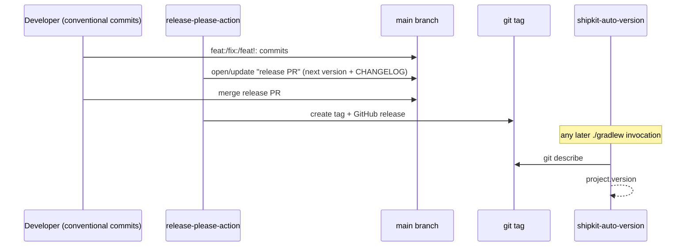
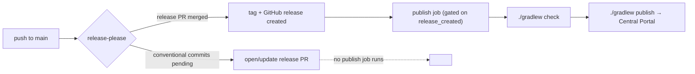

## Context

Percolate is a multi-module Gradle build (`annotations`, `bom`, `percolate`, `percolate-javapoet`, `processor`, `reactor`, `reactor-blocking`, `spi`, `strategies-builtin`, plus internal-only `dependencies`/`test-foundation`/`architecture-tests`/`percolate-smoke`) sharing one `group` and one `version` across every subproject. Today `version` is a hardcoded string in root `build.gradle`; there is no tag history (`git tag -l` is empty), no CHANGELOG, and no publish repository configured anywhere — `maven-publish` currently only produces local artifacts. `spi`, `processor`, `strategies-builtin`, `reactor`, `reactor-blocking`, `annotations`, `percolate`, `percolate-javapoet`, and `bom` already apply `maven-publish`; the CI build (`.github/workflows/build.yml`) runs `./gradlew check` and deploys the Antora docs site, but has no release job.

The author has a prior project (`joke/spock-deepmock`) with a working release pipeline: `shipkit-auto-version` for version derivation, `release-please-action` for the release PR/tag/changelog flow, and a hand-rolled `signing` + `maven-publish` block targeting the now-defunct legacy OSSRH staging URL. That pipeline is the starting shape for this change, updated to target the Central Portal directly (OSSRH's staging repo was sunset) via `io.github.sgtsilvio.gradle.maven-central-publishing`, with POM metadata handled declaratively by the companion `io.github.sgtsilvio.gradle.metadata` plugin instead of a hand-rolled `pom { ... }` block repeated per module.

Two smaller cleanups ride along because they touch the exact same root `publishing {}` wiring being rebuilt: the `selfNamedArtifacts` artifactId exception list (a hardcoded stand-in for what the `group` already implies), and the `pom.withXml` surgery that strips the internal `:dependencies` platform out of `spi`'s published POM after the fact rather than not importing it in the first place.

## Goals / Non-Goals

**Goals:**
- One repo-wide version, computed from git tags at build time — no manually-edited version string.
- Conventional-commit-driven release PRs, changelog, and tag/GitHub-release creation.
- Publishing to Maven Central (Central Portal) gated strictly on a created release — no snapshot publishing.
- Declarative, single-source POM metadata (name/description/license/developers/SCM) instead of hand-rolled per-module blocks.
- artifactId derived from Gradle's own `project.name` — no hardcoded exception list.
- Fix the `:dependencies` platform POM leak at its source (dependency scope), not by post-hoc XML surgery.

**Non-Goals:**
- Provisioning the Sonatype Central Portal account, namespace verification, GPG keypair, or GitHub repo secrets — the user does this manually, outside this change.
- Snapshot/`-SNAPSHOT` publishing on every `main` merge — explicitly deferred.
- GitHub Packages as a second publish target — explicitly declined; Central Portal only.
- Renaming module directories — the artifactId cleanup only changes what `maven-publish` emits, not the Gradle project layout.
- Per-module independent versioning (release-please's non-`simple` release types) — this build has always shared one version across all modules and continues to.

## Decisions

### Version source of truth: git tags via shipkit-auto-version, decided by release-please

release-please *decides* the next version from conventional commits and *creates* the tag; shipkit-auto-version *reads* whatever the latest tag is at configure time and stamps `project.version`. Neither tool edits a version file, so there is exactly one source of truth (the tag) and no file to keep in sync. This mirrors the split already working in `spock-deepmock`.

- **Alternative considered**: have release-please bump a `gradle.properties` version property directly (its `simple` release type supports an `extra-files` version bump). Rejected — it reintroduces a file-based version alongside the tag, and shipkit-auto-version already solves "derive version from tag" with zero maintenance.

### Release-type: `simple`, one version for the whole repo

The repo already ships one version across every subproject (`subprojects { version = ... }` in root `build.gradle`); release-please's `simple` type manages exactly that — one version, one CHANGELOG, no per-package manifest. This is not a scope decision so much as confirming the existing single-version model carries forward unchanged.

### Publish gating: release-created only, no snapshots

Every ordinary merge to `main` only ever updates the pending release PR — no artifact is built or pushed. Only a release-PR merge (which release-please turns into a tag + `release_created=true` output) triggers the `publish` job. This matches the explicit instruction to publish only on `release_created`, and keeps Central Portal free of snapshot noise until that's separately decided.

### Central Portal via `io.github.sgtsilvio.gradle.maven-central-publishing` + `io.github.sgtsilvio.gradle.metadata`

`spock-deepmock`'s hand-rolled approach (raw `signing {}` block with `useGpgCmd()`, a `maven { url = 'https://oss.sonatype.org/service/local/staging/deploy/maven2/' }` repository, and a per-project `pom { ... }` block built from `project.name` string interpolation) targets the legacy OSSRH staging endpoint, which Sonatype has sunset — copying it verbatim would not work today. `maven-central-publishing` talks to the Central Portal API directly and expects `mavenCentralUsername`/`mavenCentralPassword` (Gradle properties, settable as `ORG_GRADLE_PROJECT_*` env vars in CI) plus core `signing` configured with in-memory `signingKey`/`signingPassword` — no `gpg` binary or key-import CI step required. `metadata` supplies POM name/description/license/developers/SCM declaratively from one block, replacing the copy-pasted `pom { ... }` closure.

- **Alternative considered**: `com.vanniktech.maven.publish` — the more widely-known choice, but flagged by the user as not recently updated; `io.github.sgtsilvio.gradle.maven-central-publishing` is the author's own prior-validated choice from `spock-deepmock`'s lineage and is Central-Portal-native.
- **Alternative considered**: keep the legacy OSSRH staging flow — rejected, the endpoint is no longer live for new deployments.

### artifactId: default to `project.name`, drop the exception list

`group` is already `io.github.joke.percolate`; repeating `percolate-` in every artifactId is redundant and was only being produced by a hardcoded `selfNamedArtifacts` list that had to special-case `percolate` and `percolate-javapoet`. Deleting the custom `artifactId = ...` assignment lets `maven-publish` fall back to its own default (`project.name`), which needs no list, no predicate, and no maintenance as modules are added. `versionMapping.fromResolutionResult()` is dropped alongside it: every dependency in this build is pinned to an exact version via the `:dependencies` platform's `constraints` block (no ranges), so declared version and resolved version are always identical — the mapping was solving a problem that cannot occur here.

- **Alternative considered** (raised earlier in exploration): keep prefixed names but derive the prefix from `rootProject.name` instead of a hardcoded list. Superseded by the simpler "no prefix at all" direction once `group` was recognized as already carrying it.

### `:dependencies` leak: fix at the source, not with XML surgery

`spi` imports the internal `:dependencies` platform via `implementation platform(project(':dependencies'))` and separately re-imports it via `api platform(project(':dependencies'))` for downstream consumers of `spi`'s own API surface. The `api` edge is what makes the platform import show up in `spi`'s published POM `dependencyManagement`, which is what today's `pom.withXml { asNode().dependencyManagement.each { it.parent().remove(it) } }` block exists to strip back out. Narrowing that edge to `implementation` (or `compileOnly`, whichever keeps `spi` compiling — `spi`'s own compiled API doesn't reference third-party platform-managed types directly, so `implementation` is expected to suffice) removes the leak at its origin, and the XML-surgery block can be deleted once no module's `api` configuration pulls in `:dependencies`.

**Note on architecture**: this only touches the internal `:dependencies` version-pin platform. `:bom` — percolate's own published multi-module BOM listed as a `constraints` block of `project(...)` references — is untouched; it is intentionally published and intentionally a `java-platform`.

## Risks / Trade-offs

- [Risk] Narrowing `spi`'s `:dependencies` import from `api` to `implementation` could break a downstream module that was (even accidentally) relying on `spi`'s `api` edge to receive the platform's version constraints transitively → Mitigation: `./gradlew check` across the whole build will surface any resulting unresolved/unconstrained dependency immediately; the fix is scoped to `spi/build.gradle` only and is trivially reversible.
- [Risk] Dropping `versionMapping` is safe only as long as every dependency stays exact-pinned via `:dependencies`; a future dynamic/range version would silently reintroduce declared-vs-resolved drift in published POMs with no mapping to catch it → Mitigation: this is the existing constraint discipline of the `:dependencies` platform already; not a new obligation introduced by this change.
- [Risk] The `percolate-` → unprefixed artifactId rename is a **breaking** coordinate change → Mitigation: nothing has ever been published under the old coordinates (no tags exist), so there are no real consumers to break; this is the correct time to make the change.
- [Risk] `maven-central-publishing`/`metadata` are a smaller, less battle-tested pairing than `vanniktech`'s plugin → Mitigation: already proven in the author's own `spock-deepmock` lineage (modulo the OSSRH→Central-Portal endpoint swap); both are CC (configuration-cache)-compatible per their plugin-portal listings.
- [Risk] `release-please`'s default `GITHUB_TOKEN` cannot trigger downstream workflow runs from its own PR merges → Mitigation: `spock-deepmock` already works around this with a dedicated `RELEASE_PLEASE` PAT secret; this change follows the same pattern.

## Migration Plan

1. Land the Gradle-side changes (shipkit-auto-version, artifactId/versionMapping cleanup, `:dependencies` scope fix, `metadata` block, `maven-central-publishing` plugin) and confirm `./gradlew check` and `./gradlew publishToMavenLocal` succeed with the new coordinates.
2. Add `.github/workflows/release.yml`.
3. User adds the required GitHub repo secrets (`RELEASE_PLEASE`, `mavenCentralUsername`, `mavenCentralPassword`, `signingKey`, `signingPassword`) — outside this change.
4. First real release is exercised end-to-end only once secrets exist; until then the `publish` job simply has never run (its trigger, `release_created`, never fires without a merged release PR).
5. No rollback concern for existing consumers: no artifact has ever been published under any coordinate.

## Open Questions

- None outstanding — GitHub Packages was explicitly declined, snapshot publishing was explicitly deferred, and credential provisioning is explicitly out of scope for this change.
