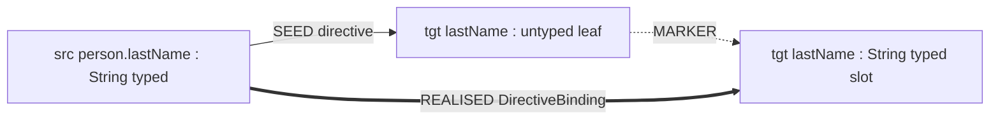

## Context

After `target-to-source-expansion` (2026-05-17), the realisation engine is a thin, per-`ExpansionGroup`, target-driven greedy driver. Strategies stay myopic — they declare what they produce from what input types via `BridgeStep`/`GroupBuild`, and the driver materialises intermediates and registers nested groups. After `source-path-resolvers` (2026-05-18), `SeedGraph` types every directive's source chain via `PathSegmentResolver`s and routes the directive-bridging SEED edge from the typed source to the untyped target leaf, carrying the `@Map` mirror.

Two pre-existing engine gaps then surface, both blocking integration on `~/Projects/joke/percolate-integration/mappers`:

1. The SEED chain from typed source to untyped target leaf to typed target slot (via the MARKER edge `ResolveTargetChainsPhase` already emits) encodes the directive's pinning structurally, but `ResolveTargetChainsPhase` never consumes it to bind the typed slot to a specific source. The driver in `ExpandGroupsPhase` then chooses any same-typed candidate by `Node::id` and silently picks the wrong source.
2. `ExpandGroupsPhase.registerElementSeedGroup` materialises the element-seed input/output nodes and the nested group declared by container bridges via `BridgeStep.elementSeeds`, but emits no REALISED edge from the parent step's input candidate to the element-seed input. The slot is disconnected from any source-parameter-root, the driver falls through to bridges, `OptionalWrap` misfires and synthesises an unproducible intermediate, and the chain dead-ends.

Both gaps live in scaffolding/driver code. The fix preserves the locked-in invariants ([[project-expansion-direction]], [[project-expansion-mental-model]]) and changes no SPI. Bundled with both is the deferred removal of `GetterRead`-as-`Bridge`, whose role (resolving getter-shaped source chains) has been superseded by `GetterPathResolver` (seed-time) + directive-pinning (scaffold-time).

```mermaid
graph TD
  subgraph current["Today: typed source, type-only realisation"]
    A1[src person2.first String typed]
    B1[tgt firstName ?]
    C1[tgt firstName String typed slot]
    D1[src person.lastName String typed]
    A1 -- SEED directive --> B1
    B1 -. MARKER .-> C1
    D1 -. DirectAssign type-only --> C1
    note1[wrong source wins]
  end

  subgraph proposed["After this change: directive-pinned scaffolding"]
    A2[src person2.first String typed]
    B2[tgt firstName ?]
    C2[tgt firstName String typed slot]
    A2 -- SEED directive --> B2
    B2 -. MARKER .-> C2
    A2 == REALISED DirectiveBinding ==> C2
  end
```

## Goals / Non-Goals

**Goals:**

- Make the realisation engine consume the directive-carrying SEED+MARKER chain structurally, so the typed source named by `@Map` always reaches its corresponding typed target slot — without `ExpandGroupsPhase` running type-only bridge searches for those slots.
- Make every container bridge's `ElementSeed` declaration materialise as a complete subgraph: the element-seed input has an incoming REALISED edge from the outer iterable input, so `SourceReachability.slotReachable` succeeds without driver misfires.
- Remove `GetterRead`-as-`Bridge` in the same commit as the engine fix, so the "engine green" milestone is the one where the legacy fallback disappears.
- Land the change at the integration boundary: `~/Projects/joke/percolate-integration/mappers` compiles green with `mapAddress` present, and generated `PersonMapper.java` reads each directive's named receiver.

**Non-Goals:**

- Change the `Bridge`, `GroupTarget`, or `ElementSeed` SPI. Strategies stay myopic; the SPI surface is unchanged.
- Change `SeedGraph` or `PathSegmentResolver`s. The typed source chain + typed bridging SEED edge from `source-path-resolvers` is the input we consume; we do not adjust it.
- Add directive-pinning logic to `ExpandGroupsPhase`'s `tryBridges` / `candidateInputs`. The driver continues to be myopic about directives — the scaffolding hands it a 1-slot group with the source already pinned.
- Implement automatic same-name mapping (no-`@Map` directive synthesis). Deferred to a future change. With `GetterRead`-as-`Bridge` removed, mapper authors must write explicit `@Map` directives until that change lands.
- Re-introduce multi-producer commit, structural dedup, or forward expansion. None of these is touched.

## Decisions

### Decision 1: Directive-pinning lives in `ResolveTargetChainsPhase`, not in strategies and not in `ExpandGroupsPhase`

When `ResolveTargetChainsPhase` allocates a typed target slot from a `ConstructorCall.buildFor(...)` result, it already holds `(slotNode, seedNode)` where `seedNode` is the untyped target leaf (per the existing `findCorrespondingSeedNode` call). The phase already emits a `MARKER` edge from `seedNode` to `slotNode`. We extend the same step to additionally inspect the SEED edges incoming to `seedNode`. When exactly one such SEED edge originates at a typed source node (the typed bridging edge from `source-path-resolvers`), the phase allocates a 1-slot `ExpansionGroup` whose root is the slot and whose slot is the typed source, registers the group, and adds a REALISED edge from the typed source to the slot.

**Why scaffolding, not strategy or driver:**

- [[feedback-strategies-stay-myopic]]: strategies never inspect the graph; SEED-chain consultation is incompatible with the SPI contract.
- [[project-expansion-direction]]: `ResolveTargetChainsPhase` is *the* target-side scaffolding phase. Adding "consume SEED chain to pin sources" fits its existing role of "consume SeedGraph's declarations and turn them into expansion groups."
- The driver (`ExpandGroupsPhase`) sees a group whose slot is already reachable from a source-parameter-root (the slot *is* the typed source). `slotReachable` returns true immediately; no bridge work runs for that slot. The driver remains myopic.

**Alternatives considered:**

- *Filter `candidateInputs` in `ExpandGroupsPhase`.* Rejected: pushes "consult SEED chain" into the driver, which the memory marks as a regression vector.
- *Add a new phase between `ResolveTargetChainsPhase` and `ExpandGroupsPhase`.* Rejected: same data, same predicate, same outputs as ResolveTargetChainsPhase already produces — splitting it adds a phase boundary without separating concerns.
- *Have `SeedGraph` create the directive-binding group.* Rejected: the typed target slot does not exist at `SeedGraph` time; it is allocated later by `ResolveTargetChainsPhase` after `ConstructorCall.buildFor` runs.

### Decision 2: Pass-through codegen and `DirectiveBinding` sentinel strategy FQN

The directive-binding REALISED edge carries:

- Weight: `Weights.STEP` (the cheapest non-NOOP; "this is a direct assignment after type resolution").
- Codegen: `(vars, inputs) -> CodeBlock.of("$L", inputs.single())`. The slot value is the source value, verbatim.
- `strategyClassFqn`: the literal string `"io.github.joke.percolate.processor.stages.expand.DirectiveBinding"`, with no corresponding `Bridge` or class — it's a sentinel.

**Why a sentinel and not a real `Bridge`:**

- The directive-binding edge is scaffolding, not a strategy match. There is no SPI implementation behind it; making it a `Bridge` would invite the impossible-to-test "fires only when SEED chain is present" semantics.
- The DOT renderer (`graph-debug-output`) already labels edges by simple name derived from `strategyClassFqn`. A stable sentinel renders as `DirectiveBinding` in dot output, which is exactly the label we want.
- Diagnostic output gets a self-describing strategy name without needing a fake class.

**Why pass-through codegen and not `DirectAssign`'s codegen:**

- They do the same thing (`$L`, the slot value). Reusing `DirectAssign`'s class would falsely attribute the edge to a `Bridge`; we want the dot output to show `DirectiveBinding` so it's distinguishable from the engine's type-only DirectAssign matches.
- Identical render output, different provenance — the renderer is the right place to surface that distinction.

**Alternatives considered:**

- *Reuse `DirectAssign.class.getName()` as the FQN.* Rejected: collapses the provenance distinction; you can't tell from a dot dump whether the edge came from directive pinning or type-only matching.
- *Introduce a real `DirectiveBinding` class implementing `Bridge`.* Rejected: a class that exists only to provide a label is dead code; a sentinel string is honest about what it is.

### Decision 3: Element-seed iteration edge in `registerElementSeedGroup`, attributed to the parent bridge

`ExpandGroupsPhase.commitBridgeStep` already has both `candidate` (the outer iterable source node) and the `BridgeStep` in scope when it calls `registerElementSeedGroup`. We thread `candidate` and the parent step's `strategyClassFqn` + `weight` into `registerElementSeedGroup` so it can emit `Edge.realised(candidate, elemFromNode, parentWeight, passThroughCodegen, parentStrategyFqn)` alongside the nested group it already registers.

**Why attribute the edge to the parent bridge (SetMap/ListMap/OptionalMap), not a sentinel:**

- Semantically, the iteration *is* part of the parent bridge's transformation. SetMap, by virtue of its container-map nature, expands "outer iterable" into "element scope" — the iteration edge belongs to the same conceptual unit as the outer SetMap REALISED edge.
- The dot label `SetMap (2)` on the element-seed-input incoming edge correctly tells the reader "this value comes from the SetMap iteration."
- A separate sentinel would imply a separate strategy match; there isn't one.

**Why pass-through codegen on this edge too:**

- The actual iteration code is generated by the parent SetMap step (its codegen emits `for (...) { ... }` or `stream().map(...)`). The element-seed input is just "the iteration variable" — its incoming edge is structural, not code-emitting.
- A throw-on-render codegen (`new UnsupportedOperationException`) would be honest about "this edge generates no code on its own," but pass-through is simpler and matches Decision 2's pattern.

**Alternatives considered:**

- *Special-case `slotReachable` to treat element-seed inputs as implicitly reachable when their containing iterable is reachable.* Rejected: hides the structural relationship behind a reachability rule; the dot output stops being a faithful recipe.
- *Make `ElementSeed` carry the iterable type so the driver can find the candidate.* Rejected: the driver already has the candidate locally in `commitBridgeStep`; the SPI shouldn't grow to expose it.
- *Move `registerElementSeedGroup` into the strategy.* Rejected by [[feedback-strategies-stay-myopic]].

### Decision 4: Bundle `GetterRead` removal in the same change

`source-path-resolvers/proposal.md` deferred `GetterRead`-as-`Bridge` removal to "after integration is green." Integration green is *this* change. Bundling removes the legacy fallback in the same commit that makes the new path mandatory, leaving no window where both code paths exist and could be exercised differently by different tests.

**What gets deleted:**

- `strategies-builtin/src/main/java/io/github/joke/percolate/spi/builtins/GetterRead.java`
- `strategies-builtin/src/test/groovy/.../GetterReadSpec.groovy`
- `strategies-builtin/src/test/groovy/.../GetterReadMultiHopSpec.groovy`
- `GetterRead` assertion in `BuiltinServiceRegistrationSpec.groovy`
- The stale `GetterRead-as-SourceStep` requirement in `expansion-strategy-spi/spec.md` (left over from before `target-to-source-expansion`; the current code is `GetterRead-as-Bridge`)
- `GetterRead` from the eleven-required-specs list in `builtin-strategy-unit-tests/spec.md`
- `GetterRead` label scenarios in `graph-debug-output/spec.md`

**Why a single commit:**

- One-commit regression window: either the integration is green with the new directive-pinning path and `GetterRead` gone, or the change is rolled back as a unit.
- Anyone bisecting a future regression has a single suspect commit for "the day GetterRead-as-Bridge stopped firing"; no need to look at two commits in sequence.

**Alternatives considered:**

- *Separate follow-up change.* Rejected here per user decision; the integration acceptance is the same regardless, and bundling removes a step.

### Decision 5: Directive-binding scaffolding triggers only when source and slot share the exact same type

The scaffolding-time predicate for emitting a `DirectiveBinding` group:

```
exists exactly one SEED edge `e` with e.to == seedNode, e.from typed,
  AND Types.isSameType(e.from.type, slot.type)
```

When the predicate fails (no typed SEED source, multiple typed SEED sources, or type mismatch), the phase does not allocate a directive-binding group; `ExpandGroupsPhase` falls through to ordinary bridge search.

**Why exact `isSameType`, not `isAssignable` or any kind of subtyping/widening tolerance:**

- The project's direction is to add first-class conversion strategies (`IntegerToLong`, `EnumToString`, `IntToInteger`/`IntegerToInt`, …) as ordinary `Bridge`s that emit their own REALISED edges. Conversions thereby become **explicit in the graph** and surface in `*.transforms.dot` as labelled steps.
- A directive-binding edge with pass-through `$L` codegen claims "this slot's value *is* this source's value." That claim is honest only for same-type bindings. Any subtyping or boxing-tolerant rule would silently hide a conversion the user would otherwise see in the transforms view.
- Pass-through codegen across types compiles in many JVM cases (Long widening, autoboxing) but encodes the user's intent imprecisely. We prefer "no scaffolding, fall through to bridges" over "silent conversion baked into directive-binding."

**Consequence for mismatched-type directives:**

`ExpandGroupsPhase` runs ordinary bridge search to satisfy the typed slot. Once conversion strategies land, the engine will find an explicit conversion chain (e.g., `Integer → Long` via `IntegerToLong.bridge(...)`). The chain's `from` candidate is selected by the engine's existing rules (lexically first matching strategy, then first matching candidate by id). For directives whose source has a unique same-typed candidate in scope (the common case — container conversions in the integration `PersonMapper` are like this), the engine picks correctly even without directive-pinning. For directives whose mismatched-source resolution is ambiguous (multiple convertible-source candidates), the wrong-source bug remains; we revisit when the ambiguity actually surfaces, presumably alongside the conversion-strategies change.

**Alternatives considered:**

- *`Types.isAssignable(sourceType, slotType)` permitting subtype direct assignment.* Rejected: hides conversions (widening, boxing) behind a pass-through edge instead of making them explicit graph steps.
- *Always emit the directive-binding group; let codegen fail loudly if types don't match.* Rejected: directive-binding would then be a parallel realisation path to ordinary bridge search, two ways of doing the same job.
- *At scaffolding time, query bridges to find a conversion chain and bake it into the directive-binding group's codegen.* Rejected: duplicates `ExpandGroupsPhase`'s bridge-search logic in the scaffolding phase. Conversions belong in the bridge layer where they already get the deterministic-iteration / multi-hop-frontier treatment the engine already implements.

### Decision 6: No change to existing `MARKER` semantics

The MARKER edge `seedNode → slotNode` that `ResolveTargetChainsPhase` already emits stays. The new REALISED `directivePinnedSource → slotNode` edge sits alongside it; they describe two different things:

- MARKER: "the untyped seed leaf for this target path corresponds to this typed slot" (diagnostic origin tracking).
- REALISED: "the directive's typed source produces the slot's value" (the realisation recipe).



## Risks / Trade-offs

[**Risk**] Transforms-view tests count REALISED in-edges on typed target slots. Today every typed slot has exactly one REALISED in-edge (from `ConstructorCall`'s slot→root in the wrong direction… actually slot→root is REALISED outgoing; incoming for the slot comes from `tryBridges`). After this change, directive-pinned slots gain one *extra* incoming REALISED edge from the typed source. → **Mitigation:** audit `processor/src/test/groovy/.../expand/*Spec` for transforms-view assertions; update expected counts where needed. The integration project's `*.transforms.dot` is the acceptance signal.

[**Risk**] `GetterRead`-as-`Bridge` removal could break a test fixture or scenario that relied on implicit getter-bridging without a `@Map` directive. → **Mitigation:** the integration mapper has `@Map` directives everywhere; processor tests using fake bridges (`processor/src/test/groovy/.../expand/properties/fakes/`) don't use `GetterRead`. The strategies-builtin unit specs for `GetterRead` are deleted alongside the implementation. If any other test fails after deletion, the corrective action is to add an explicit `@Map` directive, not to revive the bridge.

[**Risk**] Element-seed iteration edge attribution to the parent bridge means a SetMap step emits two REALISED edges (the outer container-map edge plus the element-seed iteration edge) with the same `strategyClassFqn`. → **Mitigation:** acceptable. Existing tests counting "REALISED edges with `strategyClassFqn == SetMap`" need updating to expect two per matched SetMap step instead of one. The dot renderer can disambiguate via edge labels (`SetMap (2)` vs `SetMap iteration`); the spec leaves the label to the renderer.

[**Risk**] `DirectiveBinding` as a sentinel `strategyClassFqn` means no class with that FQN exists. → **Mitigation:** the dot renderer derives the simple name by string split; no class lookup is performed. Diagnostic output similarly uses the FQN as an opaque tag.

[**Risk**] The directive-binding predicate fires per-slot, and a `ConstructorCall` group has multiple slots. If two slots share the same untyped seed leaf (e.g., misconfigured mapper) the phase would attempt two directive-binding groups against the same source. → **Mitigation:** `ConstructorCall`'s slot-naming logic ensures distinct seed-leaf-to-slot mappings under any well-formed mapper. The phase emits at most one directive-binding group per `(slot, SEED-edge)` pair; double-emission is structurally impossible.

[**Risk**] Mismatched-type directives are not directive-pinned in v1. A directive `@Map(source = "person.age")` (returning `int`) into a slot of type `Long` falls through to ordinary bridge search; once a conversion strategy (e.g., `IntToLong`) lands, the engine resolves the chain via that strategy. If multiple `int` candidates are in scope, the engine's existing tie-break (lexically first matching strategy, then first candidate by `id()`) picks one — not necessarily the directive-named one. → **Mitigation:** the integration `PersonMapper` does not exercise this combination; today's same-type directives plus single-candidate container conversions cover acceptance. Revisit when conversion strategies + multi-source ambiguity actually collide in a real mapper.

## Migration Plan

This is a pure addition for directive scaffolding plus a strategy deletion; no persisted state, no runtime data migration. Deployment plan:

1. Land the engine fix (`ResolveTargetChainsPhase` directive-binding scaffolding, `ExpandGroupsPhase.registerElementSeedGroup` iteration edge).
2. Run `./gradlew check` (root): processor and strategies-builtin tests green.
3. Run integration build at `~/Projects/joke/percolate-integration` with `mapAddress` present: compile succeeds; generated `PersonMapper.java` emits `person.getLastName()` and `person2.getFirst()` for the right targets, and the SetMap chain calls `mapAddress`.
4. Delete `GetterRead.java`, its two specs, the `BuiltinServiceRegistrationSpec` assertion, and the four spec-level references (in `expansion-strategy-spi`, `builtin-strategy-unit-tests`, `graph-debug-output`).
5. Re-run `./gradlew check` and integration — both green.
6. Run integration with `mapAddress` commented out: compile fails with the closest-miss diagnostic still naming `Person.Address` (unchanged from today).

Rollback: revert the change as a unit. The directive-binding scaffolding and the element-seed iteration edge are both additive; removing them reverts to today's broken-integration state, which is at least a known state.

## Open Questions

- Should the `DirectiveBinding` sentinel FQN live in a constants class somewhere (e.g., `Weights.DIRECTIVE_BINDING_FQN`) or remain a literal string in `ResolveTargetChainsPhase`? Literal string is fine for v1; promote to a constant if it appears in two or more places.
- Does the directive-binding REALISED edge need to be filtered out of `*.transforms.dot` (the structural view), or shown as part of the transform recipe? Showing it makes the transforms view a true recipe (the codegen *will* emit `$L` for that edge); filtering it muddies the relationship between the dot view and the generated code. Default: show it.
- Once auto-mapping (no-`@Map` directive synthesis) lands, the directive-binding scaffolding applies uniformly to synthesized directives, no change needed here. Worth noting in [[project-expansion-direction]] when that change lands.
- Ambiguous mismatched-type directives: when conversion strategies (`IntToLong`, `EnumToString`, etc.) land alongside a mapper that exposes multiple convertible-source candidates per slot, directive-pinning will need to extend to mismatched-type cases. The likely shape is the same `ResolveTargetChainsPhase` scaffolding emitting a chain of REALISED edges from the typed source through one or more conversion bridges to the typed slot, with conversion-strategy selection driven by the same deterministic tie-break the engine uses. Out of scope for this change.
