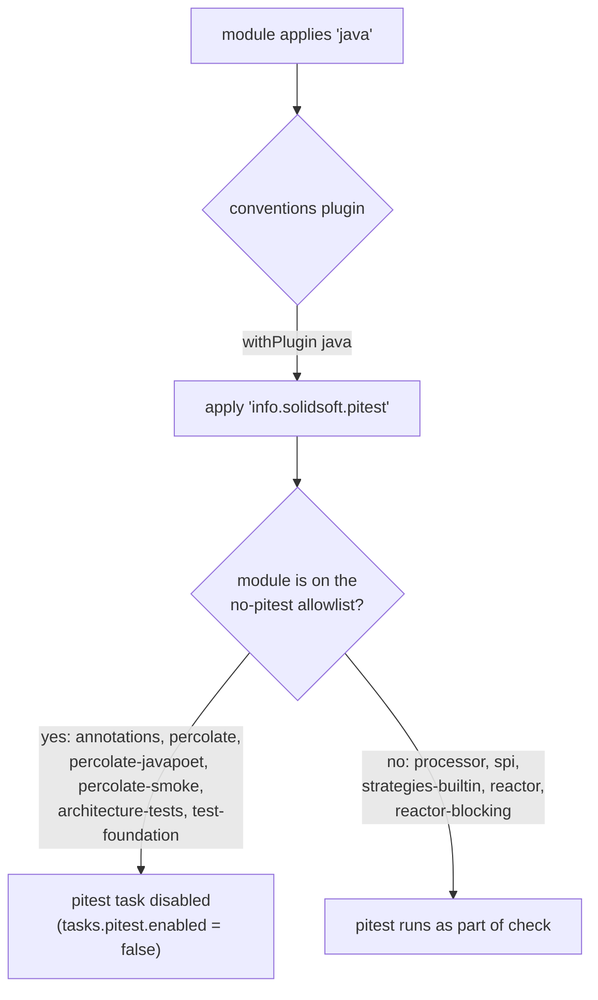

## Context

`percolate.conventions.gradle` (buildSrc) is the single cross-module Gradle convention plugin applied by every module (see `isolated-projects-build`). Today it unconditionally applies `jacoco` under `withPlugin('java-base')` and only *configures* `info.solidsoft.pitest` reactively (`pluginManager.withPlugin('info.solidsoft.pitest') { ... }`) — the plugin itself must still be declared per-module. Three modules (`processor`, `spi`, `strategies-builtin`) declare it; `reactor` and `reactor-blocking`, which carry real production code and real Spock suites, do not.

`reactor`/`reactor-blocking` additionally force `maxParallelForks = 1` plus disabling both JUnit and Spock parallelism — traced via `git log -p` to a jqwik-era commit protecting a shared `build/jqwik-database` directory from concurrent property-based test runs. jqwik was later removed as a rejected experiment (`feedback_no_jqwik`); the serial-execution config was never cleaned up.

`processor/build.gradle` carries a 7-class `jacocoExcludes` list duplicated as pitest's `excludedClasses` — the same classes carved out of both gates. `spi` and `strategies-builtin` override the shared pitest thresholds down to `mutationThreshold=10 / coverageThreshold=60 / testStrengthThreshold=15`. For `spi`, `engine-test-quality` documents *why*: a prior measurement found 16–26% mutation kill and 24–40% test strength varying run to run, attributed to pitest's own test-to-mutant attribution rather than a shared-substrate race — concluded, notably, before `dissolve-private-type-universe` (2026-07-13) deleted the last javac-backed unit fixture repo-wide. That conclusion is worth re-validating, not assumed to still hold.

## Goals / Non-Goals

**Goals:**
- One coverage tool (pitest) instead of two overlapping ones.
- Uniform pitest enrollment rule driven by the conventions plugin, not per-module copy-paste.
- Zero build-level pitest/jacoco exclusions; suppression becomes a source-level, reviewable annotation.
- One shared threshold triple (85/95/90) with no per-module carve-outs.
- Remove the jqwik-era serial-execution fossil from `reactor`/`reactor-blocking`.

**Non-Goals:**
- Not re-enabling Gradle Isolated Projects (still blocked by `info.solidsoft.pitest`'s own root-touching behavior — see `isolated-projects-build`; wider enrollment doesn't change that blocker's shape).
- Not introducing a different mutation-testing tool or a coverage-reporting service (codecov, etc.).
- Not a general test-suite rewrite — only the specific classes/modules the raised gate flags.

## Decisions

### 1. Auto-apply pitest via an opt-out list in the conventions plugin, not an opt-in list

Two ways to wire "most `java` modules get pitest, six don't":
- **(a) Allowlist**: keep `id 'info.solidsoft.pitest'` explicit per enrolled module (status quo shape, just move config).
- **(b) Denylist**: conventions applies pitest under `withPlugin('java')` unconditionally, then the six excluded modules opt out.

Chosen: **(b)**, because the point of moving pitest into conventions at all is that new modules with real code get mutation testing *by default* — an allowlist just relocates the same per-module decision the exclusion-ban is trying to eliminate elsewhere. Concretely:

The disabling mechanism itself is the opposite of an "exclusion" in the sense this change bans (that ban targets *what pitest mutates within an enrolled module* — classes/methods — not *whether a module with zero mutable production logic runs pitest at all*). Disabling the whole task for a module with no main source is a different, legitimate on/off switch; the six modules turning it off each have a one-line, self-evident reason (no main source, or main source with zero unit-tagged tests), listed in the proposal. If a future module needs the same treatment, that's a new one-line entry, not a build-wide policy exception.

### 2. Suppression is an annotation, not a Gradle-level exclusion

`com.groupcdg:pitest-annotations` is already a `compileOnly` dependency wherever pitest applies (unused until now). `@DoNotMutate` and `@CoverageIgnore` require no new Gradle wiring beyond what's already there — the pitest Gradle plugin recognizes them at the mutation-engine level once the annotation is on the compile classpath. This makes every suppression a `git blame`-able, PR-reviewable line in the source file it protects, rather than an invisible-at-review-time string in a build script far from the code it exempts.

### 3. spi's threshold: root-cause first, override never

Given the `dissolve-private-type-universe` timeline, the historical variance measurement significantly predates the removal of the last javac-backed test fixture. Re-measure before assuming the old finding still applies:
1. Run `spi`'s pitest with cleared history several times at the current thresholds.
2. If the score is genuinely flat (no javac substrate left to race), raising to 85/95/90 is a normal test-writing problem — write the missing tests.
3. If variance reappears, it is now happening with **zero** javac in the unit path (confirmed by `builtin-strategy-unit-tests` and the current `engine-test-quality` text) — so the cause is either pitest's mutant-to-test attribution (as previously concluded) or something new. Either way, the fix belongs in this change: either restructure the ambiguous tests pitest is scoring inconsistently (multiple tests weakly covering the same mutant is itself a test-quality smell worth fixing), or, if attribution nondeterminism turns out to be an inherent pitest limitation unrelated to test quality, that's a finding to document plainly rather than silently re-lowering the floor.

No per-module override is reintroduced as a way out of step 3.

## Risks / Trade-offs

- **[Risk] Raising `spi`/`strategies-builtin` thresholds from 10/60/15 to 85/95/90 may require substantial new test-writing, not just config changes.** → In scope for this change per explicit instruction; tasks.md sequences build-plumbing first so the real gate is live early and test-writing work is measured against it directly instead of against guesswork.
- **[Risk] `reactor`/`reactor-blocking` have never run pitest; removing forced serial execution and enrolling both at once conflates two independent changes if something breaks.** → Mitigation: land serial-execution removal and plain `check` (no pitest yet) first, confirm parallel execution is clean on its own, then enroll pitest as a separate step — see tasks.md ordering.
- **[Risk] A previously-excluded processor class (e.g. Dagger-generated code) turns out to be mutable in ways that reveal a real gap, not just noise.** → Treat pitest's findings as the ground truth once the exclusion is lifted; annotate only what's genuinely unmutatable (generated code, pure debug output), restructure the rest.
- **[Trade-off] Denylist-based auto-enrollment means a brand-new module with real code and no tests yet will fail `check` immediately (`failWhenNoMutations = true`) instead of silently skipping pitest.** → Accepted: that failure is the correct signal (write tests before shipping logic), not a defect.

## Open Questions

None outstanding — enrollment set, threshold values, suppression annotations, and the spi variance approach were all resolved with the user before this document was written.
