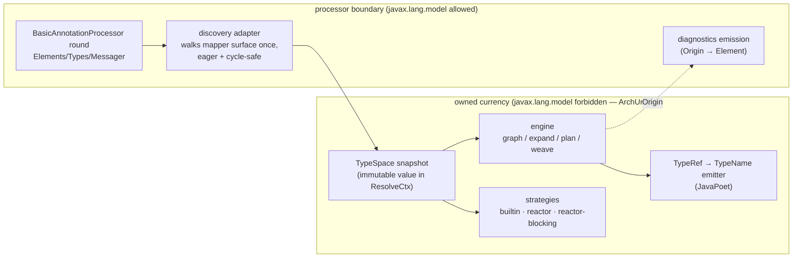
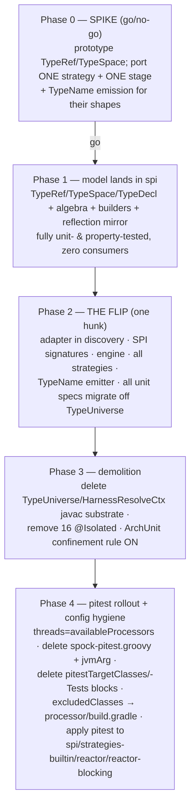

# Design: evict-javax-model

## Context

The engine and SPI currently use `javax.lang.model` (`TypeMirror`, `TypeElement`, `Types`, `Elements`) as
their type currency. A `TypeMirror` is a handle into a live javac session: lazy, mutable behind the scenes,
thread-hostile, and without value equality. Consequences today:

- Tests need a shared javac → the all-static `TypeUniverse` singleton → races under threaded pitest,
  javac "Filling X during Y" assertions, `SynchronizedElements`, eager closure-priming, 16 `@Isolated`
  specs, `threads = 1`, and a serialised `spock-pitest.groovy` minion config.
- Production cannot key by type: `Value.id()` dedups the graph by `TypeMirror::toString`;
  `MethodScope`/`SelfCallGuard` string-key the same way; nullability is bolted beside the mirror in `Value`
  identity because it cannot live in it.
- Every future SPI consumer inherits the same untestability (15 SPI files carry `TypeMirror`).

Measured production surface (the entire behaviour to replace): `Types.erasure/isSameType/isAssignable/
getDeclaredType/boxedClass/unboxedType/getPrimitiveType/getArrayType`; `Elements.getTypeElement/
getAllMembers/getPackageOf/getBinaryName/getName`; plus the model objects those hand out. JavaPoet consumes
mirrors at 7 sites via `TypeName.get(mirror)`. Discovery already produces owned vocabulary
(`CallableMethods`, `MethodCandidate`, `MappingDirective`).

> **Architecture shift — explicit warning.** This change replaces the SPI/engine type currency. It is a
> deliberate, contained shift: it does **not** alter the locked north star (no IR, target-driven demand,
> myopic strategies, composition ⟂ snippets, container model). It swaps a *foreign* currency for an *owned*
> one at the same seams, and strengthens the existing invariants (strategies become authorable without any
> `javax.lang.model` import; the graph gains real value identity).

## Goals / Non-Goals

**Goals:**

- One immutable, thread-safe type currency (`TypeRef` + `TypeSpace` snapshot) owned by the SPI.
- `javax.lang.model` confined to the processor boundary (discovery adapter, diagnostics emission,
  generated-file writing), enforced by ArchUnit.
- Unit tests construct type fixtures as plain values — no javac, no shared state, no serialisation
  anywhere in the unit path.
- Threaded pitest (`availableProcessors()`) on **all** production modules; all pitest workarounds deleted.
- The e2e compile-tests stay green throughout — they gate the adapter against real javac.

**Non-Goals:**

- JLS-faithful subtyping (wildcard calculus, capture conversion, infinite types). The algebra is
  *lawful, not faithful*; real Java semantics are validated by the feature-e2e layer (real compiles).
- Changing any engine algorithm (expansion, SAT/cost, weaving, port sourcing) — currency only.
- The `features-as-documentation` re-slice (next change).
- Public API stability guarantees — pre-1.0, this is the last cheap moment for the break.

## Decisions

### D1 — Own currency, not a better substrate

Alternatives considered:

| Option | Verdict |
|---|---|
| Immutable fake `Types`/`Elements` (test-only) | Treats the symptom; SPI stays hostile (no value equality, strategy authors keep the testing problem); an elaborate artifact whose destiny is deletion |
| Per-thread/per-spec javac tasks | Mirrors from different tasks don't compare; static constants used in `where:` blocks break; keeps javac fragility |
| Keep `@Isolated` + `threads = 1` | The bridge we already have; blocks the pitest rollout; recurring cost |
| **Own immutable model, javac dies at discovery** | **Chosen** — removes the disease; fixes production string-keying; makes the SPI self-testable |

### D2 — `TypeRef`: pure data, no behaviour

A small closed hierarchy of immutable values (Java 11 → Lombok `@Value`, no records/sealed):
`DeclaredRef` (qualified name, type arguments, reference to its `TypeDecl`), `PrimitiveRef` (kind),
`ArrayRef` (component), `VariableRef` (name, for functor-lift matching), `NoneRef` (void/none). Value
equality and `hashCode` come from the data — `Value` dedup, map keys, and set membership become honest.
`toString` renders the source form (`java.util.List<java.lang.String>`), preserving today's rendering
convention (harness fakes/`Name` compare via `toString`).

**Nullability stays outside `TypeRef`.** The three-axes architecture (nullability / presence / sequence)
already models nullness as its own axis keyed beside the type in `Value`; folding it into `TypeRef` would
double-key it and ripple through every equality site. No change to the axis model.

### D3 — `TypeSpace`: the algebra lives on the snapshot, refs stay dumb

`TypeSpace` is an immutable snapshot value answering exactly the measured surface: `isSameType` (structural),
`isAssignable`, `erasure`, `declared(fqn, args…)`, `arrayOf`, boxing/unboxing (fixed 8-entry table),
`decl(fqn)` lookup, and member enumeration. It is **passed through `ResolveCtx` — never ambient, never
static**. That is the structural cure: shared mutable singleton → passed immutable value; there is nothing
left to race on, so parallel Spock and threaded pitest are safe by construction.

Assignability is a reflexive-transitive walk over declared supertype edges. Edges carry the declared
supertype *with its type arguments in terms of the subtype's variables* (`ArrayList<E> → List<E>`), so the
walk substitutes arguments; same-erasure comparison is invariant (`isSameType` pairwise on args); raw types
fall back to erasure. No wildcards in v1 (spike verifies none are needed by current strategies).

### D4 — Member model: only what production touches

`TypeDecl` (kind: class/interface/enum, modifiers, supertype edges, members) with `MethodSig`
(name, parameters, return `TypeRef`, static/default/abstract flags) and `FieldSig`. Constructors are
`MethodSig`s with a marker. This replaces `TypeElement`/`ExecutableElement`/`VariableElement` everywhere the
engine or a strategy reads structure (accessor discovery, callable indexing, constructor assembly).

Directives are already extracted at discovery (`MappingDirective`); with the adapter, extraction is complete
there — **engine-side code never sees an `AnnotationMirror`**. Test fixtures therefore never need real
annotations: specs construct directive values directly.

### D5 — Diagnostics keep positions via an opaque origin token

`Messager` needs real `Element`s/`AnnotationMirror`s for error positioning. Model values carry an opaque
`Origin` handle that only the boundary can resolve back (registry populated by the adapter during
discovery). The engine passes it through untouched. ArchUnit exempts the diagnostics-emission and adapter
packages; everything else is `javax.lang.model`-free.

### D6 — The adapter is discovery, finishing what it started

The adapter eagerly materialises the reachable type closure from the mapper's declared surface (parameter
and return types, their accessor/member types transitively, callable-method signatures, directive-referenced
types), with a visited-set for cycles (`Person → Person`). Annotation processing is single-threaded per
round, so the walk is race-free by context; the *result* is immutable.

### D7 — `TypeRef → TypeName` emission replaces `TypeName.get(mirror)`

One emitter in codegen: qualified names → `ClassName` (nested-aware via the decl's enclosing chain), args →
`ParameterizedTypeName`, arrays/primitives directly, type-use `@Nullable` from the nullness axis exactly as
today. All 7 JavaPoet sites route through it.

### D8 — Test construction: literal builders + a reflection mirror for fixtures

Two fixture paths in `spi` testFixtures (replacing `TypeUniverse`/`HarnessResolveCtx`'s javac substrate):

- **Literal builders** — `TypeSpace` built inline in a spec: declare decls, edges, members. The default for
  engine seam tests and synthetic shapes.
- **Reflection mirror** — `TestTypes.of(Person.class)` mirrors a compiled fixture class's *structure*
  (methods, fields, constructors, generic supertypes via `getGenericInterfaces`/`AnnotatedType`) into decls.
  Keeps the class-literal ergonomics of `TypeUniverse.of(...)` so the ~46-file migration stays mechanical.
  Structure only — no annotations needed (D4). Plain `java.lang.reflect` is thread-safe and eager; no javac.

Prebuilt constants (`STRING`, `INT`, `LIST_OF_STRING`, …) return as plain values — safe in `where:` blocks
and across threads by construction.

### D9 — Cutover is atomic at the SPI seam; phases around it

The `ResolveCtx`/`Demand` signature change cannot be half-applied (engine on `TypeRef`, strategies on
mirrors is not a buildable state). Phasing isolates the risk *before* the flip:

Gates: e2e compile-tests + `percolate-smoke` green after Phases 2–4; pitest ratchets hold in `processor`
after Phase 4. Rollback at any phase = `git revert` (no persisted state, no data migration).

**Amendment (2026-07-04) — Phase 2 lands via a transitional bridge, not one hunk.** Measuring the flip
surface (84 production files carrying `javax.lang.model` + 94 specs on `TypeUniverse`) showed it is a
*semantic* rewrite — the `Grounding`/`PortType` collapse into `TypeSpace.match`/`ground`, and a multi-site
nullness relocation (`Demand.nullnessOf` callers in `Accessor`/`ConstructorCall`/`MethodCallBridge` move
onto adapter-resolved `MethodSig`/`ParamSig` nullness) — not the "mechanical signature-following" this
section assumed. An all-or-nothing hunk of that size is unverifiable. Phase 2 therefore lands
incrementally: `ResolveCtx` exposes `typeSpace()` **alongside** the existing `types()`/`elements()` (the
adapter sits at the boundary and holds both), consumers migrate subsystem by subsystem with the e2e +
smoke suites green at every commit, and the `javax.lang.model` accessors are deleted last — that deletion
is the true "flip". Same end state and the same ArchUnit confinement (which only switches on in Phase 3);
the only change is that intermediate states compile. Tasks 3.1–3.7 are unchanged as units of work; they
are committed as green increments rather than a single hunk.

## Risks / Trade-offs

- **[Adapter closure walk misses a reachable type]** → e2e compile-tests exercise every shipped feature
  path against real javac before Layer 2 deletes them; missing types fail loudly (lookup throws, mapper
  defers with diagnostics).
- **[Generic-supertype substitution subtly wrong (e.g. `ArrayList<E> → List<E>`)]** → example-based Spock specs
  over the algebra laws (reflexivity, transitivity, erasure idempotence, boxing round-trips, substitution
  coherence) — `TypeSpaceSpec` + `StreamMapPortSpec`; spike exercises the container strategies that depend on it hardest.
- **[`TypeRef → TypeName` emitter diverges from `TypeName.get(mirror)`]** → golden spec comparing emitter
  output against JavaPoet's own rendering for every fixture shape (nested, generic, array, primitive,
  annotated); e2e output assertions unchanged.
- **[Lawful-not-faithful algebra accepts/rejects something real javac wouldn't]** → by design; the split of
  responsibility (engine logic vs. real semantics) is the plan of record's three-layer model. Feature e2e
  keeps real compiles as the semantic oracle.
- **[The flip (Phase 2) is a large uncommittable-in-parts hunk]** → phases 0–1 de-risk everything hard
  first; the flip itself is mechanical signature-following, gated by the full old test suite still in tree.
- **[Diagnostics positions regress via Origin indirection]** → diagnostics specs already assert message +
  position; adapter registry is a plain map populated where the Elements are in hand.

## Open Questions

- Whether root `build.gradle` pitest thresholds (`mutationThreshold` etc.) stay shared or also move
  per-module once multiple modules carry pitest — decide at Phase 4 with real scores in hand.

## Spike Findings (Phase 0, 2026-07-03 — GO)

- **Go.** All four spike targets passed on the first full `:spi:check`: the algebra (29 scenarios incl.
  the substituting `ArrayList<E>→List<E>→Collection<E>→Iterable<E>` walk, invariance, raw fallback,
  boxing round-trips), the `StreamMap` port (erasure match, element extraction, `match`/`ground`
  functor-lift grounding — ~30 lines where the mirror world needs `PortType` + engine unify machinery),
  the `SelfCallGuard` keying port (signature comparison is plain `equals`, string keys gone), and the
  `TypeName` emitter (golden-identical to `TypeName.get(mirror)` for declared/parameterised/nested/
  array/primitive shapes).
- **Names and package settle as prototyped**: `TypeRef`, `TypeSpace`, `TypeDecl`, `MethodSig` in
  `io.github.joke.percolate.spi.types`. Scratch code is **promoted in place**; Phase 1 hardens and
  extends these classes (the package-info drops its SPIKE framing when Phase 2 lands).
- **`Variable` needs no bounds in v1**: matching is structural one-way unification; names suffice.
  Bounds would only serve match-time validation the engine does not perform today.
- **Nested type-use nullness (was an open question)**: not representable in the spike and not needed by
  it. Decision: keep nullness out of `TypeRef` identity (D2 stands); when Phase 3.3/3.4 ports the DOT
  renderer and the nullness-axis derivation, carry per-argument marks as a lightweight optional wrapper
  ref (`TypeRef`-adjacent, excluded from equality) or as signature-side data resolved at the boundary —
  choose whichever the porting shows is smaller; the delta spec's wording ("the model's per-argument
  nullness data") accommodates both.
- **Primitive assignability is identity-only** in the model (javac widens; here widening stays a
  conversion-strategy concern). Deviation is deliberate and documented on `TypeSpace#isAssignable`;
  the e2e layer holds the real-semantics line.
