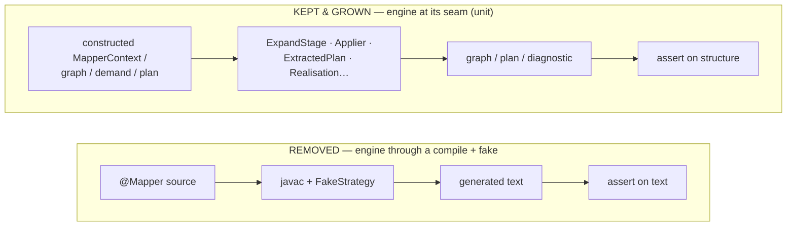
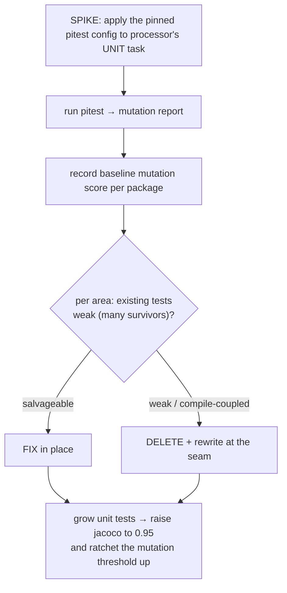

## Context

The `processor` engine currently earns most of its coverage from **fake-driven compile-testing**: specs
that stand up a `FakeStrategy`, run `javac` over a synthetic `@Mapper`, and assert on generated text. That
makes engine coverage slow, compile-coupled, and shallow — a mutated cost comparison or a broken hoist
often still produces *some* compiling output, so the test passes. The three-layer plan (`openspec/notes.md`)
makes the engine a **library**: tested at its own seams by unit tests, mutation-verified, with no strategy
and no fake. The integration confidence those compile-tests gave moves to the **feature-e2e layer** in the
very next change, so the gap this opens is closed immediately.

The build already separates the suites: `test` runs `@Tag('unit')`, `integrationTest` runs
`@Tag('integration')`, and jacoco writes `test.exec` and `integrationTest.exec` separately before merging
them against a `0.6` branch gate.

## Goals / Non-Goals

**Goals:**

- Test the engine **at its seams** — construct a stage/component's input (a `MapperContext`, graph, demand,
  or extracted plan) and assert its output, with no compilation — to a **95% branch gate** on the unit
  suite.
- Integrate **pitest on the unit suite only**, spike-validated, with a ratcheting mutation-score threshold.
- Remove the engine integration tests and the now-orphaned `FakeStrategy`.

**Non-Goals:**

- Feature or real-strategy integration coverage — owned by `features-as-documentation`, which closes the
  gap right after.
- pitest on the integration suite (it is slow precisely there; explicitly out of scope).
- Any production or behavioural change; re-adding an engine integration test (only on a later demonstrated
  need).

## Decisions

### D1 — Test the engine at its seam, not through a compile

The unit tests drive the engine's own structures directly and assert on structure, not generated text:

This is the style the existing engine unit specs (`BipartiteGraphSpec`, `CostSpec`, `ExtractedPlanSpec`,
`GroundingSpec`, `GoalSpecSpec`, …) already use; the change *extends* it to the stages and behaviours that
were only reachable through a compile before (self-seeding/descent, assembly hoisting, realisation
closest-miss, nullness crossing).

*Architecture note (per the "warn on shifts" rule):* this **removes the engine's compile-level test surface
inside `processor`** — a deliberate shift. It is safe only because the feature layer re-establishes
real-compile coverage immediately; this change must not ship as the final state of the test suite, and the
proposal/commit say so.

### D2 — pitest, unit-suite-only, spike-first

The pitest configuration is **fixed** (below), so the spike's job is to *validate it runs fast and useful
on the Spock unit suite*, *measure the baseline mutation score of the current engine tests*, and — the
deciding output — **decide per area whether the existing tests are fixed or deleted and rewritten from
scratch** based on what the mutation report exposes. A test area riddled with surviving mutants is cheaper
and cleaner to rewrite against the seam than to patch.

Fixed configuration (the spike validates, does not choose):

- Gradle plugin `id("info.solidsoft.pitest") version "1.19.0"`, bound to the unit `test` task
  (`@Tag('unit')`) and **excluding** `integrationTest` (pitest is slow only there).
- `pitest-junit5-plugin` **1.2.3** for Spock-on-JUnit-Platform support (the user-pinned `pitest 1.2.3`
  coordinate; the exact `pitestVersion` core pin is confirmed in the spike).
- **Incremental analysis enabled** (`enableDefaultIncrementalAnalysis = true`) so repeat runs only
  re-mutate changed code.
- **All mutators** (`mutators = ["ALL"]`) — maximal strictness, fitting "library-grade" engine tests.

Coverage (95% branch) and mutation score (kills) are tracked as two complementary gates; the mutation
threshold starts at the spike baseline and ratchets up as unit tests land.

*Alternatives considered:* pitest across both suites (rejected: the integration suite is where pitest is
slow, and it is being removed anyway); coverage-only, no pitest (rejected: 95% line coverage without
mutation verification still passes weak assertions — pitest is what makes the unit suite *trustworthy*,
which is the whole point of "engine as a library").

### D3 — A per-module 95% gate on `processor`, measured on the unit suite

The root applies a `0.6` branch gate to every jacoco module by merging all `*.exec`. With
`integrationTest` gone from `processor`, only `test.exec` remains, so the merged figure *is* the unit
figure. `processor` overrides its `jacocoTestCoverageVerification` to **`0.95` branch**; other modules keep
their existing gate. The override, not a global bump, keeps the 95% bar scoped to the engine that has
earned library status — the strategy modules are covered by the feature layer, not by this gate.

### D4 — Remove `FakeStrategy` and the engine integration specs together

`FakeStrategy` exists in `test-foundation` solely to drive these engine compile-tests; once they are gone it
is unused and is deleted along with its engine-side `META-INF/services` registration. `PercolateCompiler`
stays — the feature-e2e layer uses it with *real* strategies. The specs removed are exactly those that
compile a mapper with a fake to assert engine behaviour (`EngineWeavingFakeStrategySpec`,
`SelfSeedExpansionSpec`, `GenerateStageFailureModesSpec`, `DocTagsEmissionSpec`, and any sibling); their
asserted behaviours are re-expressed as seam-level unit tests where they are engine contracts (most are).

**`docTags` is relocated to `spi` and unit-tested there.** The tag-wrapping is a pure codegen transform
(wrap a `CodeBlock`/region in `// tag::<name>[]` / `// end::<name>[]`), so it belongs with the other codegen
helpers in `spi`, not buried in `BuildMethodBodies`. Extract it into an `spi` helper, have the engine call
it, and **unit-test it in `spi`** — no processor, no compile. That replaces the removed processor
`DocTagsEmissionSpec` with a fast, isolated test at the right layer.

## Risks / Trade-offs

- **95% branch on the engine is a tall bar** → some packages are legitimately hard/low-value to unit-cover
  (debug `dump`/`DotRenderer` output). Mitigation: cover them where feasible; use narrow, justified jacoco
  exclusions for pure-debug rendering rather than weakening the global bar — each exclusion noted.
- **pitest is new build infrastructure** → the spike de-risks it; if it cannot run the Spock unit suite
  acceptably, that is a recorded blocker, and the change proceeds with the 95% coverage gate while pitest is
  reconsidered (coverage lands regardless).
- **Deleting tests reduces coverage before unit tests replace it** → sequence within the change so the unit
  tests land *before* the gate is raised and the integration specs removed; never leave `main` red.
- **A removed integration spec covered something no unit test can reach** → if a behaviour genuinely needs a
  compile to assert, record it for the feature layer rather than keeping a lone fake-driven spec.

## Migration Plan

1. **Spike** pitest on `processor`'s unit task; record plugin, wiring, baseline mutation score, threshold.
2. Grow the engine unit tests at the seams toward 95% branch (stages, graph, plan, cost, hoist, realisation,
   nullness), ratcheting the pitest threshold as kills rise.
3. Raise `processor`'s jacoco gate to `0.95`; wire the pitest threshold into `check`.
4. Remove the engine integration specs and `FakeStrategy`; empty `processor`'s `integrationTest`.
5. `./gradlew check` green (unit 95% + pitest threshold); the ArchUnit boundary stays green.

*Rollback:* the change is tests + build config; reverting restores the prior specs and the `0.6` gate with
no production impact.

## Open Questions

- The exact `pitestVersion` core pin (the plugin `1.19.0` + `pitest-junit5-plugin` `1.2.3` + all-mutators +
  incremental analysis are fixed; D2) and the baseline/target mutation threshold — measured in the spike.
- Whether any debug/rendering package (`dump`, `DotRenderer`) warrants a narrow, justified jacoco exclusion
  to keep the 95% bar honest rather than weakened (D-risks).
