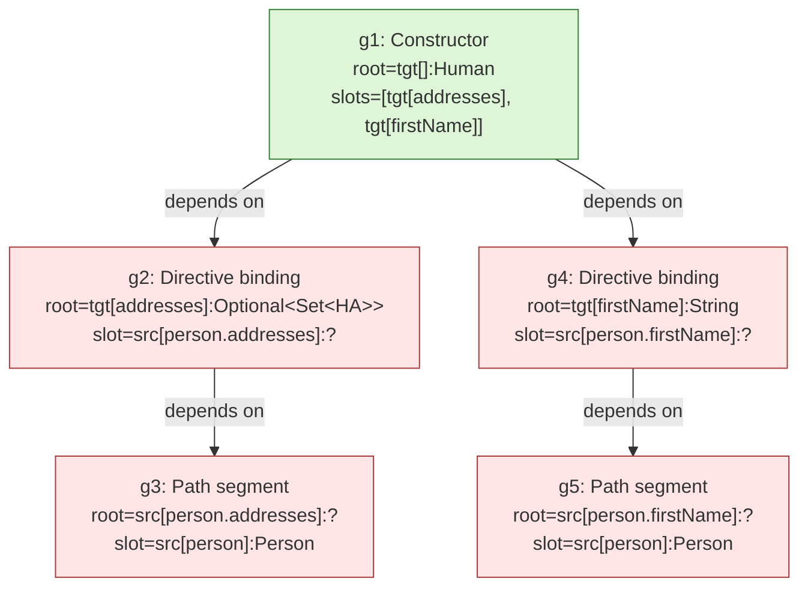

## Context

The realisation engine emerged from a multi-iteration design path. `add-graph-expansion` (2026-05-08) shipped a forward-driven three-phase pipeline with a `SourceStep` SPI; `target-to-source-expansion` (2026-05-21) inverted the driver to target-driven; `source-path-resolvers` (2026-05-21) added a seed-time path-walking algorithm via `PathSegmentResolver`; `split-container-bridges` (2026-05-22) replaced the fused `*Map` diamonds with orthogonal `*Unwrap` / `*Wrap` / `*Collect` bridges and introduced multi-fire per frontier.

After all four changes, two structural smells remain:

- `ExpansionGroup` reifies a JGraphT `AsSubgraph` view per group (`MapperGraph.addGroup(...)`), but `ExpandGroupsPhase.expandFrontier` sources candidates from `SourceReachability.candidateInputs(scope, graph)` — a global scan over `MapperGraph.nodes()`. The view exists but is never consulted by the engine. The "group is a subgraph" model is implemented as metadata, not as the scope of expansion.
- Type-only candidate matching across the global graph produced two bug classes — cross-group cycles (`elem:HA ↔ elem:Set<HA>` formed by sibling sub-groups whose downstream-of-frontier nodes leak as candidates) and multi-parameter directive ambiguity (two `Person` parameters with directives targeting different paths get confused at expansion time). The remediation introduced cycle-prevention guards and moved path-resolution to a seed-time pre-pass — both workarounds for the underlying scope leak.

Strict subgraph isolation collapses both classes by construction:

1. **Per-sub-group view scoping** — candidate search inside expansion is restricted to the current group's `view.vertexSet()`; downstream sibling-group nodes are invisible.
2. **Instance-identity `Node`s** — fresh allocations create distinct objects even when `(scope, loc, type, parent)` would equal an existing node, so cycles cannot form via structural collision (`project_expansion_mental_model.md`).
3. **One sub-group per bridge match** — every match's REALISED edge lives in its own minimal view (`{root, slot, one edge}`), so cycle detection is structurally impossible at the per-group level.

Under that model, `PathSegmentResolver`'s seed-time pre-pass becomes redundant — resolvers can fire during expansion within path-segment groups without re-introducing the multi-parameter ambiguity that motivated the seed-time fix (each path-segment group's slot is the specific parameter root the directive named; per-group local lookup cannot shuffle parameters between directives).

## Goals / Non-Goals

**Goals:**
- Make `ExpansionGroup.view` the authoritative scope of candidate search during expansion.
- Collapse the PRESERVING / ENTERING / EXITING split in `commitBridgeStep` to a single uniform branch: every match spawns its own one-slot sub-group, regardless of `ScopeTransition`.
- Restore the seed graph to a purely structural artifact (untyped at source-path segments). Move `PathSegmentResolver` invocation from `SeedGraph` into `ExpandGroupsPhase`, firing inside path-segment groups.
- Make group SAT outcome-driven and structurally local: a group SATs when every slot has at least one SAT child sub-group; base-case SAT for parameter-root slots is determined per-group from the slot's `Location` matching `currentMethod`'s parameters — no global ambient set.
- Process the group work-list in topological order over the shared-boundary group-dependency DAG (`G` depends on `H` iff `H.root ∈ G.slots`), so dependents see typed boundaries when expanded.
- Drop all cycle-prevention guards; cycles are impossible by construction.

**Non-Goals:**
- Codegen. The change preserves enough structure for a future codegen pass to walk the sub-group tree, but does not specify the walk or emit Java. Expansion produces the structure; codegen reads it later.
- `Bridge` SPI changes. The `BridgeStep` shape stays as `split-container-bridges` left it; resolvers and bridges live behind the existing surfaces.
- `PathSegmentResolver` SPI changes. The SPI surface is unchanged; only the invocation site (engine vs. seed) moves.
- `MapperGraph` schema migration. `EdgeKind` stays `{SEED, REALISED, MARKER}`; no edge types added or removed.
- Performance optimisation. The model is correctness-first; perf tuning (e.g., reverse boundary-node index for topological ordering) is a follow-up.

## Decisions

### D1. Sub-group per bridge match, regardless of `ScopeTransition`

**Decision:** `ExpandGroupsPhase.commitBridgeStep` SHALL register a fresh one-slot `ExpansionGroup` for **every** matching `BridgeStep`, with the frontier as root and the allocated input as the sole slot. `PRESERVING` matches no longer grow the parent group's view; `ENTERING` / `EXITING` matches no longer take a different code path. One rule.

**Why:** Uniform sub-group structure makes the view-scoped candidate-search rule (D2) trivially correct: every group is the smallest unit of expansion, `{root, slot, one edge}`. Cycles cannot form across sub-groups because each sibling's candidate scope is independent and instance-identity prevents structural collisions. The `PRESERVING-grows-view` rule was the engine pattern that allowed cross-group leakage today; uniform spawning removes that affordance.

**Alternatives considered:**
- *Keep PRESERVING growing the current group; only scope-changing matches spawn.* Smaller refactor (closer to `split-container-bridges`), but reintroduces the multi-chain-within-one-view complication that motivated the engine guard. Rejected as continuing the pattern we're trying to retire.
- *No sub-groups; engine maintains a global "current chain" set per slot.* Closer to the original `target-to-source-expansion` design pre-`ExpansionGroup`. Rejected as it eliminates the structural-DAG property and re-introduces global state.

### D2. Candidate search scope = `currentGroup.getView().vertexSet()`

**Decision:** When `expandFrontier(frontier, group, ...)` is invoked, candidate inputs SHALL come from `group.getView().vertexSet()` excluding the frontier itself and `TargetLocation` nodes. `SourceReachability.candidateInputs(scope, graph)` and the global `MapperGraph.nodes()` scan are removed from the expansion path.

**Why:** This is the structural fix for cross-group cycles and multi-parameter ambiguity. Under uniform sub-grouping (D1), each sub-group's view contains `{root, slot, one edge}` — candidate search trivially scopes to "the slot, maybe the root". Sibling sub-groups' nodes are invisible. Combined with instance-identity (D3), no candidate scan can pick up a downstream-of-frontier node by type.

**Alternatives considered:**
- *Global scan with cycle-prevention filter (`!reachableViaRealised(frontier → candidate)`).* The `split-container-bridges` guard. Rejected as a workaround for the missing scope rather than a fix.
- *View-scoped scan + exposed-root index across groups (boundary-import on type-match).* Adds an "exposes" semantics to groups so target-side chains can find typed source roots without a global scan. Rejected for v1 — the topological work-list (D6) achieves the same effect because dependent groups are processed after their dependencies, so shared-boundary nodes are already members of the dependent group's view by the time expansion sees them.

### D3. `Node` is instance-identity; `MapperGraph.addNode` is the only convergence point

**Decision:** `Node.equals` returns `this == other`; `Node.hashCode` returns `System.identityHashCode(this)`. `MapperGraph.addNode(Node)` is idempotent on equal (instance-equal) nodes — i.e., adding the same instance twice is a no-op. `SeedGraph` is responsible for emitting **one instance per directive-segment-root key** (it already does this via prefix-sharing). Bridge expansion creates **fresh instances** for every allocated input.

**Why:** Instance-identity is the documented model in `project_expansion_mental_model.md` ("Two `Node` instances with identical `(scope, loc, type)` are distinct nodes"). It is the structural property that makes sub-grouping (D1) cycle-free: a freshly allocated `elem:Set<HA>` in sub-group `sg1` is a different `Node` object from an `elem:Set<HA>` previously allocated by sibling `sg2`, even though their presentation attributes are equal. Cycles require shared identity; instance-identity removes that channel.

**Alternatives considered:**
- *Structural identity via `(scope, loc, type, parent)`.* Earlier design iteration. Rejected because it forced same-shape allocations to converge — exactly the channel cross-group cycles ride.

### D4. `SeedGraph` registers one group per SEED edge; seed graph is untyped at source-path segments

**Decision:** `SeedGraph` SHALL register one one-slot `ExpansionGroup` per SEED edge. Directive-bridging edges become directive-binding groups (`root = tgt[full-target-path]`, `slot = src[full-source-path]`); path-segment edges become path-segment groups (`root = src[prefix.segment]`, `slot = src[prefix]`). `SeedGraph` SHALL NOT invoke `PathSegmentResolver`s; the typed source chain produced by today's seed-time path-walking is removed. The directive-bridging edge's `from` is always the untyped seed leaf (no typed-source-prefix preference).

**Why:** The user's mental model — every SEED edge is a sub-group at seed time — restores the architecture to the 2026-05-08 layout (where source paths were untyped after seed) while keeping the structural disambiguation that `source-path-resolvers` introduced (each path-segment group's slot is the specific parameter root). Type resolution moves into expansion (D5) where it is naturally target-driven and per-group local.

**Alternatives considered:**
- *Keep seed-time path resolution; only retrofit expansion to be subgraph-scoped.* Smaller change; safer. Rejected after analysis showed seed-time path resolution is a workaround for global candidate search (the very thing this change fixes). Once the engine is subgraph-scoped, the workaround becomes redundant; carrying it as legacy creates two ways to type a source chain.

### D5. `PathSegmentResolver` fires inside path-segment groups during expansion

**Decision:** `ExpandGroupsPhase` SHALL invoke registered `PathSegmentResolver`s when expanding a **path-segment group** — a group whose `root` and `slot` both carry `SourceLocation` and whose root's path is a single-segment extension of the slot's path. For such groups, the engine iterates resolvers in `Class.getName()` ascending order, calling `resolve(slot.type.get(), segmentName, ctx)`. The first non-empty `ResolvedSegment` types the root (`Node.type` updated in place, since instance-identity preserves identity-by-object) and emits a single REALISED edge from slot to root with the resolver-provided codegen and weight. The path-segment group SATs.

The resolver SPI surface is unchanged — `resolve(parentType, segment, ctx)` returns `Optional<ResolvedSegment>`. The traversal stays target-driven: the engine starts at the group's root (the untyped segment), asks "what produces this from my slot?", and the resolver answers. Resolver-internal type inference is forward (Person.getAddresses() → List<Opt<PA>>), but the engine's graph traversal is backward. Per `feedback_never_forward_expansion.md`, this distinction is preserved.

**Why:** Path resolution is the answer to "what produces this single-segment access from its parent?" — naturally per-group local. Moving it into expansion makes the resolver another participant in the same model as bridges, not a special seed-time pre-pass. The disambiguation correctness is structural (D4 ensures the slot is the directive's specific parameter root).

**Alternatives considered:**
- *Resolvers stay at seed time; engine ignores them during expansion.* Today's behaviour. Rejected per D4 rationale.
- *Resolver-as-Bridge: collapse `PathSegmentResolver` into the `Bridge` SPI.* Rejected because resolvers need the segment name (not a type pair); shoehorning a name field into `Bridge` widens the SPI for a single use case. Two narrow SPIs are clearer than one wide one.

### D6. Topological work-list ordering over the boundary-DAG

**Decision:** `ExpandGroupsPhase` SHALL process groups in topological order over the dependency DAG defined by: `G` depends on `H` iff `H.root ∈ G.slots`. Dependencies expand first. Within a topological layer, ordering is by group registration order (deterministic). No fixed-point loop; no FIFO retry.

**Why:** Source-side path-segment groups type their roots when expanded. A directive-binding group's slot is the typed root of a path-segment group; processing the path-segment group first means the directive-binding group sees a typed slot. Constructor groups depend on their directive-binding-group children; processed last. This ordering is statically computable from the boundary-DAG at the start of expansion (and after every nested-group registration during expansion, which is a fresh leaf added to the DAG).

**Alternatives considered:**
- *FIFO with bounded re-try.* Risk of nondeterministic ordering and the fixed-point smell explicitly avoided by `add-graph-expansion` (D1 there).
- *DFS from constructor groups.* Same topological result but harder to instrument and parallelise; rejected for v1.

### D7. SAT propagation: outcome-driven, structural base case

**Decision:** Group SAT is outcome-driven: `G` SATs iff every slot in `G.slots` has at least one child sub-group rooted at it whose outcome is `SAT`. Base case: a slot SATs trivially when its `Location` is a single-segment `SourceLocation` whose first segment matches a parameter name of `currentMethod`. No global `sourceParameterRoots` set is consulted. `MapperGraph.recordGroupOutcome(...)` continues to register outcomes; the outcome is computed during expansion and read by `realisation-validation`.

**Why:** Structural base case keeps SAT determination local to each group's view. The diagnostic stage already consumes outcomes (`realisation-validation`); no double accounting between "REALISED-reachability" and "outcome-state".

**Alternatives considered:**
- *Keep `SourceReachability.slotReachable(slot, graph, sourceRoots)` as the SAT check.* Works but couples SAT to a global reachability query, re-introducing the global state we're removing.

### D8. Drop cycle prevention; drop ambient source-roots

**Decision:** Any cycle-prevention check in `commitBridgeStep` / `allocateOrReuseInputNode` SHALL be removed. `SourceReachability.sourceParameterRoots(...)` and the `sourceRoots` parameter threaded through `resolveSlot` / `expandFrontier` SHALL be removed.

**Why:** Both are structurally redundant once D1–D3 land. Cycles cannot form: instance-identity + view-scoped candidates make it impossible to import a downstream node by type into a sibling's view. Ambient source-roots are unnecessary: parameter-root SAT is structural (D7) and per-group.

**Alternatives considered:**
- *Keep cycle prevention as belt-and-braces.* Rejected. A guard that fires on an impossible condition silently masks bugs in the structural model; better to let the structural property be load-bearing.

## Group shape under the new model (worked example)

For `Human map(Person person)` with directives `@Map(target = "addresses", source = "person.addresses")` and `@Map(target = "firstName", source = "person.firstName")` and a constructor `Human(Optional<Set<HA>> addresses, String firstName)`:

`src[person]` is base-case SAT (parameter root) for both g3 and g5. Topological order: `{g3, g5}, {g2, g4}, {g1}`. Expanding g3 invokes `GetterPathResolver` against `Person.getAddresses()` → types `src[person.addresses]` to `List<Optional<PA>>`. Expanding g2 then sees a typed slot and runs container-bridge expansion to build the `List<Opt<PA>> → ... → Optional<Set<HA>>` chain as a tree of sub-groups beneath g2. Each chain hop is its own one-slot sub-group rooted at the current frontier.

## Risks / Trade-offs

- **[Engine refactor blast radius]** → Mitigation: the integration mapper (`PersonMapper.mapHuman` + `mapAddress`) stays as the green-build acceptance signal. The change is bounded to `processor/stages/expand/` plus `SeedGraph`; SPI surfaces are untouched. Reverting is a single revert (no schema migration).
- **[Sub-group count explosion in dumps]** → Mitigation: each container chain produces ~5 sub-groups per directive; for the integration mapper, this means ~40 nested groups total. The DOT renderer's cluster grouping handles arbitrary nesting; readability is comparable to today's `*.full.dot`. Codegen is a future concern that walks the tree.
- **[Path-segment-group recognition is structural, not declared]** → Mitigation: the engine identifies path-segment groups by `(root.loc, slot.loc)` shape — both `SourceLocation`, root path is slot path + one segment. This is a heuristic; a future change can add an explicit `groupKind` field to `ExpansionGroup` if confusion arises.
- **[Topological ordering with dynamic group registration]** → Mitigation: every nested sub-group registered during expansion has its root in the current group's view (a known set), so the new group is a leaf in the dependency-DAG (no group depends on it yet). Inserting into a topo order at the next iteration is O(1) — process it next in the next iteration without re-sorting.
- **[`PathSegmentResolver` order changes from `Class.getName()` to first-match-wins]** → Mitigation: same ordering, semantics unchanged. The only behavioural shift is *when* the resolver is invoked (expansion vs. seed). Existing resolver specs from `source-path-resolvers` remain valid.

## Open Questions

- **Sub-group registration during multi-fire** — when two bridges match the same frontier (e.g. `OptionalCollect` and `OptionalWrap` for `tgt[addresses]:Optional<Set<HA>>`), each spawns its own sub-group. The two sub-groups share the same root but different slots. Open: should the multi-fire siblings carry any metadata linking them (e.g. a shared `alternativeGroupId`) for diagnostic dumps, or is "same root" enough? Leaning toward "same root is enough" — codegen and diagnostics can detect siblings by root identity.
- **Path-segment groups for `record` accessors and field reads** — same structural shape as `GetterPathResolver`; the new model treats them uniformly. Confirm no resolver-specific work is needed during the migration.
- **`SeedGraph` removal of typed nodes** — directive-binding groups whose source/target types match exactly today get a "directive-binding REALISED edge" pass-through (per `graph-expansion` spec). Under D4, the seed slot is untyped, so the same-type pass-through can no longer fire at seed time. Open: does it move into expansion as a `DirectAssign`-equivalent bridge, or is the typed pass-through detected during path-segment-group SAT (since the slot becomes typed after expansion)? Leaning toward "detect after typing" — it's a natural consequence of expansion ordering.
