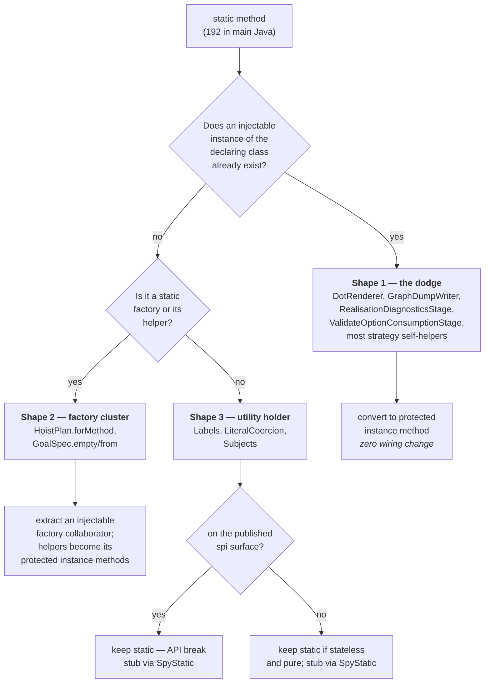
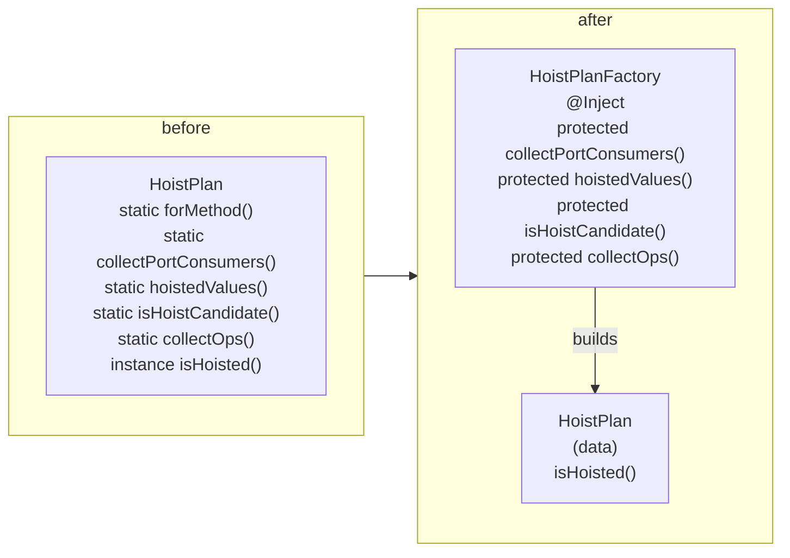
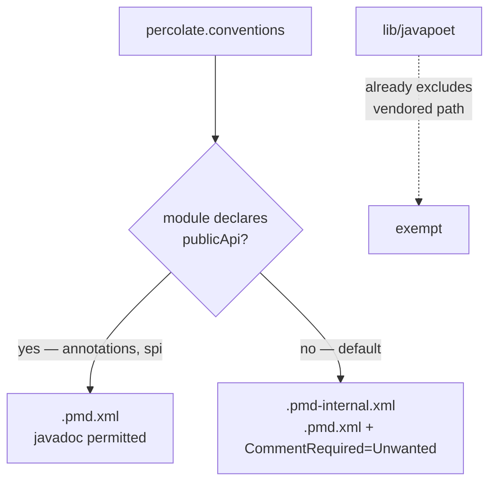

## Context

Two structural rules already hold repo-wide: no private methods (ArchUnit Rule A) and unused protected methods carry `@VisibleForTesting` (Rule C). Both exist to guarantee every authored method can be intercepted by a test double. `static` defeats both — `INVOKESTATIC` bypasses proxy interception entirely — and a previously recorded convention actively recommended it as the fix when extracting a helper on a `Spy`'d class tripped strict `0 * _`. That recommendation was wrong; the correct fix is to declare the self-interaction. In the meantime 192 static methods accumulated in main Java.

The statics are not homogeneous. Reading the hot spots shows three distinct shapes, and they need different treatments:



Shape 1 is the bulk and the actual regression: `DotRenderer` is already `@NoArgsConstructor(onConstructor_ = @Inject)` — a Dagger-managed singleton — carrying 12 static helpers it calls on itself. Nothing prevents those from being instance methods today.

Separately, the mock maker that makes final classes mockable, and `SpyStatic` usable, reached exactly one module of six because `SpockConfig.groovy` is copy-pasted per module.

## Goals / Non-Goals

**Goals:**

- Close the `static` testability hole with the same force the private-method ban already has.
- Make final-class mocking and `SpyStatic` available in every module, from one definition.
- Replace the "make it static" workaround with a recorded, order-correct self-call idiom.
- Confine javadoc to the two externally consumed modules without losing design rationale.

**Non-Goals:**

- Static analysis proving every protected method is spy-tested. Not derivable: the fact lives half in Java bytecode and half in Groovy, and Spock's AST transform reduces `1 * u.f(_)` to a `MockController` call carrying the method name as a string constant, so no call edge survives. pitest at 85/95/90 remains the oracle. Custom CodeNarc spec-shape rules were considered and explicitly dropped.
- Changing any published API. The `spi` static surface is preserved deliberately.
- Touching `lib/javapoet`, which is vendored upstream source.
- Widening ArchUnit Rule B's method-count ceiling beyond its current packages.

## Decisions

### D1 — Shape 1 statics convert with no wiring change; that is where the value is

A static helper on a class that Dagger already constructs is a pure dodge: the instance exists, the method just refuses to use it. Converting `DotRenderer`'s 12 statics, `GraphDumpWriter`'s `dimmedByCost`/`slice`, and the equivalent helpers in the stages and strategies is a visibility edit plus `@VisibleForTesting`, and each becomes independently spy-testable immediately.

*Alternative considered:* convert everything uniformly, including Shape 2 and 3. Rejected — a static factory has no instance to become an instance method of, so "uniform" conversion silently means "decompose", which is a much larger change wearing a smaller change's name.

### D2 — Shape 2 keeps a static entry point, moves its helpers to a collaborator

`HoistPlan.forMethod(...)` and `GoalSpec.from(...)` are constructor substitutes; their helpers (`collectPortConsumers`, `hoistedValues`, `isHoistCandidate`, `childLevels`, `sourcePathByTarget`, …) are the untestable part. Extract an injectable factory whose protected instance methods carry that logic, leaving the value type as data.



*Alternative considered:* leave Shape 2 alone as "legitimately static". Rejected — the factory body is where the decisions live, and it is exactly the logic pitest reports as weakly covered.

**Architecture note:** this adds classes to `processor.internal.stages.generate`, which ArchUnit Rule B caps at 15 non-synthetic methods per class. Splitting *reduces* per-class counts, so the ceiling is not threatened, but each new class must justify itself as a cohesive unit rather than a bag of relocated statics.

### D3 — Shape 3 stays static and is stubbed with `SpyStatic`

An audit of `spi` during design found the carve-out is far broader than `LiteralCoercion` and `Subjects`: **40 of `spi`'s 41 statics are public factories on the published SPI surface** — `Port.byType`/`byName`/`subTarget`/`byTypeOrDecline`, `PortType.variable`/`concrete`/`app`, `OperationSpec.of`/`ofPartial`/`mapping`/`callOf`, `Offer.of`/`refusal`, `Nullability.join`, `DirectiveInput.scalar`/`structured`, `ChildScopeSpec.lifted`, plus all 17 of `LiteralCoercion` and 3 of `Subjects`. Every one is called by third-party strategy authors, so converting any is a breaking API change. Only `Nullability.either` is non-public and in scope.

The practical consequence: **`spi` is essentially unaffected by this change**, and the conversion work lives in `processor` and `strategies-builtin`. This is a correction to the initial sizing, which assumed the 192 divided evenly across the three modules.

`Labels` (internal to `strategies-builtin`) is a stateless type-name formatter with no collaborators.

*Alternative considered:* inject `Labels` into every strategy. Rejected for now — strategies are `ServiceLoader`-instantiated and must keep a public no-arg constructor, so injection means a secondary-constructor pair on each strategy purely to seam a pure function. `SpyStatic(Labels)` gives the same test control at zero production cost, and rule 2 makes it available. If `Labels` ever acquires state or a collaborator, it moves to the secondary-constructor pattern:

```java
public Foo() { this(new Labels()); }        // ServiceLoader entry
Foo(Labels labels) { this.labels = labels; } // spec injects a Mock
```

### D4 — `SpockConfig.groovy` is generated by the conventions plugin onto the test resources

Spock discovers `SpockConfig.groovy` from the **test classpath root**, which is why the current per-module files work identically under `test` and `pitest`. A `systemProperty 'spock.configuration'` on the `test` task would not survive into pitest's own JVMs, so the classpath mechanism must be preserved. The conventions plugin therefore generates one canonical file into a generated resources directory wired into `sourceSets.test.resources`, and the six per-module copies are deleted.

*Alternative considered:* a shared resources-only module depended on by every test suite. Rejected — it adds a module and a dependency edge to solve a build-configuration problem, and `architecture-tests` would then need it too.

This keeps the single-convention-plugin rule: one `percolate.conventions` id per module, no new plugin.

### D5 — PMD selects the javadoc policy per module through a declarative opt-in

The conventions plugin hardcodes `ruleSets = ["$rootDir/.pmd.xml"]` for everyone. Rather than the plugin naming `annotations` and `spi` (a by-name cross-project reference, against the Isolated Projects direction), each module declares its own nature and the plugin reads it:



`.pmd-internal.xml` includes `.pmd.xml` and adds `category/java/documentation.xml/CommentRequired` with the `Unwanted` settings, so the two rulesets cannot drift.

*Alternative considered:* a custom XPath rule on `FormalComment`. Held in reserve — the repo already has a hand-written XPath rule (`UseVarForLocalVariables`), so this is a proven fallback if `CommentRequired`'s element coverage turns out to have gaps.

### D6 — The javadoc pass is a demotion, and the two rules are applied together

Rules 6 and 7 are one traversal, not two: for each block, decide *non-obvious → `//`* or *restates the signature → delete*. Doing them as separate passes would mean reading all 355 blocks twice and would make the delete pass tempting to automate, which is exactly how the rationale gets lost.

## Risks / Trade-offs

- **Stubbing a self-call destroys the caller's mutation coverage of it** → When a spec writes `1 * subject.f(_) >> value`, the caller's feature method no longer exercises `f`'s logic. The helper MUST get its own feature method; otherwise the conversion trades a coverage hole for a differently-shaped one and pitest will report it. Treat a threshold drop as a signal that a helper was stubbed without being separately tested.
- **`1 * subject._` is less specific than restating the entry call** → renaming the entry method will not fail the spec. Accepted: the entry call is already pinned by the `when:` block, and the exact cardinality still forces every additional self-call to be declared.
- **Mockito static mocking is thread-confined** → `SpyStatic` only works because Spock's in-JVM parallel execution is off. Anything that later re-enables `runner { parallel { enabled true } }` silently breaks static stubbing. The spec records this as a reason the setting must stay off, alongside the existing pitest reason.
- **A build tool could push back toward static** → Error Prone's `MethodCanBeStatic` is off by default; confirm it stays off, or the `-Werror` build will fight the convention it is meant to enforce.
- **`CommentRequired`'s `Unwanted` may not cover every element kind** (package-info, enum constants, nested types) → spike it against `processor` before converting all five modules; fall back to the custom XPath rule.
- **Six SpockConfig files carry distinct rationale comments** → consolidating must merge the explanations, not pick one. The reactor-blocking copy in particular records a mutation-score finding not present in the others.
- **Large mechanical diff across specs** → the static conversion touches every spec that exercised a converted method. Sequence it module by module (`spi` → `strategies-builtin` → `processor`) so a failure is attributable, and keep the mock-maker rollout first since `SpyStatic` depends on it.
- **`@VisibleForTesting` needs `org.jetbrains:annotations` on the compile classpath** → it is `compileOnly` and was historically missing in `reactor` and `strategies-builtin`; every module gaining newly-protected methods needs it declared.
