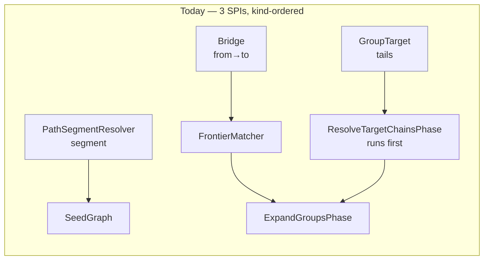
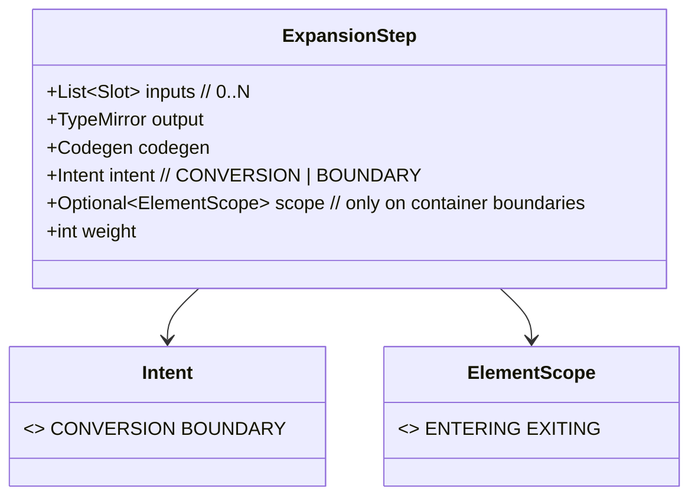
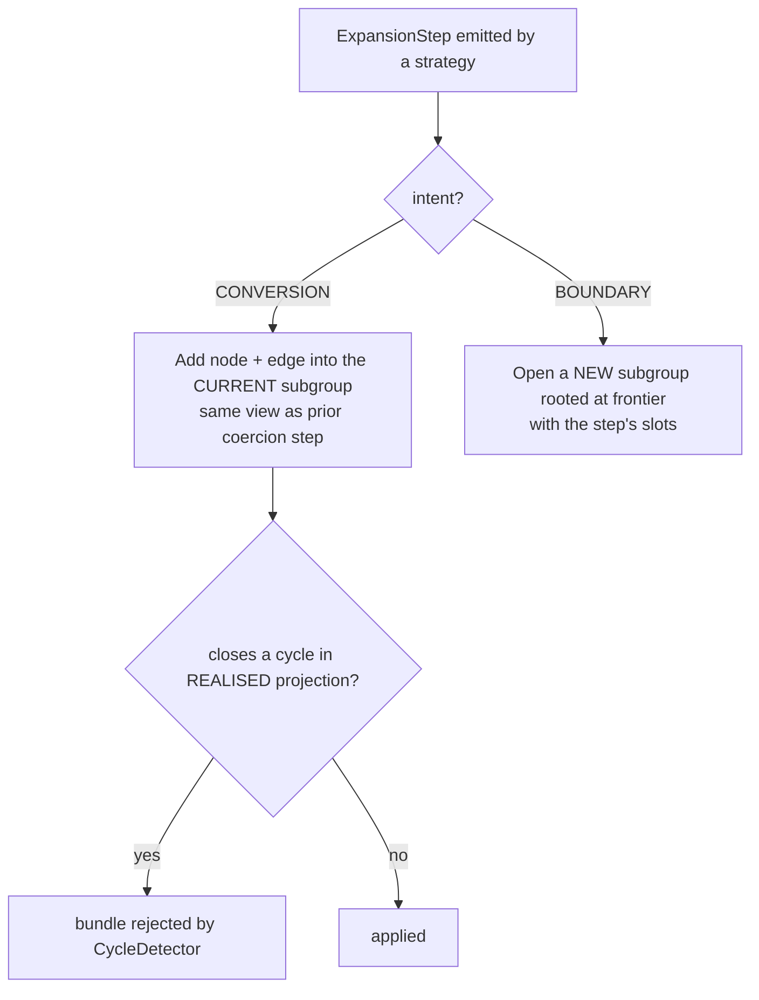
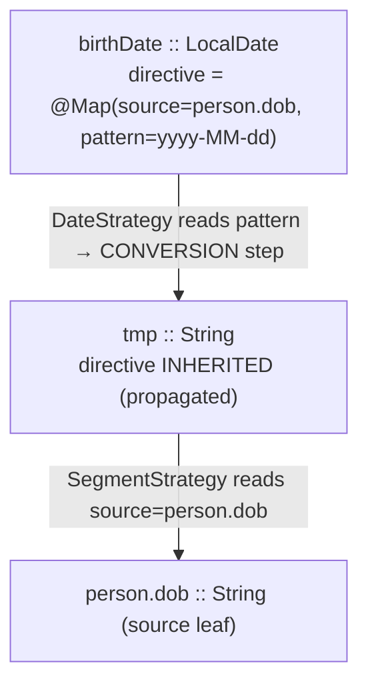

## Context

The expansion engine drives three strategy SPIs, each a different shape, loaded into three lists and consumed by kind-specific, phase-ordered code:

- `Bridge` — `bridge(from, to, ctx)`, combinatorial, tried against in-view candidates by `FrontierMatcher`.
- `GroupTarget` — `buildFor(returnType, tails, ctx)`, target-directed N-ary assembly, run first in `ResolveTargetChainsPhase`.
- `PathSegmentResolver` — `resolve(parentType, segment, ctx)`, segment-directed, used at seed time.

Two facts motivate this change (see `proposal.md` for the full why):

1. The three signatures differ only by **discovery mode**, and every discovery parameter (`from→to`, `tails`, `segment`) is derivable from one local context: the frontier's target type, its `@Map` directive, and the in-scope candidates.
2. The distinction that actually governs graph construction — **does a step cross a flow-identity boundary (open a subgroup) or convert a value in place (fold)?** — is expressed *nowhere*. Every matched step spawns a subgroup, so a coercion chain is scattered across narrow views; a box∘unbox round-trip is invisible to the `CycleDetector`, and `@Map`-carried configuration (parse patterns, default values) never reaches the strategies.



### Constraints (invariants this design must not break)

- **Myopic strategies.** A strategy makes a *local* decision and never sees the graph (no traversal, no other groups). Engine/graph fixes live in the scaffolding/driver.
- **View-scoped candidates.** Candidate search is bounded by the group's view, not a global scan.
- **Target→source direction** and the **fixed-point** work-list with dead-end pruning.
- **Single mutation site** (the `Applier`) consuming pure delta bundles.

## Goals / Non-Goals

**Goals:**
- One strategy interface `ExpansionStrategy` with `Stream<ExpansionStep> expand(Frontier, ResolveCtx)`, registered as one `ServiceLoader` list, tried together each pass — no kind/phase ordering.
- One result type `ExpansionStep`: `0..N` slots + output + codegen + an **intent** (`CONVERSION` | `BOUNDARY`) + optional element-scope.
- A **myopic** `Frontier` context (`targetType`, `directive`, flat `candidates`) — never the graph.
- Engine branches on intent only; `CONVERSION` folds into the current subgroup, making a coercion round-trip a structural cycle the existing `CycleDetector` rejects.
- Driver-side `@Map` **directive propagation** onto synthesized nodes.
- Optional **mixin** interfaces for the common combinatorial-match and container patterns.

**Non-Goals:**
- The scalar coercion strategies themselves (boxing, widening, `String` ↔ scalar) — reintroduced later by the regenerated `type-conversion` change on this base.
- Any no-progress / type-recurrence guard — this design makes it unnecessary, by construction.
- Changes to the cost oracle, `PlanView` walk, or codegen beyond what folding conversions requires.
- New mapper-facing annotation fields (e.g. `@Map(pattern=…)`) — this change only ensures the directive *reaches* strategies; the fields are added by the consumers that need them.

## Decisions

### D1 — Unify on intent, not on discovery

Separate the two orthogonal axes and unify only the load-bearing one.

- **Graph intent** (`CONVERSION` vs `BOUNDARY`) is the single bit the engine branches on. It is unified into `ExpansionStep`.
- **Discovery mode** (combinatorial / target-directed / segment-directed) is *not* a type distinction; it becomes *what a strategy reads from `Frontier`*. A combinatorial strategy iterates `candidates()`; a segment strategy reads `directive()`; an assembly strategy reads `targetType()` + `directive()`.

*Alternative considered:* keep three interfaces and add the directive to each. Rejected — it preserves kind-ordering, triples the result types, and still can't be tried in one round.

### D2 — One `ExpansionStep`, where a subgroup *is* a boundary step's slots



| Step | slots | intent | scope |
|---|---|---|---|
| default value (future) | 0 | BOUNDARY | — |
| box / widen / direct-assign | 1 | **CONVERSION** | — |
| getter / 1-arg method | 1 | BOUNDARY | — |
| container iterate/collect/unwrap/wrap | 1 | BOUNDARY | ENTERING/EXITING |
| constructor / N-arg method | N | BOUNDARY | — |

`GroupBuild`, `BridgeStep`, and `ResolvedSegment` all collapse into this. A `BOUNDARY` step's `inputs` are exactly the slots of the subgroup it opens.

*Alternative considered:* a subtype hierarchy (`ConversionStep`/`BoundaryStep`/`ScopeBoundaryStep`). Rejected for the result type — one record with an enum is simpler to pattern-match at the single mutation site; the hierarchy survives only as optional author-side **mixins** (D6).

### D3 — Intent-driven folding removes the need for any guard



Because consecutive `CONVERSION` steps share one view, `InputAllocator`'s existing same-location/same-type reuse rebinds a repeated type to the existing node; a box∘unbox round-trip then closes an instance cycle that `wouldBeAcyclic` already rejects. No type-recurrence walk is introduced.

*Alternative considered:* the `reDerivesScopeType` type-global downstream walk (the wip approach). Rejected — `PRESERVING` does not mean "conversion" (every structural edge is `PRESERVING`), so the walk leaks across constructor edges; it also violates positional identity by matching type across positions.

### D4 — `Frontier` is a myopic, non-traversable context

```java
interface Frontier {
    TypeMirror          targetType();   // what to produce here
    Optional<Directive> directive();    // in-effect @Map: source path/segment, patterns, defaults
    List<Candidate>     candidates();   // scoped snapshot: (TypeMirror type, opaque handle) — NOT the graph
}
```

`candidates()` is materialised by the driver from the group's already-scoped view as opaque handles: a strategy can match on a candidate's *type* but cannot walk from it. This is what structurally enforces "local decision, with `@Map` context, never the whole graph."

*Alternative considered:* pass the `ExpansionGroup`/view. Rejected — it hands strategies traversal and breaks myopia.

### D5 — Directive propagation is a driver responsibility

The originating `@Map` directive is threaded by the scaffolding onto nodes synthesized for `CONVERSION` steps, so a downstream strategy reads its config from local context. Today realised edges drop the directive (`Edge.realised(...)` passes `Optional.empty()`); the propagation rule is the one genuinely new piece of engine logic.



Rule: a node synthesized as the input of a step inherits the in-effect directive of the frontier it was produced for. Strategies never search for it.

*Alternative considered:* let strategies locate the directive by walking up the chain. Rejected — needs graph access (breaks D4/myopia).

### D6 — One flat list; mixins for common patterns

All strategies register under `@AutoService(ExpansionStrategy.class)` and load via one `ServiceLoader` into one list, ordered only by `priority()` then name. Two optional **mixin interfaces** with `default expand(...)` absorb boilerplate without reintroducing kind-ordering:

- `CombinatorialMatch` — default `expand()` loops `candidates()` and calls the author's `bridge(from, to, ctx)`.
- `ContainerMatch` — default `expand()` emits the iterate/collect/unwrap/wrap boundary steps with element-scope from the author's `matches`/`element` snippets.

*Alternative considered:* abstract base classes. Mixins compose better (a container is also a match) and keep the loader flat.

### D7 — Drop the `ResolveTargetChainsPhase` ordering

Strategies are tried in one round-robin per fixed-point pass. The return-assembly resolves in whatever pass its inputs become available; target→source direction bounds the search, dead ends are pruned, and the node budget bounds transients. The explicit "assembly first" phase was an artifact, not a correctness requirement.

*Alternative considered:* keep the phase. Rejected — it is redundant under the fixed-point loop and reintroduces kind-ordering.

## Architecture-shift warning

This is a **breaking restructure of the strategy-author surface** (`Bridge`/`GroupTarget`/`PathSegmentResolver` → `ExpansionStrategy`; three result types → `ExpansionStep`). It must be called out as an architectural change. Crucially, it is a *surface* restructure: every deeper invariant — myopic strategies, view-scoped candidates, target→source direction, single mutation site, fixed-point convergence — is **preserved**, and several are made more explicit (myopia is now enforced by `Frontier`'s shape; the boundary/conversion axis is now first-class). No engine guarantee is weakened.

## Risks / Trade-offs

- **Combinatorial iteration moves into strategies** → the `CombinatorialMatch` mixin supplies the loop; candidate scoping stays central in the driver, so no strategy hand-rolls scoping.
- **Directive propagation is new engine logic** → specify the inheritance rule precisely and cover it with tests; only nodes synthesized for `CONVERSION` steps inherit, so boundaries don't leak a parent's directive into an unrelated value.
- **Dropping the phase could change convergence** → covered by existing expansion specs plus a fixed-point convergence test; the node budget bounds any extra transient dead ends.
- **Folded conversions must still render** → a `CONVERSION` step renders from its realised edge *inside* the parent group's chain. Confirm `BuildMethodBodies` walks the realised-edge chain within a group, not only at group roots; this is the single codegen risk and is verified before the engine cutover.
- **Large breaking change to built-ins and tests** → all built-ins migrate in lockstep; Google Compile Testing + the expansion specs catch regressions at compile time.

## Migration Plan

Ordered tasks (single annotation-processor artifact, so the cutover is atomic at compile):

1. Introduce `ExpansionStep`, `Intent`, `Frontier`, `Candidate`, `Directive`, and `ExpansionStrategy` + mixins in `percolate-spi`.
2. Verify the codegen-walk assumption (folded conversion renders from in-group edge).
3. Rebuild the driver: one strategy list, round-robin per pass, intent-branch at the `Applier`, directive propagation; remove `ResolveTargetChainsPhase` ordering.
4. Migrate every built-in to `ExpansionStrategy` (+ mixins); flip `@AutoService` to `ExpansionStrategy`.
5. Remove `Bridge`/`GroupTarget`/`PathSegmentResolver`/`BridgeStep`/`GroupBuild`/`ResolvedSegment`.
6. Update `ProcessorModule` wiring and all affected specs/tests.

**Rollback:** this change lands as fresh commits on `main`; revert the change commit. The prior in-progress exploration is preserved on `wip/type-conversion-incomplete`.

## Open Questions

- **`directive()` shape:** raw `AnnotationMirror` (faithful, simple) vs a parsed `Directive` view (ergonomic). Lean parsed, but it widens the SPI surface — decide in specs.
- **`Candidate` handle type:** opaque token vs a thin `NodeRef`. Must remain non-traversable either way.
- **`ElementScope` placement:** optional field on `ExpansionStep` (chosen in D2) vs encoded in `Intent`. Confirm the field stays absent for non-container steps.
- **`DirectAssign` intent:** treat as `CONVERSION` (cost-0 identity fold) — confirm codegen renders an identity assignment correctly when folded rather than as its own group.
- **Mixin set:** is a third directed-segment mixin worth providing, or do segment strategies implement `expand()` directly?
