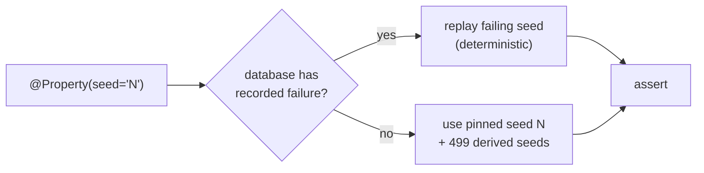

## Context

The archived change `2026-05-14-restructure-expansion-test-architecture` left the test layer in a hybrid-shaped intermediate state: seven `*Spec.groovy` files extend `Specification`, the synced `expansion-test-harness` spec mandates jqwik-driven property testing, and the actual randomness is `java.util.Random` in `GraphGenerator.groovy`. The proposal closes that gap by adding `@Property`/`@Provide` to the existing specs without giving up the Spock infrastructure (`@Tag('unit')`, `@Timeout(30)`, the Specification class shell). Two implementation choices, fixed by user decision before drafting this design:

1. **Fold** `GraphGenerator`'s logic into a shared **base class**, not a separate utility — generators are inherited by the seven specs.
2. **`@PropertyDefaults(tries = 500)`** lives on that base class, not per-spec and not in `jqwik.properties`.

This design works out the rest: the base class shape, the `Arbitrary<MapperGraph>` composition, the Spock-AST + jqwik-discovery interaction, and the migration path that keeps `./gradlew check` green throughout.

## Goals / Non-Goals

**Goals:**

- Each of the seven property specs is a hybrid class that `extends ExpansionPropertyBase` (which itself `extends Specification`), inheriting `@PropertyDefaults`, the `@Provide` generators, and the Spock infrastructure in one shot.
- Property tests fail meaningfully when the engine regresses, with shrunk counterexamples surfacing the minimal failing graph + bundle.
- `@Property(seed = '<long>')` on every property method makes CI failures locally reproducible.
- `GraphGenerator.groovy`'s `Random`-based methods are deleted; the file either disappears or becomes a thin static helper called from `@Provide` methods on the base.
- `./gradlew check` stays green at every commit on the way to the final state.

**Non-Goals:**

- Custom `Shrinkable` implementations for `MapperGraph`. The first cut leans on jqwik's automatic shrinking via `Arbitraries.flatMap` composition; quality improvements are a follow-up if and when shrinks turn out to be unhelpful.
- jqwik statistics collection (`Statistics.collect(...)`). Useful eventually for "what fraction of generated graphs actually exercised IdentityBridge?", but out of scope here.
- Replacing Spock's data-table specs (`ExpansionCapabilitiesSpec`, `ExpansionFailureModesSpec`) with jqwik. Those are deterministic capability/failure documentation — jqwik adds nothing.
- Re-enabling Jacoco coverage gates on `processor` (the separate O2 open question from the archived design).
- Adding `@PropertyDefaults(...)` knobs beyond `tries`. Defaults for `shrinking`, `afterFailure`, `edgeCases` stay at jqwik's library defaults until evidence suggests otherwise.

## Decisions

### D1. Base class: `ExpansionPropertyBase extends Specification`

A new class at `processor/src/test/groovy/io/github/joke/percolate/processor/stages/expand/properties/ExpansionPropertyBase.groovy`:

```groovy
@Tag('unit')
@Timeout(60)
@PropertyDefaults(tries = 500)
abstract class ExpansionPropertyBase extends Specification {

    @Provide
    Arbitrary<MapperGraph> seedGraphs() { ... }

    @Provide
    Arbitrary<List<Bridge>> fakeBridges() { ... }

    @Provide
    Arbitrary<List<SourceStep>> fakeSourceSteps() { ... }

    @Provide
    Arbitrary<List<GroupTarget>> fakeGroupTargets() { ... }
}
```

Each of the seven property specs becomes:

```groovy
class DeterminismSpec extends ExpansionPropertyBase {
    @Property(seed = '4242')
    void 'expansion is deterministic'(
            @ForAll('seedGraphs') MapperGraph graph,
            @ForAll('fakeBridges') List<Bridge> bridges,
            @ForAll('fakeSourceSteps') List<SourceStep> sources,
            @ForAll('fakeGroupTargets') List<GroupTarget> targets) {
        def first  = ExpansionHarness.expand(graph, bridges, sources, targets)
        def second = ExpansionHarness.expand(graph, bridges, sources, targets)
        assert nodeIds(first.expandedGraph())   == nodeIds(second.expandedGraph())
        assert edgeTuples(first.expandedGraph()) == edgeTuples(second.expandedGraph())
    }
}
```

**Why a base class** (the chosen "fold" path): generator definitions are shared verbatim by all seven specs. Inheriting them via `extends ExpansionPropertyBase` means the `@Provide` methods are inherited by jqwik discovery (jqwik scans the inheritance chain for `@Provide`-annotated methods), and the `@PropertyDefaults` class annotation flows down too. One source of truth for tries-count + generators.

**Why on `Specification`**: keeps `@Tag('unit')` discoverable by Spock's tag filter, keeps `@Timeout` interpretable by Spock if any non-`@Property` feature methods are added in the future, and keeps the seven property specs visually parallel with the rest of the test layer (`ExpansionCapabilitiesSpec`, `ExpansionFailureModesSpec`, `RealisedEdgeCanarySpec` all extend `Specification`).

**Alternative considered: `@PropertyDefaults` in `jqwik.properties`**. Rejected per user decision — a class-level annotation keeps configuration co-located with the consumers and avoids a `src/test/resources/jqwik.properties` file that's easy to miss.

**Alternative considered: keep `GraphGenerator` as a separate `Arbitraries` provider class**. Rejected per user decision (`fold it`) — duplicating `@ForAll('externalProviderMethod')` strings across seven specs is more error-prone than inheriting providers.

### D2. Verify jqwik discovers `@Property` methods on `Specification` subclasses — probe first

Spock's compile-time AST transform rewrites method bodies (e.g., `given:`/`when:`/`then:` blocks become `try/finally` + `assert` rewrites). It is plausible that `@Property` methods with plain Groovy bodies pass through untouched, but it is not guaranteed. Before the bulk rewrite, run a 20-line probe:

```groovy
class JqwikProbeSpec extends Specification {
    @Property(tries = 10)
    void 'jqwik discovers properties on Specification subclasses'(@ForAll int n) {
        assert n == n
    }
}
```

Run `./gradlew :processor:test --tests JqwikProbeSpec`. Pass criteria:
- The method shows up in `TEST-...JqwikProbeSpec.xml` as 10 invocations (jqwik) **or** as a discovered test method run by the JUnit Platform.
- No `groovy.lang.MissingPropertyException` or AST-transform error on `n`.

If the probe fails, fall back to **D2-alt**: property classes do NOT extend `Specification`. They are plain Groovy classes named `*Spec.groovy` with `@Tag` (the JUnit Jupiter version, not Spock's — feedback memory `feedback_spock_jqwik_tags` is about Spec discovery, not jqwik discovery; jqwik does respect JUnit Platform tags via `net.jqwik.api.Tag`). The base class still exists but extends nothing.

The probe lives in the source tree for the duration of the change and is deleted at the end. Recording the probe's outcome up front prevents committing seven rewrites that the test engine then refuses to run.

### D3. `Arbitrary<MapperGraph>` composition strategy

The current `GraphGenerator.randomSeed()` walks `(1..methodCount).each { buildMethod(...) }`, where each method has `(1..argCount)` args and one return. Translated to jqwik:

```groovy
@Provide
Arbitrary<MapperGraph> seedGraphs() {
    final Arbitrary<Integer> methodCount = Arbitraries.integers().between(1, 3)
    final Arbitrary<TypeMirror> types = Arbitraries.of(TypeUniverse.pool() as TypeMirror[])
    methodCount.flatMap { count ->
        Arbitraries.lazy {
            buildMethodArbitrary(types)
        }.list().ofSize(count).map { methods ->
            assembleGraph(methods)
        }
    }
}
```

Where `buildMethodArbitrary(types)` returns `Arbitrary<MethodShape>` (a small record holding `(argName, argType)` pairs + a `returnType`), and `assembleGraph(List<MethodShape>)` does the deterministic `MapperGraph` construction (mirroring today's `GraphGenerator.buildMethod`).

**Key constraints**:

- Generators must produce **fresh `MapperGraph` instances per iteration** — `MapperGraph` is mutable, and jqwik may call the property multiple times with the "same" generated value during shrinking. `map(...)` lambdas must construct, not share.
- All `TypeMirror` references come from `TypeUniverse` (single `JavacTask`, single `Elements`/`Types`) so generated graphs respect the type-identity invariant the engine relies on.
- `Arbitrary<List<Bridge>>` is built from `Arbitraries.subsetOf(...)` over a curated list `[IdentityBridge(STRING, STRING), IdentityBridge(INT, INT), ChainBridge(STRING, INT, LONG), NoOpBridge()]`. Bridge instances are reused — they are pure-function fakes, no per-iteration state.
- `DivergentBridge` is **not** in the property-test alphabet. It belongs only to `ExpansionFailureModesSpec` (round-cap row). Including it would make every property non-converge.

### D4. Pinned seeds — one per property method

Each `@Property` annotation specifies `seed = '<long>'` (jqwik requires a `long`-parseable string). Seeds are chosen arbitrarily at first; if a property finds a counterexample, the failing seed is recorded in `build/jqwik-database/` and replayed on next run regardless of the pinned seed. The pinned seed is the fallback for fresh databases (CI agents, new clones).



### D5. `GraphGenerator.groovy` — delete

Folding into the base class supersedes the standalone file. `GraphGenerator.groovy` is deleted in the same commit that introduces `ExpansionPropertyBase.groovy`; the `@Provide` methods replace `randomSeed()`, `randomBridges()`, `randomSourceSteps()`, `randomGroupTargets()` one-for-one.

**Why delete rather than keep as a private helper**: the existing methods take no arguments and use `private static final Random RNG`. Translating them to `Arbitraries`-returning methods requires a complete rewrite of the body — there is nothing left to "call into" from the new `@Provide` methods. Keeping the file would leave dead code.

### D6. `ExpansionHarness.expand(...)` serialisation under high property count

`ExpansionHarness.groovy` already uses `synchronized (EXPAND_LOCK)` around the explicit-mode pipeline call to keep the shared `JavacTask` in `TypeUniverse` thread-safe. With seven properties × 500 tries = 3500 sequential `expand(...)` invocations, total `processor:test` runtime is expected to grow by 30–60s. Acceptable trade-off; no parallelism work in this change.

If runtime turns out unacceptable, the follow-up is to make `TypeUniverse` thread-safe (per-thread `JavacTask` instances or proper `synchronized` around `Elements.getTypeElement(...)` calls) and remove `EXPAND_LOCK`. Out of scope here — measure first.

### D7. Module-info / dependency picture

`net.jqwik:jqwik` is already `testImplementation` on `processor` and `api` on the `dependencies` platform. `processor/build.gradle` already passes `-Djqwik.database.directory=build/jqwik-database`. No build-script edits required beyond verifying these still hold.

The JUnit Platform engine is provided by Spock 2.4 + jqwik together — both publish `META-INF/services/org.junit.platform.engine.TestEngine` entries, so Gradle's `useJUnitPlatform()` discovers both. This is the precondition for the hybrid model in D1.

## Risks / Trade-offs

- **[Spock AST transforms collide with jqwik `@Property` discovery]** → D2's probe runs first. If discovery fails, D2-alt drops `extends Specification` from the property base. The rest of the design (base class, folded providers, `@PropertyDefaults`) survives unchanged.

- **[Generated `MapperGraph` shared across shrink iterations causes flaky property failures]** → All `Arbitrary` composition uses `map { → new MapperGraph() ... }` so each iteration constructs a fresh graph. Code-review check at commit time; one explicit test in `JqwikProbeSpec` that asserts `expand(g, ...) == expand(g, ...)` returns the same shape across two calls (which `DeterminismSpec` does by construction).

- **[Shrinking produces unhelpful counterexamples on `MapperGraph`]** → The first cut accepts library-default shrinking via `flatMap`/`map` composition. If shrinks turn out to be "100-node graphs minimised to 99-node graphs", a follow-up adds a `Shrinkable<MapperGraph>` implementation. Out of scope here.

- **[`tries = 500` × 7 specs makes `processor:test` slow]** → D6 covers the runtime estimate and the parallelism fallback. If CI time becomes a problem before the parallelism work, drop `@PropertyDefaults(tries = 500)` to `tries = 200` as an interim — the spec says "default `@Property(tries = 500)`" but the number is a tuning knob, not a contract.

- **[Pinned seeds in source go stale if generators evolve]** → Pinned seeds are an entrypoint for replay; they do not guarantee any particular input shape. If a generator change makes the pinned seed produce a different graph than it did six months ago, the property still runs 500 tries from that seed — no flakiness, just different inputs. Acceptable.

- **[`Arbitrary<List<Bridge>>` of fake instances reuses state across iterations]** → Bridges in the alphabet (`IdentityBridge`, `ChainBridge`, `NoOpBridge`) are stateless. `DivergentBridge` is excluded (D3). If a future fake holds state, the rule is documented in the spec: fakes in the property alphabet are stateless or per-iteration-fresh.

## Migration Plan

This change is test-layer only. No production behaviour, no public APIs.

Sequence (each step a separate commit, each ending with green `./gradlew check`):

1. **Probe step.** Add `JqwikProbeSpec` (D2). Run it. Record the outcome — pass means proceed with the chosen base-class shape; fail means pivot to D2-alt before writing `ExpansionPropertyBase`. Delete the probe after the decision is committed in design comments.
2. **Introduce `ExpansionPropertyBase.groovy`** with `@PropertyDefaults(tries = 500)`, no `@Provide` methods yet. Verify the existing seven specs still compile and run after a one-line `extends ExpansionPropertyBase` change. No behaviour change yet — the base is empty besides the annotation.
3. **Add the four `@Provide` methods** to `ExpansionPropertyBase`, drawing from `TypeUniverse` and the fakes. Add **one** `@Property` method to `DeterminismSpec` alongside the existing Spock `def` block; verify both run. Verify the property shrinks meaningfully under a deliberate engine regression (mirror the prior change's task 5.15 — temporarily make `ExpandStage` iterate edges in nondeterministic order, confirm `DeterminismSpec`'s `@Property` fails with a small graph, revert).
4. **Convert the remaining six specs** (`IdempotenceSpec`, `OrderIndependenceSpec`, `MonotonicitySpec`, `IdentityCollapseSpec`, `DisjointAdditivitySpec`, `EmptyStrategyIdentitySpec`) — each gets one or more `@Property` methods. Keep the original Spock `def` blocks deleted once the `@Property` version is asserted equivalent (the spec name doesn't change; the *internal* test type does).
5. **Delete `GraphGenerator.groovy`** (D5). At this point nothing references it.
6. **Verify `build/jqwik-database/` is populated** after one full property run: it should contain serialised entries after a deliberately-failing run, and the failing seed should replay on the next invocation.
7. **Run `./gradlew check` clean.** Confirm seven `TEST-*Spec.xml` reports show jqwik invocation counts (typically reported as a single test method with `tries=500` × passes).

Rollback: `git revert`. No data, no consumers, no external state.

## Open Questions

- **Should `@PropertyDefaults(tries = 500)` apply globally or be per-spec-overridable?** Default position: base-class annotation, with individual `@Property(tries = N)` overriding for a slow property (e.g., `IdentityCollapseProperty` may need fewer tries if each iteration builds a large graph). Decide during step 3 of the migration based on observed per-property runtimes.

- **Does jqwik's database directory survive Gradle's `--rerun-tasks`?** `build/jqwik-database/` lives under the `build/` tree which `clean` deletes. If CI uses `clean` between runs, the database is effectively useless on CI but still valuable locally. Confirm during step 6; if needed, relocate the database outside `build/` (e.g., under `.gradle/jqwik-database/`) — but only if local benefit is real.

- **What's the right seed format?** jqwik requires a `long`-parseable string. Picking memorable seeds (`'1'`, `'42'`, `'2024'`) is fine; picking `Math.random()` outputs is also fine. No team-wide convention needed for a solo project; pick seeds that are easy to type when iterating locally.
